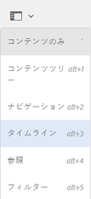
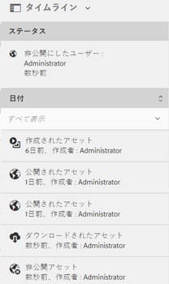

# タイムラインのアクティビティストリーム {#activity-stream-in-timeline}

この機能は、タイムラインにアセットのアクティビティログを表示します。 [!DNL Adobe Experience Manager Assets] で以下のアセット関連操作を実行すると、アクティビティストリーム機能により、タイムラインが更新され、そのアクティビティが反映されます。

アクティビティストリームでログに記録される操作は次のとおりです。

* 作成
* 削除
* ダウンロード（レンディションを含む）
* 公開
* 非公開
* 承認
* 非承認
* 移動

タイムラインに表示されるアクティビティログは、ログファイルが格納されている CRX の `/var/audit/com.day.cq.dam/content/dam` から取得されます。 さらに、新しいアセットがアップロードされたり、既存のアセットが[Experience Manager Asset Link](https://helpx.adobe.com/jp/enterprise/admin-guide.html/enterprise/using/manage-assets-using-adobe-asset-link.ug.html)または[Adobe デスクトップアプリ ](https://experienceleague.adobe.com/docs/experience-manager-desktop-app/using/release-notes.html?lang=ja)を介して[!DNL Experience Manager]に変更およびチェックインされたりすると、タイムラインアクティビティがログに記録されます。

>[!NOTE]
>
>一時的なワークフローは、履歴情報が保存されないので、タイムラインに表示されません。

アクティビティストリームを表示するには、アセットに対して 1 つ以上の操作を実行して、アセットを選択してから、グローバルナビゲーションリストから&#x200B;**[!UICONTROL タイムライン]**&#x200B;を選択します。

タイムラインに、アセットに対して実行した操作のアクティビティストリームが表示されます。

>[!NOTE]
>
>「**[!UICONTROL 公開]**」および「**[!UICONTROL 非公開]**」タスクのデフォルトのログ保存場所は、`/var/audit/com.day.cq.replication/content` です。 **[!UICONTROL 移動]**&#x200B;タスクの場合、デフォルトの場所は `/var/audit/com.day.cq.wcm.core.page` です。
