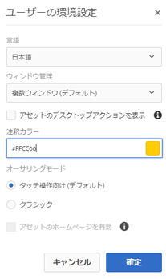
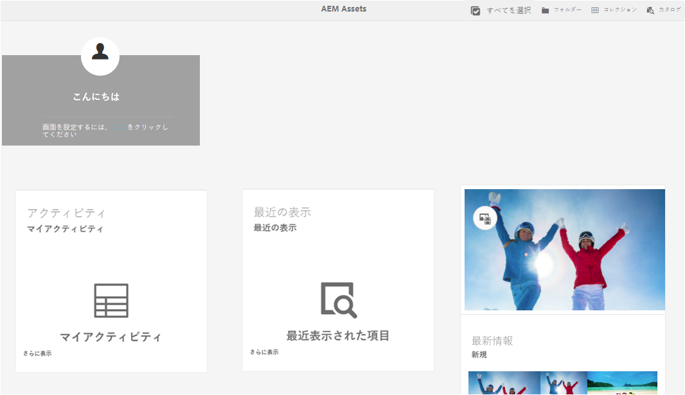

# [!DNL Adobe Experience Manager Assets] のホームページエクスペリエンス {#aem-assets-home-page-experience}

[!DNL Adobe Experience Manager Assets] のホームページをカスタマイズして、アセットに関する最近のアクティビティのスナップショットを始め、有益なスタートアップスクリーンエクスペリエンスを実現できます。

[!DNL Assets] のホームページでは、最近のアクティビティのスナップショット（最近表示またはアップロードされたアセットなど）を始め、カスタマイズした有益なスタートアップスクリーンエクスペリエンスを実現できます。

[!DNL Assets] のホームページは、デフォルトでは無効になっています。 ホームページを有効にするには、次の手順を実行します。

1. [!DNL Experience Manager] Configuration Manager `https://[aem_server]:[port]/system/console/configMgr` を開きます。
1. 「**[!UICONTROL Day CQ DAM Event Recorder]**」サービスを開きます。
1. 「**[!UICONTROL Enable this service]**」を選択して、アクティビティの記録を有効にします。

   

1. 記録するイベントを **[!UICONTROL Event Types]** リストから選択して、変更内容を保存します。

   >[!CAUTION]
   >
   >「閲覧したアセット」、「閲覧したプロジェクト」、「閲覧したコレクション」の各オプションを有効にすると、記録対象のイベント数が大幅に増加します。

1. Configuration Manager `https://[aem_server]:[port]/system/console/configMgr` で「**[!UICONTROL DAM Asset Home Page Feature Flag]**」サービスを開きます。
1. 「`isEnabled.name`」オプションを選択して、[!DNL Assets] のホームページ機能を有効にします。 変更内容を保存します。

   

1. **[!UICONTROL User Preferences]** ダイアログを開き、「**[!UICONTROL Enable Assets Home Page]**」を選択します。 変更内容を保存します。

   

[!DNL Assets] のホームページを有効にしたら、Navigation ページから [!DNL Assets] ユーザーインターフェイスに移動するか、URL `https://[aem_server]:[port]/aem/assetshome.html/content/dam` を使用して Assets ユーザーインターフェイスに直接アクセスします。

「**[!UICONTROL エクスペリエンスリンクを設定するには、ここをクリックしてください]**」をクリックして、ユーザー名、背景イメージ、プロファイル画像を追加します。

[!DNL Assets] のホームページには以下のセクションが含まれます。

* 「ようこそ」セクション
* 「ウィジェット」セクション

**「ようこそ」セクション**

ユーザーのプロファイルが存在する場合、「ようこそ」セクションには、そのユーザー向けのようこそメッセージが表示されます。 さらに、そのユーザーのプロファイル写真とようこそ画像（既に設定されている場合）も表示されます。

ユーザーのプロファイル設定が完了していない場合、「ようこそ」セクションには、一般的なようこそメッセージとプロファイル写真用のプレースホルダーが表示されます。

**「ウィジェット」セクション**

このセクションは「ようこそ」セクションの下にあり、既製ウィジェットが次のセクションに表示されます。

* アクティビティ
* 最新
* 最新情報

**アクティビティ**：このセクションの&#x200B;**[!UICONTROL マイアクティビティ]**&#x200B;ウィジェットには、アセット（レンディションなしのアセットも含む）を使用してログインユーザーが実行した最近のアクティビティが表示されます。例えば、アセットのアップロード、ダウンロード、アセットの作成、編集、コメント、注釈、共有です。

**最近の表示**：このセクションの&#x200B;**[!UICONTROL 最近表示された項目]**&#x200B;ウィジェットには、最近ログインユーザーがアクセスしたエンティティが表示されます。フォルダー、コレクション、プロジェクトが含まれます。

**最新情報**：このセクションの&#x200B;**[!UICONTROL 新規]**&#x200B;ウィジェットには、[!DNL Assets] デプロイメントに最近アップロードされたアセットとレンディションが表示されます。

ユーザーアクティビティデータのパージを有効にするには、Configuration Manager で「**[!UICONTROL DAM Event Purge Service]**」を有効にします。 このサービスを有効にすると、ログインユーザーのアクティビティのうち指定した数を超えたものがシステムによって削除されます。

ようこそ画面には、フォルダー、コレクション、カタログにアクセスするためのツールバー上のアイコンなど、簡単に操作するための機能が含まれています。

>[!NOTE]
>
>「[!UICONTROL Day CQ DAM Event Recorder]」サービスと「[!UICONTROL DAM Event Purge]」サービスを有効にすると、JCR や検索インデックス作成への書き込み操作が増加して、[!DNL Experience Manager] サーバーに対する負荷が大幅に増加します。 [!DNL Experience Manager] サーバーの負荷が増えると、パフォーマンスに影響が出ることがあります。

>[!CAUTION]
>
>[!DNL Assets] のホームページで必要なユーザーアクティビティのキャプチャー、フィルタリングおよびパージを行うと、パフォーマンスのオーバーヘッドが発生します。 そのため、管理者はターゲットユーザーのためにホームページを効果的に設定する必要があります。
>
>一括操作を実行する管理者およびユーザーは、ユーザーアクティビティが増えるのを避けるため、Asset のホームページ機能を使用しないことをお勧めします。 また、管理者は、[!UICONTROL Configuration Manager] で「[!UICONTROL Day CQ DAM Event Recorder]」を設定することで、特定のユーザーの記録アクティビティを除外することができます。
>
>この機能を使用する場合は、サーバー負荷を考慮してパージの頻度のスケジュールを設定することをお勧めします。
