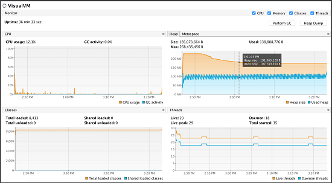
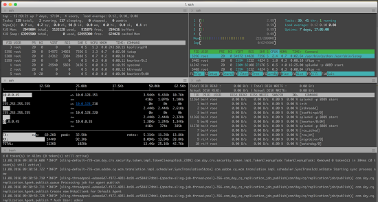

# 監視のベストプラクティス [!DNL Adobe Experience Manager Assets] デプロイメント {#assets-monitoring-best-practices}

[!DNL Experience Manager Assets] の観点から見ると、モニタリングには、次のプロセスおよびテクノロジーの観察とレポートを含める必要があります。

* システム CPU
* システムメモリ使用量
* システムディスク IO および IO 待機時間
* システムネットワーク IO
* ヒープ使用率およびワークフローなどの非同期プロセス用の JMX MBean
* OSGi コンソールヘルスチェック

通常、[!DNL Experience Manager Assets] のモニタリングには、ライブモニタリングと長期的モニタリングの 2 種類があります。

## ライブモニタリング {#live-monitoring}

環境のパフォーマンス特性を把握するには、開発のパフォーマンステストの段階、または高負荷な状態になったときに、ライブモニタリングを実行する必要があります。 通常、ライブモニタリングはいくつかのツールを使用して実行します。 以下にお勧めを示します。

* [Visual VM](https://visualvm.github.io/)：Visual VM を使用すると、CPU 使用率や、Java によるメモリ使用量などの詳細な Java VM 情報を表示できます。 また、デプロイメント上で実行されるコードのサンプリングと評価をすることができます。
* [Top](https://man7.org/linux/man-pages/man1/top.1.html)：Top は、CPU、メモリ、IO 使用量などの使用量統計を表示するダッシュボードを開く Linux コマンドです。 インスタンスの状況の概要を示します。
* [Htop](https://hisham.hm/htop/)：Htop は、インタラクティブなプロセスビューアです。 Top が提供する情報に加えて、詳細な CPU およびメモリ使用状況が表示されます。 Htop は、`yum install htop` または `apt-get install htop` を使用してほとんどの Linux システムにインストールできます。

* Iotop：Iotop は、ディスク IO 使用量の詳細なダッシュボードです。 ディスク IO を使用するプロセス、およびそのプロセスによる使用量を示すバーやメーターが表示されます。 Iotop は、`yum install iotop` または `apt-get install iotop` を使用してほとんどの Linux システムにインストールできます。

* [Iftop](https://www.ex-parrot.com/pdw/iftop/)：Iftop は、イーサネット／ネットワークの使用量についての詳細情報を表示します。 Iftop では、イーサネットを使用するエンティティについての通信チャネルごとの統計情報、および使用されている帯域幅の量が表示されます。 Iftop は、`yum install iftop` または `apt-get install iftop` を使用してほとんどの Linux システムにインストールできます。

* Java Flight Recorder（JFR）：非本番環境で自由に使用できる、Oracle の市販ツールです。 詳しくは、[Java Flight Recorder を使用した CQ ランタイムの問題の診断方法](https://cq-ops.tumblr.com/post/73865704329/how-to-use-java-flight-recorder-to-diagnose-cq)を参照してください。
* [!DNL Experience Manager] `error.log` ファイル：システムでログに記録されたエラーの詳細を [!DNL Experience Manager] `error.log` ファイルで調査できます。 コマンド `tail -F quickstart/logs/error.log` を使用して、調査するエラーを特定します。
* [ワークフローコンソール](/help/sites-administering/workflows.md)：ワークフローコンソールを使用して、遅れているワークフローや、停止しているワークフローを監視できます。

通常は、これらのツールを組み合わせて使用し、[!DNL Experience Manager] デプロイメントのパフォーマンスについて包括的に把握します。

>[!NOTE]
>
>これらのツールは標準的なツールです。アドビでは直接サポートしません。 追加のライセンスは必要ありません。

*図：Visual VM ツールを使用したライブモニタリング。*

## 長期的なモニタリング {#long-term-monitoring}

[!DNL Experience Manager] デプロイメントの長期的モニタリングでは、ライブでモニタリングされるのと同じ部分の長期にわたるモニタリングを行います。 また、環境に固有のアラートも定義します。

### ログの集約とレポート {#log-aggregation-and-reporting}

Splunk（TM）や Elastic Search／Logstash／Kabana（ELK）など、いくつかのログ集約ツールがあります。 [!DNL Experience Manager] デプロイメントの稼動時間を評価するには、システムに固有のログイベントを理解し、それに基づきアラートを作成することが重要です。 開発および運用手法をよく理解しておくと、ログ集約プロセスを適切に調整して、重要なアラートを生成するのに役立ちます。

### 環境のモニタリング {#environment-monitoring}

環境のモニタリングには、以下のモニタリングが含まれます。

* ネットワークのスループット
* ディスク IO
* メモリ
* CPU 使用率
* JMX MBean
* 外部 web サイト

それぞれの項目を監視するには、NewRelic（TM）や AppDynamics（TM）などの外部ツールが必要です。 これらのツールを使用して、システム固有のアラート（システム利用率の高さ、ワークフローのバックアップ、ヘルスチェック失敗、web サイトへの不正なアクセスなど）を定義できます。 アドビでは、特定のツールを推奨することはありません。 適切なツールを見つけて、説明した項目の監視に利用してください。

#### 内部アプリケーションモニタリング {#internal-application-monitoring}

内部アプリケーションモニタリングには、JVM などの [!DNL Experience Manager] スタックを構成するアプリケーションコンポーネントのモニタリング、コンテンツリポジトリのモニタリング、およびプラットフォーム上に構築されたカスタムアプリケーションコードによるモニタリングが含まれます。 通常、SolarWinds（TM）、HP OpenView（TM）、Hyperic（TM）、Zabbix（TM）などの一般的な多くのモニタリングソリューションで直接モニタリングできる JMX MBean を通してモニタリングを実行します。 JMX への直接接続をサポートしないシステムでは、JMX データを抽出して、それらのシステムがネイティブで理解できる形式で公開するシェルスクリプトを記述できます。

JMX MBean へのリモートアクセスは、デフォルトで無効になっています。 JMX を通したモニタリングについて詳しくは、[JMX テクノロジを使用したモニタリングと管理](https://docs.oracle.com/javase/7/docs/technotes/guides/management/agent.html)を参照してください。

多くの場合、統計情報を効果的に監視するにはベースラインが必要です。 ベースラインを作成するには、通常の動作条件の下で一定期間システムを監視し、通常の指標を特定します。

**JVM モニタリング**

他の Java ベースのアプリケーションスタックと同様に、[!DNL Experience Manager] は基盤となる Java Virtual Machine から提供されたリソースを利用します。 JVM により公開されているプラットフォーム MXBean によって、それらのリソースの多くの状態を監視できます。 MXBean について詳しくは、[プラットフォーム MBean サーバーおよびプラットフォーム MXBean の使用](https://docs.oracle.com/javase/7/docs/technotes/guides/management/mxbeans.html)を参照してください。

JVM で監視できるベースラインパラメーターをいくつか示します。

メモリ

* `MBean: lava.lang:type=Memory`
* URL：`/system/console/jmx/java.lang:type=Memory`
* インスタンス：すべてのサーバー
* アラームしきい値：ヒープまたは非ヒープメモリ使用率が、対応する最大メモリの 75％を超えた場合。
* アラーム定義：システムメモリが不十分であるか、コードにメモリリークがあります。 スレッドダンプを分析して、定義を満たすかどうか判断します。

>[!NOTE]
>
>注意：この Bean から提供される情報の単位はバイトです。

スレッド

* MBean：`java.lang:type=Threading`
* URL：`/system/console/jmx/java.lang:type=Threading`
* インスタンス：すべてのサーバー
* アラームしきい値：スレッド数がベースラインの 150％を超えた場合。
* アラーム定義：適切に停止できていないアクティブなプロセスがあるか、非効率な操作で大量のリソースを消費しています。 スレッドダンプを分析して、定義を満たすかどうか判断します。

**監視[!DNL Experience Manager]**

また、[!DNL Experience Manager] は、JMX を通して一連の統計情報および操作を公開しています。 これにより、システムヘルスを評価し、ユーザーに影響を与える前に問題を特定できます。 詳しくは、[!DNL Experience Manager] JMX MBean の[ドキュメント](/help/sites-administering/jmx-console.md)を参照してください。

[!DNL Experience Manager] で監視できるベースラインパラメーターをいくつか示します。

レプリケーションエージェント

* MBean：`com.adobe.granite.replication:type=agent,id="<AGENT_NAME>"`
* URL：`/system/console/jmx/com.adobe.granite.replication:type=agent,id="<AGENT_NAME>"`
* インスタンス：1 つのオーサーインスタンスおよびすべてのパブリッシュインスタンス（フラッシュエージェント）
* アラームしきい値：`QueueBlocked`&#x200B;`true` の値が 、または `QueueNumEntries` の値がベースラインの 150％を超えた場合。

* アラーム定義：システムにブロックされたキューが存在しており、レプリケーションターゲットがダウンしているか、または到達不能であることを示しています。 多くの場合、ネットワークまたはインフラストラクチャの問題により過剰なエントリがキューに登録されています。それによってシステムのパフォーマンスに悪影響が生じる可能性があります。

>[!NOTE]
>
>注意：MBean および URL パラメーターでは、`<AGENT_NAME>` を監視するレプリケーションエージェントの名前に置き換えます。

セッションカウンター

* MBean：`org.apache.jackrabbit.oak:id=7,name="OakRepository Statistics",type="RepositoryStats"`
* URL: */system/console/jmx/org.apache.jackrabbit.oak:id=7,name=&quot;OakRepository Statistics&quot;,type*=&quot;RepositoryStats&quot;
* インスタンス：すべてのサーバー
* アラームしきい値：開いているセッションの数がベースラインよりも 50％以上多い場合。
* アラーム定義：特定のコードによりセッションが開かれ、閉じられない状態になっています。 この状態は徐々に進行し、最終的にはシステムでメモリリークの原因となります。 システム上のセッション数は多少変動しますが、継続的に増加すべきではありません。

ヘルスチェック

[操作ダッシュボード](/help/sites-administering/operations-dashboard.md#health-reports)のヘルスチェックには、モニタリング用に対応する JMX MBean があります。 ただし、カスタムのヘルスチェックを記述して、追加のシステム統計情報を公開できます。

監視に役立つ、あらかじめ用意されたヘルスチェックをいくつか示します。

* システムチェック
  * MBean：`org.apache.sling.healthcheck:name=systemchecks,type=HealthCheck`
  * URL：`/system/console/jmx/org.apache.sling.healthcheck:name=systemchecks,type=HealthCheck`
  * インスタンス：1 つのオーサーサーバー、およびすべてのパブリッシュサーバー
  * アラームしきい値：ステータスが OK ではない場合
  * アラーム定義：いずれかの指標のステータスが警告または重要となっています。 問題の原因について詳しくは、ログ属性を確認してください。

* レプリケーションキュー

  * MBean：`org.apache.sling.healthcheck:name=replicationQueue,type=HealthCheck`
  * URL：`/system/console/jmx/org.apache.sling.healthcheck:name=replicationQueue,type=HealthCheck`
  * インスタンス：1 つのオーサーサーバー、およびすべてのパブリッシュサーバー
  * アラームしきい値：ステータスが OK ではない場合
  * アラーム定義：いずれかの指標のステータスが警告または重要となっています。 問題の原因となったキューについて詳しくは、ログ属性を確認してください。

* 応答パフォーマンス

  * MBean：`org.apache.sling.healthcheck:name=requestsStatus,type=HealthCheck`
  * URL：`/system/console/jmx/org.apache.sling.healthcheck:name=requestsStatus,type=HealthCheck`
  * インスタンス：すべてのサーバー
  * アラーム期間：ステータスが OK ではない場合
  * アラーム定義：いずれかの指標のステータスが警告または重要となっています。 問題の原因となったキューについて詳しくは、ログ属性を確認してください。

* クエリーパフォーマンス

  * MBean：`org.apache.sling.healthcheck:name=queriesStatus,type=HealthCheck`
  * URL：`/system/console/jmx/org.apache.sling.healthcheck:name= queriesStatus,type=HealthCheck`
  * インスタンス：1 つのオーサーサーバー、およびすべてのパブリッシュサーバー
  * アラームしきい値：ステータスが OK ではない場合
  * アラーム定義：システムで 1 つ以上のクエリの実行速度が遅くなっています。 問題を発生させたクエリについて詳しくは、ログ属性を確認してください。

* アクティブなバンドル

  * MBean：`org.apache.sling.healthcheck:name=inactiveBundles,type=HealthCheck`
  * URL：`/system/console/jmx/org.apache.sling.healthcheck:name=inactiveBundles,type=HealthCheck`
  * インスタンス：すべてのサーバー
  * アラームしきい値：ステータスが OK ではない場合
  * アラーム定義：システム上の非アクティブまたは未解決な OSGi バンドルの存在。 問題を発生させたバンドルについて詳しくは、ログ属性を確認してください。

* ログエラー

  * MBean：`org.apache.sling.healthcheck:name=logErrorHealthCheck,type=HealthCheck`
  * URL：`/system/console/jmx/org.apache.sling.healthcheck:name=logErrorHealthCheck,type=HealthCheck`
  * インスタンス：すべてのサーバー
  * アラームしきい値：ステータスが OK ではない場合
  * アラーム定義：ログファイルにエラーがあります。 問題の原因について詳しくは、ログ属性を確認してください。

## よくある問題と解決策  {#common-issues-and-resolutions}

モニタリング中に問題が発生した場合は、以下のトラブルシューティングを実行して、[!DNL Experience Manager] デプロイメントでよくある問題を解決できます。

* TarMK を使用している場合は、Tar 圧縮を頻繁に実行します。 詳しくは、[リポジトリのメンテナンス](/help/sites-deploying/storage-elements-in-aem-6.md#maintaining-the-repository)を参照してください。
* `OutOfMemoryError` ログを確認します。 詳しくは、[メモリの問題の分析](https://experienceleague.adobe.com/docs/experience-cloud-kcs/kbarticles/KA-17482.html?lang=ja)を参照してください。

* ログを確認し、インデックス化されていないクエリ、ツリートラバーサル、インデックストラバーサルへの参照がないかを確認します。 これらは、インデックス化されていないクエリ、または不適切にインデックス化されたクエリを示しています。 クエリおよびインデックス作成のパフォーマンスを最適化するためのベストプラクティスについては、[クエリとインデックスに関するベストプラクティス](/help/sites-deploying/best-practices-for-queries-and-indexing.md)を参照してください。
* ワークフローが予期したとおりに動作していることを確認するには、ワークフローコンソールを使用します。 可能な場合は、複数のワークフローを単一のワークフローにまとめます。
* ライブモニタリングを再確認し、他にボトルネックがないか、または特定のリソースを大量に使用している箇所がないかを確認します。
* Dispatcher を含むクライアントネットワークからの出口ポイントおよび [!DNL Experience Manager] デプロイメントネットワークへの入り口ポイントを調査します。 多くの場合、これらはボトルネックが発生する領域となります。 詳しくは、[Assets のネットワークに関する考慮事項](/help/assets/assets-network-considerations.md)を参照してください。
* [!DNL Experience Manager] サーバーのサイズを大きくします。 [!DNL Experience Manager] デプロイメントのサイズが不適切な可能性があります。 アドビカスタマーサポートは、サーバーのサイズが適切かどうかを判断するお手伝いをします。
* `access.log` および `error.log` ファイルで、不具合の発生した時刻付近のエントリを調査します。 カスタムコードの異常の兆候となるパターンを探します。 それらを監視するイベントのリストに追加します。
