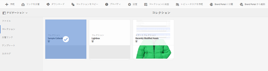
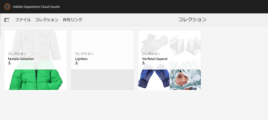

# Brand Portal へのコレクションの公開 {#publish-collections-to-brand-portal}

Adobe Experience Manager（AEM）Assets の管理者は、組織の AEM Assets Brand Portal のインスタンスにコレクションを公開できます。 ただし、最初に AEM Assets を Brand Portal と統合する必要があります。 詳しくは [AEM Assets と Brand Portal の連携の設定](/help/assets/configure-aem-assets-with-brand-portal.md)を参照してください。

その後、AEM Assets でオリジナルのコレクションに変更を加えても、そのコレクションを再び公開しない限り変更内容は Brand Portal に反映されません。 このため、作業中の変更が Brand Portal に提供されることがありません。 管理者が公開した承認済みの変更のみが Brand Portal で提供されます。

>[!NOTE]
>
>コンテンツフラグメントは Brand Portal に公開できません。 したがって、AEM オーサー上でコンテンツフラグメントを選択している場合は、「**Brand Portal に公開**」アクションを使用できません。
>
>コンテンツフラグメントを含むコレクションを AEM オーサーインスタンスから Brand Portal へ公開した場合は、そのフォルダー内のコンテンツフラグメントを除く全コンテンツが Brand Portal インターフェイスにレプリケートされます。

## Brand Portal へのコレクションの公開 {#publish-a-collection-to-brand-portal}

1. AEM Assets の UI で AEM のロゴをクリックします。
1. **ナビゲーション**&#x200B;ページで、**アセット／コレクション**&#x200B;に移動します。
1. コレクションコンソールで Brand Portal に公開するコレクションを選択します。

   

1. ツールバーで「**Brand Portal に公開**」をクリックします。
1. 確認ダイアログで「**公開**」をクリックします。
1. 確認メッセージを閉じます。
1. 管理者として Brand Portal にログインします。 公開したコレクションがコレクションインターフェイスで利用できます。

   

## コレクションを非公開にする {#unpublish-collections}

AEM Assets から Brand Portal へ公開したコレクションを非公開にすることができます。 元のコレクションを非公開にすると、Brand Portal のユーザーはそのコピーを使用できなくなります。

1. AEM Assets インスタンスのコレクションコンソールから、非公開にするコレクションを選択します。

   

1. ツールバーで「**Brand Portal から削除**」アイコンをクリックします。
1. 確認ダイアログで「**非公開**」をクリックします。
1. 確認メッセージを閉じます。 コレクションが Brand Portal インターフェイスから削除されます。
