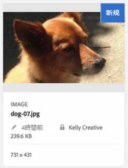
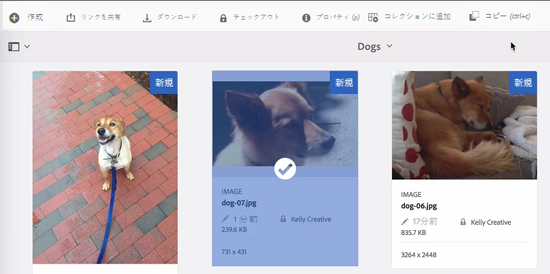
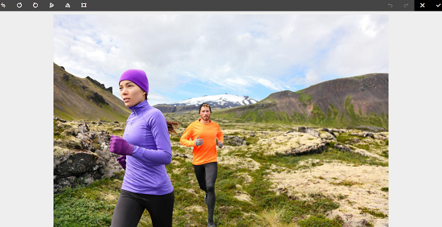
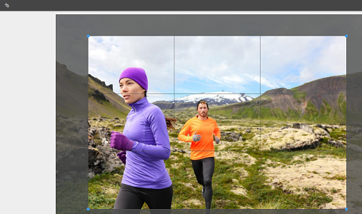
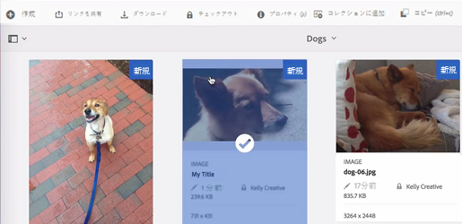

# [!DNL Experience Manager] DAM 内ファイルのチェックイン、チェックアウト {#check-in-and-check-out-files-in-assets}

| バージョン | 記事リンク |
| -------- | ---------------------------- |
| AEM as a Cloud Service | [ここをクリックしてください](https://experienceleague.adobe.com/docs/experience-manager-cloud-service/content/assets/manage/check-out-and-submit-assets.html?lang=ja) |
| AEM 6.5 | この記事 |

[!DNL Adobe Experience Manager Assets] では、編集のためにアセットをチェックアウトし、変更終了後にアセットをチェックインすることができます。 アセットをチェックアウトした後は、アセットを編集、注釈、公開、移動、削除できるのは自分だけです。 アセットのチェックアウトでアセットにロックがかかることになります。 アセットが [!DNL Assets] にチェックインされるまで、他のユーザーはそのアセットではどんな作業も行えません。 ただし、ロックされたアセットのメタデータは変更することができます。

アセットをチェックイン／チェックアウトするには、アセットへの書き込み権限が必要です。

この機能は、複数のチームにわたる編集ワークフローで複数のユーザーが共同作業をする場合に、ある作成者が変更した内容を他のユーザーが上書きしてしまう事態を防ぐのに役立ちます。

## アセットのチェックアウト {#checking-out-assets}

1. [!DNL Assets] ユーザーインターフェイスでチェックアウトするアセットを選択します。 チェックアウトしたいアセットは複数選択することもできます。
1. ツールバーの「**[!UICONTROL チェックアウト]**」をクリックします。 「**[!UICONTROL チェックアウト]**」オプションが「**[!UICONTROL チェックイン]**」に切り替わります。
チェックアウトしたアセットを他のユーザーが編集できるかを確認するには、別のユーザーとしてログインします。 チェックアウトしたアセットのサムネールには、鍵マークシンボルが表示されます。

   

   アセットを選択します。 ツールバーには、アセットの編集、注釈付け、公開、削除を行うためのオプションが表示されないことに注意してください。

   

   ロックされたアセットのメタデータを編集するには、「**[!UICONTROL プロパティを表示]**」をクリックします。

1. 「**[!UICONTROL 編集]**」をクリックして、アセットを編集モードで開きます。

   

1. アセットを編集して、変更内容を保存します。 例えば、画像を切り抜いて保存します。

   

   アセットに注釈を付けたり公開したりすることもできます。

1. [!DNL Assets] インターフェイスで編集したアセットを選択し、ツールバーの「**[!UICONTROL チェックイン]**」をクリックします。 変更されたアセットは [!DNL Assets] にチェックインされ、他のユーザーが編集できるようになります。

## 強制チェックイン {#forced-check-in}

管理者は他のユーザーがチェックアウトしたアセットをチェックインできます。

1. 管理者として [!DNL Assets] にログインします。
1. [!DNL Assets] ユーザーインターフェイスで他のユーザーにチェックアウトされているアセットを 1 つ以上選択します。

   

1. ツールバーの「**[!UICONTROL ロックを解除]**」をクリックします。 アセットはチェックインされ、他のユーザーが編集できるようになります。

## ベストプラクティスと制限事項 {#tips-limitations}

* チェックアウトされたアセットファイルを含む&#x200B;*フォルダー*&#x200B;を削除できます。 フォルダーを削除する前に、ユーザーがチェックアウトしているデジタルアセットがないことを確認します。

>[!MORELIKETHIS]
>
>* [&#x200B; [!DNL Experience Manager] デスクトップアプリ](https://experienceleague.adobe.com/docs/experience-manager-desktop-app/using/using.html?lang=ja#how-app-works2)でのチェックインとチェックアウトについて
>* [チェックインとチェックアウトについて説明するビデオチュートリアル [!DNL Assets]](https://experienceleague.adobe.com/docs/experience-manager-learn/assets/collaboration/check-in-and-check-out.html?lang=ja)
