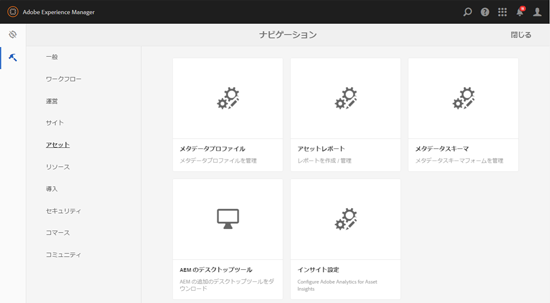
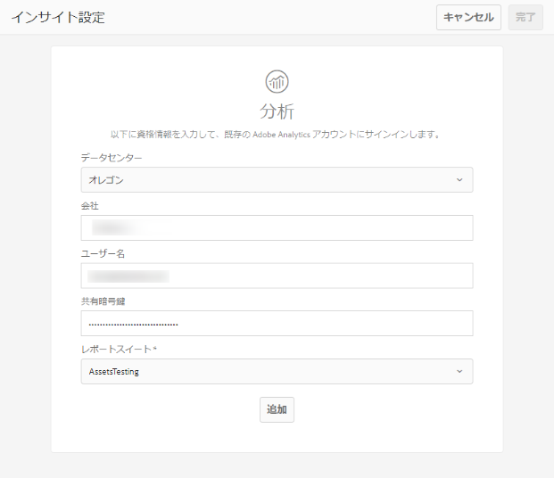

# アセットインサイトの設定 {#configure-asset-insights}

[!DNL Adobe Experience Manager Assets] では、サードパーティ Web サイトで使用されているデジタルアセットの使用状況データを [!DNL Adobe Analytics] から取得します。 アセットインサイトでこのようなデータを取得してインサイトを得るためには、まず、[!DNL Adobe Analytics] と統合するようにこの機能を設定します。 オンプレミスのインストールでこの機能を使用するには、別途 [!DNL Adobe Analytics] ライセンスを購入します。 [!DNL Managed Services] のユーザーには、[!DNL Experience Manager] に [!DNL Analytics] ライセンスがバンドルされています。 詳しくは、[Managed Services 製品説明](https://helpx.adobe.com/jp/legal/product-descriptions/adobe-experience-manager-managed-services.html)を参照してください。

>[!NOTE]
>
>インサイトのサポートおよび提供が行われるのは、画像に対してのみです。

1. [!DNL Experience Manager] で&#x200B;**[!UICONTROL ツール]**／**[!UICONTROL アセット]**&#x200B;をクリックします。

   

1. 「**[!UICONTROL インサイト設定]**」カードをクリックします。
1. ウィザードでデータセンターを選択し、組織名、ユーザー名、共有暗号鍵などの資格情報を指定します。

   

   *図：[!DNL Experience Manager] で [!DNL Adobe Analytics] をアセットインサイト用に設定*

1. 「**[!UICONTROL 認証]**」をクリックします。
1. [!DNL Experience Manager] によって認証情報が認証されたら、**[!UICONTROL レポートスイート]**&#x200B;リストから、アセットインサイトでデータをフェッチする [!DNL Adobe Analytics] レポートスイートを選択します。 「**[!UICONTROL 追加]**」をクリックします。
1. [!DNL Experience Manager] でレポートスイートが設定されたら、「**[!UICONTROL 完了]**」をタップします。

## ページトラッカー {#page-tracker}

[!DNL Adobe Analytics] アカウントを設定すると、ページトラッカーコードが生成されます。 サードパーティの web サイトで使用される [!DNL Experience Manager] アセットをアセットインサイトで追跡できるようにするには、web サイトコードにページトラッカーコードを組み込みます。 [!DNL Experience Manager Assets] の[!UICONTROL ページトラッカー]ユーティリティを使用して、ページトラッカーコードを生成します。 サードパーティの web ページにページトラッカーコードを組み込む方法について詳しくは、[Web ページでのページトラッカーと埋め込みコードの使用](/help/assets/use-page-tracker.md)を参照してください。

1. [!DNL Experience Manager] で&#x200B;**[!UICONTROL ツール]**／**[!UICONTROL アセット]**&#x200B;をクリックします。

   

1. **[!UICONTROL ナビゲーション]**&#x200B;ページで、「**[!UICONTROL インサイトページトラッカー]**」カードをクリックします。
1. 「**[!UICONTROL ダウンロード]**」をクリックして、ページトラッカーコードをダウンロードします。
