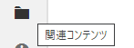
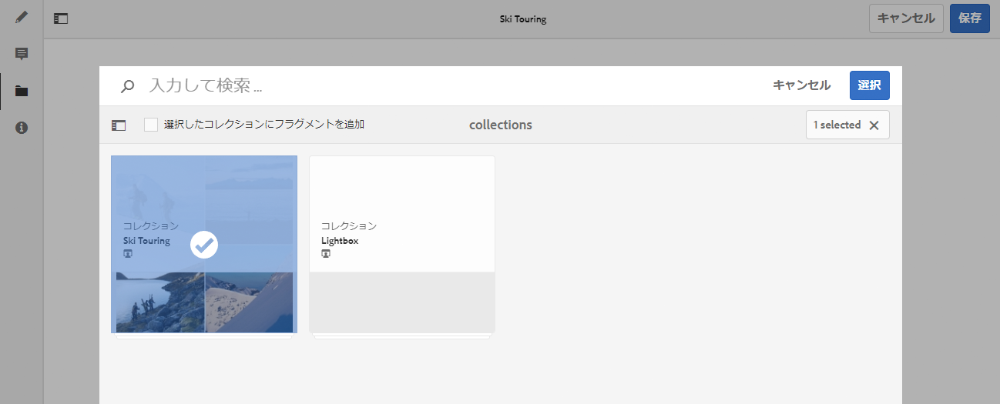
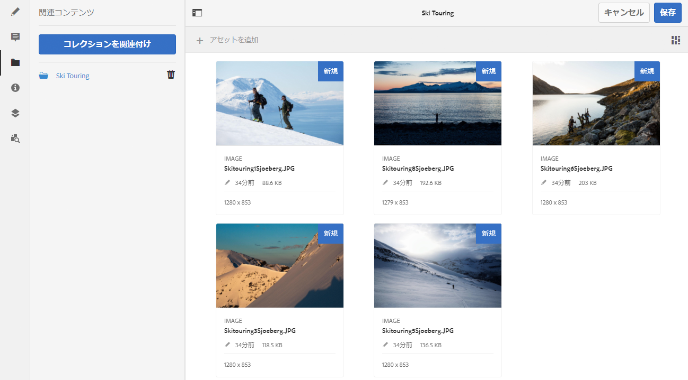

# 関連コンテンツ{#associated-content}

AEM の関連コンテンツ機能により関連性を付加して、フラグメントをコンテンツページに追加する際に、アセットを（オプションで）フラグメントと共に使用できるようになります。 これにより、[ページ上のコンテンツフラグメントを使用する際に広範なアセットにアクセスでき](/help/sites-authoring/content-fragments.md#using-associated-content)、ヘッドレスコンテンツ配信の柔軟性が向上すると共に、適切なアセットの検索に必要な時間も短縮されます。 関連するコンテンツは、コンテンツフラグメントエディターを使用して設定できます。

## 関連コンテンツの追加 {#adding-associated-content}

>[!NOTE]
>
>[ビジュアルアセット（画像など）](/help/assets/content-fragments/content-fragments.md#fragments-with-visual-assets)をフラグメントやページに追加するための様々な方法があります。

関連付けを行うには、最初に[メディアアセットをコレクションに追加する](/help/assets/manage-collections.md)必要があります。 それが完了した後で以下を実行できます。

1. フラグメントを開き、サイドパネルから「**関連コンテンツ**」を選択します。

   

1. コレクションが既に関連付けられているかどうかに応じて、次のいずれかを選択します。

   * **コンテンツを関連付け** - これが最初に関連付けられるコレクションになります
   * **コレクションを関連付け** - 関連付けられたコレクションが既に設定されています

1. 必要なコレクションを選択します。

   選択したコレクションにフラグメント自体をオプションで追加できます。これによりトラッキングに役立ちます。

   

1. 確定します（「**選択**」を使用）。 コレクションが関連付けられて表示されます。

   

## 関連コンテンツの編集 {#editing-associated-content}

コレクションを関連付けると、次の操作を実行できます。

* 関連付けの&#x200B;**削除**
* コレクションへの&#x200B;**アセットの追加**
* 追加のアクションを実行するアセットの選択
* アセットの編集
