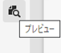
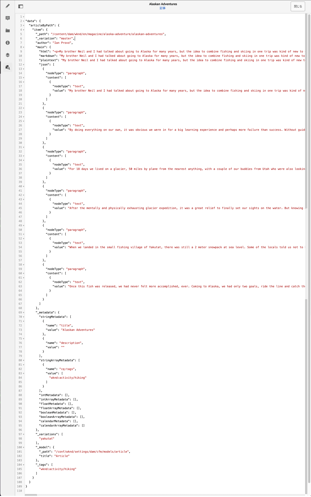

# プレビュー - JSON 表現 {#preview-json-representation}

AEM ヘッドレス実装の一部としてコンテンツフラグメントのモデルを開発する際に、コンテンツフラグメントエディターを使用して、モデルに基づいてコンテンツフラグメントのサンプル JSON 出力を表示できます。 例えば、最終的な出力がどのように見えるかを知るためにです。 これは、モデルの JSON 構造を検証する場合に便利です。データタイプごとのデフォルトのサンプルコンテンツを使用する場合もあります。

**プレビュー**&#x200B;アイコンを使用すると

現在のフラグメントの JSON 表現を表示できます。 例：

<!--
**Copy URL** lets you copy to clipboard the URL for either author or publish.
-->
