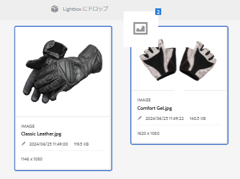

# Lightbox {#lightbox}

Lightbox は、アセットに容易にアクセスするための特別なタイプのコレクションです。 Lightbox にすぐにアクセスして、アセットを追加または削除できます。 Lightbox は、個人用の画像ギャラリーとして使用することができます。

[!DNL Adobe Experience Manager Assets] のユーザーである場合は、アプリケーションに最初にログインしたときに Lightbox が自動的に作成されます。 この Lightbox は自分専用です。 他のユーザーはこの Lightbox にアクセスできません。

## Lightbox へのアセットの追加 {#adding-assets-to-lightbox}

1. [!DNL Assets] のユーザーインターフェイスで、Lightbox に追加するアセットを選択してください。
1. アセットを **[!UICONTROL Lightbox にドロップ]**&#x200B;ゾーンにドラッグします。 ドロップゾーンがアクティブになり、ラベルが&#x200B;**[!UICONTROL ドロップして追加]**&#x200B;に変わったらアセットをリリースしてください。

   

1. ダイアログで&#x200B;**[!UICONTROL 追加]**&#x200B;をクリックし、ダイアログを閉じてプロセスを完了してください。 選択したアセットが Lightbox に追加されます。
1. Lightbox を表示するには、コレクションコンソールに移動します。
1. **[!UICONTROL Lightbox]** をクリックして、その中のアセットを表示します。

   >[!NOTE]
   >
   >Lightbox はコレクションに似ていますが、コレクションに対して通常実行するすべてのアクションを実行できるわけではありません。 例えば、Lightbox の設定を削除、共有または表示することはできません。 また、Lightbox を他のコレクションに追加することはできません。 ただし、Lightbox 内のアセットを編集することはできます。

## Lightbox からのアセットの削除 {#removing-assets-from-lightbox}

1. コレクションコンソールに移動して、「Lightbox」をクリックしてそのアセットを表示してください。
1. 削除するアセットを選択します。
1. ツールバーの「**[!UICONTROL 削除]**」をクリックします。
1. ダイアログで&#x200B;**[!UICONTROL 削除]**&#x200B;をクリックして、削除アクションを確定します。 アセットが Lightbox から削除されます。
