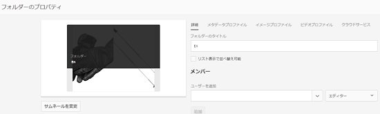
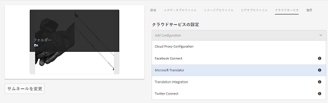
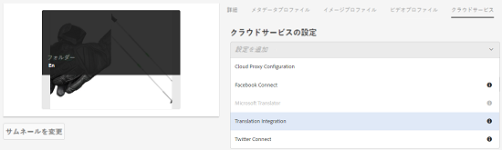
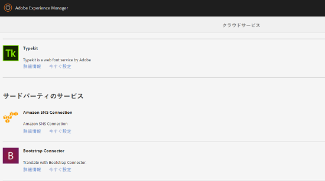
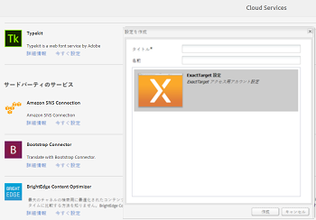
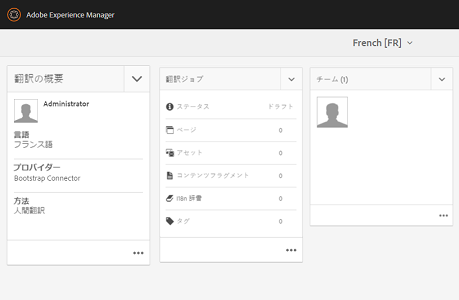

# フォルダーへの翻訳クラウドサービスの適用 {#applying-translation-cloud-services-to-folders}

[!DNL Adobe Experience Manager] では、選択した翻訳プロバイダーのクラウドベースの翻訳サービスを利用して、要件に基づいてアセットを確実に翻訳できます。

翻訳クラウドサービスをアセットフォルダーに直接適用できるので、翻訳ワークフローの間もずっとアセットを利用できます。

## 翻訳サービスの適用 {#applying-the-translation-services}

翻訳クラウドサービスをアセットフォルダーに直接適用すると、翻訳ワークフローの作成または更新時に翻訳サービスを設定する必要がなくなります。

1. [!DNL Assets] ユーザーインターフェイスから翻訳サービスを適用するフォルダーを選択します。
1. ツールバーの「**[!UICONTROL プロパティ]**」をクリックして、**[!UICONTROL フォルダーのプロパティ]**&#x200B;ページを表示します。

   

1. 「**[!UICONTROL クラウドサービス]**」タブに移動します。
1. 「クラウドサービスの設定」リストから目的の翻訳プロバイダーを選択します。 例えば、Microsoft の翻訳サービスを利用する場合は、「**[!UICONTROL Microsoft Translator]**」を選択します。

   

1. 翻訳プロバイダーのコネクタを選択します。

   

1. ツールバーで「**[!UICONTROL 保存]**」をクリックし、「**[!UICONTROL OK]**」をクリックしてダイアログを閉じます。翻訳サービスがフォルダーに適用されます。

## カスタム翻訳コネクタの適用  {#applying-custom-translation-connector}

翻訳ワークフローで使用する翻訳サービスにカスタムコネクタを適用する場合。 カスタムコネクタを適用するには、まず パッケージマネージャーからコネクタをインストールします。 次に、クラウドサービスコンソールからコネクタを設定します。 コネクタを設定すると、[翻訳サービスの適用](transition-cloud-services.md#applying-the-translation-services)で説明されている「クラウドサービス」タブのコネクタのリストに表示されるようになります。 カスタムコネクタを適用し、翻訳ワークフローを実行すると、翻訳プロジェクトの「**[!UICONTROL 翻訳の概要]**」タイルの「**[!UICONTROL プロバイダー]**」と「**[!UICONTROL メソッド]**」という見出しの下にコネクタの詳細が表示されます。

1. パッケージマネージャーからコネクタをインストールします。
1. [!DNL Experience Manager] のロゴをクリックし、**[!UICONTROL ツール]**／**[!UICONTROL デプロイメント]**／**[!UICONTROL クラウドサービス]**&#x200B;に移動します。
1. インストールしたコネクタを&#x200B;**[!UICONTROL クラウドサービス]**&#x200B;ページの「**[!UICONTROL サードパーティのサービス]**」の下で探します。

   

1. 「**[!UICONTROL 今すぐ設定]**」リンクをクリックして、**[!UICONTROL 設定を作成]**&#x200B;ダイアログを開きます。

   

1. コネクタのタイトルと名前を指定して、「**[!UICONTROL 作成]**」をクリックします。 [翻訳サービスの適用](#applying-the-translation-services)のステップ 5 で説明されている「**[!UICONTROL クラウドサービス]**」タブのコネクタリストにカスタムコネクタが表示されます。
1. カスタムコネクタを適用したら、[翻訳プロジェクトの作成](translation-projects.md)で説明されている翻訳ワークフローを実行します。 **[!UICONTROL プロジェクト]**&#x200B;コンソールで、翻訳プロジェクトの「**[!UICONTROL 翻訳の概要]**」タイルに表示されているコネクタの詳細を確認します。

   
