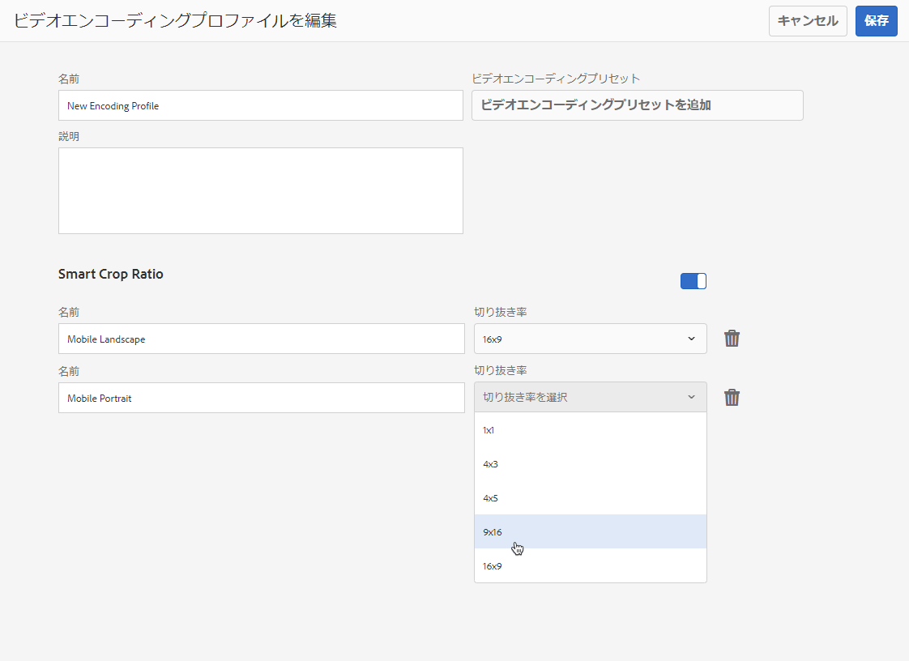
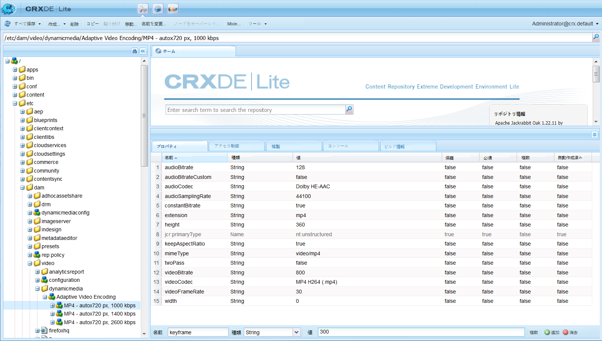
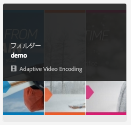
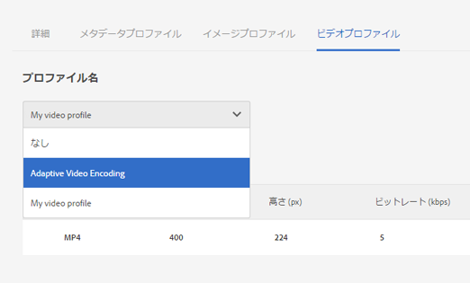
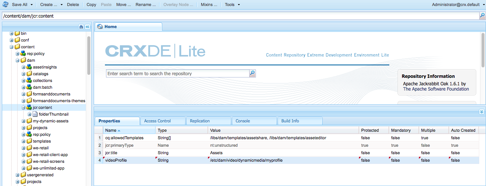

# ビデオプロファイル {#video-profiles}

Dynamic Mediaには、事前定義されたアダプティブビデオエンコーディングプロファイルが既に付属しています。 この標準プロファイルの設定は、顧客に最適な視聴エクスペリエンスを提供するために最適化されています。 アダプティブビデオエンコーディングプロファイルを使用してプライマリソースビデオをエンコードすると、ビデオプレーヤーで再生品質が最適化されます。 顧客のインターネット接続速度に基づいてビデオストリームを自動的に調整します。 これがアダプティブビットレートストリーミングと呼ばれる機能です。

ビデオの品質を決めるその他の要因には、次のようなものがあります。

* **アップロードされたプライマリソースビデオの解像度**

  MP4 ビデオが240pや360pなどの低解像度で記録されている場合、高解像度でストリーミングすることはできません。

* **ビデオプレーヤーのサイズ**

  デフォルトでは、アダプティブビデオエンコーディングプロファイルの「幅」は「自動」に設定されています。 再生中、ビデオプレーヤーは、サイズに基づいて最適な画質を自動的に選択します。

[ビデオエンコーディングのベストプラクティス](/help/assets/video.md#best-practices-for-encoding-videos)を参照してください。

[処理プロファイルを使用するためのデジタルアセットの編成のベストプラクティス](/help/assets/organize-assets.md)を参照してください。

>[!NOTE]
>
>ビデオのメタデータと関連するビデオ画像サムネールを生成するためには、ビデオ自体に対して Dynamic Media のエンコーディングプロセスを実行する必要があります。 Adobe Experience Manager では、Dynamic Media を有効にし、ビデオクラウドサービスを設定している場合は、**[!UICONTROL Dynamic Media エンコーディングビデオ]**&#x200B;ワークフローによってビデオがエンコードされます。 このワークフローは、ワークフローの処理履歴とエラー情報を取り込みます。 詳しくは、[ビデオエンコーディングと YouTube への公開の進行状況の監視](/help/assets/video.md#monitoring-video-encoding-and-youtube-publishing-progress)を参照してください。 Dynamic Media を有効にし、ビデオ Cloud Services を設定してある場合は、ビデオをアップロードすると、**[!UICONTROL Dynamic Media エンコーディングビデオ]**&#x200B;ワークフローが自動的に有効になります （Dynamic Media を使用していない場合は、**[!UICONTROL DAM アセットの更新]**&#x200B;ワークフローが有効になります）。
>
>メタデータは、アセットの検索時に役に立ちます。 サムネールは、エンコーディング中に生成される静的なビデオ画像です。 Experience Managerでは、カード表示、検索結果ビュー、アセットリストビューでビデオを視覚的に識別するために、それらを必要とし、ユーザーインターフェイスで使用します。 エンコードされたビデオのレンディションアイコン（絵画用パレット）を選択すれば、生成されたサムネールを確認できます。

ビデオプロファイルの作成が完了したら、そのプロファイルを 1 つまたは複数のフォルダーに適用してください。 [フォルダーへのビデオプロファイルの適用](#applying-a-video-profile-to-folders)を参照してください。

他のアセットタイプ向けに詳細な処理パラメーターを定義するには、[アセット処理の設定](/help/assets/config-dms7.md#configuring-asset-processing)を参照してください。

[メタデータ、画像およびビデオを処理するためのプロファイル](processing-profiles.md)も参照してください。

## アダプティブビデオエンコーディングプリセット {#adaptive-video-encoding-presets}

次の表に、モバイルデバイス、タブレットデバイス、デスクトップコンピューターへのアダプティブビデオストリーミングに対する、ベストプラクティスのエンコーディングプロファイルを示します。 これらのプリセットは、任意の縦横比のビデオで使用できます。

<table>
 <tbody>
  <tr>
   <td><strong>ビデオ形式のコーデック</strong></td>
   <td><strong>ビデオサイズ - 幅（px）</strong></td>
   <td><strong>ビデオサイズ - 高さ（px）</strong></td>
   <td><strong>縦横比を保持しますか？</strong></td>
   <td><strong>ビデオビットレート（Kbps）</strong></td>
   <td><strong>ビデオフレームレート（fps）</strong></td>
   <td><strong>オーディオコーデック</strong></td>
   <td><strong>オーディオビットレート（kbps）</strong></td>
  </tr>
  <tr>
   <td>
MP4 H.264（mp4）
 </td>
   <td>auto</td>
   <td>360</td>
   <td>はい</td>
   <td>730</td>
   <td>30</td>
   <td>Dolby HE-AAC</td>
   <td>128</td>
  </tr>
  <tr>
   <td>
MP4 H.264（mp4）
 </td>
   <td>auto</td>
   <td>540</td>
   <td>はい</td>
   <td>2000  </td>
   <td>30</td>
   <td>Dolby HE-AAC</td>
   <td>128</td>
  </tr>
  <tr>
   <td>
MP4 H.264（mp4）
 </td>
   <td>auto</td>
   <td>720  </td>
   <td>はい</td>
   <td>3000  </td>
   <td>30</td>
   <td>Dolby HE-AAC</td>
   <td>128</td>
  </tr>
 </tbody>
</table>

## ビデオプロファイルでのスマート切り抜きの使用について {#about-smart-crop-video}

ビデオプロファイルで利用できるオプション機能であるビデオ用のスマート切り抜きは、Adobe AIの人工知能の力を使用するツールです。 サイズに関係なく、アップロードしたアダプティブビデオまたはプログレッシブビデオの焦点を自動的に検出し、トリミングします。

スマート切り抜きでサポートされているビデオ形式には、MP4、MKV、MOV、AVI、FLV、WMV などがあります。

スマート切り抜きでサポートされるビデオファイルの最大サイズは、次の条件になります。

* 再生時間が 5 分間。
* 30 フレーム/秒（fps）。
* ファイルサイズが 300 MB。

Adobe AIは9000 フレームに制限されています。 つまり、30 FPS で 5 分間です。 ビデオの fps が高いと、サポートされるビデオの最大再生時間が短くなります。 例えば、Adobe AIとスマート切り抜きは、60 FPS ビデオが2分半以上の場合にのみサポートされます。

>[!IMPORTANT]
>
>ビデオのスマート切り抜きが機能するには、ビデオプロファイルに 1 つ以上のビデオエンコーディングプリセットを含める必要があります。

ビデオにスマート切り抜きを使用するには、アダプティブビデオエンコーディングプロファイルまたはプログレッシブビデオエンコーディングプロファイルを作成します。 プロファイルの一部として、**[!UICONTROL スマート切り抜き率]**&#x200B;ツールを使用して、事前定義済みの縦横比を選択します。 例えば、ビデオエンコーディングプリセットを定義した後、アスペクト比が16×9の「Mobile Landscape」定義を追加できます。 アスペクト比が9×16の「モバイルポートレート」定義を追加することもできます。 その他の縦横比や切り抜き比率は、1×1、4×3、4×5から選択できます。

ユーザーインターフェイスの&#x200B;**[!UICONTROL スマート切り抜き率]**&#x200B;の右端にあるスライダーを使用して、ビデオプロファイルのビデオスマート切り抜きをオンまたはオフに切り替えることができます。

ビデオプロファイルを作成して保存した後、目的のフォルダーに適用できます。

詳しくは、[特定のフォルダーへのビデオプロファイルの適用](#applying-video-profiles-to-specific-folders)、または[ビデオプロファイルのグローバルな適用](#applying-a-video-profile-globally)を参照してください。

[画像のスマート切り抜き](image-profiles.md)も参照してください。

## アダプティブビットレートストストリーミング用のビデオプロファイルの作成 {#creating-a-video-encoding-profile-for-adaptive-streaming}

Dynamic Mediaには、事前に定義されたアダプティブビデオエンコーディングプロファイル（MP4 H.264のビデオアップロード設定のグループ）が既に付属しており、最適な視聴体験を実現するために最適化されています。 このプロファイルは、ビデオをアップロードするときに使用できます。

ただし、この定義済みプロファイルがニーズに合わない場合は、独自のアダプティブビデオエンコーディングプロファイルを作成できます。 **[!UICONTROL アダプティブストリーミング用にエンコーディング]**&#x200B;という設定をベストプラクティスとして使用すると、プロファイルに追加されるすべてのエンコーディングプリセットが検証され、すべてのビデオが同じ縦横比であることが確認されます。 さらに、エンコーディングされたビデオは、ストリーミング向けの複数ビットレート設定として扱われます。

ビデオエンコーディングプロファイルの作成時に、ユーザー補助の目的で、ほとんどのエンコーディングオプションに対して推奨されるデフォルト設定があらかじめ入力されます。 ただし、推奨されるデフォルト値以外の値を選択すると、再生中にビデオ品質が低下したり、その他のパフォーマンス問題が発生したりする可能性があります。

そのため、アダプティブビットレートストリーミングを有効にするには、プロファイル内のすべてのMP4 H.264 ビデオエンコーディングプリセットの特定の値を検証します。 次の値は、プロファイル内の個々のエンコーディングプリセット間で一貫性を維持する必要があります。

* ビデオ形式コーデック - MP4 H.264（.mp4）
* オーディオコーデック
* オーディオビットレート
* アスペクト比を保持
* 2 パスエンコーディング
* 固定ビットレート
* H264 プロファイル
* オーディオのサンプリングレート

値が同じでない場合、プロファイルの作成をそのまま続行できます。 ただし、アダプティブビットレートストリーミングは使用できません。 ユーザーには単一ビットレートのストリーミングが示されます。 Adobeでは、プロファイル内の個々のエンコーディングプリセットで同じ値を使用するように、エンコーディング設定を編集することをお勧めします。 （**[!UICONTROL アダプティブストリーミング用にエンコーディング]**&#x200B;が有効になっている場合、ビデオプロファイル／プリセットエディターはアダプティブビデオエンコーディング設定のパリティを強制します。）

[プログレッシブストリーミング用のビデオエンコーディングプロファイルの作成](#creating-a-video-encoding-profile-for-progressive-streaming)も参照してください。

[ビデオエンコーディングのベストプラクティス](/help/assets/video.md#best-practices-for-encoding-videos)も参照してください。

他のアセットタイプへの高度な処理パラメーターの定義については、[アセット処理の設定](/help/assets/config-dms7.md#configuring-asset-processing)を参照してください。

**アダプティブビットレートストリーミング用のビデオプロファイルを作成するには**

1. Experience Manager ロゴを選択し、**[!UICONTROL ツール]**／**[!UICONTROL アセット]**／**[!UICONTROL ビデオプロファイル]**&#x200B;に移動してください。
1. **[!UICONTROL 作成]**&#x200B;を選択して、ビデオプロファイルを追加します。

1. プロファイルの名前と説明を入力します。
1. ビデオエンコーディングプリセットを作成ページまたはビデオエンコーディングプリセットを編集ページで、「**[!UICONTROL ビデオエンコーディングプリセットを追加]**」を選択します。
1. 「**[!UICONTROL 基本]**」タブで、ビデオとオーディオのオプションを設定します。
各オプションの横にある情報アイコンを選択します。 選択したビデオ形式コーデックに基づいて、説明や推奨される設定について読むことができます。
1. 「ビデオサイズ」見出しの下で、「**[!UICONTROL 縦横比を維持]**」オプションがオンになっていることを確認します。
1. ビデオフレームの解像度をピクセル単位で設定します。 ソースの縦横比（幅と高さの比率）に自動的に一致させるには、**[!UICONTROL 自動]**&#x200B;値を使用して拡大・縮小します。 たとえば、Auto × 480または640 × Autoなどです。

1. 次のいずれかの操作を行います。

   * 「**[!UICONTROL 幅]**」フィールドに「**[!UICONTROL auto]**」と入力します。 「**[!UICONTROL 高さ]**」フィールドに値をピクセル単位で入力します。

   * ビデオのサイズを目で確認できるようにするには、「**[!UICONTROL 高さ]**」の右にある情報アイコン（「i」）を選択して、サイズ計算ツールページを開きます。 **[!UICONTROL サイズ計算ツール]**&#x200B;を使用して、必要なビデオサイズ（青のボックスで表示）を設定します。 完了したら、右上隅の「**[!UICONTROL X]**」を選択します。

1. （オプション）「**[!UICONTROL 詳細]**」タブを選択し、「**[!UICONTROL デフォルト値を使用]**」チェックボックスがオンになっている（推奨）ことを確認します。 または、ビデオおよびオーディオの詳細設定を変更します。
1. ページの右上隅の「**[!UICONTROL 保存]**」を選択して、プリセットを保存します。
1. 次のいずれかの操作を行います。
   * 手順 4～10 を繰り返して、その他のエンコーディングプリセットを作成します （アダプティブビデオストリーミングの場合は、複数のビデオプリセットが必要です）。
   * 次の手順に進みます。

1. （オプション）このプロファイルを適用するビデオにビデオスマート切り抜きを追加するには、以下を行います。
   * ビデオプロファイルを編集ページで、「スマート切り抜き率」の見出しの右側にある「**[!UICONTROL 新規追加]**」を選択します。
   * 切り抜き率を容易に識別できるように、切り抜き率の名前を「名前」フィールドに入力します。
   * 「**[!UICONTROL 切り抜き率]**」ドロップダウンリストで、使用する比率を選択します。

1. 次のいずれかの操作を行います。

   * 必要に応じて、新しい切り抜き率の追加を続けます。
   * 次の手順に進みます。

1. ページの右上隅の「**[!UICONTROL 保存]**」をもう一度選択して、プロファイルを保存します。

これで、ビデオを含んだフォルダーにプロファイルを適用できるようになりました。 詳しくは、[フォルダーへのビデオプロファイルの適用](#applying-a-video-profile-to-folders)または[ビデオプロファイルのグローバルな適用](#applying-a-video-profile-globally)を参照してください。

## プログレッシブストリーミング用のビデオプロファイルの作成 {#creating-a-video-encoding-profile-for-progressive-streaming}

「**[!UICONTROL アダプティブストリーミング用にエンコーディング]**」オプションを使用しない場合は、プロファイルに追加されるすべてのエンコーディングプリセットが、単一ビットレートのストリーミングまたはプログレッシブビデオ配信用の個々のビデオレンディションとして扱われます。 また、すべてのビデオレンディションが同じ縦横比であることを確認するための検証は実行されません。

実行しているモードに応じて、サポートされるビデオ形式コーデックは次のとおりです。

* Dynamic Media-Scene7 モード：H.264（.mp4）
* Dynamic Media- ハイブリッドモード：H.264（.mp4）、WebM

「[アダプティブビットレートストリーミング用のビデオエンコーディングプロファイルの作成](#creating-a-video-encoding-profile-for-adaptive-streaming)」も参照してください。

[ビデオエンコーディングのベストプラクティス](/help/assets/video.md#best-practices-for-encoding-videos)も参照してください。

他のアセットタイプへの高度な処理パラメーターの定義については、[アセット処理の設定](/help/assets/config-dms7.md#configuring-asset-processing)を参照してください。

**プログレッシブストリーミング用のビデオプロファイルを作成するには：**

1. Experience Manager ロゴを選択してから、**[!UICONTROL ツール]**／**[!UICONTROL アセット]**／**[!UICONTROL ビデオプロファイル]**&#x200B;に移動してください。
1. **[!UICONTROL 作成]**&#x200B;を選択して、ビデオプロファイルを追加します。
1. プロファイルの名前と説明を入力します。
1. ビデオエンコーディングプリセットを作成ページまたはビデオエンコーディングプリセットを編集ページで、「**[!UICONTROL ビデオエンコーディングプリセットを追加]**」を選択します。
1. 「**[!UICONTROL 基本]**」タブで、ビデオとオーディオのオプションを設定します。
各オプションの横にある情報アイコンを選択します。 選択したビデオ形式コーデックに基づいて、追加の説明や推奨設定について読むことができます。
1. （オプション）「ビデオサイズ」ヘッダーの下で、「**[!UICONTROL 縦横比を保持]**」チェックボックスをオフにします。
1. 以下の操作を実行してください。
   * 「**[!UICONTROL 幅]**」フィールドに「**[!UICONTROL auto]**」と入力します。
   * 「**[!UICONTROL 高さ]**」フィールドに値をピクセル単位で入力します。
     ビデオのサイズを目で確認できるようにするには、「高さ」の情報アイコンを選択して、**[!UICONTROL サイズ計算ツール]**&#x200B;ページを開きます。 **[!UICONTROL サイズ計算ツール]** ページを使用して、ビデオのディメンションをさらに設定します（青いボックス）。 完了したら、ダイアログボックスの右上隅にある「**[!UICONTROL X]**」を選択します。
1. （オプション）次のいずれかの操作を行います。

   * 「**[!UICONTROL 詳細]**」タブを選択し、「**[!UICONTROL デフォルト値を使用]**」チェックボックスがオンになっている（推奨）ことを確認します。

   * 「**[!UICONTROL デフォルト値を使用]**」チェックボックスをオフにして、必要なビデオ設定とオーディオ設定を指定します。
     各オプションの横にある情報アイコンを選択します。 選択したビデオ形式コーデックに基づいて、追加の説明や推奨設定について読むことができます。

1. ページの右上隅の「**[!UICONTROL 保存]**」を選択して、プリセットを保存します。
1. 次のいずれかの操作を行います。

   * 手順 4～9 を繰り返して、その他のエンコーディングプリセットを作成します。
   * 次の手順に進みます。

1. （オプション）このプロファイルを適用するビデオにビデオスマート切り抜きを追加するには、以下を行います。

   * ビデオプロファイルを編集ページで、「スマート切り抜き率」の見出しの右側にある「**[!UICONTROL 新規追加]**」を選択します。
   * 切り抜き率を容易に識別できるように、切り抜き率の名前を「名前」フィールドに入力します。
   * 「**[!UICONTROL 切り抜き率]**」ドロップダウンリストで、使用する比率を選択します。

1. 次のいずれかの操作を行います。

   * 必要に応じて、新しい切り抜き率の追加を続けます。
   * 次の手順に進みます。

1. ページの右上隅の「**[!UICONTROL 保存]**」を選択して、プロファイルを保存します。

これで、ビデオを含んだフォルダーにプロファイルを適用できるようになりました。 詳しくは、[フォルダーへのビデオプロファイルの適用](#applying-a-video-profile-to-folders)または[ビデオプロファイルのグローバルな適用](#applying-a-video-profile-globally)を参照してください。

## カスタムで追加するビデオエンコーディングパラメーターの使用 {#using-custom-added-video-encoding-parameters}

既存のビデオエンコーディングプロファイルを編集して、高度なビデオエンコーディングパラメーターにアクセスできます。 これらのパラメーターは、Experience Managerでビデオプロファイルを作成または編集する際のユーザーインターフェイスでは使用できません。 既存のプロファイルに、minBitrate や maxBitrate などの 1 つ以上の詳細パラメーターを追加できます。

**カスタムで追加するビデオエンコーディングパラメーターを使用するには：**

1. Experience Manager ロゴを選択して、**[!UICONTROL ツール]**／**[!UICONTROL 一般]**／**[!UICONTROL CRXDE Lite]** に移動します。
1. CRXDE Lite ページの左側にあるエクスプローラーパネルで、以下の場所に移動します。

   `/conf/global/settings/dam/dm/presets/video/*name_of_video_encoding_profile_to_edit`

1. ページの右下にあるパネルの「プロパティ」タブで、使用するパラメーターの「**[!UICONTROL 名前]**」、「**[!UICONTROL タイプ]**」および「**[!UICONTROL 値]**」を指定します。

   以下の高度なパラメーターを使用できます。

<table>
 <tbody>
  <tr>
   <td><strong>名前</strong></td>
   <td><strong>説明</strong>  </td>
   <td><strong>タイプ</strong>  </td>
   <td><strong>値</strong></td>
  </tr>
  <tr>
   <td><code>h264Level</code></td>
   <td>エンコーディングに使用する H.264 レベル。 通常、このパラメーターは、使用しているエンコード設定に基づいて自動的に決定されます。</td>
   <td><code>String</code></td>
   <td>
H.264 レベルの 10 倍の数値
 
（例えば、3.0 の場合は 30、1.3 の場合は 13 のように指定します）
 
デフォルト値はありません。
 </td>
  </tr>
  <tr>
   <td><code>keyframe</code></td>
   <td>キーフレーム間のターゲットフレーム数。 2～10 秒ごとにキーフレームを生成できるように、この値を計算します。 例えば、1秒あたり30 フレームの場合、キーフレーム間隔は60 ～ 300にする必要があります。    キーフレーム間隔を短くすると、アダプティブビデオエンコーディングのストリームシークとストリームスイッチング動作が改善され、モーションの大きいビデオの品質も向上する可能性があります。 ただし、キーフレームが増えるとファイルのサイズも増えるので、通常、キーフレーム間隔を短くすると、特定のビットレートでの全体的なビデオの画質は低下します。</td>
   <td><code>String</code></td>
   <td>
正の数。
 
デフォルトは300です。
 
DASHまたはHLSの推奨値は60 ～ 90です。
 </td>
  </tr>
  <tr>
   <td><code>minBitrate</code></td>
   <td>
可変ビットレートエンコーディングに可能な最小ビットレート（Kbps）。
 
このパラメーターは、ビデオエンコーディングプロファイルを作成または編集するときに「詳細」タブで「<strong>固定ビットレートを使用</strong>」の選択をオフにした場合にのみ適用されます。
 
<a href="/help/assets/video.md#bitrate">ビットレート</a>も参照してください。
 </td>
   <td><code>String</code></td>
   <td>
正の数（Kbps）。
 
デフォルト値はありません。
 </td>
  </tr>
  <tr>
   <td><code>maxBitrate</code></td>
   <td>
可変ビットレートエンコーディングに可能な最大ビットレート（Kbps）。
 
このパラメーターは、ビデオエンコーディングプロファイルを作成または編集するときに「詳細」タブで「<strong>固定ビットレートを使用</strong>」の選択をオフにした場合にのみ適用されます。
 
<a href="/help/assets/video.md#bitrate">ビットレート</a>も参照してください。
 </td>
   <td><code>String</code></td>
   <td>
正の数（Kbps）。
 
デフォルト値はありません。 ただし、推奨値は、エンコーディングのビットレートの最大 2 倍です。
 </td>
  </tr>
  <tr>
   <td><code>audioBitrateCustom</code></td>
   <td>オーディオコーデックでサポートされている場合、オーディオストリームに固定ビットレートを強制的に適用するには、値を <code>true</code> に設定します。</td>
   <td><code>String</code></td>
   <td>
<code>true</code>／<code>false</code>
 
デフォルトは <code>false</code> です。
 
DASH または HLS の推奨値は <code>false</code> です。
 
 
 </td>
  </tr>
 </tbody>
</table>

1. ページの右下隅付近にある「**[!UICONTROL 追加]**」を選択します。
1. 次のいずれかの操作を行います。

   * 手順 3 と手順 4 を繰り返して、ビデオエンコーディングプロファイルに別のパラメーターを追加します。
   * ページの左上隅付近にある「**[!UICONTROL すべて保存]**」を選択します。

1. CRXDE Lite ページの左上隅にある「**[!UICONTROL ホームに戻る]**」アイコンを選択して、Experience Manager に戻ります。

### ビデオプロファイルの編集 {#editing-a-video-encoding-profile}

作成したビデオプロファイルを編集して、そのプロファイル内のビデオプリセットを追加、編集または削除することができます。

デフォルトでは、事前定義済みかつ標準設定の&#x200B;**[!UICONTROL アダプティブビデオエンコーディング]**&#x200B;プロファイル（Dynamic Media に付属）を編集することはできません。 代わりに、簡単にプロファイルをコピーして、新しい名前で保存できます。 その後、コピーしたプロファイルで目的のプリセットを編集できます。

[ビデオエンコーディングのベストプラクティス](/help/assets/video.md#best-practices-for-encoding-videos)も参照してください。

他のアセットタイプへの高度な処理パラメーターの定義については、[アセット処理の設定](/help/assets/config-dms7.md#configuring-asset-processing)を参照してください。

**ビデオプロファイルを編集するには：**

1. Experience Manager ロゴを選択し、**[!UICONTROL ツール]**／**[!UICONTROL アセット]**／**[!UICONTROL ビデオプロファイル]**&#x200B;に移動してください。
1. ビデオプロファイルページで、1 つのビデオプロファイル名のチェックボックスをオンにします。
1. ツールバーの「**[!UICONTROL 編集]**」を選択します。
1. ビデオエンコーディングプロファイルページで、必要に応じて名前と説明を編集します。
1. ベストプラクティスとして、「**[!UICONTROL アダプティブビットレートストリーミング用にエンコーディング]** 」チェックボックスがオンになっていることを確認します。
アダプティブビットレートストリーミングの説明を参照するには、情報アイコンを選択します。 （プログレッシブビデオプロファイルを編集する場合は、このチェックボックスをオンにしないでください）。
1. 「ビデオエンコーディングプリセット」ヘッダーの下で、プロファイルを構成するビデオエンコーディングプリセットを追加、編集または削除します。

   「**[!UICONTROL 基本]**」タブと「**[!UICONTROL 詳細]**」タブの各オプションの横にある情報アイコンを選択します。 選択したビデオ形式コーデックに基づいて、追加の説明や推奨設定について読むことができます。

1. ページの右上隅にある「**[!UICONTROL 保存]**」を選択します。

### ビデオプロファイルのコピー {#copying-a-video-encoding-profile}

1. Experience Manager ロゴを選択し、**[!UICONTROL ツール]**／**[!UICONTROL アセット]**／**[!UICONTROL ビデオプロファイル]**&#x200B;に移動します。
1. ビデオプロファイルページで、1 つのビデオプロファイル名のチェックボックスをオンにします。
1. ツールバーの「**[!UICONTROL コピー]**」を選択します。
1. ビデオエンコーディングプロファイルページで、プロファイルの新しい名前を入力します。
1. ベストプラクティスとしては、「**[!UICONTROL アダプティブストリーミング用にエンコーディング]**」チェックボックスは必ずオンにします。 アダプティブビットレートストリーミングの説明を参照するには、情報アイコンを選択します。 （プログレッシブビデオプロファイルをコピーする場合は、このチェックボックスをオンにしないでください）。

   Dynamic Media（ハイブリッドモード）では、WebM ビデオプリセットがビデオプロファイルに含まれている場合は、すべてのプリセットを MP4 にする必要があるので、**[!UICONTROL アダプティブストリーミング用にエンコーディング]**&#x200B;をオンにすることはできません。
1. 「ビデオエンコーディングプリセット」ヘッダーの下で、プロファイルを構成するビデオエンコーディングプリセットを追加、編集または削除します。

   「基本」タブと「詳細」タブの各オプションの横にある情報アイコンを選択します。 推奨される設定と説明について読むことができます。

1. ページの右上隅にある「**[!UICONTROL 保存]**」を選択します。

### ビデオプロファイルの削除 {#deleting-a-video-encoding-profile}

1. Experience Manager ロゴを選択し、**[!UICONTROL ツール]**／**[!UICONTROL アセット]**／**[!UICONTROL ビデオプロファイル]**&#x200B;に移動します。
1. ビデオプロファイルページで、1 つ以上のビデオプロファイル名のチェックボックスをオンにします。
1. ツールバーの「**[!UICONTROL 削除]**」を選択します。
1. 「**[!UICONTROL OK]**」を選択します。

## フォルダーへのビデオプロファイルの適用 {#applying-a-video-profile-to-folders}

フォルダーにビデオプロファイルを割り当てると、サブフォルダーは親フォルダーのプロファイルを自動的に継承します。 つまり、フォルダーに 1 つのビデオプロファイルのみを適用すればよいことになります。 そのため、アセットをアップロード、保存、使用およびアーカイブする場所のフォルダー構造については入念に検討してください。

フォルダーに別のビデオプロファイルを割り当てた場合、新しいプロファイルは前のプロファイルよりも優先されます。 既存のフォルダーアセットは変更されません。 新しいプロファイルは、後でフォルダーに追加されるアセットに適用されます。

ユーザーインターフェイスには、割り当てられたプロファイルを持つフォルダーを示すプロファイル名がカード名に表示されます。

ビデオプロファイルは、特定のフォルダーに適用することも、すべてのアセットに全体的に適用することもできます。

後で変更した既存のビデオプロファイルが存在するフォルダー内のアセットを再処理できます。 [処理プロファイルを編集した後のフォルダー内のアセットの再処理](processing-profiles.md#reprocessing-assets)を参照してください。

### 特定のフォルダーへのビデオプロファイルの適用 {#applying-video-profiles-to-specific-folders}

**[!UICONTROL ツール]**&#x200B;メニュー内からフォルダーにビデオプロファイルを適用するか、またはフォルダー内にいる場合は「**[!UICONTROL プロパティ]**」から適用します。 この節では、フォルダーにビデオプロファイルを適用するこれら両方の方法について説明します。

ユーザーインターフェイスには、割り当てられたプロファイルを持つフォルダーを示すプロファイル名がカード名に表示されます。

[処理プロファイルを編集した後のフォルダー内のアセットの再処理](processing-profiles.md#reprocessing-assets)も参照してください。

#### プロファイルユーザーインターフェイスを介したフォルダーへのビデオプロファイルの適用 {#applying-video-profiles-to-folders-by-way-of-the-profiles-user-interface}

1. Experience Manager ロゴを選択し、**[!UICONTROL ツール]**／**[!UICONTROL アセット]**／**[!UICONTROL ビデオプロファイル]**&#x200B;に移動します。
1. 1 つまたは複数のフォルダーに適用するビデオプロファイルを選択します。
1. 「**[!UICONTROL プロファイルをフォルダー]**&#x200B;に適用」を選択し、新しくアップロードされたアセットの受信に使用するフォルダーまたは複数のフォルダーを選択して、**[!UICONTROL 適用]**&#x200B;を選択します。 ユーザーインターフェイスには、割り当てられたプロファイルを持つフォルダーを示すプロファイル名がカード名に表示されます。

   [ビデオプロファイル処理ジョブの進行状況を監視](#monitoring-the-progress-of-an-encoding-job)できます。

#### 「プロパティ」を介したフォルダーへのビデオプロファイルの適用 {#applying-video-profiles-to-folders-from-properties}

1. Experience Manager ロゴを選択して「**[!UICONTROL アセット]**」に移動し、ビデオプロファイルを適用するフォルダーに移動します。
1. チェックマークを選択して対象のフォルダーを選択し、「**[!UICONTROL プロパティ]**」を選択します。
1. 「**[!UICONTROL ビデオプロファイル]**」タブを選択し、ドロップダウンメニューからプロファイルを選択して、「**[!UICONTROL 保存して閉じる]**」を選択します。 ユーザーインターフェイスには、割り当てられたプロファイルを持つフォルダーを示すプロファイル名がカード名に表示されます。

   
   ビデオプロファイル処理ジョブの進行状況を[監視できます](#monitoring-the-progress-of-an-encoding-job)。

### ビデオプロファイルのグローバルな適用 {#applying-a-video-profile-globally}

特定のフォルダーにプロファイルを適用できるだけでなく、グローバルにプロファイルを適用することもできます。これにより、Experience Manager Assets にアップロードされている、すべてのフォルダー内にあるすべてのコンテンツに、選択したプロファイルを適用できます。

[処理プロファイルを編集した後のフォルダー内のアセットの再処理](processing-profiles.md#reprocessing-assets)も参照してください。

**ビデオプロファイルをグローバルに適用するには、次のようにします。**

* CRXDE Lite で、`/content/dam/jcr:content` ノードに移動します。 プロパティ `videoProfile:/libs/settings/dam/video/dynamicmedia/<name of video encoding profile>` を追加し、「**[!UICONTROL すべて保存]**」を選択します。

  
* [ビデオプロファイル処理ジョブの進行状況を監視](#monitoring-the-progress-of-an-encoding-job)できます。

## ビデオプロファイルを処理するジョブの進捗をモニター {#monitoring-the-progress-of-an-encoding-job}

ビデオプロファイル処理ジョブの進行状況を目視で監視できるように、処理インジケーター（進行状況バー）が表示されます。

`error.log` ファイルで、エンコーディングジョブの進行状況を監視し、エンコーディングが完了したか、またはジョブのエラーが発生したかを確認することもできます。 `error.log` は、Experience Manager インスタンスのインストール先の `logs` フォルダーにあります。

## フォルダーからのビデオプロファイルの削除 {#removing-a-video-profile-from-folders}

フォルダーからビデオプロファイルを削除すると、サブフォルダーはその親フォルダーからのプロファイルの削除を自動的に継承します。 ただし、フォルダー内で発生したファイルの処理は変更されません。

**[!UICONTROL ツール]**&#x200B;メニュー内から、またはフォルダー内にいる場合は「**[!UICONTROL プロパティ]**」から、ビデオプロファイルをフォルダーから削除できます。 この節では、両方の方法でビデオプロファイルをフォルダーから削除する方法について説明します。

### プロファイルユーザーインターフェイスを介したフォルダーからのビデオプロファイルの削除 {#removing-video-profiles-from-folders-by-way-of-the-profiles-user-interface}

1. Experience Manager ロゴを選択し、**[!UICONTROL ツール]**／**[!UICONTROL アセット]**／**[!UICONTROL ビデオプロファイル]**&#x200B;に移動します。
1. 1 つまたは複数のフォルダーから削除するビデオプロファイルを選択します。
1. 「**[!UICONTROL フォルダーからプロファイルを削除]**」を選択し、プロファイルの削除に使用するフォルダーまたは複数のフォルダーを選択して、「**[!UICONTROL 削除]**」を選択します。

   名前がフォルダー名の下に表示されなくなっていることで、ビデオプロファイルがフォルダーに適用されていないことを確認できます。

### 「プロパティ」を介したフォルダーからのビデオプロファイルの削除 {#removing-video-profiles-from-folders-by-way-of-properties}

1. Experience Manager ロゴを選択して「**[!UICONTROL アセット]**」に移動し、ビデオプロファイルを削除するフォルダーに移動します。
1. そのフォルダーでチェックマークを選択し、「**[!UICONTROL プロパティ]**」を選択します。
1. 「**[!UICONTROL ビデオプロファイル]**」タブを選択し、ドロップダウンメニューから「**[!UICONTROL なし]**」を選択して、「**[!UICONTROL 保存して閉じる]**」を選択します。 ユーザーインターフェイスには、割り当てられたプロファイルを持つフォルダーを示すプロファイル名がカード名に表示されます。
