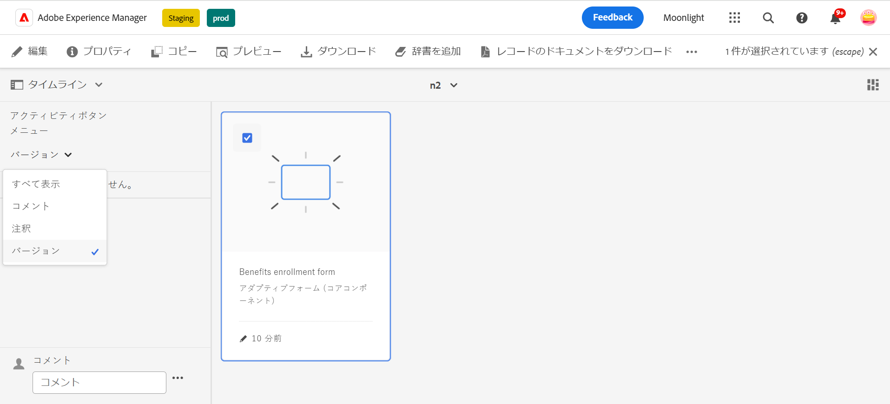
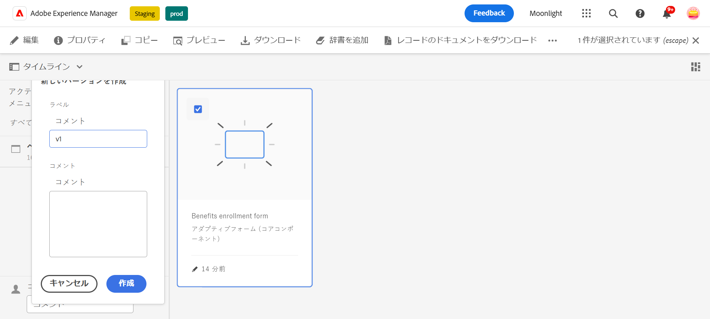
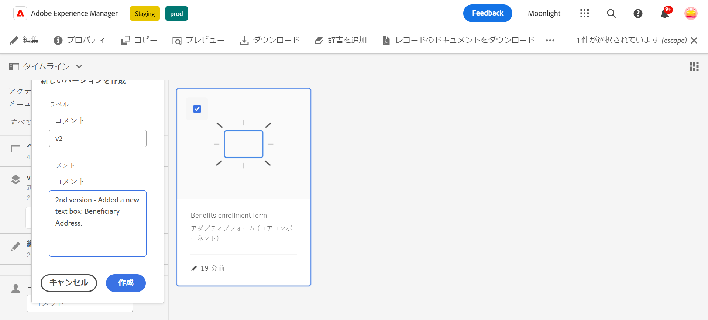
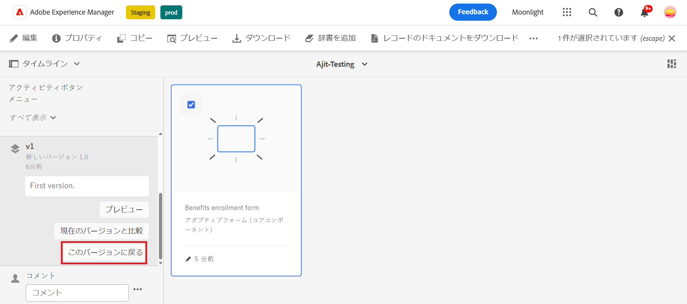
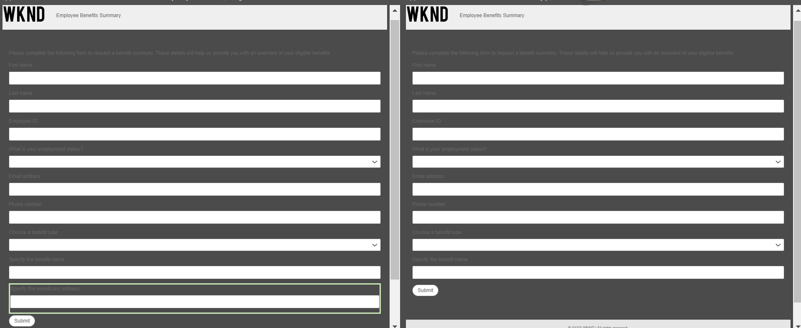
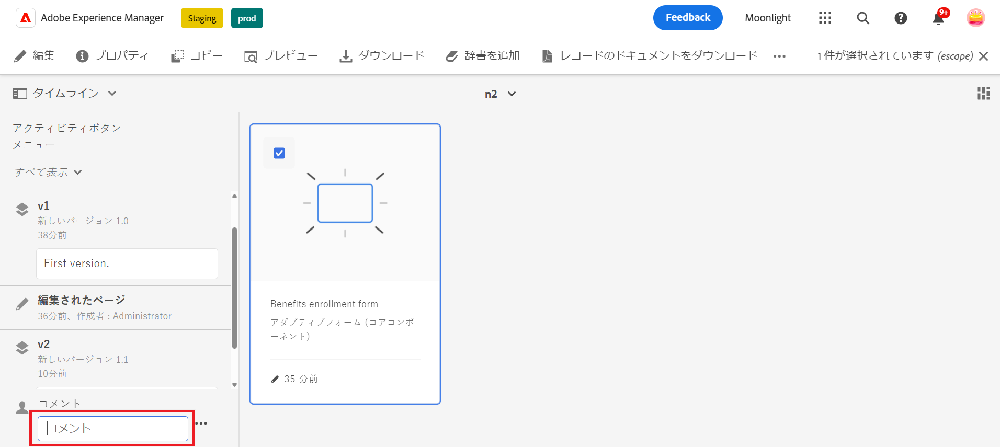
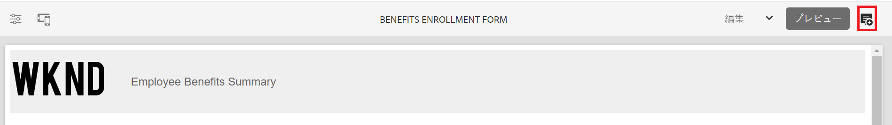
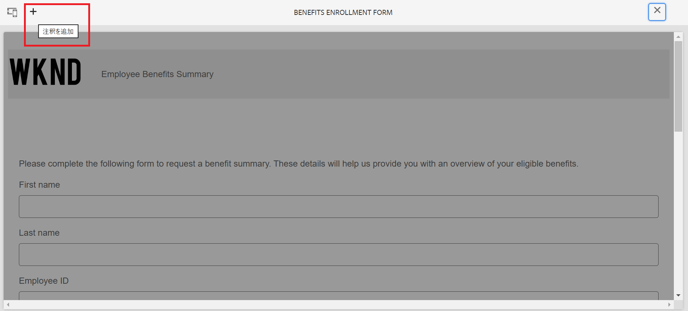
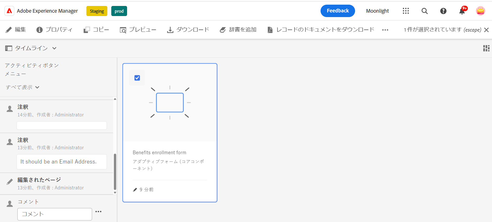

# アダプティブフォームのバージョン管理、レビューおよびコメント

この機能は、デフォルトでは有効になっていません。 公式アドレスから aem-forms-ea@adobe.com に書き込んで、機能へのアクセスをリクエストできます。

アダプティブフォームのコアコンポーネントを使用すると、フォーム作成者はフォームにバージョン管理、コメント、注釈を追加できます。 これらの機能により、ユーザーは複数のバージョンを作成および管理し、コメントを通じて共同作業を行い、特定のフォームセクションにメモを追加できるようになり、フォーム開発が簡素化され、フォーム作成エクスペリエンスが向上します。

## 前提条件 {#prerequisite-versioning}

アダプティブフォームでバージョン管理、コメント、注釈機能を使用するには、AEM Forms環境で[&#x200B; アダプティブフォームコアコンポーネント &#x200B;](/help/forms/using/enable-adaptive-forms-core-components.md)が有効になっていることを確認します。

## アダプティブフォームのバージョン管理 {#adaptive-form-versioning}

アダプティブフォームのバージョン管理は、フォームにバージョンを追加するのに役立ちます。 フォーム作成者は、フォームの複数のバージョンを簡単に作成し、最終的にビジネス目標に適したバージョンを使用できます。 さらに、フォームユーザーは、フォームを以前のバージョンに戻すこともできます。 また、作成者は、フォームの 2 つのバージョンをプレビューして比較することが容易になるので、UI の観点からフォームをより適切に分析できます。 各アダプティブフォームのバージョン管理機能について詳しく見ていきましょう。

### フォームのバージョンの作成 {#create-a-form-version}

フォームのバージョンを作成するには、次の手順に従います。

1. AEM Forms 環境で、**[!UICONTROL フォーム]**／**[!UICONTROL フォームとドキュメント]**&#x200B;に移動し、**フォーム**&#x200B;を選択します。
1. 左側のパネルの選択ドロップダウンから、「**[!UICONTROL バージョン]**」を選択します。
   
1. 左下のパネルにある **3 つのドット**&#x200B;をクリックし、「**[!UICONTROL バージョンとして保存]**」をクリックします。
1. フォームのバージョンにラベルを指定します。コメントを通じてフォームに関する情報を追加することもできます。
   

### フォームのバージョンの更新 {#update-a-form-version}

フォームを編集および更新したら、新しいバージョンをフォームに追加します。 最後の節で示した手順に従って、画像に示すようにフォームの新しいバージョンに名前を付けます。

### フォームのバージョンを元に戻す {#revert-a-form-version}

フォームのバージョンを以前のバージョンに戻すには、フォームのバージョンを選択し、「**[!UICONTROL このバージョンに戻る]**」をクリックします。

### フォームのバージョンの比較 {#compare-form-versions}

フォーム作成者は、プレビュー目的で 2 つの異なるバージョンのフォームを比較できます。 バージョンを比較するには、フォームのバージョンを選択し、「**[!UICONTROL 現在のバージョンと比較]**」をクリックします。 プレビューモードで 2 つの異なるフォームのバージョンが表示されます。

## コメントの追加 {#add-comments}

レビューとは、1 人以上のレビュー担当者に対してフォームへのコメントを許可するメカニズムです。 フォームユーザーは誰でもフォームにコメントしたり、コメントを通じてフォームをレビューしたりできます。 フォームにコメントするには、「**[!UICONTROL フォーム]**」を選択し、フォームに&#x200B;**[!UICONTROL コメント]**&#x200B;を追加します。

>[!NOTE]
> 上記で説明したように、アダプティブフォームのコアコンポーネントでコメントを使用すると、フォーム機能の[フォームへのレビュアーの追加](/help/forms/using/create-reviews-forms.md)が無効になります。

## 注釈の追加 {#adaptive-form-annotations}

多くの場合、フォームグループのユーザーは、レビューの目的で、フォームの特定のタブやコンポーネントなどに注釈を追加する必要があります。 このような場合、作成者は注釈を使用できます。
フォームに注釈を追加するには、次の手順を実行します。

1. **[!UICONTROL 編集]**&#x200B;モードでフォームを開きます。

1. 画像に示すように、右上のパネルにある&#x200B;**追加アイコン**&#x200B;をクリックします。
   

1. 次に、画像に示すように、左上のパネルにある **追加アイコン** をクリックして、注釈を追加します。
   

1. これで、コメントを追加したり、複数のカラーでスケッチを描画してフォームコンポーネントを作成したりできます。

1. フォームに追加したすべての注釈を表示するには、フォームを選択すると、画像に示すように、左側のパネルに追加した注釈が表示されます。

   

## 関連トピック

* [アダプティブフォームのコアコンポーネントの比較](/help/forms/using/compare-forms-core-components.md)
