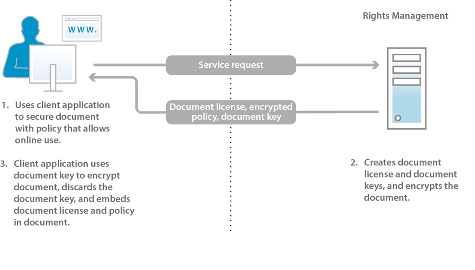

# ドキュメントセキュリティについて {#about-document-security}

Document Security を使用すると、許可されたユーザーのみがドキュメントを使用するように指定できます。Document Security を使用すると、サポートされている形式で保存した情報を安全に配布できます。次のファイル形式がサポートされています。

* Adobe PDF ファイル
* Microsoft® Word、Excel、PowerPoint ファイル

サポートされるファイルタイプをポリシーで保護する方法について詳しくは、「[その他のドキュメントセキュリティ情報](https://experienceleague.adobe.com/docs/experience-manager-65-lts/forms/use-document-security/document-security-offerings.html?lang=en)」を参照してください。

Document Security を使用すると、定義済みの機密性設定を簡単に作成および保存し、ドキュメントに適用できます。また、管理できる範囲を超えて情報が拡散しないように、ドキュメントの配布後に、受信者がドキュメントをどのように使用するかを監視および制御することもできます。

ドキュメントを保護するには、ポリシーを使用します。*ポリシー*&#x200B;は、機密性設定と許可されたユーザーのリストを含む情報のコレクションです。ポリシーを適用したドキュメントを受信者がどのように使用できるかは、ポリシーで指定した機密性設定によって決まります。例えば、テキストの印刷やコピー、テキストの編集、保護されたドキュメントへの署名やコメントの追加を受信者が実行できるかどうかを指定できます。

Document Security ユーザーは、エンドユーザーの web ページ経由でポリシーを作成します。管理者は、Document Security web ページを使用して、許可されたすべてのユーザーが利用できる共有ポリシーを含んだポリシーセットを作成します。

ポリシーは Document Security に保存されますが、ドキュメントへの適用はクライアントアプリケーションを通じて行われます。PDF ドキュメントにポリシーを適用する方法について詳しくは、*Acrobat のヘルプ*&#x200B;を参照してください。Microsoft® Office などの他のアプリケーションを使用してポリシーを適用する方法は、*Acrobat Reader DC Extensions ヘルプ*&#x200B;の各アプリケーションに関する節に記載されています。

ドキュメントにポリシーを適用すると、ポリシーで指定された機密性設定によって、ドキュメントに含まれる情報が保護されます。また、PDF ドキュメント内のすべてのファイル（テキスト、オーディオ、ビデオ）も機密性設定によって保護されます。ポリシーで保護されたドキュメントは、ポリシーで許可されている受信者に配布できます。

**ドキュメントのアクセス制御と監査**

ポリシーを使用してドキュメントを保護すると、ドキュメントを配布した後も、そのドキュメントを継続的に制御できます。ドキュメントの監視、ポリシーの変更、ユーザーによるドキュメントへのアクセスの禁止、ドキュメントに適用されるポリシーの切り替えなどを行うことができます。

Document Security を通じて、ポリシーで保護されたドキュメントを監視したり、許可されたユーザーや許可されていないユーザーがドキュメントを開こうとするなどのイベントを追跡したりできます。

**コンポーネント**

Document Security は、サーバーとユーザーインターフェイスで構成されます。

**サーバー：** Document Security でユーザー認証、ポリシーのリアルタイム管理、機密性の適用などのトランザクションを実行する際に使用する中心的なコンポーネントです。サーバーは、ポリシー、監査記録およびその他の関連情報の中央リポジトリとしての役割も果たします。

**Web ページ：**&#x200B;ポリシーの作成、ポリシーで保護されたドキュメントの管理およびポリシーで保護されたドキュメントに関連するイベントの監視を行うインターフェイスです。管理者は、ユーザー認証、監査、招待ユーザーへのメッセージングなどのグローバルオプションを設定したり、招待ユーザーのアカウントを管理したりすることもできます。

このイラストに記載された各手順は次のとおりです。

1. ドキュメント所有者が、web ページを使用してポリシーを作成します。ドキュメント所有者は、自分だけがアクセスできる個人用ポリシーを作成できます。管理者とポリシーセットコーディネーターは、許可されたユーザーがアクセスできるポリシーセット内に共有ポリシーを作成できます。
1. ドキュメント所有者がポリシーを適用し、ドキュメントを保存および配布します。ドキュメントは、メール、ネットワークフォルダー、web サイトのいずれかを通じて配布できます。
1. 受信者が、適切なクライアントアプリケーションでドキュメントを開きます。受信者は、ポリシーに従ってドキュメントを使用できます。
1. ドキュメント所有者、ポリシーセットコーディネーターまたは管理者は、web ページを使用して、ドキュメントを追跡したり、ドキュメントへのアクセスを変更したりすることができます。

## Document Security ユーザーについて {#about-document-security-users}

様々なタイプのユーザーが、様々なタスクを実行するためにドキュメントセキュリティを使用します。

* システム管理者またはその他の情報システム（IS）担当者が、Document Security をインストールし設定します。サーバー、web ページ、ポリシーおよびドキュメントのグローバル設定を行うこともあります。

  これらの設定には、例えば、Document Security のベース URL、監査とプライバシー通知、招待ユーザーの登録通知、デフォルトのオフラインリース期間などが含まれます。

* Document Security 管理者は、ポリシーとポリシーセットを作成し、ポリシーで保護されたユーザーのドキュメントを必要に応じて管理します。また、招待ユーザーアカウントを作成したり、システム、ドキュメント、ユーザー、ポリシー、ポリシーセットおよびカスタムイベントを監視します。システム管理者と協力して、グローバルサーバー、web ページおよびポリシー設定を行うこともあります。

  管理者は、管理コンソールの User Management 領域で、以下に示す役割をユーザーに割り当てることができます。これらの役割を割り当てられたユーザーは、管理コンソールの Document Security ユーザーインターフェイス領域でタスクを実行します。

  **Document Security 上級管理者**

  この役割を持つユーザーは、管理コンソールのすべての Document Security 設定にアクセスできます。この役割に関連付けられている権限は以下のとおりです。

   * 設定の管理
   * ポリシーの管理
   * ポリシーセットの管理
   * ドキュメントの管理
   * ドキュメント公開者の管理
   * 招待ユーザーとローカルユーザーの管理
   * イベントの表示
   * 委任
   * 外部ユーザーの招待

  **Document Security 管理者**

  この役割を持つユーザーは、管理コンソールの Document Security セクションの設定ページを使用して、Document Security サーバーを設定できます。この役割に関連付けられている権限は、設定の管理です。

  >[!NOTE]
  >
  >この役割を持つユーザーが管理コンソールにログインして設定関連の情報を編集するには、管理コンソールユーザーの役割も必要です。

  **Document Security ポリシーセット管理者**

  この役割を持つユーザーは、管理コンソールの Document Security セクションを使用して、他のユーザーのポリシーを編集したり、ポリシーセットを作成、編集および削除したりできます。ポリシーセット管理者は、ポリシーセットを作成するときにポリシーセットコーディネーターをそのポリシーセットに割り当てることができます。この役割に関連付けられている権限は以下のとおりです。

   * ポリシーの管理
   * ポリシーセットの管理
   * ドキュメントの管理
   * ドキュメント公開者の管理
   * イベントの表示
   * 委任

  >[!NOTE]
  >
  >この役割を持つユーザーが管理コンソールにログインして設定関連の情報を編集するには、管理コンソールユーザーの役割も必要です。

  **ドキュメントセキュリティで招待ユーザーとローカルユーザーを管理**

  この役割を持つユーザーは、すべての招待ユーザーとローカルユーザーの管理に必要なタスクを、関連する Document Security web ページで実行できます。この役割に関連付けられている権限は以下のとおりです。

   * 招待ユーザーとローカルユーザーの管理
   * 外部ユーザーの招待
   * エンドユーザー web ページへのアクセス

  >[!NOTE]
  >
  >この役割を持つユーザーが管理コンソールにログインして設定関連の情報を編集するには、管理コンソールユーザーの役割も必要です。

  **Document Security ユーザーの招待**

  この役割を持つユーザーは、ユーザーを招待できます。この役割に関連付けられている権限は以下のとおりです。

   * 外部ユーザーの招待
   * エンドユーザー web ページへのアクセス

  **Document Security エンドユーザー**

  この役割を持つユーザーは、Document Security エンドユーザー web ページにアクセスできます。この役割を管理者に割り当て、管理者がエンドユーザーのページを使用してポリシーを作成できるようにすることができます。この役割に関連付けられている権限は、エンドユーザー web ページへのアクセスです。

* 有効な Document Security アカウントを持つ組織内のユーザーは、独自のポリシーの作成、ポリシーによるドキュメントの保護、ポリシーで保護されたドキュメントの追跡と管理および自分のドキュメントに関連するイベントの監視を行います。
* ポリシーセットコーディネーターは、ドキュメントの管理、イベントの表示および他のポリシーセットコーディネーターの管理を（権限に基づいて）行います。管理者が、特定のポリシーセットのポリシーセットコーディネーターとしてユーザーを指定します。
* ビジネスパートナーなどの組織外のユーザーは、Document Security ディレクトリに含まれている場合、管理者によって専用のアカウントが作成された場合、自動メール招待プロセスを通じて Document Security に登録された場合のいずれかで、ポリシーで保護されたドキュメントを使用できます。管理者が指定するアクセス設定に応じて、招待ユーザーは、ドキュメントにポリシーを適用したり、ポリシーを作成、変更および削除したりすることができます。また、他の外部ユーザーを招待して、ポリシーで保護されたドキュメントを使用させることもできます。
* 開発者は、AEM Forms SDK を使用して、カスタムアプリケーションとドキュメントセキュリティを統合します。

Document Security 管理者は、User Management の次の権限を使用して、カスタムの役割を作成できます。

* Document Security：設定の管理
* Document Security 招待ユーザーおよびローカルユーザーの管理
* Document Security：ポリシーセットの管理
* Document Security：ポリシーセットの管理
* Document Security：サーバーイベントの表示
* Document Security：ポリシー所有者の変更

## ポリシーおよびポリシーで保護されたドキュメント {#policies-and-policy-protected-documents}

*ポリシー*&#x200B;は、一連の機密設定、およびポリシーが適用されるドキュメントにアクセスできるユーザーを定義します。ドキュメントに関する権限を、ポリシーによって動的に変更することもできます。ポリシーによって、ドキュメントを保護するユーザーに、機密設定の変更、ドキュメントのアクセス権限の失効またはポリシーの切り替えを行う権限を付与します。

ポリシー保護を PDF ドキュメントに適用するには、Adobe Acrobat® Pro および Acrobat Standard を使用します。ポリシー保護は、適切な Acrobat Reader DC Extensions がインストールされているクライアントアプリケーションを使用して、Microsoft® Word、Excel および PowerPoint ファイルなどの他のファイルタイプに適用できます。

### ポリシーの仕組み {#how-policies-work}

ポリシーは、許可されたユーザーおよびドキュメントに適用される機密性設定に関する情報で構成されます。組織内の人およびアカウントを持っている組織外の人がユーザーになることができます。管理者がユーザー招待機能を有効にしている場合は、新しいユーザーをポリシーに追加することができます。この場合、登録招待用のメールプロセスが開始されます。

ポリシーの機密性設定によって、受信者がドキュメントをどのように使用できるかが決まります。例えば、テキストの印刷やコピー、変更または保護されたドキュメントへの署名やコメントの追加を実行できるかどうかを指定することができます。同じポリシーで、特定のユーザーに対して異なる機密性設定を指定することもできます。

>[!NOTE]
>
>ポリシーを通じて適用される機密性設定は、Acrobat でパスワードまたは証明書セキュリティオプションを使用して PDF ドキュメントに適用された設定よりも優先されます（詳しくは、Acrobat のヘルプを参照）。

ユーザーと管理者は、Document Security web ページを使用してポリシーを作成します。ドキュメントに適用されるのは、一度に 1 つのポリシーだけです。以下のいずれかの方法でポリシーを適用できます。

* Acrobat または他のクライアントアプリケーションでドキュメントを開き、ドキュメントを保護するためのポリシーを選択します。
* ドキュメントを Microsoft® Outlook のメール添付ファイルとして送信します。この場合は、ポリシーのリストからポリシーを選択します。または、Acrobat がデフォルトの機密性設定のセットで作成する自動生成ポリシーを選択して、メールメッセージの受信者に対してのみドキュメントを保護します。

ポリシーをドキュメントから削除するには、クライアントアプリケーションを使用します。

この図の各手順は次のとおりです。

1. ドキュメント所有者が、サポートされているクライアントアプリケーションのドキュメントを、オンラインでの使用を許可するポリシーで保護します。
1. Document Security によって、ドキュメントライセンスとドキュメントキーが作成され、ポリシーが暗号化されます。ドキュメントライセンス、暗号化されたポリシーおよびドキュメントキーがクライアントアプリケーションに返されます。
1. そのドキュメントキーを使用してドキュメントが暗号化され、ドキュメントキーが破棄されます。ドキュメントには、ライセンスとポリシーが埋め込まれています。これらのタスクは、サポートされるクライアントアプリケーションで実行されます。

ドキュメントにポリシーを適用する場合、PDF ドキュメントに含まれているすべてのファイル（テキスト、オーディオまたはビデオ）など、ドキュメントに含まれている情報は、ポリシーで指定されている機密性設定で保護されます。Document Security によってライセンスと暗号化情報が生成され、ドキュメントに埋め込まれます。ドキュメントを配布すると、それを開こうとする受信者が Document Security によって認証され、ポリシーで指定されている権限に従ってその受信者のアクセスが許可されます。

オフラインでの使用が有効になっている場合、受信者は、ポリシーで保護されたドキュメントを、ポリシーで指定される期間、オフライン（アクティブなインターネット接続やネットワーク接続がない状態）で使用することもできます。

### ポリシーで保護されたドキュメントの動作 {#how-policy-protected-documents-work}

ポリシーで保護されたドキュメントを開いて使用するには、自分の名前が受信者としてポリシーに含まれている必要があり、有効な Document Security アカウントが必要です。PDF ドキュメントの場合は、Acrobat または Adobe Reader® が必要です。その他のファイルタイプの場合は、Acrobat Reader DC Extensions がインストールされた、そのファイル用の適切なアプリケーションが必要です。

ポリシーで保護されたドキュメントを開くと、Acrobat、Adobe Reader または Acrobat Reader DC Extensions が Document Security に接続され、認証が行われます。その後、ログオンに進むことができます。ドキュメントの使用が監査されている場合は、通知メッセージが表示されます。Document Security は、付与されるドキュメント権限を判別した後、ドキュメントの復号を管理します。この後で、ユーザーはポリシーの機密性設定に従ってドキュメントを使用できるようになります。

この図の各手順は次のとおりです。

1. ドキュメントユーザーが、サポートされているクライアントアプリケーションでドキュメントを開きます。このとき、サーバーによって認証が行われます。ドキュメント ID が Document Security サーバーに送信されます。
1. Document Security でユーザーが認証され、承認のためにポリシーが確認され、バウチャーが作成されます。（ドキュメントキーと権限を記載した）バウチャーが、クライアントアプリケーションに送り返されます。
1. ドキュメントはドキュメントキーを使用して復号され、ドキュメントキーは破棄されます。これで、ポリシーの機密性設定に従ってドキュメントが使用できるようになります。これらのタスクは、サポートされるクライアントアプリケーションで実行されます。

以下の条件の下で、ドキュメントの使用を継続することができます。

* 無期限またはポリシーで指定される有効期間内。
* 管理者またはポリシーを適用したユーザーが、ドキュメントのアクセス権限を失効させるか、ポリシーを変更するまで。

ポリシーでオフラインアクセスが許可されている場合は、ポリシーで保護されたドキュメントをオフライン（インターネット接続やネットワーク接続がない状態）で使用することもできます。まず Document Security にログインして、ドキュメントを同期させます。その後、ポリシーで指定されているオフラインリース期間の間、ドキュメントを使用できます。

オフラインリース期間が終了した場合は、オンラインにしてポリシーで保護されたドキュメントを開くか、クライアントアプリケーションのコマンドを使用して、ドキュメントを Document Security と再び同期させる必要があります（詳しくは、*Acrobat のヘルプ*&#x200B;または適切な *Acrobat Reader DC Extensions のヘルプ*&#x200B;を参照してください）。

ポリシーで保護されたドキュメントを「保存」メニューコマンドまたは「別名で保存」メニューコマンドを使用して保存すると、新しいドキュメントにポリシーが自動的に適用および実行されます。新しいドキュメントを開くなどのイベントも監査されて、元のドキュメントで記録されます。

## ポリシーセット {#policy-sets}

ポリシーセットは、ある共通の目的を持つ一群のポリシーをグループ化するために使用します&#x200B;*。*&#x200B;作成されたポリシーセットは、システム内のユーザーのサブセットに対して提供されます。

それぞれのポリシーセットには、1 人以上のポリシーセットコーディネーターを設定できます。ポリシーセットコーディネーターは、管理者またはその他の権限を持つユーザーです。一般に、*ポリシーセットコーディネーター*&#x200B;には、特定のポリシーセット内に最も効果的なポリシーを作成できる組織内の専門家を指定します。

ポリシーセットコーディネーターは、以下のタスクを実行できます。

* ポリシーの作成
* ポリシーセット内のポリシーの編集と削除
* ポリシーセット設定の編集
* ポリシーセットコーディネーターの追加と削除
* ポリシーセットに含まれるポリシーまたはドキュメントのポリシーイベントとドキュメントイベントの表示
* ドキュメントへのアクセス権限の取り消し
* ドキュメントのポリシーの切り替え

>[!NOTE]
>
>`getAllPolicysetnames()` API を使用して、データベースから最大 1,000 個のポリシーセット名を取得できます。

該当する権限を持つ管理者およびポリシーセットコーディネーターは、Document Security の管理 web ページを使用して、ポリシーセットを作成および削除します。

ポリシーセットを使用できるユーザーの数は制限されています。この制限は、ドメイン内のどのユーザーやグループがドキュメントを保護するためにポリシーセットのポリシーを使用できるのかを指定することにより行います。

Document Security のインストール時に、*グローバルポリシーセット*&#x200B;と呼ばれるデフォルトのポリシーセットが作成されます。ソフトウェアをインストールした管理者が、このポリシーセットを管理します。

## ベストプラクティス {#best-practices}

ポリシーは、様々なドキュメントに適用できる、再利用可能な権限とユーザーグループのセットです。保護されたドキュメント用です。これらのポリシーにより、許可されたユーザーのみが許可された機能を使用できるようになります。部門内の様々なユーザーの役割やドキュメントの増加に伴い、ポリシーやポリシーセットの数は増加することが予想されます。ポリシーを作成および管理する際の考慮事項とベストプラクティスを次に示します。

* **再利用可能なポリシーを作成：**&#x200B;アドビは、様々なドキュメントにわたってポリシーを再利用することをお勧めします。これにより、ポリシーの数を最小限に抑え、最適なパフォーマンスを提供し、ポリシーの管理を容易にできます。再利用可能なポリシーを作成するには：

1. 部門レベルおよび会社レベルでアクセス制御の要件を特定して定義します。

1. ユーザーグループを作成し、これらのグループにユーザーを追加します。

1. ポリシーセットを作成します。 

1. ポリシーセットを開き、ポリシーを作成します。ユーザーグループを追加し、ポリシーの機密性（アクセス制御）設定をおこないます。

個々のユーザーではなくポリシーにユーザーグループを追加します。これにより、多数のユーザーに対するポリシーの管理と適用が容易になります。

* **カスタムポリシーセットを作成：**&#x200B;ポリシーセットは、複数のポリシーを 1 つの管理可能なエンティティに組み合わせます。組織または会社のカスタムポリシーセットを作成し、それらを使用して関連ポリシーをグループ化し、システム内のユーザーのサブセットで使用できるようにします。

  ポリシーセットを使用すると、組織や会社内の特定のユーザーに関連するポリシーを割り当てて管理しやすくなります。例えば、財務部門と人事部門のポリシーセットを別々に設定すると、対応する部門に指定されたドキュメントに関連するポリシーを容易に管理し、適用できます。

* **外部認証を使用して権限を動的に適用：** [外部認証](https://help.adobe.com/ja_JP/livecycle/11.0/ProgramLC/WS624e3cba99b79e12e69a9941333732bac8-6f26.2.html)を使用して、外部条件に基づいて権限を評価し、動的に適用できます。権限を外部条件に基づいて動的に評価すると、次のことが可能になります。

   * 組織内のドキュメントに対して一元的なアクセス制御を提供します。

   * ユーザーがポリシーで保護されたドキュメントにアクセスできるかどうかを動的に判断することで、ポリシーで保護されたドキュメントへのアクセスを制御します。例えば、ポリシーで保護されたドキュメントをユーザーが印刷できるかどうかを動的に決定します。

   * 標準のポリシー評価プロセスに加えて、コンテンツ管理システムが使用するアクセス制御メカニズムを使用します。例えば、ポリシーで保護されたドキュメントをユーザーが印刷できるかどうかをサービスが判断する場合、標準のポリシー評価プロセスを使用できます。また、コンテンツ管理システムで使用されるアクセス制御メカニズムも使用できます。

  Document Security のポリシー評価プロセスを外部の認証ハンドラーに完全に置き換えることは可能ですが、外部の認証ハンドラーをポリシー評価プロセスと組み合わせて使用することをお勧めします。その結果、コンテンツ管理システムと同じ制御メカニズムでドキュメントアクセスを制御できます。例えば、ポリシーで保護されたドキュメントをユーザーが印刷できるかどうかを判断する際に、Document Security サービスは標準のポリシー評価プロセスを使用します。また、コンテンツ管理システムで使用されるアクセス制御メカニズムも使用します。詳しくは、[外部認証ハンドラーの作成](https://help.adobe.com/ja_JP/livecycle/11.0/ProgramLC/WS624e3cba99b79e12e69a9941333732bac8-6f26.2.html)を参照してください。

* **ポリシーセットの数を制限：**&#x200B;ポリシーやポリシーセットが常に増加するのには、いくつかの要因があります。一般的な要因は以下のとおりです。

   * 時間の経過に伴う組織内のユーザーの役割、部門、ドキュメントの増加。
   * 組織の部門は単独で作業し、部門固有のポリシーを厳しく管理します。組織内で同一のポリシーが作成されます。

  アドビは、ポリシーとポリシーセットの数を最小限に抑えることをお勧めします。ポリシーとポリシーセットを容易に管理し、パフォーマンスを向上できます。数を最小限に抑えるには、次の手順に従います。

   * 再利用可能なポリシーを作成します。これらのポリシーは複数の部門で共有できます。
   * 部門ごとに個別のポリシーセットではなく、一部のポリシーが複数の部門に適用される場合は、組織全体のポリシーセットを作成することを検討します。
   * 関連するポリシーをポリシーセットにグループ化します。ポリシーごとに個別のポリシーセットを作成しないでください。
   * 外部認証を使用して、ユーザー権限を動的に制御します。

  >[!NOTE]
  >
  >[getAllPolicysetnames()](https://developer.adobe.com/experience-manager/reference-materials/6-5/forms/programlc/javadoc/com/adobe/livecycle/rightsmanagement/client/PolicyManager.html?lang=ja) API を使用すると、最大 1,000 個のポリシーセット名を取得できます。内部的には、API は、API 呼び出し元がドキュメント公開者権限持つ最大 1,000 個のポリシーを取得し、取得したポリシーに関連付けられた一意のポリシーセット名のリストを作成して返します。例えば、API が 1,000 個のポリシーを取得し、取得したポリシーが合計 200 個のポリシーセットに関連付けられている場合、API は 200 個のポリシーセット名のみを返します。
