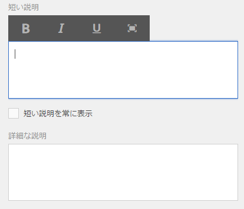
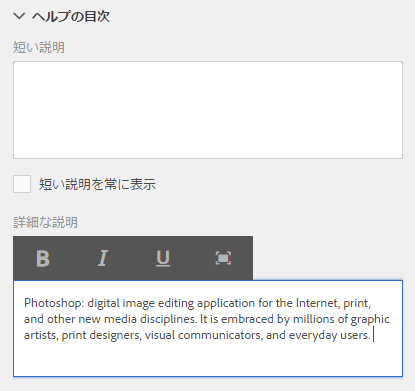
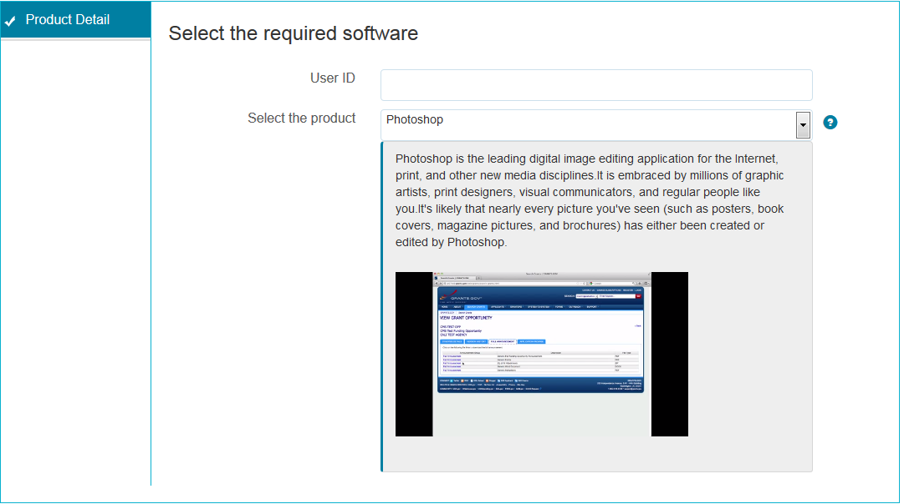
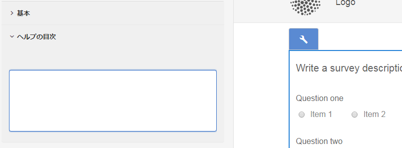

# フォームのフィールドのための文脈依存ヘルプの作成{#authoring-in-context-help-for-form-fields}

[アダプティブフォームの新規作成](/help/forms/using/create-an-adaptive-form-core-components.md)または [AEM Sites ページへのアダプティブフォームの追加](/help/forms/using/create-or-add-an-adaptive-form-to-aem-sites-page.md)には、最新の拡張可能なデータキャプチャ[コアコンポーネント](https://experienceleague.adobe.com/docs/experience-manager-core-components/using/adaptive-forms/introduction.html?lang=ja)を使用することをお勧めします。 これらのコンポーネントは、アダプティブフォームの作成における大幅な進歩を表し、ユーザーエクスペリエンスの向上を実現します。 この記事では、基盤コンポーネントを使用してアダプティブフォームを作成する古い方法について説明します。

## はじめに {#introduction}

エンドユーザーがフォームに記入しているときに、特定のフォームフィールドへの記入方法がわからない場合があります。 そのような問題を解決するために、アダプティブフォームでは、テキストのまたは高度な文脈依存ヘルプをフォームフィールドに追加できるようにしています。 これにより、フォーム入力エクスペリエンスを向上し、エンドユーザーにとっての曖昧さを回避することができます。

この記事では、フォーム作成者がアダプティブフォームの作成中に文脈依存ヘルプを追加する方法を説明します。

## 文脈依存ヘルプを追加 {#add-in-context-help}

文脈依存ヘルプは、サイドバーにある「プロパティ」タブの「ヘルプコンテンツ」セクションで、以下のオプションを利用して指定できます。

* [簡単な説明](../../forms/using/authoring-in-field-help.md#p-short-description-p)
* [詳細な説明](../../forms/using/authoring-in-field-help.md#p-long-description-p)

>[!NOTE]
>
>詳細な説明は簡単な説明をオーバーライドします。 両方を指定した場合は、詳細な説明のみが表示されます。

### 簡単な説明 {#short-description}

簡単な説明フィールドは、フォームフィールドの記入に関する短く簡単なヒントを提供するためにあります。 「簡単な説明」フィールド内で指定されたテキストは、フィールドの上にカーソルを移動させると、ツールチップとして表示されます。

>[!NOTE]
>
>ヘルプテキストを常にフィールドの下に表示するには、「**簡単な説明を常に表示する**」を選択します。

### 詳細な説明 {#long-description}

「詳細な説明」フィールドを使って、文脈依存ヘルプに長いテキストを指定したり、ビデオなどのリッチメディアコンテンツを埋め込んだりすることができます。 例えば、次の画像では文脈依存ヘルプとしてビデオを埋め込む方法を示しています。

長い説明を追加すると、**?**&#x200B;が表示されます フィールドの横にあるアイコン。 アイコンをクリックすると、「詳細な説明」セクションに追加されたコンテンツが表示されます。

### パネルレベルのヘルプ {#panel-level-help}

フォームフィールドの文脈依存ヘルプに加え、パネル編集ダイアログの「ヘルプコンテンツ」タブから、パネルレベルでヘルプを指定することができます。

パネルにヘルプを追加すると、**?**&#x200B;が表示されます パネルの説明の横にあるアイコン。 アイコンをクリックすると、パネル編集ダイアログの「ヘルプコンテンツ」セクションに追加されたコンテンツが表示されます。

