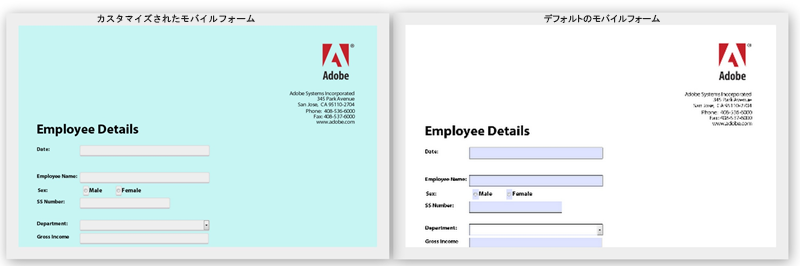

# HTML5 フォームのデフォルトスタイルの変更{#changing-default-styles-of-html-forms}

HTML5 フォームは HTML5 機能の使用によりレンダリングされ、レンダリングされるフォームのスタイル設定は CSS を使用して実行されます。 HTML5 フォームのデフォルトのアピアランスは、その PDF のレンディションに似ています。 開発者はカスタム CSS を使用して、HTML5 フォームのデフォルトのアピアランスを変更できます。

この記事では、HTML5 フォームのスタイルを変更するための詳細手順を説明します。[スタイルの概要](/help/forms/using/css-styles.md)の記事では、HTML5 フォームのさまざまなスタイル設定を詳しく解説します。 この記事に記載されている手順を実行する前に、「スタイルの概要」の記事を必ずお読みください。

次の 2 つの画像はデフォルトのスタイルとカスタマイズされたスタイルの違いを示しています。

## フォームのスタイル設定 {#style-your-forms}

1. **カスタムスタイルを追加するプロファイルを選択**

   **https://&lt;server>:&lt;port>/crx/de** の URL で CRX DE インターフェイスにアクセスし、プロファイルを作成するか、既存のプロファイルを選択します。 プロファイルの作成方法について詳しくは、[プロファイルの作成](/help/forms/using/custom-profile.md)を参照してください。

1. **HTML5 フォームのスタイル設定用の CSS スタイルシートを作成**

   プロファイルレンダラーを作成したフォルダーに移動し、CSS スタイルシートファイルを作成します。 以下の手順に従います。

   1. フォルダーを右クリックして、メニューから&#x200B;**作成**／**ファイルを作成**&#x200B;を選択します。

   1. ファイルを作成ダイアログで、スタイルシートの名前を入力します。 拡張子 .css を必ず使用してください（例：stylesheet.css）。
   1. ナビゲーションペインから、作成した CSS ファイルを開きます。
   1. スタイル設定するコンポーネントの CSS クラスを定義し、それらのクラスにスタイルを追加します。

   HTML5 フォームにある特定のコンポーネントに対してどの CSS クラスを作成するかについて詳しくは、[スタイルの概要](/help/forms/using/css-styles.md)を参照してください。

1. **プロファイルレンダラーにスタイルシートを追加**

   CRX DE でプロファイルレンダラーページ（jsp ファイル）を開き、CSS ファイルを XFA クライアントライブラリのすぐ下にあるページに含めます。 次の手順を実行して、CSS ファイルをプロファイルに含めます。

   1. レンダラーページで次の行を検索します。

      &lt;cq&lt;ph:includeClientLib categories=&quot;xfaforms.profile&quot; />

   1. 次の行を上記の行の下に挿入して、スタイルシートを含めます。

      &lt;link href=&quot;/path/to/stylesheet&quot; rel=&quot;stylesheet&quot; type=&quot;text/css&quot;/>

   1. ファイルを保存します。
