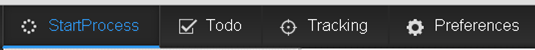
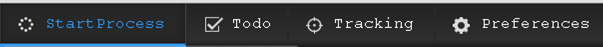

# インターフェイスのフォントの変更{#changing-the-font-on-the-interface}

AEM Forms Workspace に表示されているフォントを変更することができます。 ユーザーインターフェイスの特定のセクションで使用されているフォントは、スタイルシートの対応するセクションに定義されています。 フォントは選択的にユーザーインタフェイス上で変更することができます。

[AEM Forms Workspace のカスタマイズの一般的な手順](../../forms/using/generic-steps-html-workspace-customization.md)に従います。要件に応じて、CSS、HTML、またはその両方をカスタマイズするための手順に従います。

1. 既存のスタイルのフォントファミリを変更または追加します。
1. HTML 要素でフォントファミリインラインを変更または追加します。
1. スタイルを追加して HTML 要素で使用します。

例えば、トップナビゲーションバーのアンカーテキストのフォントを「Courier New」に変更するには、次の手順に従います。

1. `https://'[server]:[port]'/lc/crx/de/index.jsp` にアクセスして CRXDE Lite にログインします。
1. 次のいずれかの操作を行います。

   1. 既存のスタイルでフォントファミリーを変更するには、/apps/ws/css にある newStyle.css ファイルに以下を追加します。

      ```css
      #topnav a {
         font-family: "Courier New";
      }
      ```

   1. フォントファミリインラインを HTML 要素に追加するには、`/libs/ws/js/runtime/templates/appnavigation.html` ファイルを `/apps/ws/js/runtime/templates/appnavigation.html` にコピーします。

      /apps/ws/js/runtime/templates/appnavigation.html ファイルを次のようにして更新します。

      ```jsp
      <li class="process"><a href="#" title="<%= $.t('index.header.topnav.startprocess.detail')%>" style="font-family:Courier New;" ><%= $.t('index.header.topnav.startprocess.name')%></a></li>
      <li class="todo"><a href="#/todo" title="<%= $.t('index.header.topnav.todo.detail')%>" style="font-family:Courier New;" ><%= $.t('index.header.topnav.todo.name')%></a></li>
      <li class="track"><a href="#/tracking" title="<%= $.t('index.header.topnav.tracking.detail')%>" style="font-family:Courier New;" ><%= $.t('index.header.topnav.tracking.name')%></a></li>
      <li class="preference"><a href="#/preferences" title="<%= $.t('index.header.topnav.preferences.detail')%>" style="font-family:Courier New;" ><%= $.t('index.header.topnav.preferences.name')%></a></li>
      ```

      編集のため /apps/ws/js/registry.js ファイルを開き、`text!/lc/libs/ws/js/runtime/templates/appnavigation.html` を `text!/lc/apps/ws/js/runtime/templates/appnavigation.html` に置き換えます。

   1. フォントファミリを定義するスタイルを追加するには、/apps/ws/css にある newStyle.css ファイルに以下を追加します。

      ```css
      .myNewFontStyle a {
         font-family: "Courier New";
      }
      ```

      フォントファミリインラインを HTML 要素に追加するには、/apps/ws/js/runtime/templates にある appnavigation.html ファイルに以下を追加します。

      ```jsp
      <div id="topnav" class="myNewFontStyle">
          <ul>
              <li class="process"><a href="#" title="<%= $.t('index.header.topnav.startprocess.detail')%>" ><%= $.t('index.header.topnav.startprocess.name')%></a></li>
              <li class="todo"><a href="#/todo" title="<%= $.t('index.header.topnav.todo.detail')%>"><%= $.t('index.header.topnav.todo.name')%></a></li>
              <li class="track"><a href="#/tracking" title="<%= $.t('index.header.topnav.tracking.detail')%>" ><%= $.t('index.header.topnav.tracking.name')%></a></li>
              <li class="preference"><a href="#/preferences" title="<%= $.t('index.header.topnav.preferences.detail')%>" ><%= $.t('index.header.topnav.preferences.name')%></a></li>
          </ul>
      </div>
      ```

1. Workspace を再起動して変更が表示されるようにブラウザーのキャッシュをクリアします。



フォントをカスタマイズする前のトップナビゲーションバー



最初のタブのフォントをカスタマイズした後のトップナビゲーションバー
