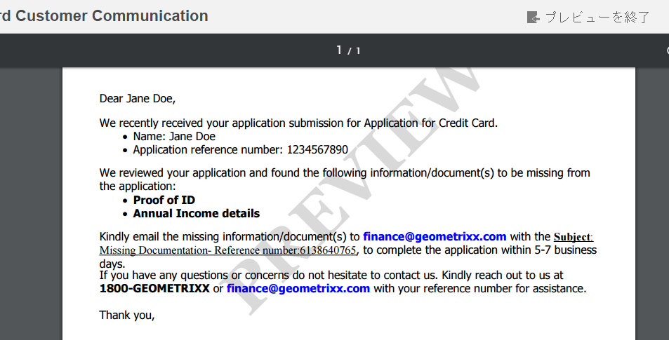

# レター PDF プレビューのカスタム透かし{#custom-watermark-in-letter-pdf-preview}

## 概要 {#overview}

通信作成 UI を使用するエージェントユーザーは、メールや印刷などを後処理に送信する最終的形態で表示します。

PDF データの不正使用を防ぐため、プレビューの PDF に透かしを付けることができます。 デフォルトの透かしは「プレビュー」で、PDF 全体に表示されます。

PDF のプレビューで透かしを表示するには、https://&#39;[server]:[port]&#39;/system/console/configMgr にある「**[!UICONTROL Correspondence Management の設定]**」で「プレビュー中に&#x200B;**[!UICONTROL 透かしを適用する]**」オプションを選択します。



透かしのテキストと外観をカスタマイズするには、次の手順を実行します。

## 通信作成 UI で PDF プレビュー内の透かしをカスタマイズする {#customizewatermark-}

1. `https://'[server]:[port]'/[ContextPath]/crx/de` にアクセスし、管理者としてログインします。
1. apps フォルダーで **[!UICONTROL previewwatermark]** という名前のフォルダーを作成します。パスや構造は libs フォルダー内の previewwatermark フォルダーと同様です。

   1. 次のパスにある **previewwatermark** フォルダーを右クリックし、「**オーバーレイノード**」を選択します。

      `/libs/fd/cm/configFiles/previewwatermark`

   1. オーバーレイノードダイアログに次の値が表示されていることを確認します。

      **パス：** /libs/fd/cm/configFiles/previewwatermark

      **オーバーレイの場所：** /apps/

      **ノードタイプを一致させる：**&#x200B;オン

      >[!NOTE]
      >
      >/libs 分岐は変更しないでください。 次の操作を行った場合はこのブランチが変更されるため、各自で加えた変更がすべて失われる可能性があります。
      >
      >    
      >    
      >    * インスタンスをアップグレード
      >    * ホットフィックスの適用
      >    * 機能パックをインストール
      >    
      >

   1. 「**OK**」をクリックし、「**すべて保存**」をクリックします。 指定されたパスに、**[!UICONTROL previewwatermark]** フォルダーが作成されます。

1. 「/libs/fd/cm/configFiles/previewwatermark」フォルダーから DDX ファイルをコピーして「/apps/fd/cm/configFiles/previewwatermark」フォルダーに貼り付け、「**[!UICONTROL すべて保存]**」をクリックします。
1. DDX ファイルは /apps/fd/cm/configFiles/previewwatermark/ から必要に応じて変更します。

   ```xml
   <DDX xmlns="https://ns.adobe.com/DDX/1.0/">
    <PDF result="output.pdf">
     <PDF source="input.pdf"/>
           <Watermark opacity="15%" rotation="45">
            <StyledText>
                     <p font-family="Georgia" font-size="70pt" color="black" font-weight="bold">
                         PREVIEW
                    </p>
            </StyledText>
           </Watermark>
    </PDF>
   </DDX>
   ```

   透かしの外観、テキスト、揃えのカスタマイズについては、[アセンブラーサービスと DDX リファレンス](https://help.adobe.com/jp_ja/livecycle/11.0/ddxRef.pdf)ドキュメントから、透かしと背景の追加と削除を参照してください。

   >[!NOTE]
   >
   >ddx ファイルでは、結果と入力への参照は output.pdf および input.pdf のままになります。 ddx ファイルの名前も変更しません。

1. 「**すべて保存**」をクリックします。
