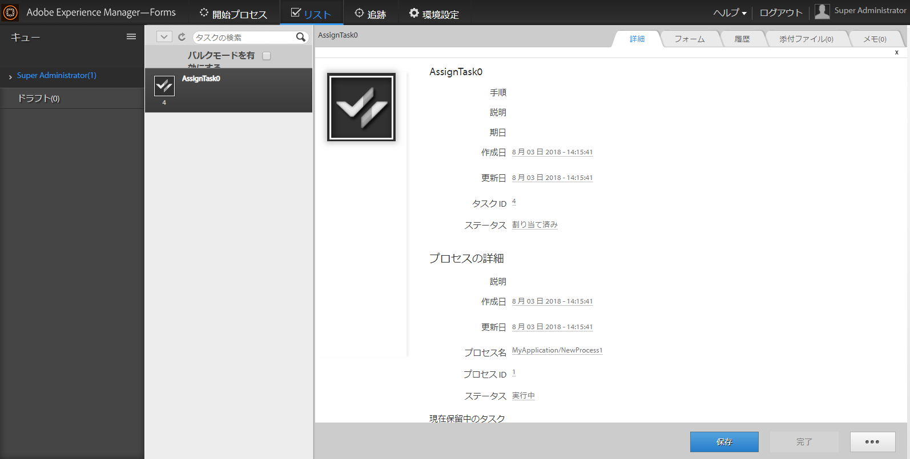

# TODO リストでの追加データの表示{#displaying-additional-data-in-todo-list}

デフォルトで、AEM Forms Workspace TODO リストにタスクの表示名および説明が表示されます。 しかしながら、作成日や締切日などのその他の情報を追加することができます。 また、アイコンを追加したり、表示のスタイルを変更することもできます。



この記事では、TODO リストの各タスクに情報を追加して表示する手順について説明します。

## 追加できる情報 {#what-can-be-added}

サーバーによって送信された `task.json` にある情報を追加することができます。 情報は、平文テキストとして追加することも、スタイルを使用して情報をフォーマットすることもできます。

JSON オブジェクトの説明についての詳細は、[この](/help/forms/using/html-workspace-json-object-description.md)記事を参照してください。

## タスクでの情報の表示 {#displaying-information-on-a-task}

1. 「[AEM Forms Workspace のカスタマイズの一般的な手順](../../forms/using/generic-steps-html-workspace-customization.md)」に従います。
1. タスクに追加の情報を表示するには、対応するキーと値のペアを `translation.json` のタスクブロック内に追加する必要があります。

   例えば、`/apps/ws/locales/en-US/translation.json`（英語）に変更します。

   ```json
   "task" : {
           "reminder" : {
               "value" : "Reminder",
               "tooltip" : "This is reminder __reminderCount__, for this task."
           },
           "deadlined" : {
               "value" : "Deadlined",
               "tooltip" : "This task has deadlined"
           },
           "save" : {
               "message" : "Task has been saved successfully"
           },
           "status" : {
               "deadlined" : "Deadlined",
               "created" : "Created",
               "assignedsaved" : "Draft from assigned task",
               "terminated" : "Terminated",
               "assigned" : "Assigned",
               "unknown" : "Unknown",
               "createdsaved" : "Draft from created task",
               "completed" : "Completed"
           },
           "draft" : {
               "value" : "Saved",
               "tooltip" : "This task is marked as a draft"
           },
           "escalated" : {
               "value" : "Escalated",
               "tooltip" : "This task has been escalated"
           },
           "forward" : {
               "value" : "Forwarded",
               "tooltip" : "This task was forwarded"
           },
           "priority" : {
               "highest" : "Highest priority",
               "normal" : "Normal priority",
               "high" : "High priority",
               "low" : "Low priority",
               "lowest" : "Lowest priority"
           },
           "claimed" : {
               "value" : "Claimed",
               "tooltip" : "This task has been claimed"
           },
           "locked" : {
               "value" : "Locked",
               "tooltip" : "This task is locked"
           },
           "consulted" : {
               "value" : "Consulted",
               "tooltip" : "This task has been consulted"
           },
           "returned" : {
               "value" : "Returned",
               "tooltip" : "This task was returned back"
           },
           "multiplesubmitbuttons" : {
               "message" : "The form associated with this task has multiple submit buttons so the Workspace Complete button will be disabled. Click the appropriate button on the form to submit it."
           },
           "nosubmitbutton" : {
               "message" : "The form associated with this task does not appear to have submit buttons. You may need to upgrade your Adobe Reader version to 9.1 or greater and enable the Reader Submit option in your process."
           },
           "icon" : {
               "tooltip" : "open the task __taskName__"
           }
       }
   ```

   >[!NOTE]
   >
   >対応するキーと値のペアをすべてのサポートされている言語に追加します。

1. 例えば、次のようにしてタスクブロック内に情報を追加します。

   ```json
   "stepname" : {
               "value" : "Step Name",
               "tooltip" : "This task belongs to __stepName__ step"
   }
   ```

## 新規プロパティでの CSS の定義 {#defining-css-for-the-new-property}

1. タスクに追加された情報（プロパティ）にスタイルを適用できます。 これを行うには、`/apps/ws/css/newStyle.css` に追加された新規プロパティにスタイル情報を追加する必要があります。

   例えば、以下を追加します。

   ```css
   .task .taskProperties .stepname{
       width: 25px;
       background: url(../images/stepname.png) no-repeat; /*-------- Or just reuse background image / image-sprite defined .task .taskProperties span of style.css---------------------*/
       background-position: 0px 0px; /*-------- Dummy values, need to be configured as per user background image / image-sprite ---------------------*/
   }
   ```

## HTML テンプレートへのエントリの追加 {#adding-entry-in-the-html-template}

最後に、タスクに追加する各プロパティの開発パッケージにエントリを含める必要があります。 作成する方法については、「AEM Forms Workspace コードの構築」を参照してください。

1. `task.html` をコピーします：

   * コピー元：`/libs/ws/js/runtime/templates/`
   * コピー先：`/apps/ws/js/runtime/templates/`

1. 新しい情報を `/apps/ws/js/runtime/templates/task.html` に追加します。

   例えば、`div class="taskProperties"` の下に追加します。

   ```jsp
   <span class="stepname" alt="<%= $.t('task.stepname.value')%>" title = '<%= $.t("task.stepname.tooltip",{stepName:stepName})%>'/>
   ```
