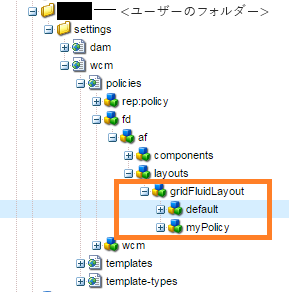
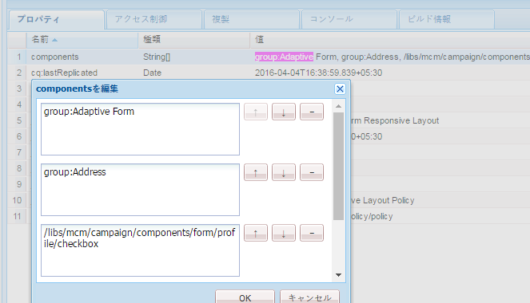
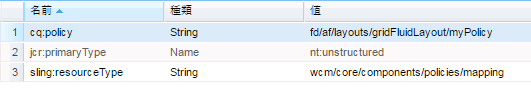

# 使用するテンプレートに基づいたコンポーネントの表示{#displaying-components-based-on-the-template-used}

フォーム作成者は、[テンプレート](../../forms/using/template-editor.md)を使用してアダプティブフォームを作成する際、テンプレートポリシーに基づいて、特定のコンポーネントを表示して使用できます。 テンプレートコンテンツポリシーを指定することにより、フォームの作成中にフォーム作成者に表示されるコンポーネントのグループを選択できます。

## テンプレートのコンテンツポリシーの変更 {#changing-the-content-policy-of-a-template}

作成したテンプレートは、コンテンツリポジトリの `/conf` に保存されます。 テンプレートのパスは、`/conf` ディレクトリに作成したフォルダーに基づいて、`/conf/<your-folder>/settings/wcm/templates/<your-template>` になります。

テンプレートのコンテンツポリシーに基づいてサイドバーにコンポーネントを表示するには、次の手順を実行します。

1. CRXDE Lite を開きます。\
   URL：`https://<server>:<port>/crx/de/index.jsp`
1. CRXDE で、テンプレートを作成したフォルダーに移動します。

   例：`/conf/<your-folder>/`

1. CRXDE で、`/conf/<your-folder>/settings/wcm/policies/fd/af/layouts/gridFluidLayout/` に移動します。

   コンポーネントのグループを選択するには、新しいコンテンツポリシーが必要です。 ポリシーを作成するには、デフォルトのポリシーをコピー＆ペーストし、名前を変更します。

   デフォルトコンテンツポリシーのパス： `/conf/<your-folder>/settings/wcm/policies/fd/af/layouts/gridFluidLayout/default`

   `gridFluidLayout` フォルダーで、デフォルトのポリシーをコピーして貼り付け、名前を変更します。 （例：`myPolicy`）。

   

1. 作成した新しいポリシーを選択し、右側のパネルにあるタイプが `string[]` の **components** プロパティを選択します。

   components プロパティを選択して開くと、components を編集ダイアログが表示されます。 components を編集ダイアログでは、「**+**」および「**-**」ボタンを使用して、コンポーネントグループを追加または削除できます。 作成者が使用するコンポーネントのフォームを含むコンポーネントグループを追加できます。

   

   コンポーネントグループを追加した後、「**OK**」をクリックしてリストを更新し、CRXDE アドレスバーの上にある「**すべて保存**」をクリックして更新します。

1. テンプレートで、コンテンツポリシーをデフォルトから、作成した新しいポリシーに変更します。 （この例では `myPolicy` です。）

   ポリシーを変更するには、CRXDE で `/conf/<your-folder>/settings/wcm/templates/<your-template>/policies/jcr:content/guideContainer/rootPanel/items` に移動します。

   `cq:policy` プロパティで、`default` を新しいポリシー名（`myPolicy`）に変更します。

   

   テンプレートを使用して作成したフォームを使用すると、追加したコンポーネントがサイドバーに表示されます。
