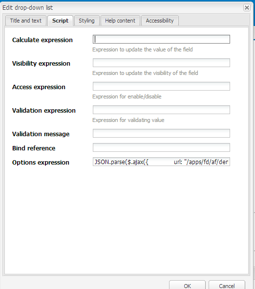

# ドロップダウンリストの動的な自動入力 {#dynamically-populating-drop-down-lists}

## 前提条件 {#prerequisites}

* [OSGi バンドルの作成](https://experienceleague.adobe.com/docs/experience-manager-learn/getting-started-wknd-tutorial-develop/overview.html?lang=ja&amp;CID=RedirectAEMCommunityKautuk)
* [AEM コンポーネントの開発](/help/sites-developing/components.md)
* [アダプティブフオームの作成](../../forms/using/creating-adaptive-form.md)
* [アダプティブフォームのオーサリング](../../forms/using/introduction-forms-authoring.md)

## ドロップダウンリストを動的に自動入力する手順 {#procedure-to-dynamically-populate-drop-down-lists}

「**国**」ドロップダウンリストで選択した値に基づいて、「**州**」ドロップダウンリストに自動入力するシナリオを考えてみます。「**国**」ドロップダウンリストでオーストラリアを選択した場合、「**州**」ドロップダウンリストにはオーストラリアの州名が表示されます。次の手順では、このタスクを実行する手順を説明します。

1. 次のモジュールでプロジェクトを作成します。

   * ドロップダウンに入力するロジックが含まれるバンドル。この場合はサーブレットです。
   * コンテンツ。.jar ファイルを埋め込んで、ドロップダウンリソースを持ちます。 サーブレットは、このリソースを指します。

1. リクエストパラメーター Country に基づいてサーブレットを作成し、国内の州の名前を含む配列を返します。

   ```java
   @Component(metatype = false)
   @Service(value = Servlet.class)
   @Properties({
           @Property(name = "sling.servlet.resourceTypes", value = "/apps/populatedropdown"),
           @Property(name = "sling.servlet.methods", value = {"GET", "POST"}),
           @Property(name = "service.description", value = "Populate states dropdown based on country value")
   })
   public class DropDownPopulator extends SlingAllMethodsServlet {
       private Logger logger = LoggerFactory.getLogger(DropDownPopulator.class);
   
       protected void doPost(SlingHttpServletRequest request,
                             final SlingHttpServletResponse response)
               throws ServletException, IOException {
           response.setHeader("Access-Control-Allow-Origin", "*");
           response.setContentType("application/json");
           response.setCharacterEncoding("UTF-8");
           try {
               String US_STATES[] = {"0=Alabama",
                       "1=Alaska",
                       "2=Arizona",
                       "3=Arkansas",
                       "4=California",
                       "5=Colorado",
                       "6=Connecticut",
                       "7=Delaware",
                       "8=Florida",
                       "9=Georgia",
                       "10=Hawaii",
                       "11=Idaho",
                       "12=Illinois",
                       "13=Indiana",
                       "14=Iowa",
                       "15=Kansas",
                       "16=Kentucky",
                       "17=Louisiana",
                       "18=Maine",
                       "19=Maryland",
                       "20=Massachusetts",
                       "21=Michigan",
                       "22=Minnesota",
                       "23=Mississippi",
                       "24=Missouri",
                       "25=Montana",
                       "26=Nebraska",
                       "27=Nevada",
                       "28=New Hampshire",
                       "29=New Jersey",
                       "30=New Mexico",
                       "31=New York",
                       "32=North Carolina",
                       "33=North Dakota",
                       "34=Ohio",
                       "35=Oklahoma",
                       "36=Oregon",
                       "37=Pennsylvania",
                       "38=Rhode Island",
                       "39=South Carolina",
                       "40=South Dakota",
                       "41=Tennessee",
                       "42=Texas",
                       "43=Utah",
                       "44=Vermont",
                       "45=Virginia",
                       "46=Washington",
                       "47=West Virginia",
                       "48=Wisconsin",
                       "49=Wyoming"};
               String AUSTRALIAN_STATES[] = {"0=Ashmore and Cartier Islands",
                       "1=Australian Antarctic Territory",
                       "2=Australian Capital Territory",
                       "3=Christmas Island",
                       "4=Cocos (Keeling) Islands",
                       "5=Coral Sea Islands",
                       "6=Heard Island and McDonald Islands",
                       "7=Jervis Bay Territory",
                       "8=New South Wales",
                       "9=Norfolk Island",
                       "10=Northern Territory",
                       "11=Queensland",
                       "12=South Australia",
                       "13=Tasmania",
                       "14=Victoria",
                       "15=Western Australia"};
               String country = request.getParameter("country");
               JSONArray stateJsonArray = new JSONArray();
               if (country.length() > 0) {
                   if ("australia".equalsIgnoreCase(country)) {
                       stateJsonArray = new JSONArray();
                       for (String state : AUSTRALIAN_STATES) {
                           stateJsonArray.put(state);
                       }
                   } else if ("unitedstates".equalsIgnoreCase(country)) {
                       stateJsonArray = new JSONArray();
                       for (String state : US_STATES) {
                           stateJsonArray.put(state);
                       }
                   }
                   response.setContentType("application/json");
                   response.getWriter().write(stateJsonArray.toString());
               }
   
           } catch ( Exception e) {
               logger.error(e.getMessage(), e);
           }
       }
   }
   ```

1. アプリケーション内の特定のフォルダー階層の下にドロップダウンノードを作成します（例えば、/apps/myfolder/demo の下にノードを作成します）。ノードの `sling:resourceType` パラメーターがサーブレットがポイントするもの（/apps/populatedropdown）と同じであるようにしてください。

   

1. コンテンツノードをパッケージ化し、その .jar ファイルを特定の場所（例えば /apps/myfolder/demo/install/）に埋め込みます。同じファイルをサーバーにデプロイします。
1. アダプティブフォームを作成し、2 つのドロップダウンリスト（国と州）をそれに追加します。国リストには、国の名前を含めることができます。 州リストは、最初のリストで選択した国の州名を動的に入力できます。

   国リストに表示する国の名前を追加します。 州リストに、国リスト内の国の名前に基づいて入力するスクリプトを追加します。

   

   ```javascript
   JSON.parse(
       $.ajax({
           url: "/apps/myfolder/demo/dropdown",
           type: "POST",
           async: false,
           data: {"country": country.value},
            success: function(res){},
            error : function (message) {
                 guideBridge._guide.logger().log(message);
                 successFlag = false;
                 }
              })
   .responseText);
   ```

前述のコードが実装されたサンプルのアダプティブフォーム（demo/AFdemo）を含むコンテンツパッケージ。

[ファイルを入手](assets/dropdown-demo-content-1.0.1-snapshot.zip)
