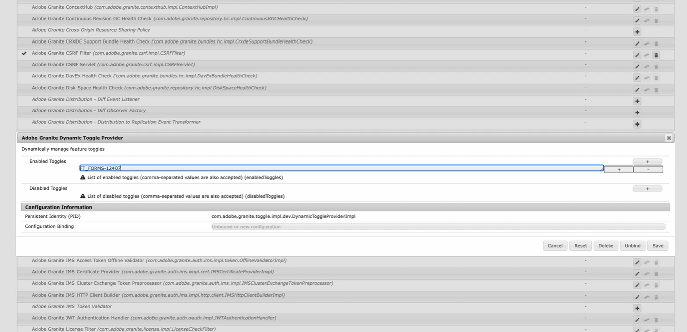
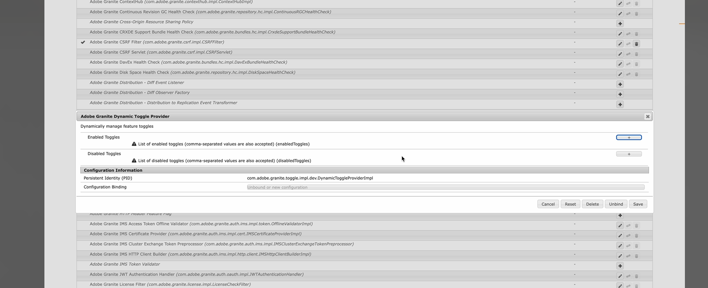

# Adobe Experience Manager（AEM）6.5 の機能切替スイッチ{#enable-feature-toggle-aem-forms-65}

機能切替スイッチは、管理者が特定の機能を動的に有効または無効にできる AEM の機能です。 この機能は、大規模なデプロイメントやコードベースの変更を必要とせずに、**早期導入機能**&#x200B;や&#x200B;**プレリリース機能**&#x200B;を管理する場合に特に役立ちます。 これにより、AEM 環境でアクセスできる機能に対する柔軟性と制御が確保されます。

## 機能切替スイッチの有効化 {#enable-feature-toggle-65}

早期導入用の機能切替スイッチや新機能は、次の手順に従って、**AEM web コンソール**&#x200B;を通じて設定できます。

1. AEM Forms インスタンスにログインします。
2. `http://<author-instance-url>:portnumber/system/console/configMgr` に移動します。
3. Configuration Manager で **Adobe Granite Dynamic Toggle Provider** を検索します。
4. アイコン  をクリックします。
5. 「[!UICONTROL 有効な切替スイッチ]」セクションで、 をクリックします。
6. 以下の画像に示すように、機能の機能切替スイッチ ID を追加します。
   

   >[!NOTE]
   >
   >機能切替スイッチ ID は、早期導入機能に固有のドキュメントで確認できます。

7. 「保存」をクリックします。

## 機能切替スイッチの無効化 {#disable-feature-toggle-65}

切替スイッチが有効になっている機能の切替スイッチを無効にするには、次の手順に従います。

1. AEM Forms インスタンスにログインします。
2. `http://<author-instance-url>:portnumber/system/console/configMgr` に移動します。
3. Configuration Manager で **Adobe Granite Dynamic Toggle Provider** を検索します。
4. アイコン  をクリックします。
5. 「[!UICONTROL 無効な切替スイッチ]」セクションで、 をクリックします。
6. 無効にする機能の切替スイッチ番号を追加します。
   
7. 「保存」をクリックします。

## 技術的な考慮事項

機能切替スイッチは環境に固有で、実行時に管理されるので、サーバーの再起動は必要ありません。 ただし、一部の機能では、変更を反映するために、関連するページを更新したり、キャッシュを消去したりする必要がある可能性があります。
`http://<author-instance-url>:4502/etc.clientlibs/toggles.json` 経由で、環境の機能切替スイッチを通じて有効になっている機能のリストにアクセスできます。
