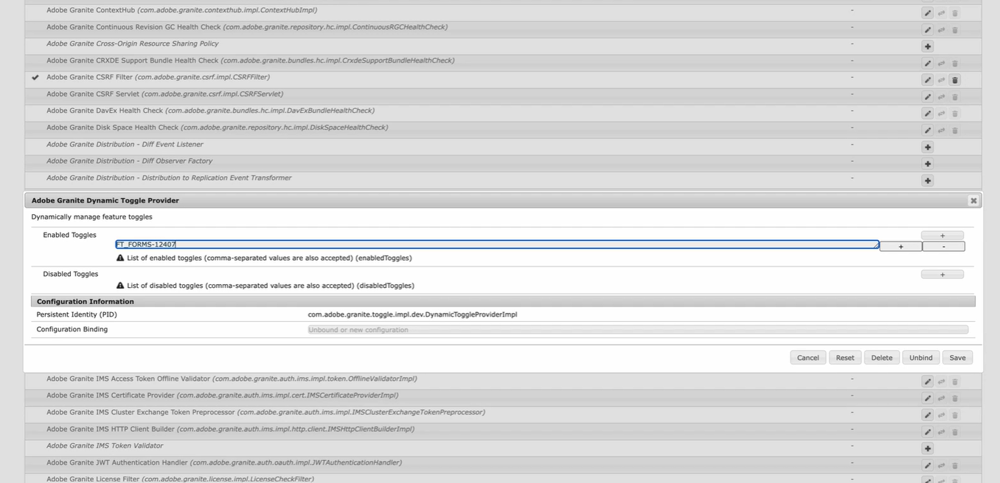

# Adobe Experience Manager（AEM） 6.5 の機能の切り替え{#enable-feature-toggle-aem-forms-65}

機能の切り替えはAEMの機能で、管理者が特定の機能を動的に有効または無効にできるようにするものです。 この機能は、大規模なデプロイメントやコードベースの変更を必要とせずに **早期導入者機能** および **プレリリース機能** を管理する場合に特に役立ちます。 これにより、AEM環境でアクセスできる機能を柔軟に制御できます。

## 機能切替スイッチの有効化 {#enable-feature-toggle-65}

早期導入者または新機能の機能の切り替えは、次の手順に従って **0&rbrace;AEM web コンソールを使用して設定できます。**

1. AEM Forms インスタンスにログインします。
2. `http://<author-instance-url>:portnumber/system/console/configMgr` に移動します。
3. Configuration Manager で **Adobe Granite Dynamic Toggle Provider** を検索します。
4. アイコン  をクリックします。
5. 「[!UICONTROL &#x200B; 有効な切り替え &#x200B;]」セクションで、「」をクリックします。
6. 以下の画像に示すように、機能の機能切り替え ID を追加します。
   

   >[!NOTE]
   >
   >機能の切り替え ID は、早期導入者機能に固有のドキュメントで確認できます。

7. 「保存」をクリックします。

## 機能切り替えを無効にする {#disable-feature-toggle-65}

切り替えが有効になっている機能の機能の切り替えを無効にするには、次の手順に従います。

1. AEM Forms インスタンスにログインします。
2. `http://<author-instance-url>:portnumber/system/console/configMgr` に移動します。
3. Configuration Manager で **Adobe Granite Dynamic Toggle Provider** を検索します。
4. アイコン  をクリックします。
5. 「[!UICONTROL &#x200B; 無効な切り替え &#x200B;]」セクションで、「」をクリックします。
6. 無効にする機能のトグル番号を追加します。
   
7. 「保存」をクリックします。

## 技術的な考慮事項

機能の切り替えは環境に固有で、実行時に管理されるので、サーバーを再起動する必要はありません。 ただし、一部の機能では、変更を反映するために、関連するページの更新やキャッシュのクリアが必要になる場合があります。
`http://<author-instance-url>:4502/etc.clientlibs/toggles.json` を使用して、環境の機能切り替えによって有効になった機能のリストにアクセスできます。
