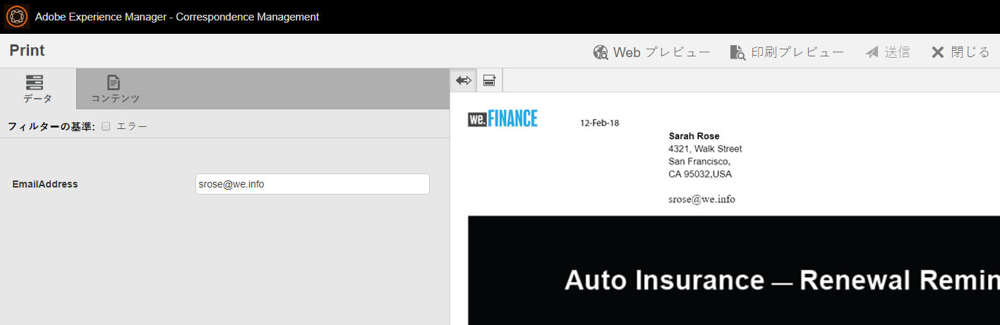
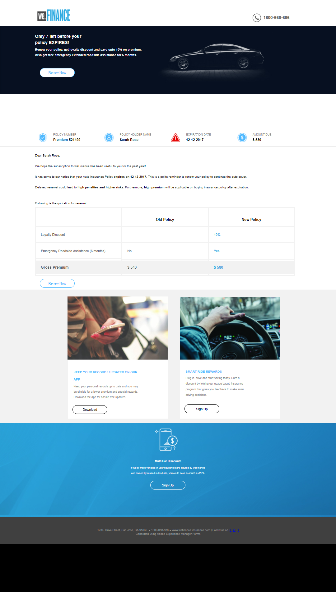

# `We.Finance`自動保険更新参照サイトのチュートリアル{#we-finance-auto-insurance-renewal-reference-site-walkthrough}

## `We.Finance`参照サイトシナリオ  {#we-finance-reference-site-scenario}

`We.Finance` Web サイトは、AEM Formsのインタラクティブなコミュニケーション機能を学習するために設計された金融サービス サイトです。

AEM formsとMicrosoft Dynamicsの統合が、金融機関における顧客体験のパーソナライズにどのように役立つかを紹介する®`We.Finance`自動車保険のユースケースの詳細なチュートリアルをご覧ください。 このインタラクティブなチュートリアルは、金融会社における複雑なデジタルトランザクションや、顧客とのコミュニケーションの実装を容易にすることを目的としています。

**まず、ユースケースをご覧ください。**

Sarah Roseは既存の`We.Finance`のお客様で、自動車保険ポリシーを購入しました。 現在、Sarah は保険ポリシーの更新時期を迎えています。 Gloria Rios は彼女の保険営業担当です。 `We.Finance` web サイトから、ポリシーの更新に関するリマインダーがSarahに送信されます。 Sarahはメールの指示に従ってプロセスを正常に完了しました。

## 自動保険申し込みのチュートリアル {#auto-insurance-application-walkthrough}

`We.Finance`自動保険アプリケーションのシナリオは、ユーザーの視覚的なナレーションであり、次の2つのペルソナに基づいています。

* Sarah Rose、`We.Finance`のお客様
* 保険代理店、Gloria Rios、`We.Finance`

### Gloriaが`We.Finance`から保険金更新通知を送信します {#gloria-sends-an-insurance-policy-renewal-communication-from-we-finance}

Gloria は AEM インスタンスにログインし、「**自動保険更新**」をクリックしてから「**エージェント UI を開く**」をクリックします。 クリックすると、Sarah Rose のポリシーの詳細が保険関連ドキュメントに表示されます。 Gloriaが&#x200B;**送信**&#x200B;をクリックすると、「送信開始」画面にメッセージが表示され、数秒後に「送信完了」が表示されます。

Sarahは、「自動車保険の更新」という件名のメールを受信します。

#### 実際の動作確認 {#see-it-yourself}

**Adobe Experience Manager** > **Forms** > **Formsとドキュメント** > **`We.Finance`** > **自動車保険**&#x200B;に移動します。 「自動保険更新／**インタラクティブなコミュニケーション**」を選択し、「**エージェント UI を開く**」をクリックします。 エージェント UI でインタラクティブなコミュニケーションが開きます。 ポリシードキュメントが添付されたメールを受信するには、有効なメールアドレスを入力して「送信」をクリックします。

`https://[authorHost]: authorPort]/aem/formdetails.html/content/dam/formsanddocuments/we-finance/autoinsurance/auto-insurance-renewal.` から自動保険更新インタラクティブなコミュニケーションに直接アクセスして確認することができます。

### Sarahは、`We.Finance`から保険契約の更新に関する連絡を受け取り、更新を決定しました {#sarah-receives-an-insurance-policy-renewal-communication-from-we-finance-and-decides-to-renew}

Sarahは`We.Finance`から添付メールを受信し、自動車保険ポリシーの有効期限が近づいていることをSarahに通知しました。 添付ファイルは、印刷用の自動保険レターです。

Sarahはオプション **今すぐ更新**&#x200B;をクリックし、自動保険手紙のweb バージョンに誘導されます。 このレターの上に、Sarahはポリシーの有効期限が切れるまでの残り時間を見つけます。 このページでは、保険の概要を説明します。 ポリシー番号、支払額、割引オファー、ロイヤルティ特典の詳細を説明します。 **今すぐ更新**&#x200B;がポリシーの下部でクリックされます。

#### 仕組み {#how-it-works}

自動保険レターのwebおよび印刷出力は、インタラクティブ通信のマルチチャネル機能を使用して作成されます。

メールの「今すぐ更新」ボタンは、自動保険更新アプリケーションにリンクされています。このアプリケーションは、パブリッシュインスタンス上のインタラクティブなコミュニケーションです。

#### 実際の動作確認 {#see-it-yourself-1}

PDF が添付されたメールを受信します。 PDF は自動保険レターの印刷版です。 「**今すぐ更新する**」をクリックしてポリシーの Web 版にアクセスします。 個人情報とポリシーの詳細を確認し、**今すぐ更新**&#x200B;をクリックすると、別のインタラクティブなコミュニケーションに移動します。

メールの「**今すぐ更新**」ボタンをクリックすると、Sarah はポリシーの web 版にリダイレクトされます。 次の URL にアクセスできます。

`https://[authorServer]:[authorPort]/content/document.html?schema=fdm&documentId=/content/forms/af/we-finance/autoinsurance/auto-insurance-renewal/channels/web.html&customerId=1`

自動保険更新の詳細な概要を確認してからページ下部の&#x200B;**今すぐ更新する**&#x200B;をクリックします。

### Sarah は支払いページを表示します {#sarah-reaches-the-payment-page}

`We.Finance` web サイトでは、Sarahが支払いページに移動します。 Sarah は、自分の記録と照らし合わせて、ポリシー番号と有効期限を再確認します。 ページの右側で契約更新の支払いの概要を確認します。合計金額からプレミアム割引として 10％差し引かれていることがわかります。

#### 仕組み {#how-it-works-1}

「今すぐ更新」ボタンをクリックすると、支払いページが表示されます。 支払いページはアダプティブフォームです。

#### 実際の動作確認 {#see-it-yourself-2}

「**今すぐ更新する**」をクリックして支払いページにアクセスします。 クレジットカード情報を入力し、「**支払う**」をクリックします。

以下のオーサリングインスタンスから支払いページにアクセスすることができます。

`https://[authorServer]:[authorPort]/content/document.html?documentId=/content/forms/af/we-finance/credit-card/ccbillpayment.html&schema=fdm&customerId=1`

### Sarah は支払いを行ってプロセスを完了します {#sarah-makes-the-payment-and-completes-the-process}

Sarah はクレジットカードの詳細を入力し、**支払う**&#x200B;をクリックします。

#### 仕組み {#how-it-works-2}

Sarahがクレジットカードの詳細を入力して「送信」をクリックすると、クレジットカードの支払いが処理され、アダプティブフォームで設定された「ありがとうございます」メッセージが画面に表示されます。

#### 実際の動作確認 {#see-it-yourself-3}

「支払う」をクリックすると、確認メッセージが以下の URL に表示されます。

`https://[authorServer]:[authorPort]/content/forms/af/we-finance/credit-card/ccbillpayment/jcr:content/guideContainer.guideThankYouPage.html?owner=admin&status=Submitted`
