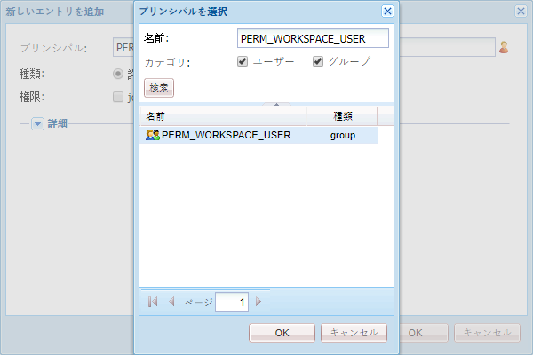

# AEM Forms Workspace のカスタマイズの一般的な手順 {#generic-steps-for-aem-forms-workspace-customization}

カスタマイズを実行するための一般的な手順を以下に示します。

1. `https://'[server]:[port]'/lc/crx/de/index.jsp` にアクセスして CRXDE Lite にログインします。
1. `/apps` に `ws` という名前の `sling:Folder` フォルダーが存在しない場合は、作成します。 `sling:Folder` フォルダーを作成するには、`apps` フォルダーを右クリックし、**[!UICONTROL 作成]**／**[!UICONTROL ノードを作成]**&#x200B;を選択します。 名前を `ws` として指定し、タイプを `sling:Folder` として選択して「**[!UICONTROL OK]**」をクリックします。 「**[!UICONTROL すべて保存]**」をクリックします。
1. `/apps/ws` を参照して「**[!UICONTROL アクセス制御]**」タブに移動します。
1. 「**[!UICONTROL リポジトリ]**」オプションを選択します。 **[!UICONTROL アクセス制御]**&#x200B;リストで「**[!UICONTROL +]**」をクリックして、エントリを追加します。 もう一度「**[!UICONTROL +]**」をクリックします。
1. **PERM_WORKSPACE_USER** プリンシパルを検索して選択します。

   

1. `jcr:read` 権限をプリンシパルに付与します。
1. 「**[!UICONTROL すべて保存]**」をクリックします。
1. `GET.jsp`、`index` および `html.jsp` ファイルを `/libs/ws` フォルダーから `/apps/ws` フォルダーにコピーします。
1. `/libs/ws/locales` フォルダーを `/apps/ws` フォルダーにコピーします。 「**[!UICONTROL すべて保存]**」をクリックします。
1. 以下に示すように、`GET.jsp` ファイルの参照および相対パスを更新し、「**[!UICONTROL すべて保存]**」をクリックします。

   ```javascript
   <meta http-equiv="refresh" content="0;URL='/lc/apps/ws/index.html'" />
   ```

1. CSS のカスタマイズは以下のようにして実行します。

   1. `/apps/ws` フォルダーに移動して `css` という名前のフォルダーを作成します。

   1. `css` フォルダーに `newStyle.css` という名前のファイルを作成します。

   1. `/apps/ws/html`.jsp を開いて次のように変更します。変更元：

   ```javascript
   <link lang="en" rel="stylesheet" type="text/css" href="css/style.css" />
   <link lang="en" rel="stylesheet" type="text/css" href="css/jquery-ui.css"/>
   ```

   コピー先：

   ```javascript
   <link lang="en" rel="stylesheet" type="text/css" href="../../libs/ws/css/style.css" />
   <link lang="en" rel="stylesheet" type="text/css" href="css/newStyle.css" />
   <link lang="en" rel="stylesheet" type="text/css" href="../../libs/ws/css/jquery-ui.css"/>
   ```

   >[!NOTE]
   >
   >上記のように、style.css のエントリの後ろにユーザー定義された CSS ファイルのエントリを配置します。

1. /apps/ws/html.jsp ファイルで、

   ```jsp
   <script data-main="js/main" src="js/libs/require/require.js"></script>
   ```

   コピー先：

   ```jsp
   <script data-main="js/main" src="../../libs/ws/js/libs/require/require.js"></script>
   ```

1. 以下の操作を実行します。

   1. `/apps/ws` に `js` という名前のフォルダーを作成します。 「**[!UICONTROL すべて保存]**」をクリックします。

   1. `/apps/ws/js` に `libs` という名前のフォルダーを作成します。 「**[!UICONTROL すべて保存]**」をクリックします。

   1. `/libs/ws/js/libs/jqueryui` フォルダーを `/apps/ws/js/libs` にコピーします。 「**[!UICONTROL すべて保存]**」をクリックします。

1. HTML のカスタマイズは以下のようにして実行します。

   1. `/apps/ws/js` の下に `runtime` という名前のフォルダーを作成します。 「**[!UICONTROL すべて保存]**」をクリックします。

   1. `/apps/ws/js/runtime` の下に `templates` という名前のフォルダーを作成します。 「**[!UICONTROL すべて保存]**」をクリックします。

   1. `/libs/ws/js/main.js` を `/apps/ws/js/main.js` にコピーします。

   1. /libs/ws/js/registry.js を `/apps/ws/js/registry.js` にコピーします。

1. 「**[!UICONTROL Save All]**」をクリックし、キャッシュをクリアして AEM Forms Workspace を更新します。

   URL `https://'[server]:[port]'/lc/ws` にアクセスして、管理者とパスワードの資格情報を使用してログインします。 ブラウザーが `https://'[server]:[port]'/lc/apps/ws/index.html` にリダイレクトします。
