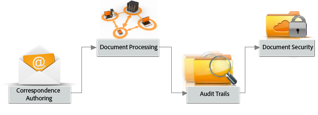

# AEM Forms の概要{#introduction-to-aem-forms}

| バージョン | 記事リンク |
| -------- | ---------------------------- |
| AEM as a Cloud Service | [ここをクリックしてください](https://experienceleague.adobe.com/docs/experience-manager-cloud-service/content/forms/forms-overview/home.html?lang=ja) |
| AEM 6.5 | この記事 |

AEM Forms における新機能や改良点については、[AEM Forms における新機能](../../forms/using/whats-new.md)を参照してください。

## AEM Forms について {#about-aem-forms}

Adobe Experience Manager（AEM）は、複雑なデジタルフォームの作成、管理、公開、および更新に特化した、使いやすいソリューションです。また、バックエンドプロセス、ビジネスルール、およびデータとの統合も実現されています。

AEM Forms では、通信管理機能、ドキュメントセキュリティ、統合された分析とともに、フォームのオーサリング、管理、公開を組み合わせて、魅力的なエンドツーエンドのエクスペリエンスを作成します。AEM Forms は、すべての Web チャネルやモバイルチャネルで動作するように設計されており、ビジネスプロセスに効率的に統合することができます。これにより、効率を向上させながらも、文書業務やエラーを削減することができます。

大企業では、一度フォームを作成したら、そのフォームがコンテンツ管理システムにコピーして再利用されることも多くあります。フォームの大規模なデータベースを最新状態に維持し、検索可能な状態に保つことは非常に頭の痛い課題となることもあります。AEM はカスタマイズ可能な「フォームポータル」を提供することにより、web チャネルおよびモバイルチャネルの双方から必要なフォームを見つけ、アクセスできる状態に保ちます。

AEM Forms は、アダプティブフォームだけでなく、XFA フォーム、PDF ォーム、および関連アセットも管理できるフォーム管理ツールを提供します。詳しくは、[フォーム管理の概要](../../forms/using/introduction-managing-forms.md)を参照してください。

>[!NOTE]
>
>[AEM 6.5 クイックスタート](https://experienceleague.adobe.com/docs/experience-manager-65-lts/deploying/deploying/deploy.html)で使用できるアダプティブフォーム機能は、探索と評価のみを目的として設計されています。 アダプティブフォームの機能には適切なライセンスが必要なので、実稼動環境で使用する場合は、AEM Forms の有効なライセンスを取得することが不可欠です。

### 主な機能 {#key-capabilities}

要約すると、AEM Forms は、手動プロセスを削減し、顧客満足度を向上させる次のような強力なフォーム管理機能を提供します。

* PDF、HTML5、アダプティブフォームなどの動的フォームを設計および展開するための一元的なフォームポータル
* 使いやすいグラフィカルユーザーインターフェイスにより、ビジネスユーザーは簡単にフォームのインポート、管理、プレビュー、および公開が可能
* キーワード、タグ、およびメタデータをサポートする、強力な検索機能を備えたレスポンシブなフォームディレクトリ
* ユーザーのデバイスや場所を動的に検出することにより、web チャネルやモバイルチャネルに最適化されたフォーム描画を実現
* Adobe Analytics との統合により、フォームの使用指標を効果的に測定可能
* Adobe Document Cloud eSign サービスや Scribble との統合により、機密情報を含むドキュメントへの電子署名に対応
* 自動化されたフォーム公開機能と、複数のチャネルを通じてタイムリーでパーソナライズされた一貫したコミュニケーションを提供する機能

## AEM フォームの種類 {#aem-form-types}

AEM Forms では、新規および既存のフォームを拡張することで、

* ほとんどの紙のように見える、ピクセルパーフェクトなページ番号付き HTML フォームや PDF フォーム、または
* ユーザーのデバイスやブラウザーに自動的に適応するアダプティブフォームを作成できるようになります。

**PDF のフォーム**

PDF フォームでは、オフラインで入力してローカルに保存し、次回オンラインになったときにフォームデータを送信することができます。2 次元バーコードを使用してフォームデータをキャプチャしたり、デジタル署名を使用してユーザーの信頼性を検証したりすることができます。

**HTML のフォーム**

HTML5 ブラウザーベースのフォームは、モバイルデバイスとデスクトップブラウザーの両方で表示することができます。手書きや eSign サービスを使用して、HTML フォームに電子署名することができます。

**アダプティブフォーム**

アダプティブフォームは、必要に応じてフィールドやセクションを追加または削除することで、ユーザーの応答に動的に適応できます。AEM では、アダプティブフォームを作成する際に、Adobe XML フォームテンプレートを再利用することができます。

### サポートされている機能 {#supported-features}

次の機能は、すべてのフォームタイプでサポートされています。

* ダイナミックレイアウト
* フォームフィールドの検証
* 状況依存ヘルプ
* スクリプトと XML データの処理
* アクセシビリティの設計と確認
* サーバー側でフォームを保存する機能
* ファイル添付に対応
* データキャプチャ用の HTML Workspace との統合

## オフラインのデータ収集 {#offline-data-collection}

フォームデータが送信されると、Adobe Experience Manager により、フォームデータは既存のシステム、ビジネスルール、および必要な人材に接続されます。

AEM Forms では、モバイルアプリケーションとして Forms Workspace を備えており、デジタルビジネスプロセスをモバイルデバイスにも拡張することができます。Forms Workspace を使用することにより、オフライン時であってもデータを収集し記録することができます。Forms Workspace は、モバイルデバイスの機能を使用することで、写真やビデオをキャプチャし、タイムスタンプ情報などのデータを収集することができます。次回ネットワークに接続した際に、ユーザーが収集したデータを同期させることができます。

データをオフラインでキャプチャし、オンラインになった際に同期する機能は、現場で作業する場合に特に有用です。これにより、生産性を向上させ、エラーを削減することができます。

**オフラインデータ収集用の Forms Workspace を使用する利点**

* タスク割り当てと追跡の作業を容易にする HTML 形式のワークスペースアプリケーション
* ドラッグ＆ドロップによるワークフローデザイン環境
* エンタープライズコンテンツ管理コネクター（ECM）
* フォームのデータをエンタープライズシステムに接続するための XML や SOAP といったオープンスタンダードのサポート
* モニターバックログ、作業キュー、および主要業績評価指標（KPI）の HTML レポートにデフォルトで対応
* 事業活動をリアルタイムで把握できる、カスタマイズ可能なダッシュボード
* サードパーティのレポートツールと接続するための API

## パーソナライズされた通信 {#personalized-communication}

効率的なデジタルセルフサービス体験を実現する上で重要な要素は、パーソナライズされた情報をタイムリーにやり取りすること、そしてどのようなデバイスからでも場所を問わずにアクセスできることです。パーソナライズされたタイムリーな通信により、ユーザーのコンバージョン率と満足度の両方を向上させることができます。

AEM Forms を使用するビジネスユーザーは、ドキュメントテンプレートをカスタマイズし、バックエンドプロセスからの情報を取り入れ、インタラクティブなコンポーネントを組み込むことにより、パーソナライズされた魅力的なユーザーエクスペリエンスを提供することができます。直感的なユーザーインターフェイスにより、技術的なスキルを持たないユーザーでもビジネスルールを開発し、問い合わせに基づいてコミュニケーションを生成するタイミングや、ユーザーが生成した応答を開始するタイミングを決めることができます。

領収書、ウェルカムキットや明細書などのパーソナライズされたドキュメントを、複数のチャネルにわたって簡単に配信することができます。組織では、パーソナライズされた web ポータルへトラフィックを引き込み、別のサービスへの登録や購入を促進することができます。

**主な機能**

* テンプレート、コンテンツブロックやビジネスルールなどをサポートする対応オーサリング環境
* ドキュメントの変換およびアセンブリ
* Web、メール、および紙面などの複数のチャネルを介した、オンデマンドまたはバッチ文書配信のサポート
* 変更履歴を伴う監査記録
* コンテンツの完全性と署名者の身元を検証するデジタル署名のサポート
* ドキュメントの AEM Forms 用セキュリティアドオンにより、暗号化、使用ポリシー、トラッキング、および監査などに対応

合理化され、パーソナライズされたコミュニケーションのワークフロー

