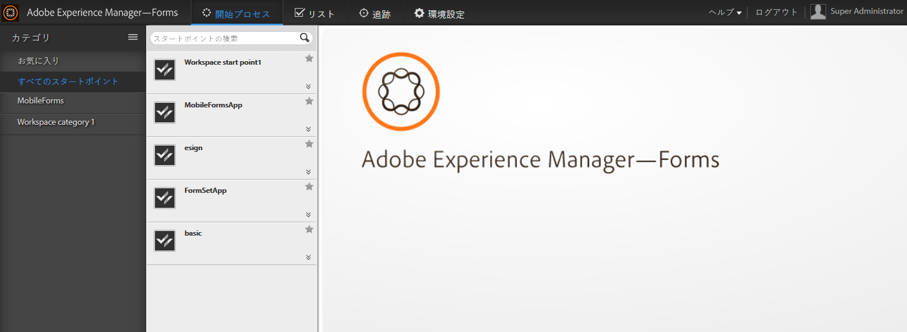

# AEM Forms Workspace の概要{#introduction-to-aem-forms-workspace}

Forms Workflow は自動化を実現し、重要なドキュメントやフォーム関連のビジネスプロセスを可視化することにより、組織の効率化を促進します。 プロセス管理モジュールを利用すれば、オンラインとオフラインの両方でアクセスできる、合理化されたエンドツーエンドのワークフロー（人、システム、コンテンツ、ビジネスルールなど）を構築できます。Forms workflowには、AEM Forms workspaceが含まれます。 AEM Forms Workspace にはワークスペースを拡張、統合するための新しい機能が追加されており、より使いやすくなっています。

AEM Forms Workspace はより多くのデバイスやフォームファクターと互換性があります。 Flash® Player と Adobe® Reader® を使用しなくてもクライアントでタスク管理が可能です。 PDF フォームに加え、HTML フォームのレンダリングを容易にします。

**主な機能**:

* プロセスの参加者はどこにいても動的な PDF フォーム、モバイルインターフェイス、web アプリケーションで連絡が取れます。
* Workspace コンポーネントを web アプリケーションで容易に統合できます。 AEM Forms Workspace は容易にカスタマイズや再利用が可能なコンポーネントベースのソフトウェアです。
* AEM Forms Workspace アプリを使用して、ビジネスプロセスをオンラインとオフラインの両方のモバイルワーカーに拡張します。
* レポートを表示してバックログ、作業クエリ、KPI をモニターします。 API を使用してデータを抽出し、サードパーティのレポートツールを使用するとさらに分析することができます。
