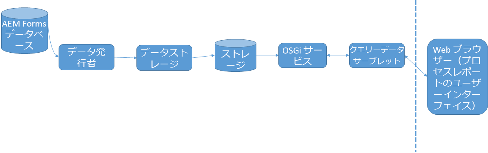

# プロセスレポートの仕組み{#how-process-reporting-works}

プロセスレポートは、JEE 上の AEM Forms のレポートモジュールです。

プロセスレポートを使用すると、AEM Forms のプロセスとタスクに関するレポートを実行できます。

プロセスレポートは、組み込みのプロセスレポートリポジトリを使用して Forms データを公開します。 その後、そのデータを使用してレポートを実行します。

プロセスレポートは、以下のモジュールで構成されています。

* [ProcessDataPublisher サービス](#processdatapublisher-service-br-p)
* [ProcessDataStorage サービス](#processdatastorageprovider-service-br-p)
* [OSGi サービス](#osgi-service-br-p)
* [クエリデータサーブレット](#querydataservlet-service-br-p)
* [Process Reporting ユーザーインターフェイス](#process-reporting-user-interface-br-p)

## Process Reporting のアーキテクチャー {#process-reporting-architecture-br}

## Process Reporting モジュール {#process-reporting-modules}

### ProcessDataPublisher サービス {#processdatapublisher-service-br}

ProcessDataPublisher サーバーは、AEM Forms データベースで定期的に実行され、サービスの最後の実行以降に変更されたデータを抽出します。 その後、Process Data Storage サービスにデータを公開します。

サービスの設定について詳しくは、[ProcessDataPublisher サービスの設定](/help/forms/using/process-reporting/install-start-process-reporting.md#p-reportconfiguration-service-p)を参照してください。

### ProcessDataStorageProvider サービス {#processdatastorageprovider-service-br}

ProcessDataStorageProvider サービスは、ProcessDataPublisher サービスからプロセスデータを受け取り、そのデータをプロセスレポートリポジトリに保存します。

サービスの設定について詳しくは、[ProcessDataStorageProvider サービスの設定](/help/forms/using/process-reporting/install-start-process-reporting.md#p-to-configure-the-process-reporting-repository-locations-p)を参照してください。

### OSGi サービス {#osgi-service-br}

QueryDataServlet は、このサービスを使用して、プロセスレポートリポジトリからレポートデータを取得します。

### QueryDataServlet サービス {#querydataservlet-service-br}

QueryDataServlet サービスは、Process Reporting ユーザーインターフェイスからクエリを受け入れます。

次に、このサービスは OSGi サービスを使用して関連するレポートデータを取得し、そのデータを処理して、ユーザーインターフェイスにデータを返します。

### Process Reporting ユーザーインターフェイス {#process-reporting-user-interface-br}

Process Reporting のユーザーインターフェイスは、web ブラウザーベースのインターフェイスです。 このインターフェイスを使用して、AEM Forms データベースから公開されたプロセスおよびタスク情報を表示します。

Process Reporting のユーザーインターフェイスの概要については、[Process Reporting ユーザーインターフェイス](/help/forms/using/process-reporting/introduction-process-reporting.md)を参照してください。

### QueryDataServlet サービス {#querydataservlet-service-br-1}

QueryDataServlet サービスは、Process Reporting ユーザーインターフェイスからクエリを受け入れます。

次に、このサービスは OSGi サービスを使用して関連するレポートデータを取得し、そのデータを処理して、ユーザーインターフェイスにデータを返します。

### カスタムレポート {#custom-reports-br}

独自のカスタムレポートを作成し、これらのレポートを Process Reporting ユーザーインターフェイスの「カスタムレポート」タブに表示できます。

カスタムレポートを作成する手順については、[Process Reporting のカスタムレポート](/help/forms/using/process-reporting/process-reporting-custom-reports.md)記事の「カスタムレポートを作成するには」を参照してください。
