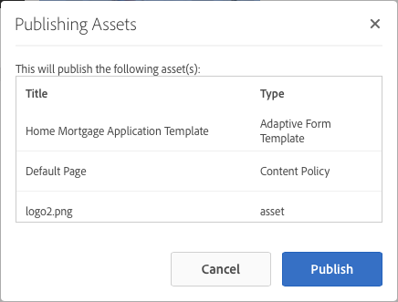

# フォームとドキュメントの公開と非公開{#publishing-and-unpublishing-forms-and-documents}

AEM Forms では、フォームを簡単に作成し、公開したり非公開にしたりできます。AEM Forms について詳しくは、[フォーム管理の概要](../../forms/using/introduction-managing-forms.md)を参照してください。

AEM Forms サーバーは 2 つのインスタンス（オーサーとパブリッシュ）を提供します。オーサーインスタンスは、フォームのアセットとリソースを作成し管理するためのものです。パブリッシュインスタンスは、エンドユーザーに対して使用可能なアセットや関連リソースを保持するためのものです。XDP フォームと PDF フォームはオーサーモードで読み込むことができます。詳しくは、[AEM Forms での XDP および PDF ドキュメントの取得](../../forms/using/get-xdp-pdf-documents-aem.md)を参照してください。

## サポートしているアセット {#supported-assets-nbsp}

AEM Forms では、次のアセットタイプをサポートしています。

* アダプティブフォーム
* アダプティブドキュメント
* アダプティブフォームフラグメント
* テーマ
* フォームテンプレート（XFA フォーム）
* PDF のフォーム
* ドキュメント（非インタラクティブ PDF ドキュメント）
* フォームセット
* リソース（画像、スキーマ、スタイルシート）

初期設定では、すべてのアセットはオーサーインスタンスでのみ使用可能です。管理者またはフォーム作成者は、リソースを除くすべてのアセットを公開できます。

フォームを選択して公開すると、関連のアセットとリソースも公開されます。ただし、依存アセットは公開されません。このコンテキストでは、関連のアセットやリソースは、公開済みアセットが使用または参照するアセットです。依存アセットは、公開済みアセットを参照するアセットです。

アダプティブフォームには、自動的に公開されない構成、設定、カスタマイズが含まれる場合があります。アダプティブフォームを公開する前に、以下のリソースを公開またはアクティブ化することをお勧めします。

* 編集可能なアダプティブフォームテンプレート
* Adobe Sign、Typekit、reCAPTCHA、フォームデータモデルのクラウドサービスの設定
* その他のクラウドサービスの設定は、ユーザーが管理者権限を保有している場合にのみアクティブ化されます。
* カスタマイズ。以下のようなものが含まれます。

   * カスタムレイアウト
   * カスタム外観
   * CSS ファイル - アダプティブフォームのコンテナプロパティダイアログで入力値として使用
   * クライアントライブラリカテゴリ - アダプティブフォームのコンテナプロパティダイアログで入力値として使用
   * アダプティブフォームテンプレートの一部として含まれる可能性のあるその他のクライアントライブラリ
   * デザインパス

## アセットの状態 {#asset-states}

アセットは次のステータスを持つことができます。

* **非公開**：一度も公開されていないアセット（未公開状態は、フォームアセットのみに適用されます。Correspondence Management アセットには、非公開状態がありません）。
* **公開済み**：公開済みアセット。パブリッシュインスタンスで使用できます。
* **変更済み**： 公開後に変更されたアセット。

## アセットの公開 {#publish-an-asset}

1. AEM Forms サーバーにログインします。
1. 次のいずれかの手順を使って、アセットを選択して公開します。

   1. ポインタをアセットの上に置き、**[!UICONTROL 公開]**  を選択します。
   1. 次のいずれかを実行し、「公開」を選択します。

      * カード表示になっている場合は、**[!UICONTROL 選択を入力]**  を選択し、アセットを選択します。アセットが選択されます。
      * リスト表示になっている場合は、アセットのチェックボックスをオンにします。アセットが選択されます。
      * 詳細を表示するアセットを選択します。
      * 「プロパティを表示 」をタップしてアセットのプロパティを表示します。

      >[!NOTE]
      >
      >複数のアセットを選択しないでください。複数のアセットを一度に公開することはサポートされていません。

1. 公開プロセスが始まるときに、確認ダイアログが表示され、関連するすべてのアセットとリソースが表示されます。関連アセットを含むダイアログボックスで、「**[!UICONTROL 公開]**」を選択します。アセットが公開され、「アセット公開成功」ダイアログが表示されます。

   >[!NOTE]
   >
   >アダプティブフォームの場合、関連アセットと一緒に、アダプティブフォームページ名も表示されます。

   

   関連するすべてのアセットとリソースが表示されている確認ダイアログ。

   >[!NOTE]
   >
   >Forms Manager を使用する場合で、ユーザーが表示されているアセットを公開する権限を持っていないときは、公開アクションは無効化されます。特別な権限を必要とするアセットは、赤色で表示されます。

   アセットが公開されると、そのアセットのメタデータプロパティがパブリッシュインスタンスにコピーされ、アセットのステータスが公開済みに変更されます。公開される依存アセットのステータスも公開済みに変更されます。

   アセットの発行後に、Forms ポータルを使用して、すべてのアセットを web ページに表示できます。詳しくは、[ポータル上のフォーム公開の概要](../../forms/using/introduction-publishing-forms.md)を参照してください。

## すべての Correspondence Management アセットの公開 {#publish-all-the-correspondence-management-assets}

AEM Forms では、サーバー上のすべての Correspondence Management アセットを 1 度で公開します。公開済みのアセットには、すべての Correspondence Management アセットと関連する依存性が含まれます。

サーバー上のすべての Correspondence Management アセットを公開するには、次の手順を実行します。

1. AEM Forms サーバーにログインします。
1. グローバルナビゲーションバーで「**Adobe Experience Manager**」を選択します。
1. 「」を選択し、「**Forms**」を選択します。
1. 「**Correspondence Management アセットを公開**」を選択します。

   

   「すべての Correspondence Management アセットを公開する」ページが表示され、前回の Correspondence Management アセットの公開処理についての情報が示されます。

   

1. 「**公開**」を選択し、確認メッセージで「**OK**」を選択します。

   バッチ処理が完了すると、前回の実行詳細を表示できます。これには管理者ログインや、バッチの実行が成功したか失敗したかなどの情報が含まれます。

   >[!NOTE]
   >
   >公開処理は、一度開始するとキャンセルすることはできません。また、公開処理の進行中は、アセットの作成、削除、修正、公開や、「すべての Correspondence Management アセットを書き出し」を開始しないでください。

## フォームとドキュメントの公開と非公開の自動化 {#automate-publishing-and-unpublishing-for-forms-amp-documents}

AEM Forms では、フォームとドキュメントでアセットの公開と非公開をスケジュールできます。スケジュールはメタデータエディターで指定できます。フォームメタデータの管理について詳しくは、[フォームメタデータの管理](../../forms/using/manage-form-metadata.md)を参照してください。

以下の手順に従って、フォームとドキュメントのアセットを公開および非公開する日時をスケジュールします。

1. アセットを選択し、「**[!UICONTROL プロパティを表示]**」を選択します。メタデータプロパティページが開きます。
1. メタデータプロパティページで、「**[!UICONTROL 詳細]**」を選択し、**[!UICONTROL 編集]**  を選択します。
1. 「**[!UICONTROL オンタイムに公開]**」フィールドと「**[!UICONTROL オフタイムに公開]**」フィールドで、日時を選択します。\
   **[!UICONTROL 完了]**  を選択します。

## アセットを非公開 {#unpublish-an-asset}

1. 公開されるアセットを選択し、**[!UICONTROL 非公開]**  を選択します。
1. 次のいずれかの手順を使用して、アセットを選択し非公開にします。

   1. ポインタをアセットの上に置き、**[!UICONTROL 非公開]**  を選択します。
   1. 次のいずれかを行い、「非公開」を選択します。

      * カード表示になっている場合は、**[!UICONTROL 選択を入力]**  を選択し、アセットを選択します。アセットが選択されます。

      * リスト表示になっている場合は、マウスをアセットに移動して  を選択します。アセットが選択されます。

      * 詳細を表示するアセットを選択します。
      * 「プロパティを表示 」をタップしてアセットのプロパティを表示します。

1. 非公開プロセスが始まるときに、確認ダイアログが表示されます。「**[!UICONTROL 非公開]**」を選択します。

   >[!NOTE]
   >
   >選択されているアセットだけが非公開になり、子アセットと参照されているアセットは非公開にはなりません。

## アセットまたはレターを以前の公開済みバージョンに戻す {#revert-an-asset-or-letter-to-the-previously-published-version}

アセットまたはレターを編集して公開するたびに、アセットまたはレターのバージョンが作成されます。アセットまたはレターを、以前に公開したバージョンに戻すことができます。アセットまたはドキュメントの現在のバージョンに対して誰かが誤った操作をした場合、バージョンの巻き戻しが必要になることがあります。

>[!NOTE]
>
>公開済みのレターで使用されている依存アセットがシステムから削除されている場合、そのレターを最後に公開した状態に戻さないでください。

1. アセットを選択し、**[!UICONTROL 以前に公開したバージョンに戻す]**  を選択します。
1. アセットが戻される前に、確認ダイアログが表示されます。「**[!UICONTROL 元に戻す]**」を選択します。

   アセットまたはレターが、以前に公開したバージョンにロールバックされます。

## アセットの削除 {#delete-an-asset}

>[!NOTE]
>
>アセットを削除すると、パブリッシュインスタンスからアセットが削除されます。アセットを削除すると、そのアセットのバージョン履歴（ベースバージョンを除く）も削除されます。

1. アセットを選択し、「**[!UICONTROL 削除]**」 をタップします。

   >[!NOTE]
   >
   >「削除」オプションは、アセットをタップしてアセットの詳細を表示する場合や、「プロパティを表示 」をタップしてアセットのプロパティを表示する場合にも使用できます。

1. アセットを削除する前に、確認ダイアログが表示されます。「**[!UICONTROL 削除]**」を選択します。

   >[!NOTE]
   >
   >選択されているアセットだけが削除され、従属アセットは削除されません。アセットの参照を確認するには、 を選択してからアセットを選択します。
   >
   >
   >削除しようとしているアセットが別のアセットの子アセットである場合、削除されません。そのようなアセットを削除するには、別のアセットからのそのアセットへの参照を削除してから再度実行します。

## アダプティブフォームの保護 {#protected-adaptive-forms}

選択したユーザーにアクセスを許可するフォームの認証を有効にすることができます。フォームの認証を有効にすると、ユーザーにはアクセス前にログイン画面が表示されます。認証済みの資格情報を持つユーザーのみがフォームにアクセスすることができます。

フォームの認証を有効にする手順は次のとおりです。

1. ブラウザーで、パブリッシュインスタンスの configMgr を開きます。\
   URL：`https://<hostname>:<PublishPort>/system/console/configMgr`

1. Adobe Experience Manager Web Console Configuration で、「**Apache Sling Authentication Service**」をクリックして設定します。
1. 表示された Apache Sling Authentication Service ダイアログで、「**+**」ボタンを使用してパスを追加します。\
   パスを追加すると、そのパスのフォームに対して認証サービスが有効になります。
