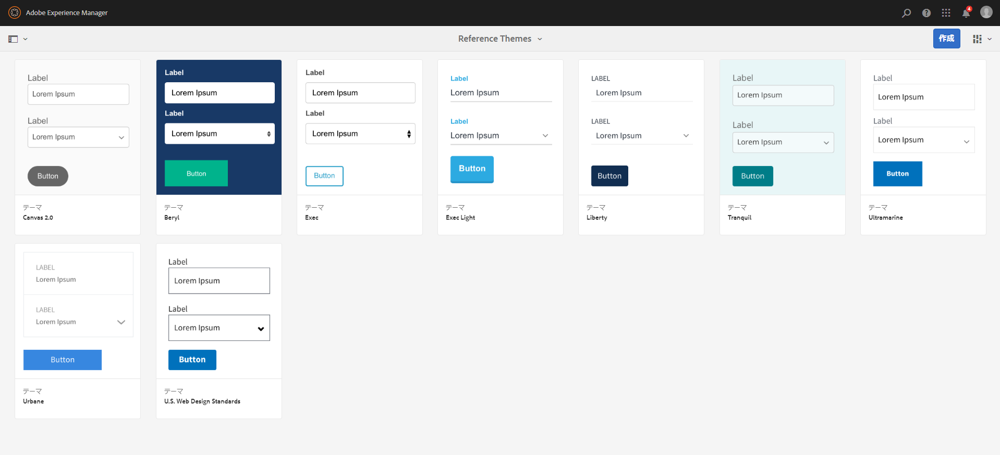
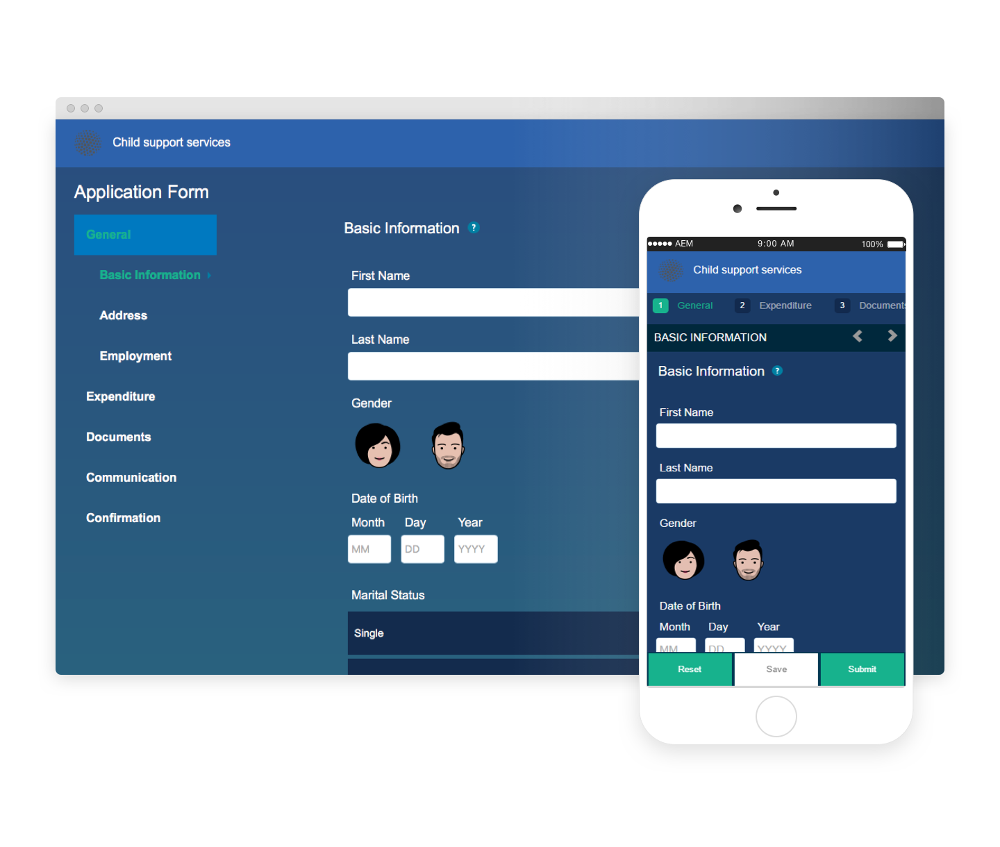
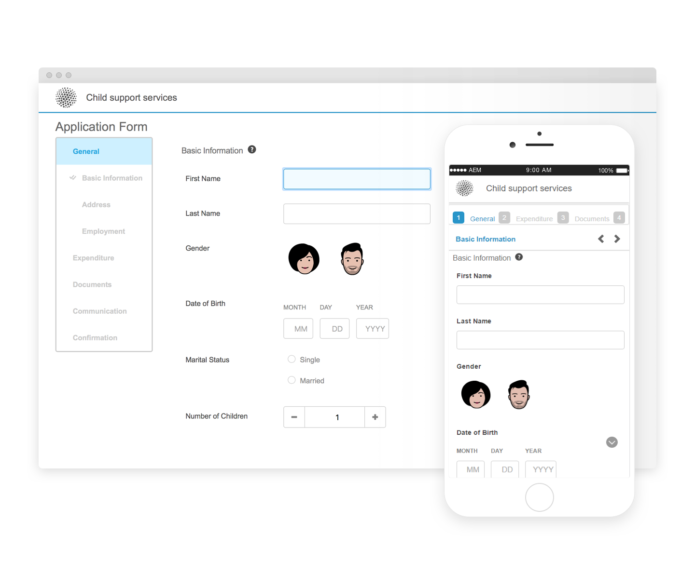
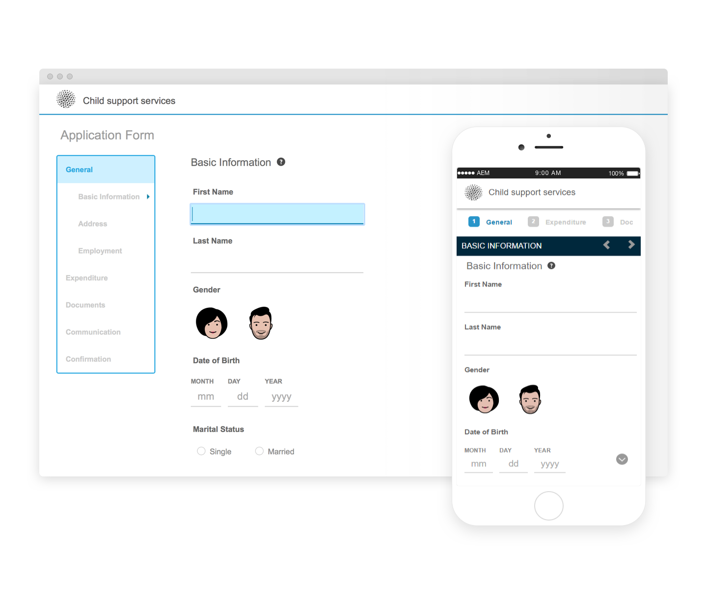
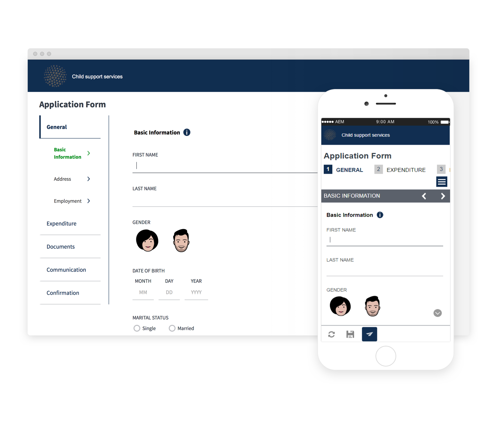
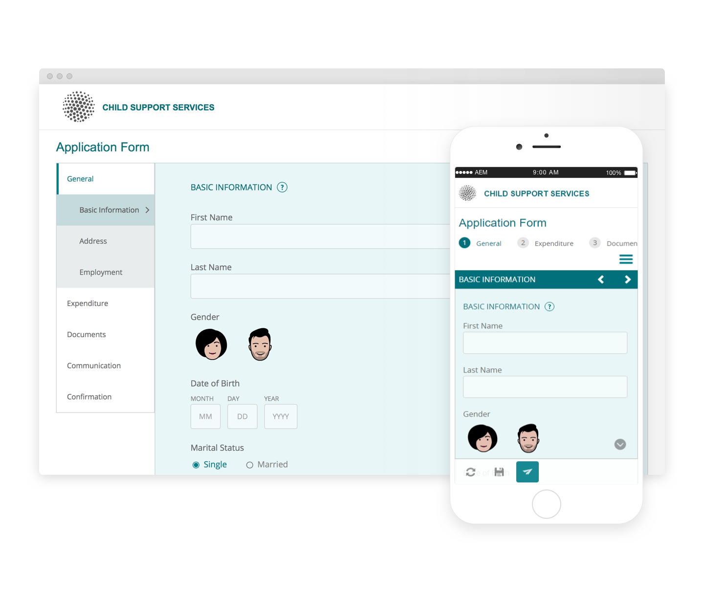
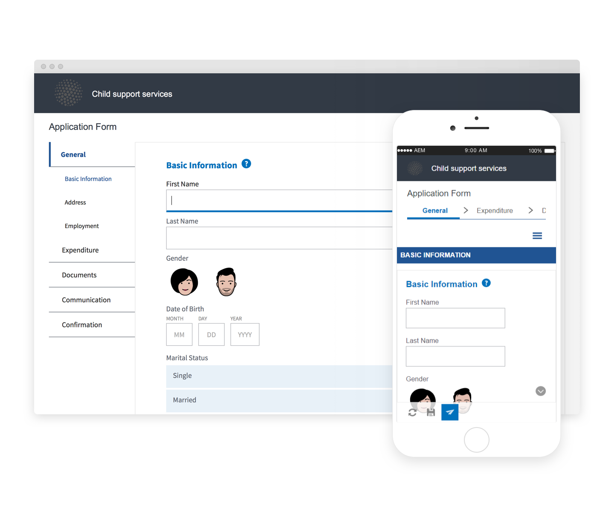
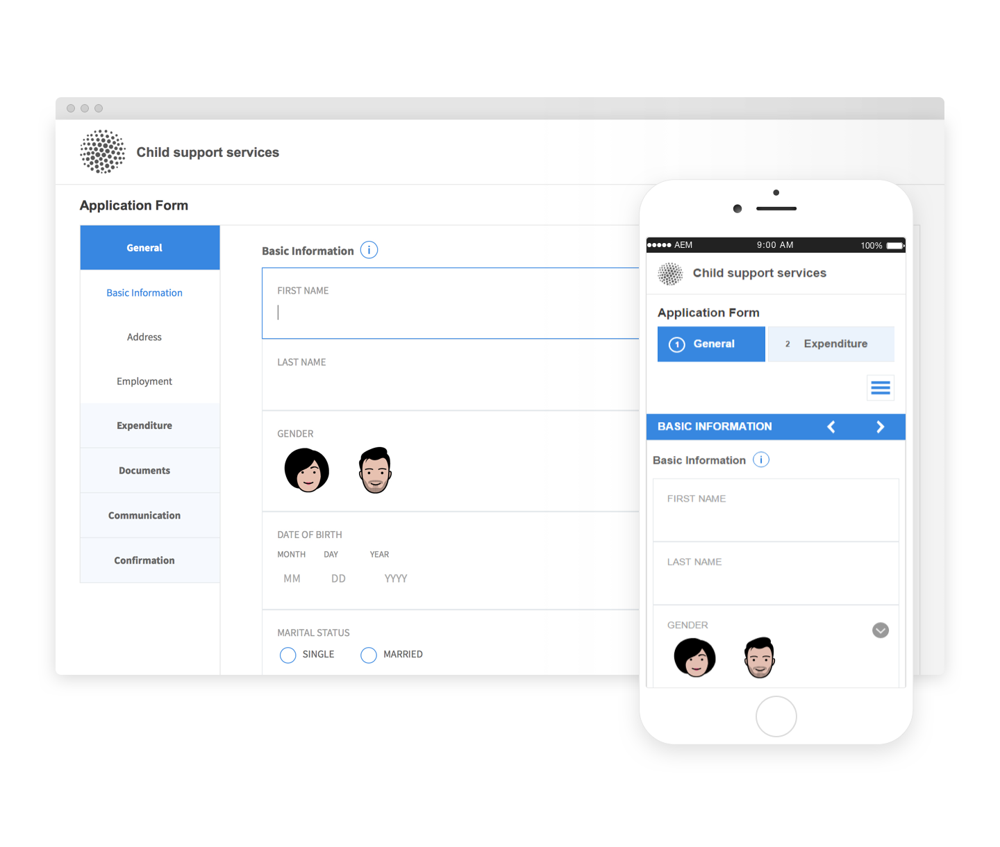
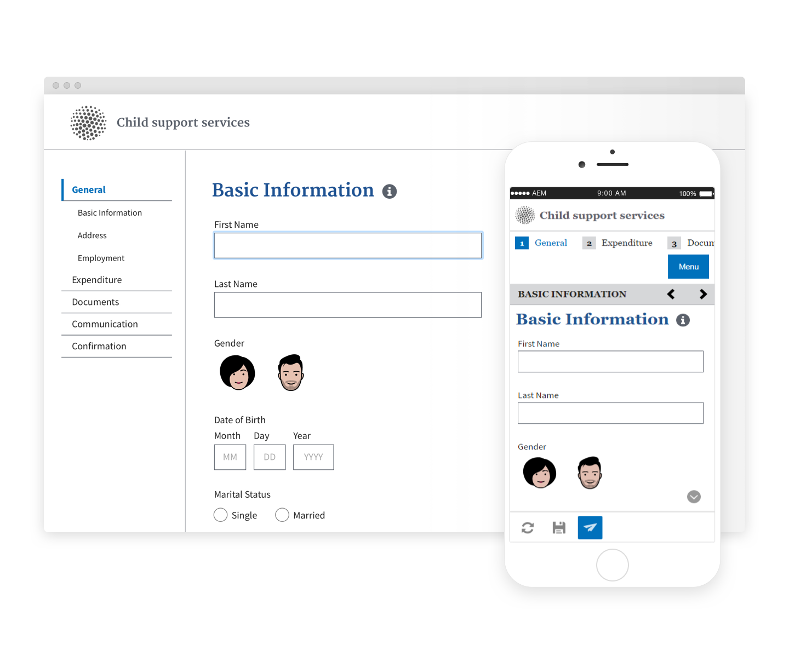

# リファレンステーマ{#reference-themes}

[テーマ](../../forms/using/themes.md)を使用すると、CSS に関する深い知識がなくてもフォームのスタイルを設定できます。 デフォルトのテーマに加え、[AEM Forms アドオンパッケージ](https://experienceleague.adobe.com/docs/experience-manager-release-information/aem-release-updates/forms-updates/aem-forms-releases.html?lang=ja)をインストールすることで以下のテーマを取得できます。

* Beryl
* Exec
* Exec-Light
* Liberty
* Ultramarine
* Urbane
* U.S. Web Design Standards
* Tranquil

各テーマには、独自のエレガントなスタイルが含まれていて、ユーザー向けの使いやすいアダプティブフォームの作成に使用できます。 パネル、テキストボックス、数値ボックス、ラジオボタン、表、スイッチなど、セレクター用の独自のスタイル設定が含まれています。 これらのテーマ内のスタイルは、要件に基づいたものです。 例えば、あるシナリオで、クリーンなフォントを含む最小限のテーマが必要だとします。 Liberty テーマなら、その外観を実現できます。

このパッケージに含まれるテーマはレスポンシブで、これらのテーマ内のスタイルはモバイルおよびデスクトップ表示用として定義されています。 様々なデバイス上の最新ブラウザーのほとんどは、これらのテーマのいずれかが適用されたフォームを問題なくレンダリングできます。

パッケージのインストールについて詳しくは、[パッケージの作業方法](/help/sites-administering/package-manager.md)を参照してください。

## Beryl {#beryl}

Beryl テーマは、We.Gov アダプティブフォームで使用され、背景画像、透明度および大きくてフラットなアイコンの使用を強調します。 以下のスクリーンショットで、Beryl テーマの外観と、フォームのスタイル設定がどのように拡張されるかを確認できます。

<!--
[Click to enlarge

](assets/beryl-1.png)
-->

## Exec {#exec}

Exec テーマは、背景を単色で塗りつぶさず、フォームコンポーネントを強調します。 コンポーネントを選択してクリックすると、フォントの色が変わります。 デフォルトのキャンバステーマと比較すると、選択したタブのテキストのフォント色が濃い青に変わります。 「ナビゲーション」ボタンと「送信」ボタンが Beryl テーマとは異なることに注目してください。

<!--
[Click to enlarge

](assets/exec-1.png)
-->

## Exec Light {#exec-light}

Exec Light テーマは、空白を使用してシームレスなエクスペリエンスを作成します。 「次へ」ボタンと「送信」ボタンは、単色で塗りつぶされ、3D のシャドウが付きます。 左側で選択したタブには、ダブルチェックマークではなく矢印が付きます。

<!--
[Click to enlarge

](assets/exec-light-1.png)
-->

## Liberty {#liberty}

Liberty テーマは、ミニマリストなアプローチを採用して、重要な部分を強調します。 例えば、訪問済みのタブのフォントの色が緑に変わります。 テキストボックスの下のアウトラインだけが表示されます。これは、線が引かれている紙ベースのフォームの外観をエミュレートしています。 アクティブなテキストボックスの下のアウトラインは黒で、その他のテキストボックスの下のアウトラインは薄い灰色です。

<!--
[Click to enlarge

](assets/liberty-1.png)
-->

## Tranquil {#tranquil}

Tranquil テーマは、Tranquil カラースキームの明るい色調と暗い色調を提供して、フォームの様々なコンポーネントを強調します。 例えば、ラジオボタン、パネル、タブが、様々なシェーディングの緑色になります。

<!--
[Click to enlarge

](assets/tranquil-1.png)
-->

## Ultramarine {#ultramarine}

Ultramarine テーマは、濃い青色のシェーディングを使用して、タブ、パネル、テキストボックス、ボタンなどのコンポーネントを強調します。

<!--[Click to enlarge](assets/ultramarine-1.png)-->

## Urbane {#urbane}

Urbane テーマは、フォームのミニマルで機能的な外観を強調します。 Urbane テーマをフォームに適用すると、コンポーネントはフラットになります。 パネルには細いアウトラインが付き、モダンな外観になります。

<!--
[Click to enlarge

](assets/urbane-1.png)
-->

## U.S. Web Design Standards {#u-s-web-design-standards}

U.S. Web Design Standards テーマは、名前が示すとおり、Draft U.S. Web Design Standards サイトで規定されている書体とスタイルを使用します。 この Web 標準は、連邦政府の Web サイト間での Web エクスペリエンスを統一するために、連邦政府機関で使用されています。

<!--
[Click to enlarge

](assets/usgov.png)
-->
