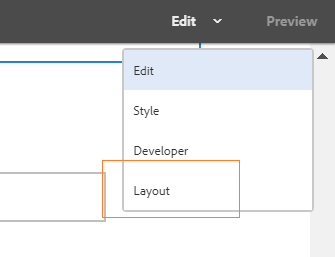

# レイアウトモードを使用したコンポーネントのサイズ変更 {#use-layout-mode-to-resize-components}

[アダプティブフォームの新規作成](/help/forms/using/create-an-adaptive-form-core-components.md)または [AEM Sites ページへのアダプティブフォームの追加](/help/forms/using/create-or-add-an-adaptive-form-to-aem-sites-page.md)には、最新の拡張可能なデータキャプチャ[コアコンポーネント](https://experienceleague.adobe.com/docs/experience-manager-core-components/using/adaptive-forms/introduction.html?lang=ja)を使用することをお勧めします。これらのコンポーネントは、アダプティブフォームの作成における大幅な進歩を表し、ユーザーエクスペリエンスの向上を実現します。この記事では、基盤コンポーネントを使用してアダプティブフォームを作成する古い方法について説明します。

## 適用先 {#applies-to}

このドキュメントは、**AEM 6.5 LTS Forms** に適用されます。

AEM as a Cloud Serviceのドキュメントについては、[Cloud ServiceのAEM Forms](https://experienceleague.adobe.com/docs/experience-manager-cloud-service/content/forms/adaptive-forms-authoring/authoring-adaptive-forms-foundation-components/configure-layout-of-an-adaptive-form/resize-using-layout-mode.html?lang=ja) を参照してください。

アダプティブフォームのオーサリングインターフェイスを使用すると、レイアウトモードを使用してコンポーネントのサイズを変更できます。列内の青い点をドラッグ＆ドロップして、コンポーネントを配置する開始点と終了点を定義します。レスポンシブグリッド内のコンポーネントをタップすると、青い点が表示されます。レスポンシブグリッドは、12 個の等しい列で構成されています。代替列の白と青色の影は、1 つの列と他の列を区別します。

レイアウトモードを使用すると、デスクトップ、タブレット、スマートフォン、その他の小型デバイスなど、あらゆる種類のデバイスのコンポーネントサイズを変更できます。タブレットはデスクトップ版からレイアウト設定を自動的に引き継ぎ、小型デバイスはスマートフォンからレイアウト設定を引き継ぎます。自動的に生成された設定を上書きして、デバイスタイプごとに異なる設定を定義することもできます。

## レイアウトモードへのアクセス {#access-layout-mode}

「**プレビュー**」オプションの横のアダプティブフォームのオーサリングインターフェイス上部に表示されるドロップダウンリストから、「**レイアウト**」を選択します。フォームがレイアウトモードで表示されます。

1. AEM オーサーインスタンスにログインし、**Adobe Experience Manager**／**フォーム**／**フォームとドキュメント**&#x200B;に移動します。
1. [アダプティブフォーム](../../forms/using/creating-adaptive-form.md)を作成するか、既存のアダプティブフォームを開きます。
1. 「**プレビュー**」オプションの横の上部に表示されるドロップダウンリストから「**レイアウト**」を選択します。フォームがレイアウトモードで表示されます。

   

## コンポーネントのサイズ変更 {#resize-components}

1. レイアウトモードで、サイズを変更するコンポーネントを選択します。レスポンシブグリッドの開始と終了に青い点が表示されます。
1. レスポンシブグリッド内のコンポーネントの位置を定義する青い点をドラッグ＆ドロップします。

   

   コンポーネントをタップした後に表示されるツールバーは、以下のオプションで構成されます。

   * **[!UICONTROL 親]**： コンポーネントの親を選択します。
   * **[!UICONTROL ブレークポイントのレイアウトを元に戻す]**：すべてのサイズ変更を元に戻し、コンポーネントにデフォルトのレイアウトを適用します。
   * **[!UICONTROL 新しい行にフローティングする]**：同じ行内に複数のコンポーネントがある場合は、コンポーネントを次の行に移動します。

   また、パネルレベルで「**[!UICONTROL ブレークポイントのレイアウトを元に戻す]**（）」オプションを使用して、すべてのサイズ変更を元に戻すこともできます。

   >[!NOTE]
   >
   >レイアウトモードを使用して、テーブルの列、ツールバー、ツールバーボタン、ターゲット領域のコンポーネントのサイズを変更することはできません。スタイルモードを使用して、これらのコンポーネントのサイズを変更します。

### 例 {#example}

**目的：**&#x200B;テーブルコンポーネントと画像コンポーネントを挿入し、アダプティブフォームでそれらを互いに平行に配置します。

1. アダプティブフォームで編集モードを使用して、テーブルコンポーネントと画像コンポーネントを挿入します。画像コンポーネントは、テーブルコンポーネントの後に表示されます。
1. レイアウトモードに切り替えて、テーブルコンポーネントを選択します。コンポーネントのサイズを変更する青い点が列 1 と列 12 に表示されます。
1. レスポンシブグリッドの列 12 の青い点を列 6 にドラッグ＆ドロップします。

   

1. 同様に、画像コンポーネントを選択し、レスポンシブグリッドの列 1 の青い点を列 7 にドラッグ＆ドロップします。テーブルと画像コンポーネントは互いに平行に表示されます。

   

   画像コンポーネントを選択し、ツールバーにある「**新しい行にフローティングする**」オプションを選択すると、画像コンポーネントを次の行に移動できます。

## パネルのサイズ変更 {#resize-panels-layout-mode}

個々のコンポーネントではなくパネル全体のサイズを変更する場合は、以下の手順を実行します。

1. サイズ変更するパネル内のコンポーネントを選択し、「」を選択し、パネルがコンポーネントの直接の親である場合は、ドロップダウンリストの最初のオプションを選択します。

   レスポンシブグリッドの開始と終了に青い点が表示されます。

1. レスポンシブグリッド内のパネルの位置を定義する青い点をドラッグ＆ドロップします。手順 1 と 2 を繰り返し、「」を選択して、サイズ変更したパネルを次の行に移動できます。

## パネルの複数列レイアウトの定義

以下の手順を実行して、パネルの列数を定義します。

1. **[!UICONTROL 編集]**&#x200B;モードで、パネルを選択して、「」を選択し、**[!UICONTROL パネルレイアウト]**&#x200B;ドロップダウンリストから「**[!UICONTROL レスポンシブ - ナビゲーションなしですべてページに配置]**」オプションを選択します。

1. 「」を選択して、プロパティを保存します。

1. **[!UICONTROL レイアウト]**&#x200B;モードで、パネル内のいずれかのコンポーネントを選択して、「」を選択し、パネルを選択します。

1. 「」を選択し、ドロップダウンリストから列数を選択します。列数の範囲は 1～12 です。パネルが複数列のレイアウトに分割されます。

## 古いレスポンシブレイアウトに対する新しいレスポンシブグリッドの有効化 {#enableresponsivegrid}

AEM Forms 6.4 以前のバージョンを使用して作成するフォームに対して、新しいレスポンシブグリッドを有効にし、コンポーネントのサイズを変更します。

>[!NOTE]
>
>新しいレスポンシブグリッドに切り替えると、フォームで使用するコンポーネントに対して既に定義されているレイアウトプロパティが破棄されます。

以下の手順を実行して、新しいレスポンシブグリッドを有効にします。

1. 「**プレビュー**」オプションの横の上部に表示されるドロップダウンリストから「**レイアウト**」を選択します。レイアウトモードを有効にするための確認メッセージが表示されます。
1. 「**はい**」を選択して、フォームの&#x200B;**レイアウト**&#x200B;モードを有効にします。

### 新しいレスポンシブレイアウトを使用した、古いフラグメントのアダプティブフォームへの埋め込み {#embed-an-old-fragment-in-an-adaptive-form-with-new-responsive-layout}

アダプティブフォームの新しいレスポンシブレイアウトを使用すると、古いレスポンシブレイアウトを含むアダプティブフォームのフラグメントをフォームに追加できます。ただし、新しいレイアウトでは、フラグメントで使用するコンポーネントに対して既に定義されているレイアウトプロパティが破棄されます。レイアウトモードに切り替えて、フラグメントで使用するコンポーネントのレイアウトプロパティを定義できます。

### 新しいレスポンシブレイアウトを使用した、フラグメントの古いアダプティブフォームへの埋め込み {#embed-a-fragment-with-new-responsive-layout-in-an-old-adaptive-form}

古いレスポンシブレイアウトを含むアダプティブフォームで、新しいレスポンシブレイアウトを使用してフラグメントを埋め込むと、そのフォームのレイアウトモードを有効にし、フラグメントを再埋め込みするよう求められます。

レイアウトモードを有効にするには、「**プレビュー**」オプションの横の上部に表示されるドロップダウンリストから「**レイアウト**」を選択し、「**はい**」を選択して確認します。**編集**&#x200B;モードを選択して、フラグメントを再埋め込みします。

## 古いレスポンシブレイアウトを含むフォームに対するレイアウトモードの無効化 {#disable-layout-mode-for-forms-with-old-responsive-layout}

古いレスポンシブレイアウトを含むフォームのレイアウトモードを無効にするには、フォームで使用するテンプレートのプロパティを編集します。

レイアウトモードを無効にするには、以下の手順を実行します。

1. **[!UICONTROL ツール]**／**[!UICONTROL 一般]**／**[!UICONTROL テンプレート]**&#x200B;を選択し、フォームで使用するテンプレートを&#x200B;**[!UICONTROL 編集]**&#x200B;モードで開きます。
1. 左側のウィンドウでドキュメントコンテナを選択し、「**[!UICONTROL ポリシー]**」を選択します。

   

1. 「**[!UICONTROL レイアウト設定]**」タブを選択し、「**[!UICONTROL レイアウトモードを無効にする]**」を選択します。
1. 「」を選択して、テンプレートのプロパティを保存します。
