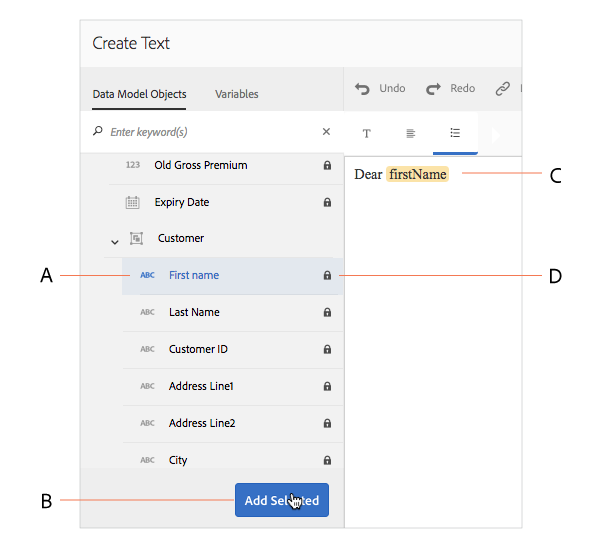
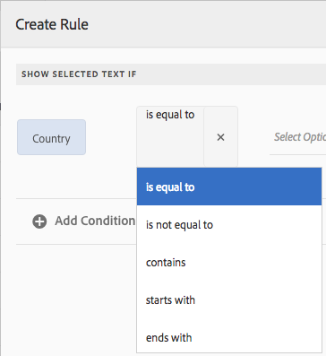
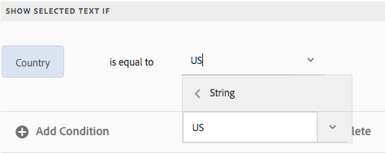

# インタラクティブ通信内のテキスト{#texts-in-interactive-communications}

## 概要 {#overview}

テキストドキュメントフラグメントは、1 つまたは複数のテキスト段落で構成されます。段落は静的または動的にすることができます。動的な段落には、フォームデータモデルのプロパティと変数を含めることができます。ルールを適用し、テキストドキュメントフラグメント内でそのルールを繰り返すこともできます。例えば、あいさつ文に記載する顧客の名前をフォームデータモデル（FDM）のプロパティとして指定し、実行時にその名前の値を動的に設定することができます。この値を変更すると、エージェント UI で同じインタラクティブ通信を使用して、異なる顧客に対してインタラクティブ通信を設定することができます。

インタラクティブ通信内のテキストドキュメントフラグメントでは、以下に示す動的データがサポートされています。

* **データモデルオブジェクト**：データプロパティでは、バックエンドのデータソースが使用されます。
* **ルールベースのコンテンツ**：ルールに基づいて表示と非表示が切り替わる、テキスト内の特定のコンテンツ。ルールは、フォームデータモデルのプロパティに基づいて適用することも、フォームデータモデルの変数に基づいて適用することもできます。
* **変数**：テキストドキュメントフラグメントでは、バックエンドのデータソースに変数が連結されることはありません。インタラクティブ通信を後処理用に送信する際に、エージェントが変数の値を設定または選択します（または、エージェントが変数をデータソースに連結します）。 
* **繰り返し構造**：クレジットカードの取引明細など、インタラクティブ通信を生成するたびに件数が変化する動的な情報を、インタラクティブ通信に含めることができます。繰り返し構造を使用すると、このような動的な情報の書式設定と構造化を行うことができます。詳しくは、「[インライン条件と繰り返し](https://helpx.adobe.com/jp/experience-manager/6-3/forms/using/cm-inline-condition.html)」を参照してください。

## テキストの作成 {#createtext}

1. 「**[!UICONTROL フォーム]**／**[!UICONTROL ドキュメントフラグメント]**」を選択します。
1. **[!UICONTROL 作成]**／**[!UICONTROL テキスト]**&#x200B;の順に選択します。
1. 次の情報を指定します。

   * **[!UICONTROL タイトル]**：（任意）テキストドキュメントフラグメントのタイトルを入力します。タイトルは一意である必要はなく、特殊文字や英語以外の文字を含めることもできます。タイトルを指定している場合、サムネイルやプロパティなどでは、タイトルによってテキストが参照されます。
   * **[!UICONTROL 名前]**：テキストの名前を入力します。フォルダー内の他のテキストと重複しない名前を入力する必要があります。どのような状態であっても、1 つのフォルダー内に、同じ名前を持つ 2 つのドキュメントフラグメント（テキスト、条件、リスト）を保管することはできません。「名前」フィールドに入力できるのは、英語の文字、数字、ハイフンのみです。「名前」フィールドは、「タイトル」フィールドに基づいて自動的に入力されます。「タイトル」フィールドに入力した特殊文字、スペース、および英数字以外の文字はハイフンに置き換えられます。「タイトル」フィールドの値は「名前」フィールドに自動的にコピーされますが、値を編集することもできます。

   * **[!UICONTROL 説明]**：テキストの説明を入力します。
   * **[!UICONTROL フォームデータモデル]**：（任意）フォームデータモデルに基づいてテキストを作成する場合は、「フォームデータモデル」ラジオボタンを選択します。「フォームデータモデル」ラジオボタンを選択すると、「**[!UICONTROL フォームデータモデル]**」フィールドが表示されます。フォームデータモデルを参照して選択します。インタラクティブ通信用のテキストと条件を作成する場合は、そのインタラクティブ通信で使用するものと同じデータモデルを使用する必要があります。フォームデータモデルについて詳しくは、「[データ統合](/help/forms/using/data-integration.md)」を参照してください。

   * **[!UICONTROL タグ]**：（オプション）カスタムタグを作成するには、テキストフィールドに値を入力して Enter を押します。このテキストを保存すると、新しく追加されたタグが作成されます。

1. 「**[!UICONTROL 次へ]**」を選択します。

   テキストを作成ページが表示されます。フォームデータモデルのベースのテキストを作成することを選択した場合は、左側のパネルにフォームデータモデルのプロパティが表示されます。

1. テキストを入力し、以下のオプションを使用して、フォームデータモデルのプロパティと変数について書式設定と条件設定を行い、それらのプロパティと変数をテキストに挿入します。

   * [フォームデータモデル](#formdatamodel)
   * [変数](#variables)
   * [ルールエディター](#rules)
   * [書式設定オプション](#formatting)

      * [書式設定されたテキストを他のアプリケーションからコピーして貼り付け](#paste)

      * [テキストの一部をハイライト表示](#highlight)

   * [繰り返し](/help/forms/using/cm-inline-condition.md)
   * [特殊文字](#special)
   * [テキストの検索と置換](#searching)
   * [ショートカットキー](/help/forms/using/keyboard-shortcuts.md)

   >[!NOTE]
   >
   >フォームデータモデル要素、データディクショナリ要素、変数は、テキストエディターで @ 記号を使って追加することができます。テキストエディターで @ を先頭にした文字列を入力すると、すべてのデータモデル要素、データディクショナリ要素、変数が検索され、検索された文字列を含む要素または変数が表示されます。検索結果をナビゲートして、要素や変数を選択することができます。一致する結果がない場合、 「*一致する結果が見つかりません*」のメッセージが表示されます。

1. 「**[!UICONTROL 保存]**」を選択します。

   テキストが作成されます。これで、このテキストを構築ブロックとして使用して、インタラクティブ通信を作成することができます。

## テキストの編集 {#edittext}

次の手順を使用して、既存のテキストドキュメントフラグメントを編集できます。インタラクティブ通信エディターを使用して、テキストドキュメントフラグメントを編集することもできます。

1. **[!UICONTROL フォーム]**／**[!UICONTROL ドキュメントフラグメント]**&#x200B;を選択します。
1. テキストドキュメントフラグメントに移動して選択します。
1. 「**[!UICONTROL 編集]**」を選択します。
1. 必要な変更を行います。テキストのオプションについて詳しくは、[テキストの作成](#createtext)を参照してください。
1. 「**[!UICONTROL 保存]**」を選択したあと、「**[!UICONTROL 閉じる]**」を選択します。

## フォームデータモデルのプロパティを使用したテキストドキュメントフラグメントのパーソナライズ {#formdatamodel}

フォームデータモデルのプロパティを挿入することで、テキストドキュメントフラグメントをパーソナライズできます。フォームデータモデルのプロパティをテキスト内に挿入すると、インタラクティブ通信のプレビューを表示する際に、関連するデータソースから受信者固有のデータを取得して設定できるようになります。フォームデータモデルについて詳しくは、[AEM Forms のデータ統合](/help/forms/using/data-integration.md)を参照してください。

テキストの作成時にフォームデータモデルを指定すると、そのフォームデータモデルのプロパティが、テキストエディターの左側のウィンドウに表示されます。テキストドキュメントフラグメントと、そのテキストドキュメントフラグメントを含むインタラクティブ通信で、指定するフォームデータモデルが同じである必要があります。

* フォームデータモデルのプロパティをテキスト内に挿入するには、そのプロパティを挿入する位置にカーソルを置いてから、左側のウィンドウで上図の「**[A]**」プロパティをタップして選択し、「**[!UICONTROL [B] 選択項目を追加]**」を選択します。プロパティをダブルクリックするだけでも、「**[C]**」のカーソルの位置に挿入できます。フォームデータモデルのプロパティが、茶色の背景色でハイライト表示されます。

また、テキストエディターで @ 記号を使用して、フォームデータモデルプロパティを検索して追加することもできます。プロパティを挿入する位置にカーソルを置きます。@ の後に検索文字列を入力します。検索操作は、ドキュメントフラグメントで使用可能なすべてのフォームデータモデルのプロパティと変数に対して実行されます。検索文字列を含むプロパティまたは変数が取得され、ドロップダウンリストとして表示されます。検索結果間を移動し、カーソル位置で挿入するプロパティをクリックします。検索結果を非表示にするには、Esc キーを押します。

* エージェント UI を使用して[インタラクティブ通信の準備と送信](/help/forms/using/prepare-send-interactive-communication.md)を行う際に、エージェントでフォームデータモデルのプロパティの値を編集できるようにするには、そのプロパティの&#x200B;**[D]**&#x200B;ロックアイコンを選択してロックが解除された状態であることを確認します。デフォルト状態では、プロパティはロックされているので、エージェントはエージェント UI でプロパティを編集できません。

フォームデータモデルのプロパティを使用して、コンテンツの一部を表示または非表示にするためのルールを作成することもできます。詳しくは、[テキスト内でルールを作成する](#rules)を参照してください。

## テキストドキュメントフラグメント内での変数の作成と使用 {#variables}

変数は、インタラクティブ通信の作成時に連結できるプレースホルダーです。変数は、フォームデータモデルのプロパティまたはテキストフラグメントに連結できます。変数は、エージェントが指定するように残しておくこともできます。

次の場合に、フォームデータモデルのプロパティの代わりに変数を使用できます。

* 複数のインタラクティブ通信で同じテキストドキュメントフラグメントを使用する必要があり、インタラクティブ通信ごとに異なる連結方法を使用する必要がある場合。
* テキストドキュメントフラグメントの作成時に、フォームデータモデルが存在しない場合。変数を挿入し、後でインタラクティブ通信の作成時にフォームデータモデルのプロパティにそれらの変数をバインドすることができます。
* テキストドキュメントフラグメントからテキストを連結し、取得する必要がある場合。変数に連結できるのは、内部に変数を持たないテキストドキュメントフラグメントのみです。

テキストドキュメントフラグメントの作成または編集時に、変数を作成および挿入できます。作成した変数は、エージェント UI の「データ」タブに表示されます。[エージェント UI を使用してインタラクティブ通信の準備と送信](/help/forms/using/prepare-send-interactive-communication.md)を行う際に、エージェントが変数の値を指定します。

### 変数の作成 {#createvariables}

1. 左側のウィンドウで、「**[!UICONTROL 変数]**」を選択します。

   変数ウィンドウが表示されます。

   

1. 「**[!UICONTROL 作成]**」を選択します。

   変数を作成ウィンドウが表示されます。

1. 次の情報を入力して、「**[!UICONTROL 作成]**」を選択します。

   * **[!UICONTROL 名前]**：変数の名前。
   * **[!UICONTROL 説明]**：（オプション）変数の説明を入力します。
   * **[!UICONTROL タイプ]**：変数のタイプ（文字列、数値、ブール値、日付）を選択します。
   * **[!UICONTROL 特定の値のみ許可]**：文字列変数または数値変数の場合、エージェント UI のプレースホルダーの特定の値セットからエージェントが選択するようにできます。この値セットを指定するには、このオプションを選択してから、「**[!UICONTROL 値]**」フィールドで許可されているコンマ区切りの値を指定します。

1. 「**[!UICONTROL 作成]**」を選択します。

   変数が作成され、変数ウィンドウに表示されます。

1. テキスト内に変数を挿入するには、適切な位置にポインタを合わせ、変数を選択して、「**[!UICONTROL 選択項目を追加]**」を選択します。

   

   変数が明るい青の背景色でハイライト表示され、フォームデータモデルのプロパティが茶色の背景色でハイライト表示されます。

   または、テキストエディターの @ 記号を使用して変数を検索および追加できます。変数を挿入する位置にカーソルを置きます。@ の後に検索文字列を入力します。検索操作は、ドキュメントフラグメントで使用可能なすべてのフォームデータモデルのプロパティと変数に対して実行されます。検索文字列を含むプロパティと変数が取得され、ドロップダウンリストとして表示されます。検索結果間を移動し、カーソル位置で挿入する変数をクリックします。検索結果を非表示にするには、Esc キーを押します。

1. 「**[!UICONTROL 保存]**」を選択します。

## テキスト内にルールを作成 {#rules}

テキスト内でルールエディターを使用して、**事前に定義された条件**&#x200B;に基づいてコンテンツやテキストの文字列の表示と非表示を切り替えるためのルールを作成することができます。これらの条件は、次に基づいて構築できます。

* 文字列
* 数値
* 数式
* 日付
* 関連するフォームデータモデルのプロパティ
* テキスト内に作成した任意の変数

### テキスト内にルールを作成 {#create-rules-in-text}

1. テキストの作成時または編集時に、ルールを使用して条件を設定するテキスト内の文字列、段落、またはコンテンツを選択します。

   

1. 「**[!UICONTROL ルールを作成]**」を選択します。

   ルール作成ダイアログが表示されます。文字列、数値、数式、日付のほかに、以下のデータをルールエディターで使用して、ルールのステートメントを作成することができます。

   * 関連するフォームデータモデルのプロパティ
   * 作成済みの任意の変数

   評価するオプションを選択します。

    

   >[!NOTE]
   >
   >テキストの条件設定と表示をおこなうためのルールを作成する場合、コレクションプロパティは使用できません。

1. 「次の値と等しい」、「次の値を含む」、「次の値で始まる」など、ルールを評価するための適切な演算子を選択します。

   

1. 評価式、値、データモデルプロパティ、または変数を挿入します。

   

   フォームデータモデルのソースデータに基づき、受信者が米国に居住している場合に、選択されたテキストを表示するためのルール

   * ルールの作成時または編集時にサイズ変更（）を選択して、ルールを作成／ルールを編集ダイアログを拡張できます。ダイアログを拡張して全画面表示にすると、フォームデータモデルのプロパティと変数をドラッグ＆ドロップして、ルールを作成できます。サイズ変更をもう一度選択すると、ルールを作成ダイアログに戻ります。
   * 1 つのルールで複数の条件を作成することもできます。
   * 既にルールが適用されているコンテンツの一部に対して、別のルールを作成して適用することもできます。

1. 「**[!UICONTROL 完了]**」を選択します。

   ルールが適用されます。 ルールが適用されたテキストまたはコンテンツは、緑色でハイライト表示されます。ハイライトの左側に表示されているハンドルにポインタを合わせると、適用されているルールが表示されます。

   

   適用したルールの左側に表示されるハンドルをクリックすると、そのルールの編集や削除をおこなうためのオプションが表示されます。

## テキストの書式設定 {#formatting}

テキストの作成や編集を行う場合、選択する編集のタイプ（「段落」、「整列」、「リスト」）に応じて、表示されるツールバーが異なります。

以下のツールバーのタイプ（段落、整列またはリスト）を選択します。

フォント編集ツールバー

整列ツールバー

リストツールバー

### テキストの一部のハイライト表示または強調表示 {#highlight}

編集可能なドキュメントフラグメント内のテキストの一部をハイライト表示または強調するには、目的のテキストを選択して「ハイライト表示の色」を選択します。

基本カラーパレットの基本カラー `**[A]**` を直接選択するか、スライダー `**[B]**` を使用して「**選択**」を選択し、そのカラーの適切なシェードを選択できます。

オプションで、「詳細」タブに移動して、適切な色相、明度および彩度 `**[C]**` を選択して正確な色を作成し、次に「`**[D]**` を選択」を選択して、テキストをハイライト表示するカラーを適用できます。

### 書式設定されたテキストの貼り付け {#paste}

別のアプリケーション（Microsoft® Word や HTML ページなど）で使用されているテキスト内の 1 つまたは複数の段落を再利用するには、目的のテキストをコピーしてテキストエディター内にペーストします。コピーしたテキストの書式は、テキストエディターでも保持されます。

編集可能なテキストドキュメントフラグメント内のテキストの 1 つまたは複数の段落をコピーしてペーストすることができます。例えば、次のような居住証明書の箇条書きリストが含まれている Microsoft® Word ドキュメントがあるとします。

この場合、Microsoft® Word ドキュメント内のテキストをコピーして、編集可能なテキストドキュメントフラグメントに直接ペーストすることができます。箇条書きリスト、フォント、テキストの色などの書式は、テキストドキュメントフラグメント内に保存されます。

>[!NOTE]
>
>ただし、貼り付けたテキストの書式設定にはいくつかの[制約](https://helpx.adobe.com/jp/aem-forms/kb/cm-copy-paste-text-limitations.html)があります。

## テキストへの特殊文字の挿入 {#special}

必要に応じて、ドキュメントフラグメントに特殊文字を挿入します。例えば、特殊文字パレットを使用して、以下の特殊文字を挿入することができます。

* 通貨記号（€、￥、£ など）
* 数学記号（∑、√、∂、^ など）
* 句読記号（‟、” など）

テキストエディターでは、210 個の特殊文字がサポートされます。管理者は、[カスタマイズすることで特殊文字を増やしたり、カスタムの特殊文字を追加したりする](/help/forms/using/custom-special-characters.md)ことができます。

## テキストの検索と置換 {#searching}

大量のテキストが含まれているテキストドキュメントフラグメントで作業を行う場合、特定のテキスト文字列を検索しなければならないことがあります。また、特定のテキスト文字列を別の文字列と置換する必要がある場合もあります。

「検索と置換」機能により、テキストドキュメントフラグメント内の任意のテキスト文字列を検索して置き換えることができます。この機能には、強力な正規表現検索も含まれています。

1. テキストドキュメントフラグメントを[編集](#edittext)用に開きます。
1. 「**[!UICONTROL 検索と置換]**」を選択します。

1. 検索するテキストを「**[!UICONTROL 検索]**」テキストボックスに入力し、新しいテキスト（置き換えるテキスト）を「**[!UICONTROL 置換]**」テキストボックスに入力して「**[!UICONTROL 置換]**」を選択します。

1. 検索テキストが見つかると、そのテキストが置換テキストに変更されます。

   * 複数の検索テキストが見つかった場合は、テキストドキュメントフラグメント内でそれらのテキストがハイライト表示されます。「**[!UICONTROL 置換]**」をもう一度選択すると、そのハイライトされたテキストが置換され、3つ目のテキストが見つかった場合はカーソルが次の検索テキストに移動します。
   * 検索テキストがそれ以上見つからない場合は、「モジュールの最後に達しました」というメッセージが検索と置換ダイアログに表示されます。

   また、「すべて置換」を選択して、見つかった検索テキストをすべてまとめて置き換えることができます。

   「検索と置換」機能には、強力な正規表現検索機能が組み込まれています。正規表現を使用して検索を実行するには、「**[!UICONTROL 正規表現]**」を選択して「**[!UICONTROL 検索]**」または「**[!UICONTROL 置換]**」を選択します。
