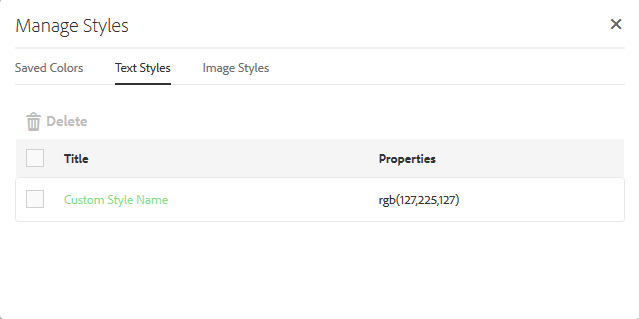
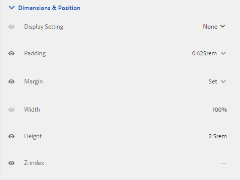

# テーマの作成および使用 {#creating-and-using-themes}

[アダプティブフォームの新規作成](/help/forms/using/create-an-adaptive-form-core-components.md)または [AEM Sites ページへのアダプティブフォームの追加](/help/forms/using/create-or-add-an-adaptive-form-to-aem-sites-page.md)には、最新の拡張可能なデータキャプチャ[コアコンポーネント](https://experienceleague.adobe.com/docs/experience-manager-core-components/using/adaptive-forms/introduction.html?lang=ja)を使用することをお勧めします。これらのコンポーネントは、アダプティブフォームの作成における大幅な進歩を表し、ユーザーエクスペリエンスの向上を実現します。この記事では、基盤コンポーネントを使用してアダプティブフォームを作成する古い方法について説明します。

## 適用先 {#applies-to}

このドキュメントは、**AEM 6.5 LTS Forms** に適用されます。

AEM as a Cloud Serviceのドキュメントについては、[Cloud ServiceのAEM Forms](https://experienceleague.adobe.com/ja/docs/experience-manager-cloud-service/content/forms/adaptive-forms-authoring/authoring-adaptive-forms-foundation-components/create-an-adaptive-form-on-forms-cs/themes) を参照してください。

## はじめに {#introduction}

テーマを作成して適用することにより、アダプティブフォームやインタラクティブ通信のスタイルを設定して視覚的に表現することができます。テーマには、コンポーネントとパネルのスタイルを設定するための詳細情報が含まれています。スタイルには、背景色、状態色、透明度、配置、サイズなどのプロパティが含まれます。テーマを適用すると、指定したスタイルが対応するコンポーネントに反映されます。テーマは、独立して管理されます。アダプティブフォームやインタラクティブ通信が参照されることはありません。

以下の操作を実行できます。

* テーマの作成
* 既存のテーマを編集してコピーする
* 既存のテーマをダウンロードして AEM Forms サーバーにアップロードする
* テーマの依存関係を管理する

## テーマの作成、ダウンロード、アップロード {#creating-downloading-or-uploading-a-theme}

AEM Forms では、テーマを作成、ダウンロード、アップロードできます。テーマは、フォーム、ドキュメント、レターなどの他のアセットと同様に作成できます。テーマは、フォームのようにメタプロパティを使用した、独立したエンティティとして保存できます。テーマは独立したエンティティであるため、複数のアダプティブフォームとインタラクティブ通信で再利用できます。テーマを別の AEM Forms インスタンスに移動して再利用することもできます。

### テーマの作成 {#creating-a-theme}

次の手順を実行して、テーマを作成します。

1. **Adobe Experience Manager**／**Forms**／**テーマ**&#x200B;の順にクリックします。

1. テーマページで、**作成／テーマ**&#x200B;をクリックします。
テーマを作成するためのウィザードが起動します。

1. テーマ作成ウィザードの「基本」タブで、テーマの「**タイトル**」フィールドと「**名前**」フィールドに値を指定します。これらは必須フィールドです。

1. 「詳細」タブには、2 つのフィールドがあります。

   * **Clientlib の場所**：テーマのクライアントライブラリを保存するリポジトリ内の場所です。

   * **Clientlib カテゴリ**：テーマのクライアントライブラリのカテゴリ名を入力するためのテキストフィールドを提供します。

1. **作成**／**編集**&#x200B;の順にクリックして、テーマエディターでテーマを開きます。テーマページに戻る場合は、「**完了**」をクリックします。

### テーマのダウンロード {#downloading-a-theme}

テーマを zip ファイルとして書き出し、別のプロジェクトや AEM インスタンスでそのテーマを使用できます。テーマをダウンロードするには、以下の手順を実行します。

1. **Adobe Experience Manager**／**Forms**／**テーマ**&#x200B;の順にクリックします。

1. テーマページでテーマを&#x200B;**選択**&#x200B;し、「**ダウンロード**」をクリックします。テーマの詳細を示すダイアログボックスが表示されます。

1. 「**ダウンロード**」をクリックします。テーマが zip ファイルとしてダウンロードされます。

>[!NOTE]
>
>アダプティブフォームが関連付けられ、そのアダプティブフォームがカスタムテンプレートに基づいているテーマをダウンロードする場合は、そのカスタムテンプレートもダウンロードしてください。ダウンロードしたテーマとアダプティブフォームを AEM Forms サーバーにアップロードする場合は、関連するカスタムテンプレートもアップロードしてください。

### テーマのアップロード {#uploading-a-theme}

プロジェクトにスタイル設定がプリセットされた作成済みのテーマを使用できます。他の人が作成したテーマのパッケージをプロジェクトにアップロードしてインポートできます。

テーマをアップロードするには、以下の手順を実行します。

1. **Adobe Experience Manager**／**Forms**／**テーマ**&#x200B;の順にクリックします。

1. テーマページで、**作成／ファイルのアップロード**&#x200B;をクリックします。
1. ファイルのアップロードプロンプトで、コンピューター上のテーマパッケージを参照して選択し、「**アップロード**」をクリックします。アップロードされたテーマは、テーマページで使用することができます。

## テーマのメタデータ {#metadata-of-a-theme}

以下の表に、テーマのメタプロパティを示します。これらのプロパティは、テーマのプロパティページに表示されます。

<table>
 <tbody>
  <tr>
   <th>
<strong>ID</strong>
 
 
 </th>
   <th><strong>名前</strong></th>
   <th><strong>編集の可否</strong></th>
   <th><strong>プロパティの説明</strong></th>
  </tr>
  <tr>
   <td>1.</td>
   <td>タイトル</td>
   <td>はい</td>
   <td>テーマの表示名です。</td>
  </tr>
  <tr>
   <td>2.</td>
   <td>説明</td>
   <td>はい</td>
   <td>テーマについての説明です。</td>
  </tr>
  <tr>
   <td>3.</td>
   <td>タイプ</td>
   <td>いいえ</td>
   <td>
    <ul>
     <li>アセットのタイプです。</li>
     <li>この値はテーマである必要があります。</li>
    </ul> </td>
  </tr>
  <tr>
   <td>4.</td>
   <td>作成日</td>
   <td>いいえ</td>
   <td>テーマの作成日です。</td>
  </tr>
  <tr>
   <td>5.</td>
   <td>作成者名</td>
   <td>はい</td>
   <td>テーマの作成者です。テーマの作成時に計算されます。</td>
  </tr>
  <tr>
   <td>6.</td>
   <td>最終変更日</td>
   <td>いいえ</td>
   <td>テーマが最後に変更された日付です。</td>
  </tr>
  <tr>
   <td>7.</td>
   <td>ステータス</td>
   <td>いいえ</td>
   <td>テーマの状態（変更済み／公開済み）。</td>
  </tr>
  <tr>
   <td>8.</td>
   <td>オンタイムに公開</td>
   <td>はい</td>
   <td>テーマを自動で公開する時間。</td>
  </tr>
  <tr>
   <td>9.</td>
   <td>オフタイムに公開</td>
   <td>はい</td>
   <td>テーマを自動で非公開にする時間です。</td>
  </tr>
  <tr>
   <td>10.</td>
   <td>タグ</td>
   <td>はい</td>
   <td>検索の向上のために使用される、識別用にテーマに付加されるラベルです。</td>
  </tr>
  <tr>
   <td>11.</td>
   <td>参照</td>
   <td>リンク</td>
   <td>
    <ul>
     <li>「参照元」セクションを含みます。そのテーマを使用するフォームをリスト表示します。</li>
     <li>テーマが他のアセットを参照していない場合、「参照」セクションはありません。</li>
    </ul> </td>
  </tr>
  <tr>
   <td>12.</td>
   <td>Clientlib の場所</td>
   <td>対応</td>
   <td>
    <ul>
     <li>このテーマに対応する clientlib が保存される、「/etc」内のユーザー定義のリポジトリのパスです。</li>
     <li>デフォルト値 - 「/etc/clientlibs/fd/themes」 + テーマのアセットの相対パス。</li>
     <li>場所が存在しない場合、フォルダー階層は自動生成されます。</li>
     <li>この値が変更されると、clientlib ノード構造は、入力された新しい場所に移動します。 <em><strong>メモ：</strong>デフォルトの clientlib の場所を変更する場合は、CRXDE リポジトリで <code>crx:replicate</code>、<code>rep:write</code>、<code>rep:glob:*</code>、<code>rep:itemNames::</code> <code>js.txt</code>、<code>jcr:read</code> を <code>forms-users</code> に、<code>crx:replicate</code>、<code>jcr:read</code> を新しい場所の <code>fd-service</code>に割り当てます。また、<code>forms-user</code></em> の <code>deny jcr:addChildNodes</code> を追加して別の ACL を添付します</li>
    </ul> </td>
  </tr>
  <tr>
   <td>13.</td>
   <td>Clientlib カテゴリ名</td>
   <td>対応</td>
   <td>
    <ul>
     <li>このテーマのユーザー定義の clientlib カテゴリ名です。</li>
     <li>名前が既に存在するテーマで使用されていると、エラーが表示されます。</li>
     <li>デフォルト値 - テーマの位置を使用して計算されます。</li>
     <li>この値が変更されると、clientlib ノードに対応してカテゴリ名が更新されます。clientlib カテゴリ名は参照で使用されるため、jsp ファイルの clientlib カテゴリ名の更新は不要です。</li>
    </ul> </td>
  </tr>
 </tbody>
</table>

## テーマエディターについて {#about-the-theme-editor}

AEM Forms にはテーマエディターが付属します。テーマエディターは、ビジネスユーザーや web デザイナー／開発者にとって使いやすいインターフェイスです。アダプティブフォームとインタラクティブ通信の様々な要素のスタイルを簡単に指定するために必要な機能が用意されています。テーマを作成すると、フォーム、インタラクティブ通信、レター、ドキュメントフラグメント、データ辞書のように、独立したエンティティとして保存されます。

テーマエディターでは、テーマでスタイル設定されたコンポーネントのスタイルをカスタマイズできます。デバイス上でのフォームやインタラクティブ通信の外観をカスタマイズすることができます。

テーマエディターは次の 2 つのパネルに分けられます。

* **キャンバス** - 右側に表示されます。キャンバスには、サンプルのアダプティブフォームまたはインタラクティブ通信が表示されます。スタイルを変更すると、その変更内容がキャンバス上で即時に反映されます。また、キャンバスから直接オブジェクトを選択して、オブジェクトに関連するスタイルを検索したり、そのスタイルを編集したりすることもできます。上部にあるデバイスの解像度のルーラーにより、キャンバスが制御されます。解像度のブレークポイントをルーラーで選択すると、各解像度について、サンプルのフォームまたはインタラクティブ通信のプレビューが表示されます。キャンバスについては、[下記](../../forms/using/themes.md#using-canvas)で説明されています。

* **サイドバー** - 左側に表示されます。以下の項目があります。

   * **セレクター**：スタイル設定用に選択されたコンポーネントと、スタイルを設定するプロパティが表示されます。セレクターは、あるタイプのすべてのコンポーネントを表示します。テーマ内でテキストボックスコンポーネントを編集用に選択すると、フォームまたはインタラクティブ通信内のすべてのテキストボックスで、同じスタイルが継承されます。セレクターを使用すると、スタイル設定のための汎用コンポーネントまたは特定のコンポーネントを選択できます。例えば、フィールドコンポーネントは汎用コンポーネント、テキストボックスは特定コンポーネントになります。

     **汎用コンポーネントのスタイル設定：**
フィールドは、年齢などの数値ボックスフィールド、または住所などのテキストボックスフィールドにできます。1 つのフィールドのスタイルを設定すると、年齢、名前、住所などすべてのフィールドのスタイルが設定されます。

     **特定コンポーネントのスタイル設定：**
特定コンポーネントは、特定のカテゴリのオブジェクトに影響します。テーマ内で数値ボックスコンポーネントのスタイルを設定すると、フォームまたはインタラクティブ通信内の数値ボックスオブジェクトでのみ、そのスタイルが継承されます。

     例えば、住所などのテキストボックスは長く、年齢などの数値ボックスは短くなります。数値ボックスフィールドを選択して、長さを短くし、フォームに適用します。フォームにあるすべての数値ボックスフィールドの幅が短くなります。

     特定の背景色が設定されているすべてのフィールドコンポーネントをカスタマイズすると、年齢フィールド、名前フィールド、住所フィールドなど、すべてのフィールドでその背景色が継承されます。年齢などの数値ボックスを選択し、幅を短くすると、年齢や家族の人数など、すべての数値ボックスの幅が短くなります。テキストボックスの幅は変更されません。

   * **状態：**&#x200B;特定の状態にあるオブジェクトのスタイル設定をカスタマイズします。例えば、デフォルト、フォーカス、無効、ホバー、エラーの状態におけるオブジェクトの見え方を指定できます。
   * **プロパティカテゴリ：**&#x200B;スタイル設定プロパティには、様々なカテゴリがあります。例えば、ディメンションと位置、テキスト、背景、境界線および効果などです。各カテゴリで、スタイル設定情報を指定します。例えば、背景では、背景色や画像とグラデーションを指定します。

   * **詳細：**&#x200B;カスタムの CSS を任意のオブジェクトに追加することができます。この CSS により、スタイル設定が重複している場合は、視覚的な制御を行うプロパティが上書きされます。

   * **CSS を表示**：選択したコンポーネントの CSS が表示されます。

  また、サイドバーの下部に矢印が表示されます。矢印をクリックすると、「**成功をシミュレート**」と「**エラーをシミュレート」という 2 つのオプションがさらに表示されます。**&#x200B;これらのオプションは、上記のオプションと合わせて、詳細が[下記](../../forms/using/themes.md#using-rail)で説明されています。

 **A.** サイドバー **B.** キャンバス

### コンポーネントのスタイル設定 {#styling-components}

複数のアダプティブフォームとインタラクティブ通信で、同じテーマを使用できます。その場合、そのテーマ内で指定したコンポーネントの書式設定がアダプティブフォームとインタラクティブ通信にインポートされます。タイトル、説明、パネル、フィールド、アイコン、テキストボックスなど、様々なコンポーネントのスタイルを設定できます。テーマ内でウィジェットを使用して、コンポーネントのプロパティを設定できます。CSS オーバーライドセクションでは CSS コードを記述することができ、各種カスタムセレクターも用意されているため、CSS や LESS に関する知識は必須ではありませんが、こうした知識があった方が望ましいです。CSS オーバーライドセクションは、サイドバーでコンポーネントを選択すると表示されます。

サイドバーの各種オプションを使用して、様々なコンポーネントを選択してスタイルを設定できます。

サイドバーにあるコンポーネントの「編集」ボタンをクリックすることでキャンバスのコンポーネントが選択され、サイドバーのオプションを使用してコンポーネントのスタイルを設定できます。

テキストボックス、数値ボックス、ラジオボタン、チェックボックスのような特定のコンポーネントは、フィールドのような高レベルのコンポーネントで分類されます。例えば、ラジオボタンのスタイル設定をカスタマイズすることができます。スタイル設定のラジオボタンを設定するには、**フィールド／ウィジェット／ラジオボタン**&#x200B;を選択します。

サイドバーの「**すべてを展開**」をクリックして、前面に表示されていない分類化されたコンポーネントを表示、選択、ならびにスタイル設定します。

### パネルレイアウトのスタイル設定 {#styling-panel-layouts-br}

AEM Forms のテーマでは、フォームとインタラクティブ通信のパネルレイアウトで、各種要素のスタイルを設定することができます。そのまま使用できるレイアウトやカスタムのレイアウト要素のスタイル設定がサポートされています。

すぐに使用できるパネルには以下が含まれています。

* 左側のタブ
* 上部のタブ
* アコーディオン
* レスポンシブ
* ウィザード
* モバイルレイアウト

   * ヘッダーのパネルタイトル
   * ヘッダーのパネルタイトルなし

セレクターは、レイアウトごとに異なります。テーマエディターからのカスタムレイアウトのスタイル設定には、以下が含まれます。

* スタイル設定可能なレイアウトのコンポーネントの定義、およびこれらのコンポーネントを一意に認識する CSS セレクター
* これらのコンポーネントに適用可能な CSS プロパティの定義
* ユーザーインターフェイスからのインタラクティブなコンポーネントのスタイル設定の定義

### 画面サイズごとに異なるスタイル {#different-styles-for-different-screen-sizes-br}

デスクトップのレイアウトとモバイルのレイアウトは、わずかにまたは全面的に異なるスタイルになります。モバイルデバイスの場合、タブレットとスマートフォンはコンポーネントのサイズを除き同様のレイアウトを共有します。

テーマエディターのブレークポイントを使用して、様々な画面サイズに応じた代替のスタイル設定を定義します。テーマの構築を開始するベースデバイスまたは解像度を選択すると、他の解像度のスタイルバリエーションが自動的に生成されます。すべての解像度のスタイル設定を明示的に変更することができます。

>[!NOTE]
>
>最初に、フォームまたはインタラクティブ通信を使用してテーマが作成され、次に、各種のフォームやインタラクティブ通信にそのテーマが適用されます。テーマの作成に使用されるブレークポイントは、そのテーマが適用されるフォームやインタラクティブ通信とは異なる場合があります。CSS メディアクエリは、テーマが適用されるフォームまたはインタラクティブ通信ではなく、テーマの作成に使用されるフォームまたはインタラクティブ通信に基づいています。

### オブジェクト選択時のサイドバーにおける、スタイル設定プロパティのコンテキストの変更 {#styling-properties-context-changes-in-sidebar-on-selecting-objects}

キャンバスでコンポーネントを選択すると、そのスタイル設定プロパティがサイドバーに一覧表示されます。オブジェクトのタイプと状態を選択して、スタイルを設定します。

### テーマエディターで最近使用したスタイル {#recently-used-styles-in-theme-editor}

テーマエディターは、コンポーネントに適用した最大 10 個のスタイルをキャッシュします。キャッシュしたスタイルは、テーマの別のコンポーネントで使用できます。最近使用したスタイルは、リストボックスとしてサイドバーで選択したコンポーネントのすぐ下にあります。最初は、最近使用したスタイル一覧は空になっています。

コンポーネントのスタイルを設定すると、そのスタイルはキャッシュされ、リストボックスに一覧表示されます。この例では、テキストボックスのラベルのスタイルを設定して、フォントサイズとカラーを変更します。同様の手順に従って、画像の選択や色の変更を行い、コンポーネントのスタイルを設定することができます。フィールドラベルのスタイル設定が変更されると、スタイルがキャッシュされてリストボックスに一覧表示されます。

この例ではフィールドラベルのスタイルが変更されています。レスポンシブパネル説明がスタイルとして選択されている場合、リストエントリがアセットライブラリ内に追加されます。アセットライブラリのエントリを使用すると、レスポンシブパネル説明のスタイルを変更できます。

アセットライブラリに追加されたスタイルは、別のテーマで使用できます。また、[スタイルモード](../../forms/using/inline-style-adaptive-forms.md)になっているフォームエディターまたはインタラクティブ通信の UI で使用することもできます。同様に、フォームエディターまたはインタラクティブ通信エディターの UI のスタイルモードを使用してコンポーネントのスタイルを設定すると、そのスタイルがキャッシュに格納され、テーマ内で使用できるようになります。

アセットライブラリでプラスボタンを使用すると、スタイルに名前を付けて永続的に保存できます。サイドバーにある「保存」ボタンをクリックしなくても、プラスボタンを使用すると、スタイルを保存してコンポーネントに適用できます。後で使用するためにスタイルを保存するプラスボタンは、スタイルモードでは使用できません。

スタイルにカスタム名を付けると、そのスタイルはテーマに関連付けられ、他のテーマでは使用できなくなります。保存したスタイルを削除するには、次の手順を実行します。

1. キャンバスツールバーで、**テーマオプション** ／**スタイルを管理**&#x200B;をクリックします。
1. スタイルを管理ダイアログで、保存したスタイルを選択し、「**削除**」をクリックします。

   

### ライブプレビュー、保存、変更の破棄 {#live-preview-save-and-discard-changes}

スタイル設定で行った変更内容は、キャンバス上に読み込まれたフォームまたはインタラクティブ通信で即座に反映されます。ライブプレビューを使用すると、スタイル設定をインタラクティブに定義して、その影響を確認できます。コンポーネントのスタイル設定を変更すると、サイドバーの「**完了**」ボタンが有効になります。変更を保持するには、「**完了**」ボタンを使用します。

>[!NOTE]
>
>フィールドに無効な文字が入力されると、フィールドの境界線の色が赤に変わり、画面の左上隅にエラーメッセージが表示されます。例えば、数字を入力できるテキストボックスにアルファベットを入力すると、入力ボックスの境界線の色が赤に変わります。このようなテーマは、上部に表示されるエラーを解決しないと保存できません。

### 任意のアダプティブフォームまたはインタラクティブ通信を使用してテーマを作成する {#theme-with-another-adaptive-form-or-interactive-communication}

テーマを作成する際は、テーマエディターに付属するフォームを使用して作成します。このフォームのコンポーネントのスタイル設定を行います。テーマエディターに付属しているフォームではなく、任意のフォームやインタラクティブ通信を選択してスタイルを設定し、その結果をプレビューできます。

テーマエディターのキャンバス上で現在のフォームまたはインタラクティブ通信を置き換えるには：

1. テーマエディターパネルで、**テーマオプション** ／**設定**&#x200B;をクリックします。

1. 「一般」タブの「**アダプティブフォーム / ドキュメント**」フィールドで、フォームまたはインタラクティブ通信を参照して選択します。

### やり直し／取り消し {#redo-undo}

意図しない変更を取り消すまたはやり直すことができます。キャンバスの「やり直し／取り消し」ボタンをクリックします。

キャンバスの「取り消し／やり直し」ボタン

「やり直し／取り消し」ボタンは、テーマエディターでコンポーネントのスタイルを設定すると表示されます。

## テーマエディターの使用 {#using-the-theme-editor}

テーマエディターでは、作成またはアップロードしたテーマを編集できます。**フォームとドキュメント／テーマ**&#x200B;に移動し、テーマを選択して開きます。テーマエディターでテーマが開きます。

上記で説明されているように、テーマエディターにはサイドバーとキャンバスの 2 つのパネルがあります。

テーマエディターのテキストボックスウィジェットコンポーネントの成功状態スタイル設定をカスタマイズします。キャンバスでコンポーネントを選択し、サイドバーでその状態を選択します。サイドバーで使用できるスタイル設定オプションで、コンポーネントの外観をカスタマイズします。

### キャンバスの使用 {#using-canvas}

すぐに使用できる付属のフォームを使用してテーマを作成することも、選択したフォームやインタラクティブ通信を使用してテーマを作成することもできます。キャンバスには、テーマのカスタマイズ内容と共に、テーマの作成時に使用したフォームまたはインタラクティブ通信のプレビューが表示されます。フォーム上部にあるルーラーは、デバイスの表示サイズに応じてレイアウトを決定するために使用します。

キャンバスツールバーには、以下が表示されます。

* **サイドパネルを切り替え** ：サイドバーの表示と非表示を切り替えます。
* **テーマオプション** ：3 つのオプションを提供します。

   * 設定：プレビューフォーム、インタラクティブ通信、基本クライアントライブラリ、Adobe Fonts 設定を選択するためのオプションが用意されています。
   * テーマ CSS を表示：選択したテーマの CSS が生成されます。
   * スタイルを管理：テキストと画像のスタイルを管理するためのオプションが用意されています。
   * ヘルプ：テーマエディターの画像によるガイドツアーを実行します。

* **エミュレーター** ：異なる画面サイズで、テーマの外観をエミュレートできます。表示サイズは、エミュレーターでブレークポイントとして処理されます。ブレークポイントを選択し、そのスタイルを指定できます。例えば、デスクトップとタブレットは 2 つのブレークポイントです。ブレークポイントごとに異なるスタイルを指定できます。

キャンバスでコンポーネントを選択すると、その上部にコンポーネントツールバーが表示されます。コンポーネントツールバーを使用すると、コンポーネントを選択したり、汎用コンポーネントに切り替えたりできます。例えば、パネルの数値テキストボックスを選択するとします。コンポーネントツールバーには次のオプションが表示されます。

* **数値ボックスウィジェット**：サイドバーで外観をカスタマイズするコンポーネントを選択できます。
* **フィールドウィジェット**：スタイル設定の汎用コンポーネントを選択できます。この例では、スタイル設定にすべてのテキスト入力コンポーネント（テキストボックス／数値ボックス／数値ステッパー／日付入力）が選択されています。

* ：スタイル設定のために、汎用コンポーネントに切り替えることができます。数値ボックスを選択してこのアイコンを選択すると、フィールドコンポーネントが選択されます。フィールドコンポーネントを選択してこのアイコンを選択すると、パネルが選択されます。このアイコンをタップし続けると、最終的にスタイル設定用のレイアウトが選択されます。

>[!NOTE]
>
>コンポーネントのツールバーで使用できるオプションは、選択したコンポーネントにより異なります。

キャンバスの数値ボックスのコンポーネントツールバー

### サイドバーの使用 {#using-rail}

テーマエディターのサイドバーには、テーマ内のコンポーネントのスタイルをカスタマイズし、セレクターを使用するためのオプションが用意されています。セレクターにより、コンポーネントのグループまたは個別のコンポーネントを選択し、サイドバーのセレクターを検索できます。カスタムコンポーネントのセレクターを作成できます。

キャンバスまたはサイドバーのセレクターでコンポーネントを選択する場合、サイドバーにはスタイルをカスタマイズするためのすべてのオプションが表示されます。コンポーネント選択時、サイドバーに表示されるオプションは次のとおりです。

* 状態
* プロパティシート
* 成功／エラーをシミュレート

#### 状態 {#state}

状態は、コンポーネントに対するユーザーインタラクションの指標です。例えば、ユーザーがテキストボックスに誤ったデータを入力した場合、テキストボックスの状態はエラー状態に変わります。テーマエディターにより、特定の状態に対するスタイル設定を指定できます。

状態のスタイルのカスタマイズのオプションは、コンポーネントごとに異なります。

#### プロパティシート {#property-sheet}

<table>
 <tbody>
  <tr>
   <td><strong>Property</strong></td>
   <td><strong>使用方法</strong></td>
  </tr>
  <tr>
   <td>
寸法と位置
 </td>
   <td>
テーマ内のコンポーネントの整列、サイズ、位置、配置のスタイルを設定できます。 
 
オプションは、ディスプレイ設定、余白、マージン、幅、高さおよび Z インデックスです。
 
レイアウトモードを使用すると、ドラッグ＆ドロップが容易なインターフェイスを使用してコンポーネントの幅を定義することもできます。詳しくは、<a href="../../forms/using/resize-using-layout-mode.md">レイアウトモードを使用したコンポーネントのサイズ変更</a>を参照してください。
 </td>
  </tr>
  <tr>
   <td>
テキスト
 </td>
   <td>
テーマのコンポーネントのテキストスタイルをカスタマイズできます。
 
例えば、テキストボックスに入力したテキストの見え方を変更するとします。
 
オプションには、フォントファミリー、太さ、カラー、サイズ、行の高さ、テキストの整列、文字間隔、テキストのインデント、下線、斜体、テキストの変換、垂直方向の整列、ベースライン、方向があります。 
 </td>
  </tr>
  <tr>
   <td>
背景 
 </td>
   <td>
コンポーネントの背景を画像または色で塗りつぶします。 
 </td>
  </tr>
  <tr>
   <td>
境界線
 </td>
   <td>
コンポーネントの境界線の外観を選択できます。例えば、テキストボックスに濃い赤の太い境界線を点線で付けるとします。 
 
オプションは、境界線の幅、スタイル、半径および色です。
 </td>
  </tr>
  <tr>
   <td>
効果
 </td>
   <td>
コンポーネントに、不透明度、描画モード、シャドウなどの特殊効果を追加できます。 
 </td>
  </tr>
  <tr>
   <td>
詳細
 </td>
   <td>
以下を追加できます。

    <ul>
     <li>セレクターでデフォルトコンテンツの前後にコンテンツを追加して、そのスタイルを設定するための <code>::before</code> および <code>::after</code> 疑似要素プロパティ。  <a href="https://www.w3schools.com/css/css_pseudo_elements.asp" target="_blank">CSS 疑似要素</a>を参照してください。</li>
     <li>カスタム CSS コードをコンポーネントにインラインで記述し、カスタムセレクターを作成します。 </li>
    </ul> 
カスタムの CSS コードを追加すると、サイドバーのオプションを使用して追加したカスタマイズがオーバーライドされます。 
 </td>
  </tr>
 </tbody>
</table>

#### 成功／エラーをシミュレート {#simulate-error-success}

サイドバーの下部には、「エラーをシミュレート」オプションと「成功をシミュレート」オプションがあります。サイドバーの下部に表示される表示／非表示の矢印を使用すると、これらのオプションを表示できます。テーマエディターを使用して、様々な状態のコンポーネントのスタイルを設定できます。

例えば、フォームに数値フィールドを追加して、テーマエディターでそのスタイル設定を指定します。ユーザーがフィールドに英数字を入力する際に、テキストボックスの背景色を変更するとします。テーマで数値フィールドを選択して、サイドバーにある状態オプションを使用します。サイドバーでエラー状態を選択し、背景色を赤に変更します。動作をプレビューするには、サイドバーにある「エラーをシミュレート」オプションを使用します。「エラーをシミュレート」および「成功をシミュレート」オプションについて、以下で詳しく説明します。

* **成功をシミュレート**：
成功状態のスタイル設定を指定した場合のコンポーネントの見え方を確認できます。例えば、フォームで顧客がパスワードを設定します。ユーザーは、指定されたガイドラインに従ってパスワードを設定できます。指定されたすべてのガイドラインに従ってパスワードを入力すると、テキストボックスが緑色に変わります。テキストボックスが緑色に変わると、成功状態になります。成功状態のコンポーネントのスタイルを指定し、その外観を「成功をシミュレート」オプションを使用してシミュレートできます。

* **エラーをシミュレート**：
エラー状態のスタイル設定を指定した場合のコンポーネントの見え方を確認できます。例えば、フォームで顧客がパスワードを設定します。ユーザーは、指定されたガイドラインに従ってパスワードを設定できます。指定されたガイドラインに従わずにパスワードを入力すると、テキストボックスが赤色に変わります。テキストボックスが赤色に変わると、エラー状態になります。エラー状態のコンポーネントのスタイルを指定し、その外観を「エラーをシミュレート」オプションを使用してシミュレートできます。

### コンポーネントのスタイル設定 {#styling-a-component}

例えば、フォームに 2 つのタイプのテキストボックスがあるとします。一方は数値のみ、もう一方は英数字の値を入力できます。数値のみを入力できるテキストボックス（数値ボックス）のスタイル設定をカスタマイズできます。

以下の手順を実行して、特定コンポーネントのスタイル設定をカスタマイズできます（この例の数値ボックス）。

1. テーマエディターで、キャンバスの数値ボックスを選択します。
1. 数値ボックスを選択すると、オプションが 3 つあるコンポーネントツールバーが表示されます。

   * **数値ボックスウィジェット**
   * **フィールドウィジェット** 

1. **数値ボックスウィジェット** を選択します。
1. サイドバーのタイトルが「数値ボックスウィジェット」に変わり、外観をカスタマイズするオプションが表示されます。サイドバーの「**寸法と位置**」オプションを使用して、コンポーネントのサイズをカスタマイズします。状態が&#x200B;**デフォルト**&#x200B;であることを確認してください。

**数値ボックスウィジェット**&#x200B;を選択する代わりに、コンポーネントツールバーの&#x200B;**フィールドウィジェット**&#x200B;を選択し、上記の手順を実行します。「**フィールドウィジェット**」オプションでサイズを選択すると、数値ボックスを除くすべてのテキストボックスが同じサイズになります。

### 特定の状態のフィールドのスタイル設定 {#styling-fields-given-state}

コンポーネントツールバーを使用して、異なる状態のコンポーネントのスタイルを設定することもできます。例えば、コンポーネントが無効になっている場合、無効状態になります。テーマエディターでスタイルを設定できるコンポーネントの状態としてよく使用されるのは、デフォルト、フォーカス、無効、エラー、成功およびホバーです。キャンバスでコンポーネントを選択して、サイドバーの状態オプションを使用し、外観をカスタマイズできます。

特定の状態のコンポーネントのスタイル設定をカスタマイズするには、次の手順を実行します。

1. キャンバスでコンポーネントを選択し、コンポーネントツールバーから適切なオプションを選択します。サイドバーに、コンポーネントのスタイル設定をカスタマイズするためのオプションが表示されます。
1. サイドバーで状態を選択します（例：エラー状態）。
1. サイドバーの&#x200B;**「境界線」、「背景」**&#x200B;などのオプションを使用して、コンポーネントの外観をカスタマイズします。
1. サイドバーの下部にある「**エラーをシミュレート**」オプションを使用して、編集時にスタイル設定がどのように見えるかを確認します。

状態を指定した後にコンポーネントのスタイル設定をカスタマイズすると、カスタマイズは指定された状態のコンポーネントにのみ表示されます。例えば、ホバー状態が選択されているときにコンポーネントのスタイル設定をカスタマイズするとします。この場合、テーマの適用先となるレンダリング後のフォームやインタラクティブ通信内のコンポーネント上にポインターを移動すると、コンポーネントのカスタマイズ内容が表示されます。

エラーと成功以外の状態の動作をシミュレートするには、プレビューモードを使用します。プレビューモードを使用するには、ページツールバーにある「**プレビュー**」をクリックします。

### 小型画面向けレイアウトのスタイル設定 {#styling-layouts-for-smaller-displays}

キャンバスのルーラーを使用して、画面が小さいデバイスのブレークポイントを選択します。キャンバスのエミュレーター  をクリックして、ルーラーとブレークポイントを表示します。ブレークポイントを使用すると、携帯電話やタブレットなど、各種デバイスで表示されるフォームやインタラクティブ通信の表示サイズをプレビューできます。テーマエディターでは、複数の画面サイズがサポートされています。

異なるブレークポイントにスタイルを設定するには、次の手順を実行します。

1. キャンバスで、ルーラーの上にあるブレークポイントを選択します。ブレークポイントとは、モバイルデバイスおよびその画面サイズのことです。
1. サイドバーを使用して、選択した表示サイズに合わせて、テーマ内のフォームまたはインタラクティブ通信コンポーネントのスタイルをカスタマイズします。
1. カスタマイズ内容を保存します。

複数のデバイスで、フォームまたはインタラクティブ通信コンポーネントのスタイルを設定することができます。デスクトップデバイスとモバイルデバイスでは、フォームコンポーネントとインタラクティブ通信コンポーネントのスタイルがまったく異なる場合があります。

### テーマ内で Web フォントを使用する {#using-web-fonts-in-a-theme}

これまでに行った手順により、Web サービスで使用できるフォントを、アダプティブフォームとインタラクティブ通信でも使用できるようになりました。Adobe の Web フォントサービスである [Adobe Fonts](https://fonts.adobe.com/) は、設定サービスとしてすぐに使用できます。Adobe Fonts を使用するには、キットを作成し、その中にフォントを追加し、[Adobe Fonts](https://fonts.adobe.com/) からキット ID を取得します。

AEM で Adobe Fonts を設定するには、次の手順を実行します。

1. オーサーインスタンスで、Adobe Experience Manager／ツール／デプロイメント／クラウドサービスに移動します。
1. **Cloud Services** ページで、「**Adobe Fonts**」オプションに移動して開きます。設定フォルダーを開き、「**作成**」をクリックします。
1. **設定を作成**&#x200B;ダイアログで、新しい設定のタイトルと名前を指定し、「**作成**」をクリックします。

   設定ページにリダイレクトされます。

1. コンポーネントを編集ダイアログが表示されるので、キット ID を入力して「**OK**」をクリックします。

Adobe Fonts 設定を使用するようにテーマを設定するには、次の手順を実行します。

1. オーサーインスタンスで、テーマエディターにあるテーマを開きます。
1. テーマエディターで、**テーマオプション** ／**設定**&#x200B;に移動します。
1. 「**Adobe Fonts 設定**」フィールドで、キットを選択して「**保存**」をクリックします。

   これで、テーマのフォントファミリーのプロパティにフォントが追加されたことが分かります。

### テーマエディターでのフォントの一覧表示と選択 {#listing-and-selecting-fonts-in-theme-editor}

テーマ設定サービスを使用して、テーマエディターにフォントを追加できます。次の手順を実行して、フォントを追加します。

1. 管理者権限を使用して AEM web コンソールにログインします。AEM Web コンソールの URL は、`https://'[server]:[port]'/system/console/configMgr` です。
1. **Adaptive Form Theme Configuration Service** を開きます。

   

1. 「+」をクリックし、フォントの名前を指定して「**保存**」をクリックします。フォントが追加され、テーマエディターで使用可能になります。

#### テーマエディターでのフォントの選択 {#selecting-fonts-in-theme-editor}

「+」ボタンを使用して、フォントを追加できます。フォントを追加すると、サイドバーに表示されます。

テーマの設定オプションに加えて、テーマエディター自体からフォントを追加することもできます。サイドバーの下にある「フォントファミリー」フィールドに使用するフォントを入力し、キーボードの Return キーを押します。

フォントを選択すると、フォントファミリーリストに追加されます。テーマエディターの「マスク」オプションを使用して、リストに表示されているフォントを無効または有効にすることができます。

コンポーネントのフォントが変更されたことを確認できます。

「フォントファミリー」フィールドは、複数のフォントをサポートしています。フォントを入力すると、ブラウザーはフォントを検索し、選択したコンポーネントに適用します。フォントが見つからない場合は、ブラウザーは、ファミリー内でそのフォントの横にあるフォントを探します。検索する特定のフォントを入力して開始できます。使用するフォントが見つからない場合は、フォントファミリーに一般的なフォントを入力して使用できます。

#### テーマエディター内で適用されているスタイルをマスク {#mask-styles-applied-in-theme-editor}

テーマ内で適用されているスタイルをマスクできるようになりました。テーマエディターのサイドバーに表示されている  アイコンを使用して、適用されているスタイルを無効にできます。例えば、フォームまたはインタラクティブ通信内のコンポーネントのサイズを変更した場合、プロパティの左側に表示されているマスクボタンを使用して無効にすることができます。テーマを保存すると、選択した「マスク」オプションが保持されます。

以下の例では、テーマ内でマスクされたスタイルとマスクされていないスタイルを示しています。

## テーマをフォームまたはインタラクティブ通信に適用する {#applying-a-theme-to-a-form-or-interactive-communication-br}

テーマをアダプティブフォームに適用するには：

1. フォームを編集モードで開きます。フォームを編集モードで開くには、フォームを選択し、「**開く**」をクリックします。
1. 編集モードで、コンポーネントを選択し、／**アダプティブフォームコンテナ**&#x200B;をクリックしてから、 をクリックします。

   サイドバーのフォームのプロパティを編集できます。

1. サイドバーで、「**スタイル設定**」をクリックします。
1. 「**アダプティブフォームのテーマ**」ドロップダウンリストからテーマを選択し、**完了**  をクリックします。

テーマをインタラクティブ通信に適用するには、以下の手順を実行します。

1. インタラクティブ通信を編集モードで開きます。インタラクティブ通信を編集モードで開くには、フォームを選択して、「**開く**」をクリックします。
1. 編集モードで、コンポーネントを選択し、／**ドキュメントコンテナ**&#x200B;をクリックしてから、 をクリックします。

   サイドバーでフォームのプロパティを編集できます。

1. サイドバーの「**基本**」の下に表示されている「**テーマ**」ドロップダウンでテーマを選択し、「**完了**」をクリックします。

### 実行時にフォームのテーマを変更 {#change-theme-of-a-form-at-runtime}

テーマにより、フォーム内の異なるコンポーネントのスタイルが設定されます。`themeOverride` プロパティを使用して、フォームのテーマを動的に変更できます。フォームの一般的な URL は次のとおりです。

`https://<server>:<port>/content/forms/af/test.html`

themeOverride パラメーターを使用して、実行時にテーマを適用できます。

`https://<server>:<port>/content/forms/af/test.html?themeOverride=/content/dam/formsanddocuments-themes/simpleEnrollmentTheme`

「`themeOverride`」オプションを使用して、テーマにパスを提供できます。これにより、フォームのテーマを変更し、更新されたスタイルを使用してフォームをリフレッシュします。

## テーマを使用した外観の設定 {#specific-af-appearance}

AEM Forms には、すぐに使用できるデフォルトのキャンバステーマ以外に、様々なテーマが用意されています。別のテーマを使用してフォームやインタラクティブ通信を設計し、追加の変更を加えたい場合は、テーマライブラリフォルダーからテーマをコピーします。コピーしたテーマをテーマライブラリフォルダーの外部に貼り付け、コピーしたテーマを必要な変更に応じて編集します。

テーマをコピーするには、次の手順を実行します。

1. オーサーインスタンスで、**Adobe Experience Manager／Forms／テーマ**&#x200B;に移動します。
1. テーマライブラリフォルダーを開きます。
1. テーマライブラリフォルダーで、対応するすぐに使用可能なテーマにポインターを置いて、「**コピー**」を選択します。
1. コピーしたテーマをテーマライブラリフォルダーの外部に貼り付けます。
1. コピーしたテーマをカスタマイズします。

テーマのカスタマイズが完了したら、そのカスタマイズ内容をフォームまたはインタラクティブ通信に適用します。

>[!NOTE]
>
>テーマライブラリフォルダーにあるテーマに変更を加えないでください。このフォルダーにはシステムテーマが含まれています。これらのテーマに加えた変更は、AEM Forms の新しいバージョンまたはホットフィックスのインストール時にすべて上書きされます。

## 他のアダプティブフォームの使用例への影響 {#impact-on-other-adaptive-form-use-cases}

* **フォームの公開／非公開：**&#x200B;フォームの公開時に、適用するテーマも公開します（まだ公開していない場合）
* **フォームのインポート／エクスポート：**&#x200B;フォームのインポートまたはエクスポートでは、関連するテーマも自動でインポートまたはエクスポートされます。
* **フォームの参照：**&#x200B;フォームの参照の「参照」セクションには、テーマの追加入力が含まれます。
* **フォームの最終変更時間：**&#x200B;関連するテーマが変更されると更新されます。
* **A/B テスト：** A/B テストのフォームの 2 つのバージョンに異なるテーマを適用できます。2 つのテーマの情報は、2 つのガイドコンテナに個別に保存されます。

## CSS 生成シーケンス {#css-generation-sequence}

「CSS を表示」を選択すると、テーマエディターはすべてのスタイル設定情報を収集し、CSS を構築します。情報は次の順序で収集されます。

1. テーマの基本クライアントライブラリで定義したスタイル設定。
1. サイドバーのプロパティを使用して指定したユーザー定義のスタイル設定。
1. 「CSS 上書き」オプションを使用して指定された CSS スタイル。

例えば、基本クライアントライブラリのテキストボックスの背景色は青になります。サイドバーのプロパティを使用して、ピンクに変更します。CSS を生成すると、テキストボックスの背景色がピンク色になります。プロパティを使用して背景色を変更した後、別の作成者が「CSS 上書き」オプションを使用してテキストボックスの背景色を白に変更できます。CSS を生成すると、生成された CSS の背景色が白になります。

## スタイルのデバッグ {#debugging-styles}

テーマエディターでコンポーネントのスタイルを指定すると、CSS が生成されます。汎用コンポーネントをスタイル設定する場合、これに含まれる複数のコンポーネントもスタイル設定されます。例えば、1 つのフィールドにスタイルを設定すると、そこに含まれるテキストボックスとラベルのスタイルも設定されます。フィールド内のテキストボックスのスタイルを設定すると、その CSS が設定されます。フィールドとコンポーネント用に生成された CSS をデバッグする場合は、テーマエディターに CSS を表示するオプションがあります。

生成された CSS は、次のオプションを使用して確認できます。

* サイドバーの「**CSS を表示**」オプション：テーマでコンポーネントを選択すると、サイドバーに「CSS を表示」オプションが表示されます。`::before`、`::after` 疑似要素を含め、生成された CSS を表示します。
* キャンバスツールバーの「**テーマ CSS を表示**」オプション：キャンバスツールバーで、／**テーマ CSS を表示**&#x200B;をクリックします。テーマエディターで定義したプロパティから生成されたテーマ CSS 全体を表示できます。

## トラブルシューティング、レコメンデーション、ベストプラクティス {#troubleshooting-recommendations-and-best-practices}

* **別のテーマに属するアセットの回避**

  テーマを編集する際、アセット（画像など）を他のテーマから参照して追加することができます。例えば、ページの背景を編集しているとします。例えば、**ページ** ／**背景**／**追加**／**画像**&#x200B;を選択すると、他のテーマの画像を参照して追加することが可能なダイアログが表示されます。

* アセットを別のテーマから追加し、そのテーマが移動または削除されると、現在のテーマに問題が生じる場合があります。他のテーマからアセットを参照して追加しないようにすることをお勧めします。
* **基本クライアントライブラリ、テーマエディター、インラインスタイル設定の使用**

   * **ベース Clientlib**：

     基本クライアントライブラリには、スタイル設定情報が含まれています。テーマ内のクライアント側ライブラリでスタイル設定情報を使用するには、次の手順を実行します。

      1. **Experience Manager／フォーム／テーマ**&#x200B;に移動します。
      1. テーマページで、テーマを選択し、「**プロパティの表示**」をクリックします。
      1. プロパティページが開くので、「**詳細**」をクリックします。
      1. 「詳細」タブの「Clientlib の場所」フィールドで、使用するクライアントライブラリを参照して選択します。
      1. 「**保存**」をクリックします。

     クライアントライブラリで指定したスタイル設定が、それを使用するテーマに読み込まれます。例えば、クライアントライブラリでテキストボックス、数値ボックス、切り替えのスタイル設定を指定するとします。クライアントライブラリをテーマに読み込むと、テキストボックス、数値ボックス、切り替えのスタイル設定が読み込まれます。その後で、テーマエディターを使用して他のコンポーネントのスタイルを設定できます。
テーマを作成して、それをコピーし、コピーしたテーマのスタイル設定を変更して同じような用途に使用することもできます。
詳しくは、「[テーマを使用して外観を設定する](#specific-af-appearance)」を参照してください。

   * **テーマエディター：**

     テーマエディターを使用すると、テーマを作成して、フォームやインタラクティブ通信のスタイルを設定できます。1 つのテーマ内で各コンポーネントのスタイルを設定すると、作成する複数のフォームやインタラクティブ通信で、外観と操作性を統一できます。まずテーマのスタイル設定情報を指定し、その後でテーマをフォームに適用することをお勧めします。

   * **インラインスタイル設定：**

     フォームで作業を行う際に、フォームまたはインタラクティブ通信のマルチチャネルエディターのスタイルモードを使用して、コンポーネントのスタイルを設定できます。スタイルモードを使用してフォームコンポーネントのスタイル設定を変更すると、テーマで指定したスタイル設定は上書きされます。特定のフォームの特定のコンポーネントのスタイル設定を変更する方法については、[コンポーネントのインラインスタイル設定](../../forms/using/inline-style-adaptive-forms.md)を参照してください。

* **クライアントサイドライブラリの使用**

  スタイル設定情報を読み込むためにクライアントライブラリを作成する場合は、[クライアントサイドライブラリの使用](/help/sites-developing/clientlibs.md)を参照してください。クライアントライブラリを作成したら、前述の手順でテーマに読み込むことができます。

* **コンテナパネルのレイアウト幅の変更**

  コンテナパネルのレイアウト幅の変更はお勧めしません。コンテナパネルの幅を指定すると、幅が静的になり、様々なディスプレイに合わせて調整されません。

* **ヘッダーとフッターを操作する際にフォームエディターまたはテーマエディターを使用する場合**

  テーマエディターは、フォントスタイル、背景、透明度などのスタイル設定オプションを使用してヘッダーとフッターのスタイルを設定する場合に使用します。
ヘッダーにロゴイメージや企業名などの情報を表示し、フッターに著作権情報を表示する場合は、フォームエディターのオプションを使用します。
