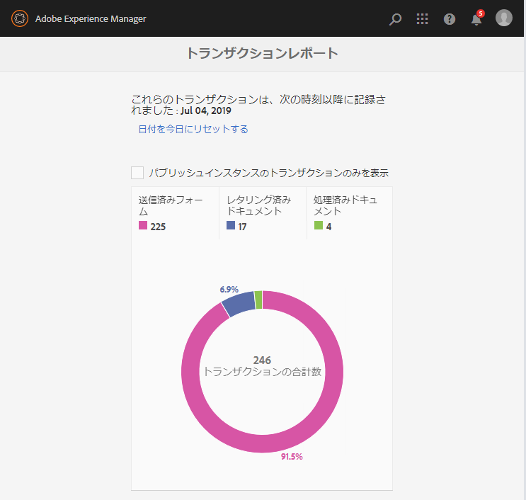
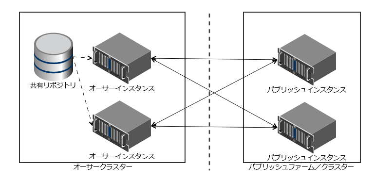

# OSGi 上の AEM Forms のトランザクションレポート {#transaction-reports-overview}

<!--
## Introduction {#introduction}

Transaction reports in AEM Forms let you keep a count of all transactions taken place since a specified date on your AEM Forms deployment. The objective is to provide information about product usage and help business stakeholders understand their digital processing volumes. Examples of a transaction include:

* Submission of an adaptive form, an HTML5 Form, or a form set
* Rendition of a print or a web version of an interactive communication
* Conversion of a document from one file format to another

For more information on what is considered a transaction, see [Billable APIs](../../forms/using/transaction-reports-billable-apis.md).
-->

トランザクションの記録はデフォルトで無効になっています。 AEM web コンソールから[トランザクションの記録を有効](../../forms/using/viewing-and-understanding-transaction-reports.md#setting-up-transaction-reports)にすることができます。 オーサーインスタンス、処理インスタンスまたはパブリッシュインスタンスのトランザクションレポートを表示できます。 すべてのトランザクションの集計合計に対して、作成者または処理インスタンスのトランザクションレポートを表示します。 パブリッシュインスタンスで発生したトランザクションレポートのうち、レポートの実行元のパブリッシュインスタンスでのみ発生したすべてのトランザクション数を表示します。

同じ AEM インスタンス上でコンテンツを作成（アダプティブフォーム、インタラクティブなコミュニケーション、テーマ、その他のオーサリングアクティビティを作成）したり、ドキュメントを処理（ワークフロー、ドキュメントサービス、その他の処理アクティビティを使用）したりしないでください。 コンテンツの作成に使用する AEM Forms サーバーでは、トランザクションの記録を無効にしておきます。 ドキュメントの処理に使用する AEM Forms サーバーに対して、トランザクションの記録を有効にしておきます。

トランザクションは、指定した期間（フラッシュバッファ時間 + リバースレプリケーション時間）、バッファに残ります。 デフォルトでは、トランザクション数がトランザクションレポートに反映されるまで、約 90 秒かかります。

PDF フォームの送信、エージェント UI によるインタラクティブなコミュニケーションのプレビュー、非標準のフォーム送信方法の使用などのアクションは、トランザクションとしては考慮されません。 AEM Forms は、このようなトランザクションを記録する API を提供します。 カスタム実装から API を呼び出して、トランザクションを記録します。

## サポートされるトポロジ {#supported-topology}

トランザクションレポートは、OSGi 環境の AEM Forms でのみ使用できます。 author-publish、author-processing-publish、および処理のみのトポロジがサポートされます。 トポロジについて詳しくは、[AEM Forms のアーキテクチャとデプロイメントトポロジ](../../forms/using/transaction-reports-overview.md)を参照してください。

トランザクション数は、パブリッシュインスタンスからオーサーインスタンスまたは処理インスタンスにリバースレプリケートされます。 オーサーとパブリッシュの代表的なトポロジを次に示します。

>[!NOTE]
>
>AEM Forms トランザクションレポートは、パブリッシュインスタンスのみを含むトポロジをサポートしていません。

### トランザクションレポートの使用に関するガイドライン {#guidelines-for-using-transaction-reports}

* オーサーインスタンスのレポートにはオーサリングアクティビティ中に登録されたトランザクションが含まれるため、すべてのオーサーインスタンスのトランザクションレポートを無効にします。
* オーサーインスタンスで **パブリッシュのトランザクションのみを表示**&#x200B;オプションを有効にして、すべてのパブリッシュインスタンスの累積トランザクションを表示します。 また、特定のパブリッシュインスタンス上のみの実際のトランザクションに関するトランザクションレポートは、各パブリッシュインスタンス上で表示することもできます。
* オーサーインスタンスを、ワークフローの実行とドキュメントの処理のために使用しないでください。
* パブリッシュサーバーにトポロジがある場合は、トランザクションレポートを使用する前に、すべてのパブリッシュインスタンスでリバースレプリケーションが有効になっていることを確認してください。
* トランザクションデータは、パブリッシュインスタンスから、対応するオーサーインスタンスまたは処理インスタンスにのみリバースレプリケーションされます。 オーサーインスタンスまたは処理インスタンスは、データを別のインスタンスにレプリケートできません。 例えば、author-processing-publish トポロジがある場合、集計トランザクションデータは処理インスタンスにのみレプリケートされます。

## 関連記事 {#related-articles}

* [OSGi 上の AEM Forms のトランザクションレポートの表示と理解](../../forms/using/viewing-and-understanding-transaction-reports.md)
* [OSGi 上の AEM Forms のトランザクションレポートの課金対象 API](../../forms/using/transaction-reports-billable-apis.md)
* [OSGi 上の AEM Forms のカスタム実装のトランザクションの記録](/help/forms/using/record-transaction-custom-implementation.md)
