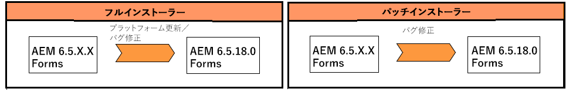

# JEE 上の AEM 6.5 Forms へのアップグレード {#upgrade-to-aem-forms-jee}

AEM 6.5.18.0 JEE版Formsには、フルインストーラーとパッチインストーラーの2種類のインストーラーが用意されています。

**フルインストーラー**: JEE上の[AEM 6.5.18.0 フルインストーラー](https://experienceleague.adobe.com/ja/docs/experience-manager-release-information/aem-release-updates/forms-updates/aem-forms-releases)を使用して、新しいAEM Forms インスタンスを設定したり、JEE上のAEM 6.5.x.x FormsからJEE上のAEM 6.5.18.0 Formsへのアップグレードを実行したりできます。

**パッチインストーラー**: [JEE パッチインストーラー](https://experienceleague.adobe.com/ja/docs/experience-manager-release-information/aem-release-updates/forms-updates/aem-forms-releases)のAEM 6.5.18.0は、既にAEM 6.5.x.x バージョンを使用しているお客様向けです。 パッチインストーラーを使用して、AEM Forms の最新バージョンにアップグレードできます。

次の表は、フルインストーラーとパッチインストーラーを使用する際のシナリオを示しています。

次の手順を実行して、フルインストーラーを使用して、JEE上の既存のAEM Forms 6.5.x.xをJEE上のAEM 6.5.18.0 Formsにアップグレードします。

1. [ソフトウェア配布](https://experience.adobe.com/#/downloads/content/software-distribution/en/aem.html)から JEE 上の AEM 6.5 Forms インストーラーをダウンロードします。 インストーラーを使用するには、有効なメンテナンス＆サポート契約が必要です。
1. [アップグレードのチェックリストと計画](https://www.adobe.com/go/learn_aemforms_upgrade_checklist_65_jp)で、アップグレードを正しく実行するためのチェック項目を確認します。
1. [AEM Forms へのアップグレードの準備](https://www.adobe.com/go/learn_aemforms_prepareupgrade_65_jp)で、サーバーのダウンタイムを最小限に抑えながらアップグレードを正しく行うためのタスクを確認し、これらのタスクを実行します。
1. 現在の環境とアプリケーションサーバーに応じて、以下に示すいずれかのドキュメントに記載されている手順を実行します。

   * [AEM 6.3またはAEM 6.4 FormsからAEM 6.5 Forms for JBossへのアップグレード](https://www.adobe.com/go/learn_aemforms_upgradeJBoss_65_jp)
   * [AEM 6.3またはAEM 6.4 FormsからAEM 6.5 Forms for WebSphereへのアップグレード](https://www.adobe.com/go/learn_aemforms_upgradeWebSphere_65_jp)
   * [AEM 6.3またはAEM 6.4 FormsからAEM 6.5 Forms for JBoss Turnkeyへのアップグレード](https://www.adobe.com/go/learn_aemforms_upgradeTurnkey_65_jp)

LiveCycle ES2、LiveCycle ES3、AEM 6.0 Forms、AEM 6.1 Forms、AEM 6.2 Forms を AEM 6.5 Forms に直接アップグレードすることはできません。 LiveCycle または AEM Forms のバージョンを 1 つ以上中間アップグレードした後に、AEM 6.5 Forms にアップグレードできます。 中間バージョンのリストと対応するアップグレード手順について詳しくは、「[アップグレードパスを選択する](upgrade.md)」を参照してください。
