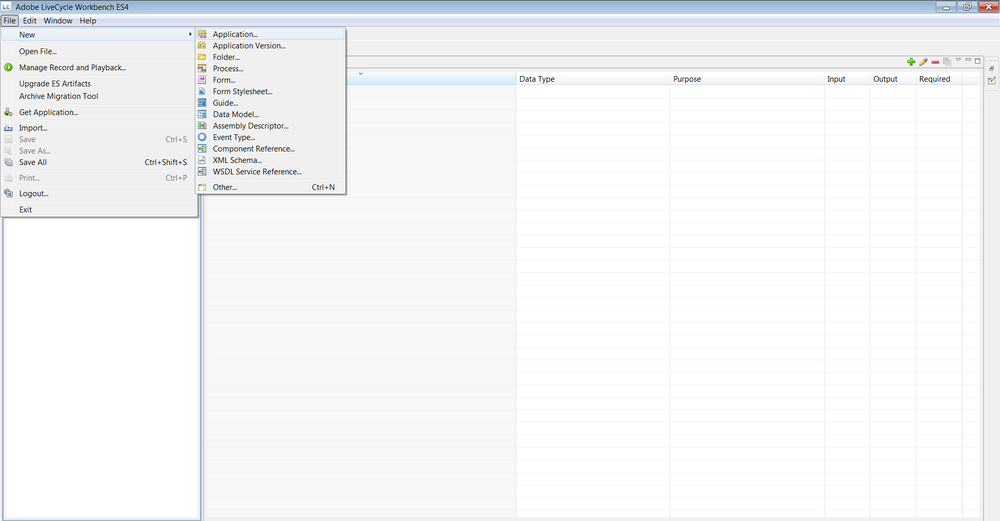
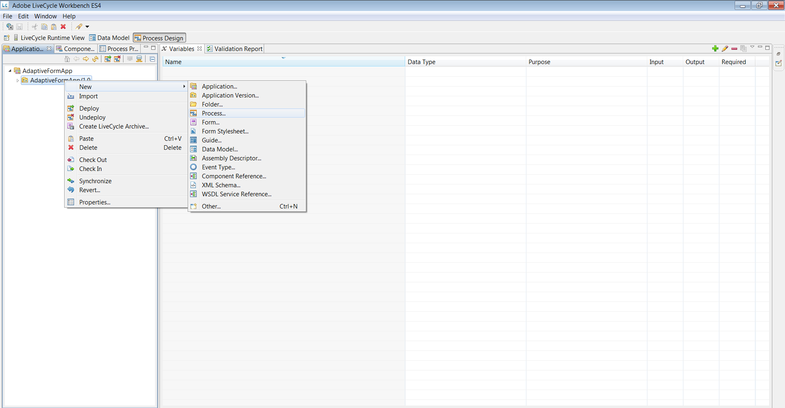
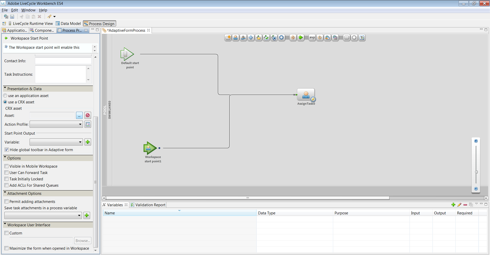
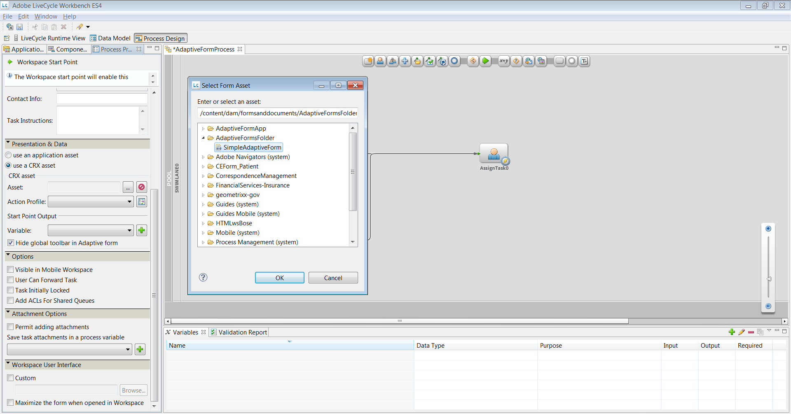

# HTML Workspace でのアダプティブフォームの使用{#using-an-adaptive-form-in-html-workspace}

JEE 上の AEM Forms では、HTML Workspace でアダプティブフォームを使用することができます。

プロセスデザインの際に XDP を選択できるため、既存のアダプティブフォーム AEM リポジトリから参照できる機能が追加されました。 この機能により、プロセスデザイナーは、アダプティブフォームを Starting Point と Task で設定することができます。

## プロセスデザインのエクスペリエンス {#process-design-experience}

プロセスデザインでアダプティブフォームの使用を有効にするには、次の手順を実行します。

* Assign Task および Start Point では、タスクにフォームアセットを割り当てる際に、CRX リポジトリ内のアダプティブフォームアセットを参照することができます。
* Assign Task および Start Point のワークベンチプロパティシートでは、アダプティブフォームのトップレベル／グローバルツールバーを非表示にすることができます。
* 新しいアクションプロファイルを、アダプティブフォームでのレンダリングおよび送信アクションに使用することができます。

### LiveCycle アプリケーションの書き出しおよび読み込み {#livecycle-application-export-and-import}

アダプティブフォームは AEM リポジトリにあるため、LiveCycle アプリケーションの書き出しには、使用されているアダプティブフォームへのリファレンスのみが含まれています。 そのため、LiveCycle アプリケーションのエクスポートおよびインポートは、2 段階のプロセスとなっています。 LiveCycle アプリケーションには、プロセスの定義などが含まれています。 アダプティブフォームを含む別のパッケージが、AEM より ZIP ファイルにて書き出されます。 読み込みは、LiveCycle アプリケーションはワークベンチを通して行われ、アダプティブフォームは AEM を通して行われます。

## HTML Workspace におけるアダプティブフォームのユーザーエクスペリエンス {#user-experience-of-adaptive-form-in-html-workspace}

HTML Workspace は、モバイルフォームに使用できるコントロールのほかに、アダプティブフォーム特有のコントロールをいくつか提供しています。 ユーザーは、Task または Start Point を開いたときに、HTML ワークスペースで添付ファイルの追加、保存、署名、送信、アダプティブフォームの移動を行うことができます。 詳しい内容は次のとおりです。

1. ファイルを添付するには、Mobile Forms と同じように、Task の添付ファイルを使用します。 アダプティブフォームでは、File Attachment タイプのボタンは非表示になっています。

1. アダプティブフォームを保存するには、Mobile Forms の場合と同じように「**保存**」をクリックします。 アダプティブフォームでは、Save タイプのボタンは非表示になっています。

1. アダプティブフォームを送信するには、Mobile Forms と同じように、「**送信**」ボタンを使うか、またはルートアクションを使用します。 アダプティブフォームでは、Submit タイプのボタンは非表示になっています。

1. **アダプティブフォームのグローバルツールバーの表示**：プロセスデザイナーがグローバル／トップレベルツールバーを非表示にしている場合、ツールバーとボタンはアダプティブフォームに表示されません。

1. **Workspace でのアダプティブフォームのナビゲーションコントロール**：HTML Workspace のアダプティブフォームでは、「保存」、「送信」、「ルートアクション」のボタンに加え、次へ／前へボタンも使用できます。 HTML Workspace でアダプティブフォームのパネルをナビゲートするには、次へ／前へボタンをクリックします。 「次へ」／「前へ」ボタンは、アダプティブフォームのモバイル表示のナビゲーションコントロールのような、精密なナビゲーションを提供します。

1. **アダプティブフォームの eSign サービスと Summary コンポーネント**：Summary コンポーネントは、HTML Workspace では操作できません。 つまり、アダプティブフォームに Summary コンポーネントが含まれていても、ワークスペースでは表示されません。 HTML Workspace では、ユーザーは、E-sign コンポーネントの自動送信の代わりに、送信またはルートアクションをクリックします。 ドキュメントが署名された後は、フラット（非インタラクティブ）な署名済みドキュメントとして表示されます。 「**送信**」またはルートアクションをクリックして、タスクまたは Start Point を閉じます。\
   署名済みのドキュメントが eSign サービスサーバーから収集され、データ xml ファイルがプロセス内の次のステップへと転送されます。

## アダプティブフォームをプロセスデザインで使用するための手順 {#steps-to-use-adaptive-forms-in-process-design}

1. Adobe Experience Manager Forms ワークベンチを開きます。

1. **ファイル／新規／アプリケーション**&#x200B;に移動するか、または既存のアプリケーションを使用してアプリケーションを作成します。

   

   アプリケーションを作成する

1. プロセスを作成するか、またはアプリケーション内の既存のプロセスを使用します。

   

   プロセスを作成する

1. Start Point または Assign Task を作成し、ダブルクリックします。
1. 「**[!UICONTROL プレゼンテーションとデータ]**」セクションで、「**[!UICONTROL CRX アセットを使用]**」を選択し、アセットの前にある省略記号をクリックします。

   

   CRX アセットを使用

1. アセットを管理 UI を通して作成されたアダプティブフォームを選択し、「**[!UICONTROL OK]**」をクリックします。

   

   アダプティブフォームを選択する

   >[!NOTE]
   >
   >アダプティブフォームの作成について詳しくは、[アダプティブフォームの作成](../../forms/using/creating-adaptive-form.md)を参照してください。
   >
   >
   >プロセスの作成について詳しくは、[プロセスの作成と管理](https://help.adobe.com/ja_JP/AEMForms/6.1/WorkbenchHelp/WS92d06802c76abadb-1cc35bda128261a20dd-7ff7.2.html)を参照してください。
