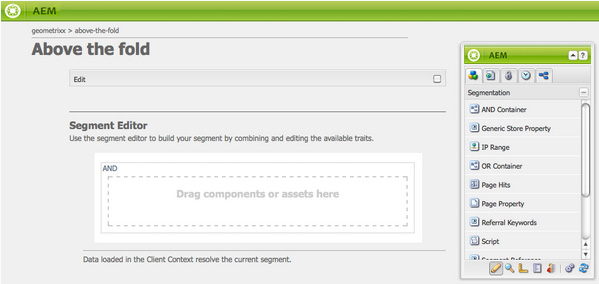
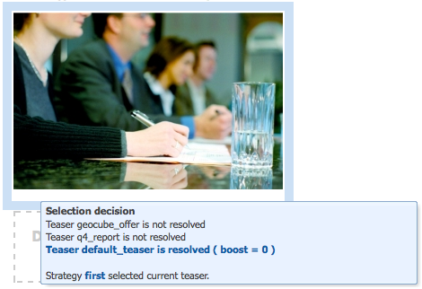

# セグメント化の設定 {#configuring-segmentation}

>[!NOTE]
>
>このドキュメントでは、ClientContext で使用するセグメント化の設定について説明します。タッチ UI で ContextHub を使用してセグメント化を設定するには、[ContextHub でのセグメント化の設定](/help/sites-administering/segmentation.md)を参照してください。

キャンペーンを作成する場合には、セグメント化を考えることが重要になります。セグメント化の仕組みと主な用語について詳しくは、[セグメント化の用語](/help/sites-authoring/segmentation-overview.md)を参照してください。

サイト訪問者についてこれまでに収集した情報と、達成する目標に応じて、ターゲットコンテンツに必要なセグメントと戦略を定義する必要があります。

このようなセグメントを使用して、訪問者に特定のターゲットコンテンツを提供します。このコンテンツは、web サイトの[キャンペーン](/help/sites-classic-ui-authoring/classic-personalization-campaigns.md)セクションで管理されます。ここで定義されたティーザーページは、任意のページでティーザー段落として追加できます。また、専用のコンテンツを適用できる訪問者セグメントを定義できます。

AEM を使用すると、セグメント、ティーザーおよびキャンペーンを簡単に作成できます。また、定義の結果を検証することもできます。

**セグメントエディター**&#x200B;を使用すると、セグメントを簡単に定義できます。

各セグメントを&#x200B;**編集**&#x200B;し、**タイトル**、**説明**&#x200B;および&#x200B;**ブースト**&#x200B;係数を指定できます。サイドキックを使用すると、**AND** コンテナおよび **OR** コンテナを追加して&#x200B;**セグメントロジック**&#x200B;を定義してから、必要な&#x200B;**セグメント特性**&#x200B;を追加して選択基準を定義できます。

## ブースト係数 {#boost-factor}

各セグメントには、重み付け係数として使用される&#x200B;**ブースト**&#x200B;パラメーターがあります。この数値が高いセグメントは、低い数値のセグメントよりも優先して選択されます。

* 最小値：`0`
* 最大値：`1000000`

## セグメントロジック {#segment-logic}

次のロジックコンテナはそのまま使用でき、選択したセグメントのロジックを構築できます。サイドキックからエディターにドラッグできます。

<table>
 <tbody>
  <tr>
   <td> AND コンテナ  </td>
   <td> AND ブール演算。  </td>
  </tr>
  <tr>
   <td> OR コンテナ  </td>
   <td> OR ブール演算値。</td>
  </tr>
 </tbody>
</table>

## セグメント特性 {#segment-traits}

以下のセグメントの特性はすぐに使用できます。また、サイドキックからエディターにドラッグできます。

<table>
 <tbody>
  <tr>
   <td> IP 範囲  </td>
   <td>訪問者に割り当てられる IP アドレスの範囲を定義します。  </td>
  </tr>
  <tr>
   <td> ページヒット  </td>
   <td>ページがリクエストされた頻度。  </td>
  </tr>
  <tr>
   <td> ページプロパティ  </td>
   <td>訪問したページのすべてのプロパティ。  </td>
  </tr>
  <tr>
   <td> リファラルキーワード  </td>
   <td>参照先の web サイトの情報と照合するキーワード。  </td>
  </tr>
  <tr>
   <td> スクリプト</td>
   <td>評価される Javascript 式。  </td>
  </tr>
  <tr>
   <td> セグメントの参照   </td>
   <td>もう一方のセグメントへの参照。  </td>
  </tr>
  <tr>
   <td> タグクラウド  </td>
   <td>訪問したページのタグと照合されるタグ。  </td>
  </tr>
  <tr>
   <td> ユーザーの年齢  </td>
   <td>ユーザープロファイルから取得される年齢。  </td>
  </tr>
  <tr>
   <td> ユーザープロパティ  </td>
   <td>ユーザープロファイルで確認できるその他すべての情報。 </td>
  </tr>
 </tbody>
</table>

OR および AND のブール演算子を使用してこれらの特徴を組み合わせ（[新しいセグメントの作成](#creating-a-new-segment)を参照）、このセグメントを選択できる確実なシナリオを定義します。

文全体が true と評価されると、このセグメントは解決されます。複数の適用可能なセグメントがある場合、**[ブースト](/help/sites-administering/campaign-segmentation.md#boost-factor)**&#x200B;係数も使用されます。

>[!CAUTION]
>
>セグメントエディターは、循環参照をチェックしません。例えば、セグメント A が別のセグメント B を参照していて、そのセグメント B がセグメント A を参照している場合などです。このため、セグメントに循環参照が存在しないことを必ず確認してください。

>[!NOTE]
>
>**_i18n** サフィックス付きのプロパティは、パーソナライズ機能の UI clientlib の一部であるスクリプトによって設定されます。UI は公開時には必要ないので、UI 関連の clientlib はすべて作成時に読み込まれます。
>
>したがって、これらのプロパティを使用してセグメントを作成するときは、通常はインスタンスで **browserFamily_i18n** ではなく、**browserFamily** を使用する必要があります。

### 新しいセグメントの作成 {#creating-a-new-segment}

新しいセグメントを定義するには、次の手順に従います。

1. パネルで、**ツール／運営／設定**&#x200B;を選択します。
1. 左側のパネルで&#x200B;**セグメント化**&#x200B;ページを開き、必要な場所に移動します。
1. **セグメント**&#x200B;テンプレートを使用して[新規ページ](/help/sites-authoring/editing-content.md#creatinganewpage)を作成します。
1. 新規ページを開くとセグメントエディターが表示されます。

   

1. サイドキックまたはコンテキストメニュー（通常、マウスを右クリックして「**新規...**」を選択すると、新規コンポーネントを挿入ウィンドウが表示される）を使用して、必要なセグメント特性を見つけます。それをデフォルトの **AND** コンテナに表示される&#x200B;**セグメントエディター**&#x200B;にドラッグします。
1. 新規の特性をダブルクリックして、例えばマウスの位置など、特定のパラメーターを編集します。

   

1. 「**OK**」をクリックして定義を保存します。
1. セグメント設定を&#x200B;**編集**&#x200B;し、**タイトル**、**説明**&#x200B;および&#x200B;**[ブースト](#boost-factor)**&#x200B;係数を追加することができます。

   

1. 必要に応じて特性を追加します。**セグメントロジック**&#x200B;にある「**AND コンテナ**」および「**OR コンテナ**」のコンポーネントを使用してブール式を作成することができます。セグメントエディターでは、不要になった特性やコンテナを削除したり、コンポーネントをステートメント内の別の場所へドラッグしたりすることができます。

### AND コンテナと OR コンテナの使用 {#using-and-and-or-containers}

AEM で複雑なセグメントを作成できます。次の基本事項に留意してください。

* 定義の最上位レベルは必ず、最初に作成された AND コンテナになります。これは変更できませんが、他のセグメント定義には影響しません。
* コンテナのネストが意味のあるものになっていることを確認してください。コンテナは、ブール式の括弧として見ることができます。

次の例は以下のいずれかの訪問者を選択するために使用されます。

16 才～ 65 才の男性

または

16 才～ 62 才の女性

主要演算子に OR を使用するため、「**OR コンテナ**」で開始する必要があります。この中に 2 つの AND ステートメントを挿入し、個別の特性を追加できる「**AND コンテナ**」がそれぞれに必要になります。

## セグメントの適用のテスト {#testing-the-application-of-a-segment}

セグメントを定義したら、**[クライアントコンテキスト](/help/sites-administering/client-context.md)**&#x200B;を使用して、考えられる結果についてテストすることができます。

1. テストするセグメントを選択します。
1. **[Ctrl+Alt+C](/help/sites-authoring/page-authoring.md#keyboardshortcuts)** キーを押して、**[クライアントコンテキスト](/help/sites-administering/client-context.md)**&#x200B;を開くと、収集されたデータが表示されます。テストを行う場合は、特定の値を&#x200B;**編集**&#x200B;するか別のプロファイルを&#x200B;**読み込んで**、その場で結果を確認できます。

1. 定義した特性に応じて、現在のページで利用可能なデータはセグメント定義と一致する場合も一致しない場合もあります。一致のステータスは定義の下に表示されます。

例えば、単純なセグメントはユーザーの年齢と性別に基づいて定義できます。特定のプロファイルを読み込むと、セグメントが正常に解決された場合は次のように表示されます。

失敗した場合は次のように表示されます。

>[!NOTE]
>
>すべての特性がただちに解決されます。ただし、ほとんどの特性はページを再読み込みしたときにのみ変更されます。マウス位置の変更はすぐに表示されるため、テストの際に便利です。

このようなテストは、**ティーザー**&#x200B;コンポーネントと組み合わせて、コンテンツページでも実行できます。

ティーザー段落にポインターを合わせると、適用されたセグメント、セグメントが解決されたかどうか、その結果として現在のティーザーインスタンスが選択された理由が表示されます。

### セグメントの使用 {#using-your-segment}

セグメントは現在[キャンペーン](/help/sites-classic-ui-authoring/classic-personalization-campaigns.md)で使用されています。これらのセグメントを使用すると、特定ターゲットのオーディエンスに向けられた実際のコンテンツを制御することができます。詳しくは、[セグメントについて](/help/sites-authoring/segmentation-overview.md)を参照してください。
