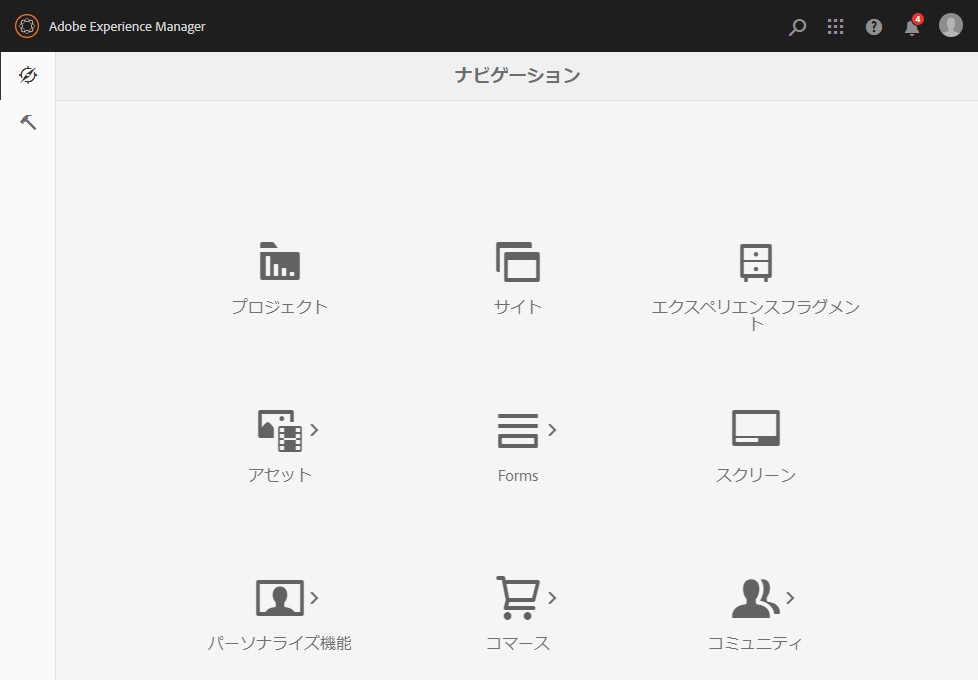

# Admin Console{#admin-consoles}

Admin Console からクラシック UI に切り替える機能は、デフォルトで無効になっています。 そのため、特定のコンソールアイコンにマウスを移動したときに表示され、クラシック UI にアクセスするためのポップアップアイコンは表示されなくなりました。

`/libs/cq/core/content/nav` にクラシック UI バージョンがあるすべてのコンソールは個別に再有効化することができ、コンソールアイコンの上にマウスを移動すると、「**クラシック UI**」オプションが再びポップアップ表示されます。

以下の例では、Sites コンソールのクラシック UI を再有効化しています。

1. CRXDE Lite を使用して、クラシック UI を再有効化する Admin Console に対応するノードを見つけます。 目的のノードは次の場所にあります。

   `/libs/cq/core/content/nav`

   例：

   [`https://localhost:4502/crx/de/index.jsp#/libs/cq/core/content/nav`](https://localhost:4502/crx/de/index.jsp#/libs/cq/core/content/nav)

1. クラシック UI を再有効化するコンソールのノードを選択します。 以下の例では、Sites コンソールのクラシック UI を再有効化しています。

   `/libs/cq/core/content/nav/sites`

1. 「**オーバーレイノード**」オプションを使用してオーバーレイを作成します。次に例を示します。

   * **パス**: `/apps/cq/core/content/nav/sites`
   * **オーバーレイの場所**: `/apps/`
   * **ノードタイプを一致させる**：アクティブ（チェックボックスをオン）

1. オーバーレイノードに次のブールプロパティを追加します。

   `enableDesktopOnly = {Boolean}true`

1. 「**クラシック UI**」オプションが、Admin Console に再びポップアップされるようになります。

   

クラシック UI バージョンへのアクセスを再有効化する各コンソールに対して、これらの手順を繰り返します。
