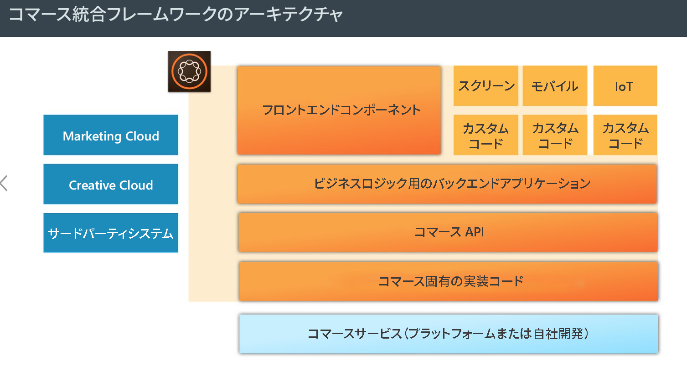
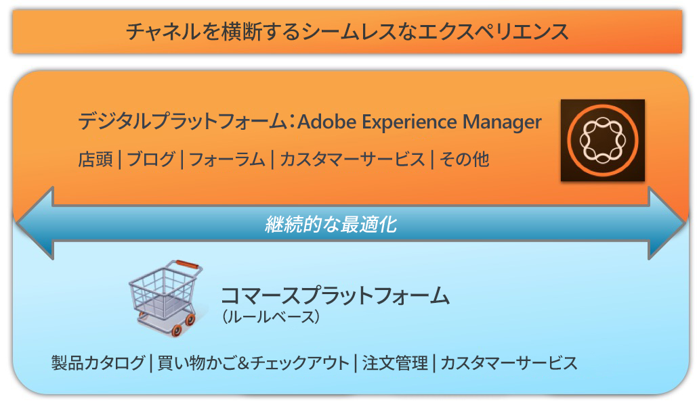

# AEM Commerce - GDPR 対応{#aem-commerce-gdpr-readiness}

>[!IMPORTANT]
>
>以下のセクションでは GDPR を例として使用していますが、詳細はすべてのデータ保護およびプライバシー規制（GDPR、CCPA など）に当てはまります。

データのプライバシー権に関する EU 一般データ保護規則（GDPR）が 2018年5月に発効します。 [アドビプライバシーセンターの GDPR ページ](https://business.adobe.com/privacy/general-data-protection-regulation.html?lang=ja)を参照してください。

>[!NOTE]
>
>詳しくは、[AEM の GDPR 対応](/help/managing/data-protection-and-privacy.md)を参照してください。

アドビのデフォルトのコマース統合では AEM がエクスペリエンスレイヤーとなり、サービスを利用して得られたデータをヘッドレスモードで動作する顧客のコマースプラットフォームに送り返します。

一部のコマースプラットフォームでは、プロファイル情報（`/home/users`）と（コマースプラットフォームにログインするための）コマーストークンが AEM 内に格納されます。 これらのユースケースについては、[AEM プラットフォームでの GDPR 要求への対応](/help/sites-administering/handling-gdpr-requests-for-aem-platform.md)をお読みください。

## AEM Commerce での GDPR 要求の処理 {#handling-gdpr-requests-for-aem-commerce}

Salesforces Commerce Cloud 統合の場合、AEM Commerce には GDPR 関連の情報は一切格納されません。 [Salesforce Cloud](https://documentation.b2c.commercecloud.salesforce.com/DOC1/index.jsp) にリクエストを転送してください。

hybris および HCL WebSphere® Commerce 統合の場合、AEM 内に若干のデータが存在します。 [AEM Platform の GDPR 手順](/help/sites-administering/handling-gdpr-requests-for-aem-platform.md)に従い、以下の質問について考察してください。

1. **自分のデータはどこに保存または使用されていますか？** AEMから表示される、名前、コマースユーザーID、トークン、パスワード、アドレスデータなどのキャッシュされたユーザープロファイル情報。
1. **対象となるGDPR データを誰と共有しますか？** AEM Commerce内のGDPR関連データは、更新されても（前述の関連プロファイル情報を除く）保存されることはありませんが、コマースプラットフォームにプロキシされて戻されます。
1. **ユーザーデータの削除方法は？** AEM でユーザープロファイルを削除し、コマースプラットフォームでユーザーの削除を呼び出してください。

>[!NOTE]
>
>[hybris の wiki](https://wiki.hybris.com/) または [HCL WebSphere® Commerce のドキュメント](https://help.hcltechsw.com/commerce/index.html)を必要に応じて参照してください。
