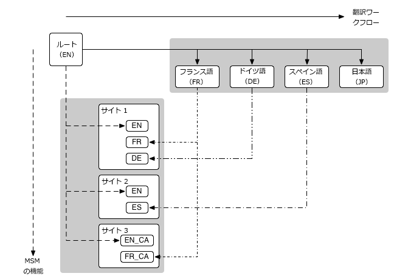

# マルチサイトマネージャーと翻訳 {#msm-and-translation}

Web サイトとページを管理するための以下の管理ツールが用意されています。

* マルチサイトマネージャー（MSM）を使用すると、同じサイトコンテンツを複数の場所で使用できるだけでなく、場所によってバリエーションを持たせることができます。

  * [コンテンツの再利用：マルチサイトマネージャーとライブコピー](/help/sites-administering/msm.md)

* 翻訳を使用すると、ページコンテンツ、アセットおよびユーザー生成コンテンツの翻訳を自動化して、多言語の web サイトを作成および管理できます。

  * [多言語サイトのコンテンツの翻訳](/help/sites-administering/translation.md)

* これらの 2 つの機能を組み合わせることで、web サイトを[多国籍化かつ多言語化](#multinational-and-multilingual-sites)することができます。

## 多国籍な多言語サイト {#multinational-and-multilingual-sites}

マルチサイトマネージャーと翻訳ワークフローを併せて使用することで、多国籍な多言語サイトのコンテンツを効率的に作成できます。 特定の国向けのメインサイトを 1 言語で作成し、そのコンテンツをベースに、必要に応じて翻訳を使用して、他のサイトを作成します。

* マスターサイトを別の言語に[翻訳](/help/sites-administering/translation.md)します。

* [マルチサイトマネージャ](/help/sites-administering/msm.md)を次の用途で使用します。

  * メインサイトのコンテンツと翻訳を再利用して、他の国や文化のサイトを作成します。
  * マルチサイトマネージャーの使用は、1 言語のコンテンツに限定してください（英語のメインは英語圏の各国サイト、フランス語のメインはフランス語圏の各国サイトなど）。
  * 必要に応じて、ライブコピーの要素を分離してローカライゼーションの詳細を追加します。

次の図に、主な概念がどのように関連するかを示します（関連するすべてのレベルと要素を網羅しているわけではありません）。

>[!NOTE]
>
>このようなシナリオでは、MSM は異なる言語バージョンを管理することはありません。
>
>* [MSM](/help/sites-administering/msm.md) は言語の境界内で、ブループリント（グローバルメインなど）からライブコピー（ローカルサイトなど）への翻訳コンテンツのデプロイメントを管理します。
>* AEM の[翻訳](/help/sites-administering/translation.md)統合機能は、サードパーティの翻訳管理サービスと連係して、各言語およびそれらの言語へのコンテンツの翻訳を管理します。
>
>より高度な使用事例の場合は、MSM を複数の言語メインにまたがって使用することもできます。

>[!NOTE]
>
>いずれの使用例の場合も、次のベストプラクティスをお読みになることをお勧めします。
>
>* [MSM のベストプラクティス](/help/sites-administering/msm-best-practices.md)（特に次の事項）：
>
>   * [サイトの作成](/help/sites-administering/msm-best-practices.md#create-site)
>   * [MSM と多言語の Web サイト](/help/sites-administering/msm-best-practices.md#msm-and-multilingual-websites)
>
>* [翻訳のベストプラクティス](/help/sites-administering/tc-bp.md)
