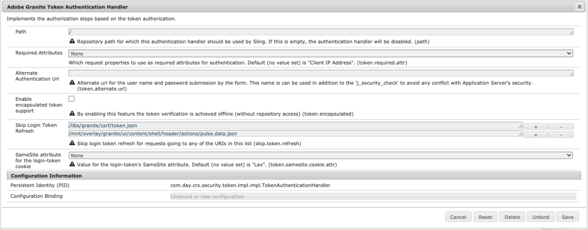

# AEM 6.5 の同一サイト cookie サポート {#same-site-cookie-support-for-aem-65}

バージョン 80 以降、Chrome および以降の Safari では、cookie セキュリティの新しいモデルが導入されました。 このモードは、`SameSite` と呼ばれる設定を通じて、cookie の利用に関するセキュリティ制御をサードパーティサイトに導入するように設計されています。 詳しくは、こちらの[web.dev - SameSite cookie の説明](https://web.dev/samesite-cookies-explained/)の記事を参照してください。

この設定のデフォルト値（`SameSite=Lax`）により、AEM インスタンスまたはサービス間の認証が機能しないことがあります。 これは、これらのサービスのドメインや URL 構造が、この cookie ポリシーの制約に該当しない可能性があるためです。

これを回避するには、ログイントークンの `SameSite` cookie 属性を `None` に設定する必要があります。

>[!CAUTION]
>
>`SameSite=None` の設定は、セキュアプロトコル（HTTPS）の場合にのみ適用されます。
>
>セキュアプロトコルでない（HTTP）場合、この設定は無視され、サーバーは次の WARN メッセージを表示します。
>
>`WARN com.day.crx.security.token.TokenCookie Skip 'SameSite=None'`

次の手順に従って、設定を追加できます。

1. Web コンソール（`http://serveraddress:serverport/system/console/configMgr`）にアクセスします。
1. **Adobe Granite Token Authentication Handler** を検索してクリックします。
1. 次の図に示すように、**login-token cookie の SameSite 属性**&#x200B;を `None` に設定します。
   
1. 「保存」をクリックします。
1. この設定が更新され、ユーザーがログアウトしてから再度ログインすると、`login-token` cookie に `None` 属性が設定され、クロスサイトリクエストに含められるようになります。
