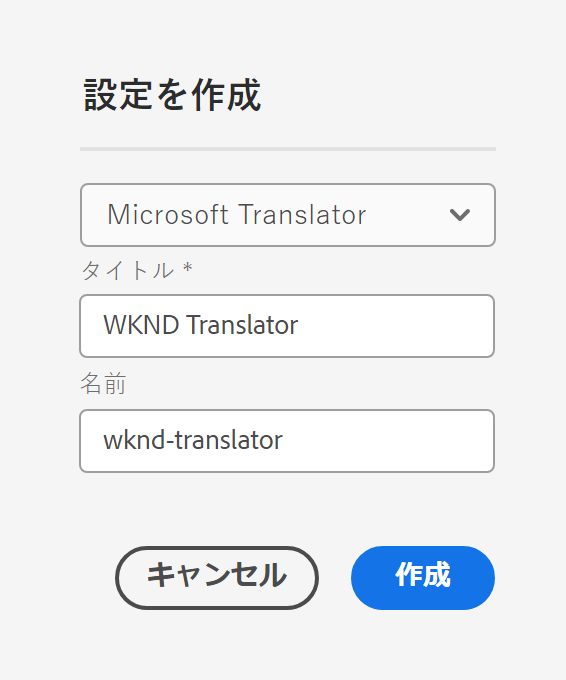
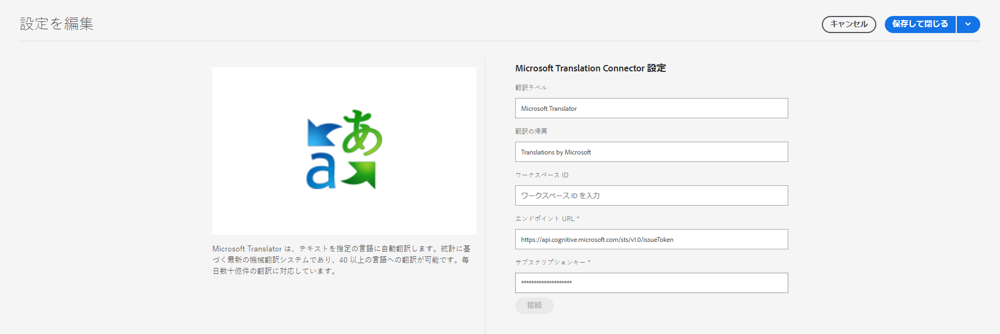

# Microsoft Translator への接続 {#connecting-to-microsoft-translator}

AEM には、ページのコンテンツまたはアセットを翻訳する [Microsoft Translator](https://www.microsoft.com/ja-jp/translator/business/) のビルトインのコネクタが用意されています。 Microsoft Translator を使用するためのライセンスを Microsoft から取得したら、このページの手順に従ってコネクタを設定してください。

| プロパティ | 説明 |
|---|---|
| 翻訳ラベル | 翻訳サービスの表示名 |
| 翻訳の帰属 | （オプション）ユーザー生成コンテンツの場合に、翻訳済みのテキストの横に表示される帰属情報（例：`Translations by Microsoft`） |
| ワークスペース ID | （オプション）使用するカスタム Microsoft Translator エンジンの ID |
| サブスクリプションキー | Microsoft Translator の Microsoft サブスクリプションキー |

Microsoft Translator 設定を作成するには、次の手順に従います。

1. [ナビゲーションパネル](/help/sites-authoring/basic-handling.md#first-steps)で、**ツール**／**クラウドサービス**／**翻訳クラウドサービス**&#x200B;をクリックします。
1. 設定を作成する場所に移動します。 通常は、これはサイトのルートにあります。また、グローバルなデフォルト設定にすることもできます。
1. 「**作成**」ボタンをクリックします。
1. 設定を定義します。
   1. ドロップダウンで **Microsoft Translator** を選択します。
   1. 設定のタイトルを入力します。 このタイトルによって、クラウドサービスコンソールおよびページプロパティのドロップダウンリストで設定が識別されます。
   1. オプションとして、設定を格納するリポジトリーノードに使用する名前を入力します。

   

1. 「**作成**」をクリックします。
1. **設定を編集**&#x200B;ウィンドウで、前述の表で説明した翻訳サービスの値を指定します。

   

1. 「**接続**」をクリックして接続を確認します。
1. 「**保存して閉じる**」をクリックします。

## Translator サービス設定の公開 {#publishing-the-translator-service-configurations}

最後の手順として、公開された翻訳済みコンテンツをサポートするために、[ツリーの公開](/help/sites-authoring/publishing-pages.md#publishing-and-unpublishing-a-tree)アクションを使用して Microsoft Translator 設定を公開してください。
