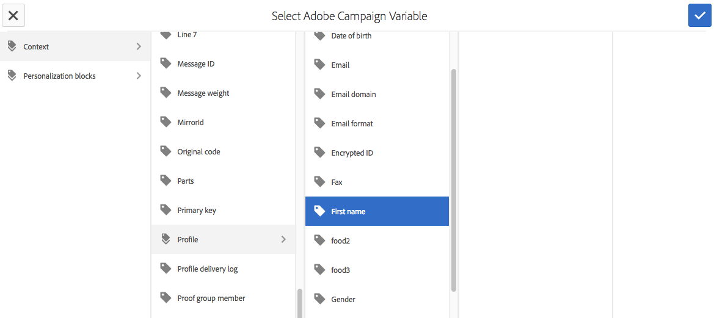
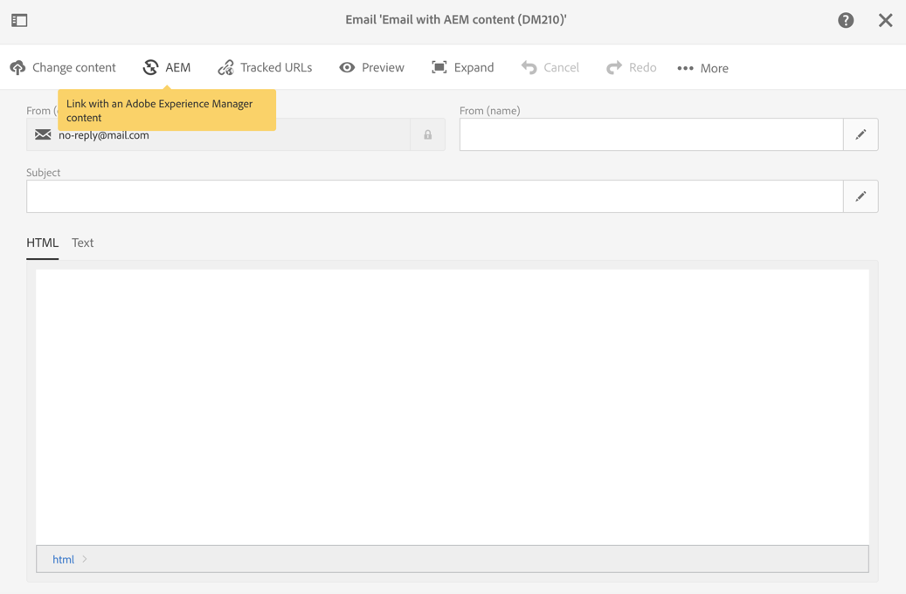

# Adobe Campaign Classic および Adobe Campaign Standard の使用{#working-with-adobe-campaign-classic-and-adobe-campaign-standard}

AEM でメールコンテンツを作成して、Adobe Campaign のメールで処理することができます。これを実行するには、次の手順に従う必要があります。

1. AEM で、Adobe Campaign 固有のテンプレートからニュースレターを作成します。
1. すべての機能にアクセスするには、コンテンツを編集する前に [Adobe Campaign サービス](#selecting-the-adobe-campaign-cloud-service-and-template)を選択します。
1. コンテンツを編集します。
1. コンテンツを検証します。

これで、コンテンツを Adobe Campaign での配信と同期できるようになります。詳細な手順については、このドキュメントを参照してください。

[AEM での Adobe Campaign フォームの作成](/help/sites-authoring/adobe-campaign-forms.md)も参照してください。

>[!NOTE]
>
>この機能を使用するには、AEM を [Adobe Campaign](/help/sites-administering/campaignonpremise.md) または [Adobe Campaign Standard](/help/sites-administering/campaignstandard.md) と連携するように設定する必要があります。

## Adobe Campaign を使用したメールコンテンツの送信 {#sending-email-content-via-adobe-campaign}

AEM と Adobe Campaign を設定すると、メール配信コンテンツを AEM 内で直接作成し、作成したコンテンツを Adobe Campaign 内で処理できます。

Adobe Campaign のコンテンツを AEM 内で作成する場合は、すべての機能にアクセスするために、コンテンツを編集する前に Adobe Campaign サービスにリンクする必要があります。

次の 2 つの場合が考えられます。

* コンテンツを Adobe Campaign からの配信と同期する場合。この場合は、AEM コンテンツを配信に使用できます。
* （Adobe Campaign Classic のみ）コンテンツを Adobe Campaign に直接送信する場合。この場合は、Adobe Campaign が新しいメール配信を自動的に生成します。このモードには制限があります。

詳細な手順については、このドキュメントを参照してください。

### 新しいメールコンテンツの作成 {#creating-new-email-content}

>[!NOTE]
>
>メールテンプレートを追加する場合は、テンプレートを使用可能にするために、必ず **/content/campaigns** の下に追加してください。

#### 新しいメールコンテンツの作成 {#creating-new-email-content-1}

1. AEM で、**サイト**／**キャンペーン**&#x200B;を選択し、メールキャンペーンを管理する場所を参照します。次の例では、パスは&#x200B;**サイト**／**Campaigns**／**Geometrixx Outdoors**／**メールキャンペーン** です。

   >[!NOTE]
   >
   >[メールのサンプルは、Geometrixx でのみ使用できます](/help/sites-developing/we-retail.md)。Geometrixx のサンプルコンテンツをパッケージ共有からダウンロードしてください。

   

1. **作成**／**ページを作成**&#x200B;の順に選択します。
1. 接続している Adobe Campaign に固有の使用可能なテンプレートのいずれかを選択して、「**次へ**」をクリックします。デフォルトでは、次の 3 つのテンプレートが使用可能です。

   * **Adobe Campaign Classic メール**：コンテンツを事前定義済みのテンプレート（2 列）に追加してから、配信のために Adobe Campaign Classic に送信できます。
   * **Adobe Campaign Standard メール**：コンテンツを事前定義済みのテンプレート（2 列）に追加してから、配信のために Adobe Campaign Standard に送信できます。

1. 「**タイトル**」に入力し、オプションで「**説明**」に入力して、「**作成**」をクリックします。メールの編集中に上書きしない限り、タイトルはニュースレターまたはメールの件名として使用されます。

### Adobe Campaign Cloud Service およびテンプレートの選択 {#selecting-the-adobe-campaign-cloud-service-and-template}

Adobe Campaign と統合するには、Adobe Campaign Cloud Service をページに追加する必要があります。これにより、パーソナライズ機能や他の Adobe Campaign 情報にアクセスできるようになります。

さらに、Adobe Campaign テンプレートを選択し、件名を変更したり、HTML 表示を使用しない受信者向けにプレーンテキストのコンテンツを追加したりする必要がある場合もあります。

Cloud Service は、「**サイト**」タブから選択することも、メール／ニュースレターの作成後にその中から選択することもできます。

「**サイト**」タブから Cloud Service を選択することを推奨します。メールまたはニュースレターから Cloud Service を選択するには、回避策が必要になります。

**Sites** ページから：

1. AEM でメールページを選択し、「**プロパティを表示**」をクリックします。

   

1. 「**編集**」、「**クラウドサービス**」タブの順に選択し、下までスクロールダウンして「+」記号をクリックし、設定を追加してから、「**Adobe Campaign**」を選択します。

   

1. 使用している Adobe Campaign インスタンスに一致する設定をドロップダウンリストから選択し、「**保存**」をクリックして確認します。
1. 「**Adobe Campaign**」タブをクリックすると、メールに適用されるテンプレートを表示できます。別のテンプレートを選択したい場合は、編集時にメール内からテンプレートにアクセスできます。

   デフォルトのメールテンプレート以外の（Adobe Campaign の）特定のメール配信テンプレートを適用したい場合は、「**プロパティ**」で「**Adobe Campaign**」タブを選択します。関連する Adobe Campaign インスタンス内でのメール配信テンプレートの内部名を入力します。

   選択するテンプレートによって、Adobe Campaign から利用できるパーソナライゼーションフィールドが決まります。

   

オーサリング時のニュースレター／メール内から選択する場合は、レイアウト上の問題によって、「**ページのプロパティ**」で Adobe Campaign クラウドサービス設定を選択できないことがあります。その場合は、以下に説明する回避策を使用できます。

1. AEM でメールページを選択し、「**編集**」をクリックします。「**プロパティを開く**」をクリックします。

   

1. 「**クラウドサービス**」を選択し、「**+**」をクリックして設定を追加します。表示される任意の設定を選択します（どれでもかまいません）。「**+**」記号をクリックして、別の設定を追加してから、「**Adobe Campaign**」を選択します。

   >[!NOTE]
   >
   >または、「**サイト**」タブで「**プロパティを表示**」を選択して、クラウドサービスを選択することができます。

1. 使用している Adobe Campaign インスタンスに一致する設定をドロップダウンリストから選択し、最初に作成した、Adobe Campaign 用ではない設定を削除してから、チェックマークをクリックして確認します。
1. 前述の手順のステップ 4 を続行して、テンプレートを選択し、プレーンテキストを追加します。

### メールコンテンツの編集 {#editing-email-content}

メールコンテンツを編集するには：

1. メールを開くと、デフォルトで編集モードに入ります。

   

1. メールの件名を変更したい場合や、HTML 表示を使用しない受信者用のプレーンテキストを追加したい場合は、「**メール**」を選択し、件名とテキストを追加します。ページアイコンを選択すると、プレーンテキストのバージョンが HTML から自動生成されます。終了したら、チェックマークをクリックします。

   Adobe Campaign のパーソナライゼーションフィールドを使用して、ニュースレターをパーソナライズできます。パーソナライゼーションフィールドを追加するには、Adobe Campaign のロゴが表示されているボタンをクリックして、パーソナライゼーションフィールドピッカーを開きます。このニュースレターで使用可能なフィールドがすべて表示され、その中から選択することができます。

   >[!NOTE]
   >
   >エディター内でプロパティのパーソナライゼーションフィールドがグレー表示になっている場合は、設定を見直します。

   

1. 画面左側のコンポーネントパネルを開き、ドロップダウンメニューから「**Adobe Campaign ニュースレター**」を選択して、以下のコンポーネントを探します。

   

1. コンポーネントをページ上に直接ドラッグし、コンポーネントに応じて編集します。例えば、**テキストおよびパーソナライゼーション（キャンペーン）**&#x200B;コンポーネントをドラッグして、パーソナライズしたテキストを追加することができます。

   

   各コンポーネントの詳細については、[Adobe Campaign コンポーネント](/help/sites-authoring/adobe-campaign-components.md)を参照してください。

   

### パーソナライゼーションの挿入 {#inserting-personalization}

コンテンツを編集する際に、以下を挿入できます。

* Adobe Campaign コンテキストフィールド。受信者のデータ（名、姓、ターゲットディメンションのデータなど）に応じて変化する値をテキスト内に挿入するフィールドです。
* Adobe Campaign パーソナライゼーションブロック。ブランドのロゴやミラーページへのリンクなど、受信者のデータに関係なく表示される、事前定義されたコンテンツのブロックです。

Campaign コンポーネントについて詳しくは、[Adobe Campaign コンポーネント](/help/sites-authoring/adobe-campaign-components.md)を参照してください。

>[!NOTE]
>
>* Adobe Campaign の「**プロファイル**」ターゲティングディメンションのフィールドのみが考慮されます。
>* プロパティを「**サイト**」から表示すると、Adobe Campaign コンテキストフィールドにアクセスできません。これらのフィールドには、編集時にメール内から直接アクセスできます。

パーソナライゼーションを挿入する方法：

1. 新しい&#x200B;**ニュースレター**／**テキストおよびパーソナライゼーション （Campaign）**&#x200B;コンポーネントをページ上にドラッグして挿入します。

   

1. 鉛筆アイコンをクリックして、コンポーネントを開きます。インプレースエディターが開きます。

   

   >[!NOTE]
   >
   >**Adobe Campaign Standard の場合：**
   >
   >* 使用可能なコンテキストフィールドは、Adobe Campaign の「**プロファイル**」ターゲティングディメンションに対応しています。
   >* [Adobe Campaign メールへの AEM ページのリンク](#linking-an-aem-page-to-an-adobe-campaign-email-adobe-campaign-standard)を参照してください。
   >
   >**Adobe Campaign Classic の場合：**
   >
   >* 使用可能なコンテキストフィールドは、Adobe Campaign **nms:seedMember** スキーマから動的に復元されます。 ターゲット拡張データは、コンテンツと同期される配信を含むワークフローから動的に復元されます。（[AEM で作成されたコンテンツと Adobe Campaign の配信の同期](#synchronizing-content-created-in-aem-with-a-delivery-from-adobe-campaign-classic)の節を参照してください）。
   >
   >* パーソナライゼーション要素を追加または非表示にするには、[パーソナライゼーションフィールドおよびブロックの管理](/help/sites-administering/campaignonpremise.md#managing-personalization-fields-and-blocks)を参照してください。
   >* **重要**：シードテーブルのフィールドはすべて、受信者テーブル（または対応する連絡先テーブル）にも存在する必要があります。

1. テキストを入力して挿入します。Adobe Campaign コンポーネントをクリックして選択し、コンテキストフィールドまたはパーソナライゼーションブロックを挿入します。完了したら、チェックマークを選択します。

   

   コンテキストフィールドまたはパーソナライゼーションブロックを挿入したら、ニュースレターをプレビューして、フィールドをテストできます。[ニュースレターのプレビュー](#previewing-a-newsletter)を参照してください。

### ニュースレターのプレビュー {#previewing-a-newsletter}

ニュースレターがどのように表示されるかをプレビューでき、パーソナライゼーションをプレビューできます。

1. ニュースレターを開いた状態で、AEM の右上隅の「**プレビュー**」をクリックします。ユーザーが受信したときにニュースレターがどのように見えるかが表示されます。

   

   >[!NOTE]
   >
   >Adobe Campaign Standard でサンプルテンプレートを使用している場合は、配信時にコンテンツを読み込むと、初期コンテンツを表示する 2 つのパーソナライゼーションブロック（**&quot;&lt;%@ include view=&quot;MirrorPage&quot; %>&quot;** および **&quot;&lt;%@ include view=&quot;UnsubscriptionLink&quot; %>&quot;**）がエラーをスローします。パーソナライゼーションブロックピッカーを使用して対応するブロックを選択すると、このエラーを解決できます。

1. パーソナライゼーションをプレビューするには、ツールバーの対応するアイコンをクリックまたはタップして ContextHub を開きます。パーソナライゼーションフィールドのタグが、選択したペルソナのシードデータで置き換えられます。ContextHub でペルソナを切り替えると変数がどのように変化するかを確認してください。

   

1. 現在選択しているペルソナに関連付けられた、Adobe Campaign のシードデータを表示できます。表示するには、ContextHub バーの Adobe Campaign モジュールをクリックします。ダイアログボックスが開き、現在のプロファイルのシードデータがすべて表示されます。再度別のペルソナに切り替えると、データが変化します。

   

### AEM でのコンテンツの承認 {#approving-content-in-aem}

コンテンツの作成が完了したら、承認プロセスを開始できます。ツールボックスの「**ワークフロー**」タブに移動して、「**Adobe Campaign 用に承認**」ワークフローを選択します。

この標準のワークフローには、改訂して承認または改訂して拒否という 2 つのステップがあります。ただし、このワークフローは拡張して、より複雑なプロセスに適合させることができます。

Adobe Campaign 用にコンテンツを承認するには、「**ワークフロー**」を選択し、「**Adobe Campaign 用に承認**」を選択することでワークフローを適用し、「**ワークフローを開始**」をクリックします。ステップを実行して、コンテンツを承認します。ワークフローの最後のステップで、「**承認**」の代わりに「**拒否**」を選択して、コンテンツを拒否することもできます。

コンテンツが承認されると、承認済みとして Adobe Campaign に表示されます。これで、メールを送信できるようになります。

Adobe Campaign Standard の場合：

Adobe Campaign Classic の場合：

>[!NOTE]
>
>未承認のコンテンツは、Adobe Campaign の配信と同期できますが、配信を実行することはできません。Adobe Campaign の配信を使用して送信できるのは、承認済みのコンテンツだけです。

## AEM と Adobe Campaign Standard および Adobe Campaign Classic のリンク {#linking-aem-with-adobe-campaign-standard-and-adobe-campaign-classic}

AEM と Adobe Campaign をリンクまたは同期する方法は、サブスクリプションベースの Adobe Campaign Standard とオンプレミスベースの Adobe Campaign Classic のどちらを使用しているかによって異なります。

使用している Adobe Campaign ソリューションに応じた手順は、以下の節を参照してください。

* [Adobe Campaign メールへの AEM ページのリンク（Adobe Campaign Standard）](#linking-an-aem-page-to-an-adobe-campaign-email-adobe-campaign-standard)
* [AEM で作成されたコンテンツと Adobe Campaign Classic の配信の同期](#synchronizing-content-created-in-aem-with-a-delivery-from-adobe-campaign-classic)

### AEM ページから Adobe Campaign メールへのリンク（Adobe Campaign Standard） {#linking-an-aem-page-to-an-adobe-campaign-email-adobe-campaign-standard}

Adobe Campaign Standard では、以下を使用して AEM で作成されたコンテンツを復元し、リンクできます。

* メール。
* メールテンプレート。

これで、コンテンツを配信できるようになります。ページ上に表示されるコードによって、ニュースレターが単一の配信にリンクされているかどうかを確認できます。

>[!NOTE]
>
>ニュースレターが複数の配信にリンクされている場合は、リンクされている配信の数が表示されます（ただし、すべての ID が表示されるわけではありません）。

AEM で作成されたページと Adobe Campaign のメールをリンクするには：

1. AEM 固有のメールテンプレートをベースにメールを作成します。詳しくは、[Adobe Campaign Standard でのメールの作成](https://helpx.adobe.com/jp/campaign/standard/channels/using/creating-an-email.html)を参照してください。

   

1. 配信ダッシュボードから&#x200B;**コンテンツ**&#x200B;ブロックを開きます。

   

1. ツールバーで「**Adobe Experience Manager コンテンツとリンク**」を選択し、AEM で使用可能なコンテンツのリストにアクセスします。

   >[!NOTE]
   >
   >アクションバーに「**Adobe Experience Manager コンテンツとリンク**」オプションが表示されない場合は、メールのプロパティで「**コンテンツ編集モード**」が「**Adobe Experience Manager**」に正しく設定されていることを確認してください。

   

1. メールで使用したいコンテンツを選択します。

   このリストでは、以下を指定します。

   * AEM でのコンテンツのラベル。
   * AEM でのコンテンツの承認ステータス。コンテンツが承認されていない場合、コンテンツを同期することはできますが、承認が完了するまで配信を送信することはできません。ただし、プルーフの送信やプレビューテストなど、特定の操作は実行できます。
   * コンテンツの最終変更日。
   * 既に配信にリンクされているすべてのコンテンツ。

   >[!NOTE]
   >
   >デフォルトでは、既に配信と同期されているコンテンツは表示されません。ただし、表示して使用することはできます。例えば、コンテンツを複数の配信のテンプレートとして使用する場合などです。

   メールを AEM コンテンツにリンクすると、そのコンテンツを Adobe Campaign で編集することはできなくなります。

1. メールのその他のパラメーター（オーディエンス、実行スケジュールなど）をダッシュボードから指定します。
1. メールの配信を実行します。配信の分析時に、最新バージョンの AEM コンテンツが取得されます。

   >[!NOTE]
   >
   >コンテンツがメールにリンクされている間に AEM で更新されると、分析時に Adobe Campaign で自動的に更新されます。コンテンツアクションバーの「**Adobe Experience Manager コンテンツを更新**」を使用して、同期を手動で実行することもできます。
   >
   >コンテンツアクションバーの **Adobe Experience Manager コンテンツとのリンクを削除**&#x200B;を使用して、メールと AEM コンテンツのリンクをキャンセルできます。このボタンは、コンテンツが既に配信とリンクされている場合にのみ表示されます。別のコンテンツを配信とリンクするには、新しいリンクを確立する前に現在のコンテンツリンクを削除する必要があります。
   >
   >リンクを削除してもローカルコンテンツは保持され、Adobe Campaign で編集できるようになります。コンテンツを変更した後に再度リンクすると、すべての変更が失われます。

### AEM で作成されたコンテンツと Adobe Campaign Classic の配信の同期 {#synchronizing-content-created-in-aem-with-a-delivery-from-adobe-campaign-classic}

Adobe Campaign では、以下を使用して AEM で作成されたコンテンツを復元し、同期できます。

* キャンペーン配信
* キャンペーンワークフローの配信アクティビティ
* 定期的配信
* 連続配信
* メッセージセンター配信
* 配信テンプレート

AEM では、ニュースレターが単一の配信にリンクされている場合は、配信コードがページ上に表示されます。

>[!NOTE]
>
>ニュースレターが複数の配信にリンクされている場合は、リンクされている配信の数が表示されます（すべての ID が表示されるわけではありません）。
>
>[!NOTE]
>
>ワークフロース手順「**Adobe Campaign に公開**」は、AEM 6.1 で廃止されます。この手順は、Adobe Campaign と AEM 6.0 の統合の一部でしたが、必要ではなくなりました。

AEM で作成されたコンテンツと Adobe Campaign の配信を同期するには、次の手順に従います。

1. 「**AEM コンテンツでメール配信（mailAEMContent）**」配信テンプレートを選択して、配信を作成または配信アクティビティをキャンペーンワークフローに追加します。

   

1. ツールバーで「**同期**」を選択して、AEM で使用可能なコンテンツのリストにアクセスします。

   >[!NOTE]
   >
   >「**同期**」オプションが配信のツールバーに表示されない場合は、**プロパティ**／**詳細**&#x200B;を選択して、**AEM** で「**コンテンツ編集モード**」フィールドが正しく設定されていることを確認してください。

   

1. 配信と同期させたいコンテンツを選択します。

   このリストでは、以下を指定します。

   * AEM でのコンテンツのラベル。
   * AEM でのコンテンツの承認ステータス。コンテンツが承認されていない場合、コンテンツを同期することはできますが、承認が完了するまで配信を送信することはできません。ただし、BAT の送信やプレビューテストなど、特定の操作は実行できます。
   * コンテンツの最終変更日。
   * 既に配信にリンクされているすべてのコンテンツ。

   >[!NOTE]
   >
   >デフォルトでは、既に配信と同期されているコンテンツは表示されません。ただし、表示して使用することはできます。例えば、コンテンツを複数の配信のテンプレートとして使用する場合などです。

   

1. 配信のその他のパラメーター（ターゲットなど）を指定します。
1. 必要に応じて、Adobe Campaign で配信承認プロセスを開始します。Adobe Campaign で設定された承認（予算、ターゲットなど）に加え、AEM でのコンテンツの承認が必要です。Adobe Campaign でのコンテンツの承認は、コンテンツが AEM で既に承認されている場合にのみ可能です。
1. 配信を実行します。配信の分析時に、最新バージョンの AEM コンテンツが復元されます。

   >[!NOTE]
   >
   >* 配信とコンテンツが同期されると、Adobe Campaign の配信コンテンツは読み取り専用になります。コンテンツだけでなく、メールの件名も変更できなくなります。
   >* Adobe Campaign の配信にリンクされている間に AEM でコンテンツが更新されると、配信の分析時に配信内のコンテンツが自動的に更新されます。「**今すぐコンテンツを更新**」ボタンを使用して、同期を手動で実行することもできます。
   >* 「**同期解除**」ボタンを使用して、配信と AEM コンテンツの同期をキャンセルできます。これは、コンテンツが既に配信と同期されている場合にのみ表示されます。別のコンテンツを配信と同期するには、新しいリンクを確立する前に、現在のコンテンツの同期をキャンセルする必要があります。
   >* 同期が解除された場合は、ローカルコンテンツが保持され、Adobe Campaign で編集できるようになります。コンテンツを変更した後に再同期すると、すべての変更が失われます。
   >* 定期的配信と連続配信の場合は、配信が実行されるたびに AEM コンテンツとの同期が停止されます。
