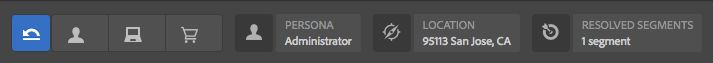
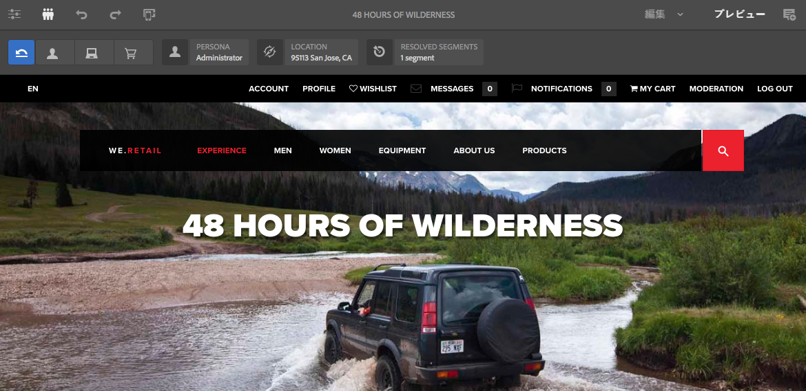
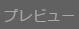

# ContextHub データを使用したページのプレビュー{#previewing-pages-using-contexthub-data}

[ContextHub](/help/sites-developing/contexthub.md) ツールバーを使用すると、ContextHub ストアからデータを表示して、ストアデータを変更できます。 ContextHub ツールバーは、ContextHub ストア内のデータに基づいて決定されるコンテンツのプレビューに役立ちます。

このツールバーは、1 つ以上の UI モジュールを含む一連の UI モードで構成されます。

* UI モードは、ツールバーの左側に表示されるアイコンです。 アイコンをクリックすると、そのモードに含まれる UI モジュールがツールバーに表示されます。
* UI モジュールは、1 つ以上の ContextHub ストアのデータを表示します。 また、一部の UI モジュールでは、ストアデータを操作することもできます。

ContextHub によって、いくつかの UI モードと UI モジュールがインストールされます。 管理者が、異なる UI モードと UI モジュールを表示するように [ContextHub を設定](/help/sites-developing/ch-configuring.md)している場合があります。

## ContextHub ツールバーの表示 {#revealing-the-contexthub-toolbar}

ContextHub ツールバーは、プレビューモードで使用できます。 このツールバーは、オーサーインスタンス上で、管理者が有効にしている場合にのみ使用できます。

1. 編集用にページを開いた状態で、ツールバーの「プレビュー」をクリックします。

   

1. ツールバーを表示するには、ContextHub アイコンをクリックします。

   

## UI モジュールの機能 {#ui-module-features}

提供する機能セットは UI モジュールごとに異なりますが、次のタイプの機能は共通しています。 UI モジュールは拡張可能なので、開発者は必要に応じて他の機能を実装できます。

### ツールバーのコンテンツ {#toolbar-content}

UI モジュールは、1 つ以上の ContextHub ストアのデータをツールバーに表示できます。 UI モジュールは、アイコンとタイトルで識別されます。

### ポップアップコンテンツ {#popup-content}

一部の UI モジュールでは、クリックまたはタップするとポップアップオーバーレイが表示されます。 一般的に、ポップアップには、ツールバーに表示されている以外の追加情報が含まれています。

### ポップアップフォーム {#popup-forms}

モジュールのポップアップオーバーレイには、ContextHub ストア内のデータを変更するためのフォーム要素を含めることができます。 ページのコンテンツがストアデータによって決まる場合は、このフォームを使用してページコンテンツの変更を監視できます。

### 全画面表示モード {#fullscreen-mode}

ポップアップオーバーレイには、クリックするとポップアップコンテンツを拡張してブラウザーウィンドウまたは画面全体に表示するアイコンを含めることができます。

