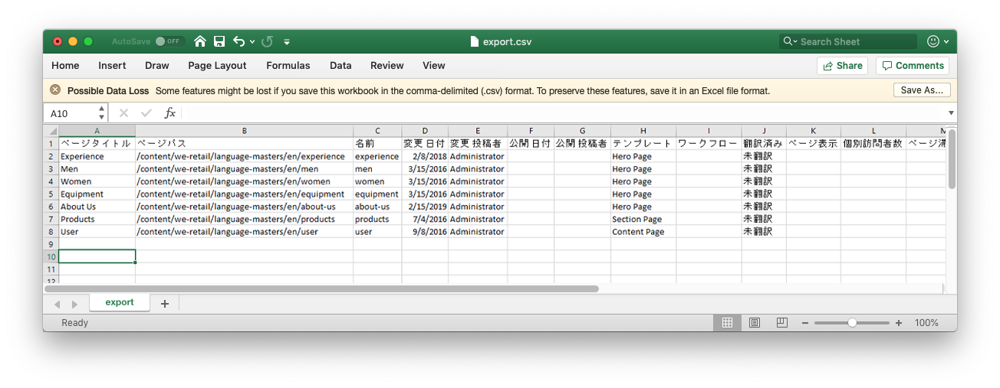
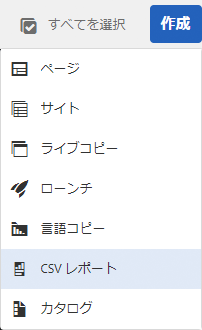
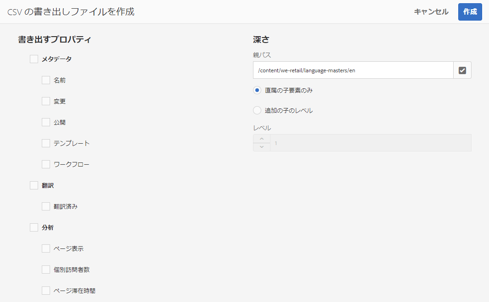

# CSV ファイルへの書き出し{#export-to-csv}

**CSV レポートの作成**&#x200B;では、ページの情報をローカルシステムの CSV ファイルに書き出すことができます。

* ダウンロードしたファイルの名前は `export.csv` になります。
* コンテンツは、選択するプロパティによって異なります。
* 書き出しのパスと深さを定義できます。

>[!NOTE]
>
>ブラウザーのダウンロード機能（およびデフォルトのダウンロード先）が使用されます。

**CSV の書き出しファイルを作成**&#x200B;ウィザードでは、次の要素を選択できます。

* 書き出すプロパティ
  * メタデータ
    * 名前
    * 変更
    * 公開済み
    * テンプレート
    * ワークフロー
  * 翻訳
    * 翻訳済み
  * 分析
    * ページ表示
    * ユニーク訪問者
    * ページ滞在時間
* 深さ
  * 親パス
  * 直属の子要素のみ
  * 追加の子のレベル
  * レベル

生成された `export.csv` ファイルは、Excel（または互換性のあるその他のアプリケーション）で開くことができます。

「**CSV レポート**&#x200B;の作成」オプションは、**Sites** コンソールをリストビューで参照するときに使用できる、**作成**&#x200B;ドロップダウンメニューのオプションです。

CSV の書き出しファイルを作成するには、次の手順を実行します。

1. **Sites** コンソールを開き、必要に応じて必要な場所まで移動します。
1. ツールバーの「**作成**」をクリックし、「**CSV レポート**」を選択してウィザードを開きます。

   

1. 書き出す必要のあるプロパティを選択します。
1. 「**作成**」を選択します。
