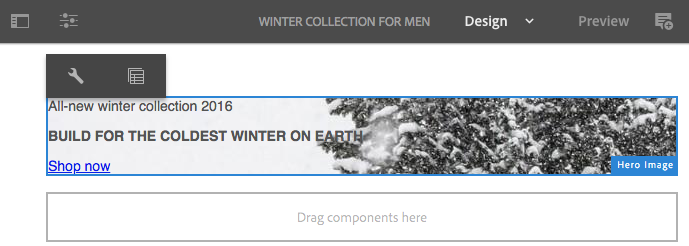
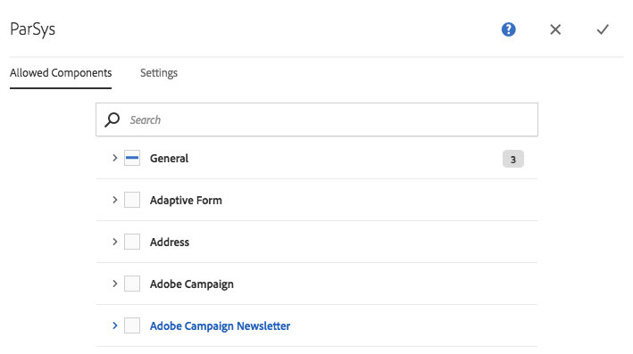

# デザインモードでのデフォルトのコンポーネントの設定{#configuring-components-in-design-mode}

AEM インスタンスを標準インストールすると、各種のコンポーネントをコンポーネントブラウザーですぐに使用できます。

加えて、これら以外の様々なコンポーネントも使用できます。このような[コンポーネントを有効または無効にする](#enable-disable-components)には、デザインモードを使用します。コンポーネントを有効にしてページに配置したら、デザインモードを使用して属性パラメーターを編集することで[コンポーネントデザインの様々な要素を設定](#configuring-the-design-of-a-component)できます。

>[!NOTE]
>
>これらのコンポーネントを編集する際は慎重に行う必要があります。デザイン設定は、多くの場合 Web サイト全体のデザインの重要な一部であり、適切な権限および経験を持つユーザー（管理者または開発者など）のみが変更する必要があります。詳しくは、[コンポーネントの開発](/help/sites-developing/components.md)を参照してください。

>[!NOTE]
>
>デザインモードは静的テンプレートでのみ使用できます。編集可能なテンプレートで作成されたテンプレートは、[テンプレートエディター](/help/sites-authoring/templates.md)を使用して編集する必要があります。

>[!NOTE]
>
>デザインモードは、（`/etc` の下に）コンテンツとして格納されたデザイン設定にのみ使用できます。
>
>継続的なデプロイメントシナリオをサポートするために、AEM 6.4 以降では、デザインを設定データとして `/apps` の下に格納することをお勧めします。`/apps` の下に格納されたデザインは実行時には編集できず、管理者でなければそうしたテンプレートのユーザーはデザインモードを使用できません。

これには、ページの段落システムで許可されたコンポーネントの追加または削除が含まれます。段落システム（`parsys`）は、他のすべての段落コンポーネントを含む複合コンポーネントです。段落システムを使用すると、作成者は異なるタイプのコンポーネントを、他のすべての段落コンポーネントを含むページに追加できます。各段落タイプは、コンポーネントとして表されます。

例えば、製品ページのコンテンツには、次の情報を含む段落システムを含めることができます。

* 製品の画像（画像または textimage 段落の形式）
* 製品の説明（テキスト段落として）
* 技術データを含むテーブル（表の段落として）
* ユーザー入力フォーム（フォーム開始、フォーム要素、フォーム終了の段落として）

>[!NOTE]
>
>`parsys` について詳しくは、[コンポーネントの開発](/help/sites-developing/components.md)および[テンプレートとコンポーネントの使用に関するガイドライン](/help/sites-developing/dev-guidelines-bestpractices.md#guidelines-for-using-templates-and-components)を参照してください。

>[!CAUTION]
>
>静的テンプレートのデザインを定義する方法としては、ここで説明しているような、デザインモードを使用したデザイン編集をお勧めします。
>
>例えば、CRX DE でデザインを変更することはベストプラクティスではなく、そのようなデザインの適用は、意図したビヘイビアーとは異なることがあります。

## コンポーネントを有効／無効にする {#enable-disable-components}

コンポーネントを有効化または無効化するには、次の手順を行います。

1. **デザイン**&#x200B;モードを選択します。

   

1. コンポーネントをクリックします。選択すると、コンポーネントに青い境界線が表示されます。

   

1. 「**親**」アイコンをクリックします。

   

   これにより、現在のコンポーネントを格納する段落システムを選択します。

1. 段落システムの「**設定**」アイコンが親のアクションバーに表示されます。

   

   このアイコンを選択してダイアログを表示します。

1. このダイアログを使用して、現在のページの編集時にコンポーネントブラウザーで利用できるコンポーネントを定義します。

   

   このダイアログにはタブが 2 つあります。

   * 許可されたコンポーネント
   * 設定

   **許可されたコンポーネント**

   「**許可されたコンポーネント**」タブで、parsys で使用できるコンポーネントを定義します。

   * コンポーネントはコンポーネントグループでグループ化され、展開する、または折りたたむことができます。
   * グループ全体を選択するにはグループ名をチェックし、すべてを選択解除するにはチェックをオフにします。
   * マイナス記号は、グループのすべてではなく少なくとも 1 つの項目が選択されていることを表します。
   * 名前でコンポーネントをフィルターするために、検索を使用できます。
   * コンポーネントグループ名の右側に一覧されるカウントは、フィルターにかかわらずそれらのグループの中の選択されたコンポーネントの合計数を示します。

   ページコンポーネントごとに設定を定義します。子ページで同じテンプレートまたは（通常は整列された）ページコンポーネントを使用すると、対応する段落システムに同じ設定が適用されます。

   >[!NOTE]
   >
   >アダプティブフォームコンポーネントは、アダプティブフォームコンテナ内で動作してフォームエコシステムを使用するように設計されています。このため、これらのコンポーネントはアダプティブフォームエディターでのみ使用する必要があり、サイトページエディターでは機能しません。

   **設定**

   「**設定**」タブでは、追加のオプションを定義できます（各コンポーネントへのアンカーの描画、各コンテナのセル内の余白の定義など）。

1. 「**完了**」を選択して設定を保存します。

## コンポーネントのデザインの設定 {#configuring-the-design-of-a-component}

1. **デザイン**&#x200B;モードを選択します。

   

1. 青い境界線のあるコンポーネントをクリックします。この例では、ヒーロー画像コンポーネントを選択します。

   

1. ダイアログを開くには、「**設定**」アイコンを使用します。

   

   デザインダイアログでは、使用可能なデザインパラメーターに従ってコンポーネントを設定できます。

   

   ダイアログには次の 3 つのタブがあります。

   * メイン
   * 機能
   * スタイル

   **プロパティ**

   「**プロパティ**」タブを使用すると、コンポーネントの重要なデザインパラメーターを設定できます。画像コンポーネントの例では、画像の許可される最大サイズと最小サイズを定義できます。

   **機能**

   「**機能**」タブを使用すると、コンポーネントの追加の機能を有効または無効にできます。例えば、画像コンポーネントの場合は、画像の向き、使用可能な切り抜きオプション、および画像をアップロードできるかどうかを定義できます。

   **スタイル**

   「**スタイル**」タブを使用すると、CSS クラスおよびスタイルを定義して、コンポーネントで使用できます。

   

   「**追加**」ボタンを使用すると、追加のエントリを複数エントリのダイアログリストに追加できます。

   

   複数エントリのダイアログリストからエントリを削除するには、**削除**&#x200B;アイコンを使用します。

   

   複数エントリのダイアログリストのエントリの順序を並べ替えるには、**移動**&#x200B;アイコンを使用します。

   

1. ダイアログを保存して閉じるには、**完了**&#x200B;アイコンをクリックします。
