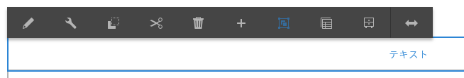
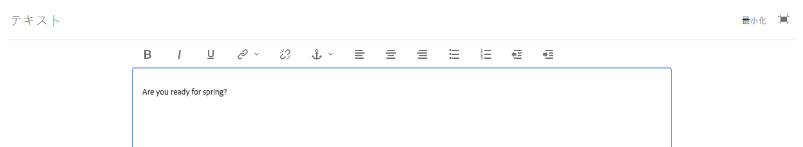
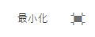

# リッチテキストエディターを使用したコンテンツのオーサリング {#use-rich-text-editor-to-author-content}

リッチテキストエディター（RTE）は、AEM にテキストコンテンツを入力するための基本的な構成要素です。 以下を含む、様々なコンポーネントの基礎を形成します。

* [テキスト](https://experienceleague.adobe.com/ja/docs/experience-manager-core-components/using/wcm-components/text)
* [テーブル](https://experienceleague.adobe.com/ja/docs/experience-manager-core-components/using/wcm-components/text#table)

## インプレース編集 {#in-place-editing}

シングルクリックでテキストベースのコンポーネントを選択すると、他のコンポーネントと同様に、[コンポーネントツールバー](/help/sites-authoring/editing-content.md#edit-configure-copy-cut-delete-paste)が表示されます。

もう一度タップまたはクリックするか、最初にコンポーネントをゆっくりダブルクリックして選択すると、インプレース編集が開始され、独自のツールバーが表示されます。 ここで、コンテンツの編集や、基本的な書式変更ができます。

このツールバーには、次のオプションがあります。

* **フォーマット**：太字、斜体、下線を設定できます。
* **リスト**：箇条書きリストまたは番号付きリストを作成したり、インデントを設定したりすることができます。
* **ハイパーリンク**
* **リンク解除**
* **フルスクリーン**
* **閉じる**
* **保存**

## フルスクリーン編集 {#full-screen-editing}

テキストベースのコンポーネントの場合は、ツールバーから「」をタップすると、リッチテキストエディターが開き、ページの他のコンテンツが非表示になります。

フルスクリーンモードでは、オーサリングに使用できる設定済みオプションがすべて表示されます。 使用できるオプションは、[設定によって異なります](/help/sites-administering/rich-text-editor.md)。

その他のリッチテキストエディターオプションを次に示します。

* **アンカー**：テキストにアンカーを作成し、後でそのアンカーへのリンクや参照を設定できます。
* **テキストを左揃え**
* **テキストを中央揃え**
* **テキストを右揃え**

「最小化」アイコンをクリックして、フルスクリーンモードを閉じます。

>[!NOTE]
>
>ネストされたリストを Microsoft Word から RTE にコピーすると、データの整合性が失われ、RTE にテキストを貼り付けた後で手動調整が必要になる可能性があります。
