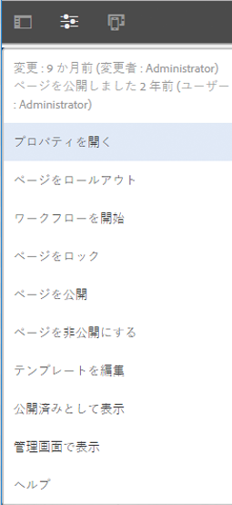

# UI の選択{#selecting-your-ui}

Adobe Experience Manager（AEM）のタッチ操作対応UIは、標準のUIです。 ただし、ユーザーが[クラシック UI](/help/sites-classic-ui-authoring/classicui.md) に切り替えたい場合もあります。 そのためのオプションがいくつか用意されています。

使用する UI を様々な場所で定義できます。

* [ インスタンスのデフォルト UIの設定](#configuring-the-default-ui-for-your-instance)
これは、ユーザーログイン時に表示するデフォルトのUIを設定します。 ユーザーは、この設定を上書きして、自分のアカウントまたは現在のセッション用に別の UI を選択できます。

* [ アカウントのクラシック UI オーサリングの設定](/help/sites-authoring/select-ui.md#setting-classic-ui-authoring-for-your-account)
これは、ページを編集する際にUIをデフォルトに設定しますが、ユーザーはこれを上書きし、アカウントまたは現在のセッションに対して別のUIを選択できます。

* [現在のセッションのクラシック UIに切り替える](#switching-to-classic-ui-for-the-current-session)
現在のセッションのクラシック UIに切り替えます。

* [ページオーサリングの場合、システムは UI に関して特定の上書きを行います](#ui-overrides-for-the-editor)。

>[!CAUTION]
>
>クラシック UI に切り替えるための様々なオプションは、そのまますぐに使用することはできません。使用するインスタンスに合わせて設定する必要があります。
>
>詳しくは、[クラシック UI へのアクセスの有効化](/help/sites-administering/enable-classic-ui.md)を参照してください。

>[!NOTE]
>
>以前のバージョンからアップグレードされたインスタンスでは、ページオーサリング用にクラシック UI が保持されます。
>
>アップグレード後、ページオーサリングが自動的にタッチ対応 UI に切り替わることはありませんが、**WCM オーサリング UI モードサービス**（`AuthoringUIMode` サービス）の [OSGi 設定](/help/sites-deploying/configuring-osgi.md)を使用すると、その切り替えを設定できます。 [エディターの UI 上書き](#ui-overrides-for-the-editor)を参照してください。

## 使用しているインスタンスへのデフォルト UI の設定 {#configuring-the-default-ui-for-your-instance}

システム管理者は、[ルートマッピング](/help/sites-deploying/osgi-configuration-settings.md#daycqrootmapping)を使用して、起動時およびログイン時に表示される UI を設定できます。

この設定は、ユーザーのデフォルト設定またはセッション設定で上書きできます。

## アカウントのクラシック UI オーサリングの設定 {#setting-classic-ui-authoring-for-your-account}

各ユーザーは、[ユーザーの環境設定](/help/sites-authoring/user-properties.md#userpreferences)にアクセスして、ページオーサリングに（デフォルト UI ではなく）クラシック UI を使用するかどうかを定義できます。

この設定は、セッション設定で上書きできます。

## 現在のセッションのクラシック UI への切り替え {#switching-to-classic-ui-for-the-current-session}

デスクトップユーザーがタッチ操作対応 UI を使用している場合に、クラシック（デスクトップのみ）UI に戻した方がよいこともあります。 現在のセッションでクラシック UI に切り替える方法はいくつかあります。

* **ナビゲーションリンク**

  >[!CAUTION]
  >
  >クラシック UI に切り替えるためのこのオプションは、そのまますぐに使用することはできません。使用するインスタンスに合わせて設定する必要があります。
  >
  >
  >詳しくは、[クラシック UI へのアクセスの有効化](/help/sites-administering/enable-classic-ui.md)を参照してください。

  このオプションが有効になっている場合は、該当するコンソールにマウスを移動するたびに、アイコン（モニターシンボル）が表示されます。 これをタップまたはクリックすると、適切な場所がクラシック UI で開きます。

  例えば、**Sites** から **siteadmin** へのリンクなどです。

  

* **URL**

  クラシック UIには、ようこそ画面（`welcome.html`）のURLを使用してアクセスできます。 次に例を示します。

  `https://localhost:4502/welcome.html`

  >[!NOTE]
  >
  >タッチ対応 UI には、`sites.html` 経由でアクセスできます。 例：
  >
  >
  >`https://localhost:4502/sites.html`

### ページ編集時のクラシック UI への切り替え {#switching-to-classic-ui-when-editing-a-page}

>[!CAUTION]
>
>クラシック UI に切り替えるためのこのオプションは、そのまますぐに使用することはできません。使用するインスタンスに合わせて設定する必要があります。
>
>詳しくは、[クラシック UI へのアクセスの有効化](/help/sites-administering/enable-classic-ui.md)を参照してください。

有効な場合は、**ページ情報**&#x200B;ダイアログで&#x200B;**クラシック UI を開く**&#x200B;が使用可能です。

### エディターの UI のオーバーライド {#ui-overrides-for-the-editor}

ページのオーサリング時に、ユーザーまたはシステム管理者が定義した設定がシステムによって上書きされることがあります。

* ページのオーサリング時：

  * URL で `cf#` を使用してページにアクセスする場合、クラシックエディターが強制的に使用されます。 例：
    `https://localhost:4502/cf#/content/geometrixx/en/products/triangle.html`

  * URL で `/editor.html` を使用しているか、タッチデバイスを使用している場合、タッチ対応エディターが強制的に使用されます。 例：
    `https://localhost:4502/editor.html/content/geometrixx/en/products/triangle.html`

* 強制は一時的なものであり、ブラウザーセッションでのみ有効です。

  * Cookie は、タッチ対応（`editor.html`）とクラシック（`cf#`）のどちらが使用されているかに応じて設定されます。

* `siteadmin` を使用してページを開くと、以下が存在するかどうかを確認します。

  * Cookie
  * ユーザーの環境設定
  * どちらも存在しない場合は、**WCM オーサリング UI モードサービス**（`AuthoringUIMode` サービス）の [OSGi 設定](/help/sites-deploying/configuring-osgi.md)で指定された定義がデフォルトで使用されます。

>[!NOTE]
>
>[ユーザーが既にページオーサリングの環境設定を定義している場合](#settingthedefaultauthoringuiforyouraccount)、OSGi プロパティの変更によってその設定が上書きされることはありません。

>[!CAUTION]
>
>既に説明したように、Cookie の使用により、次の操作はお勧めしません。
>
>* URL を手動で編集 - 非標準の URL を使用すると、不明な状況が発生し、機能が不足する場合があります。
>* 両方のエディターを同時に開くこと - 例えば、別のウィンドウで開くなど。
