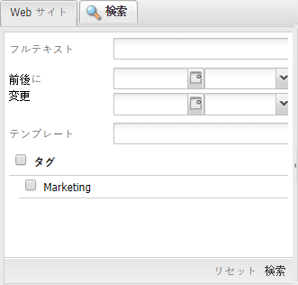
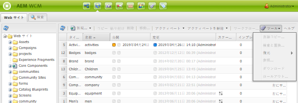
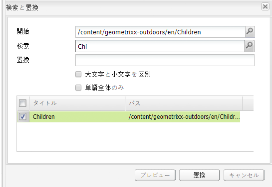

# 検索{#searching}

AEM のオーサー環境は、リソースタイプに応じて、コンテンツを検索するための様々なメカニズムを提供します。

>[!NOTE]
>
>オーサー環境外では、[Query Builder](/help/sites-developing/querybuilder-api.md) や [CRXDE Lite](/help/sites-developing/developing-with-crxde-lite.md) など、他の検索メカニズムも使用できます。

## 検索の基本 {#search-basics}

検索パネルにアクセスするには、該当するコンソールの左側のパネルの上部にある「**検索**」タブをクリックします。

検索パネルを使用すると、すべてのweb サイトページを検索できます。 次のフィールドとウィジェットが含まれています。

* **フルテキスト**：指定したテキストを検索します。
* **次の前 / 後に変更**：特定の日付の期間に変更されたページのみを検索します。
* **テンプレート**：指定したテンプレートに基づいたページのみを検索します。
* **タグ**：指定したタグを持つページのみを検索します。

>[!NOTE]
>
>インスタンスが [Lucene 検索](/help/sites-deploying/queries-and-indexing.md)用に設定されていると、次を&#x200B;**フルテキスト**&#x200B;で使用できます。
>
>* [ワイルドカード](https://lucene.apache.org/core/5_3_1/queryparser/org/apache/lucene/queryparser/classic/package-summary.html#Wildcard_Searches)
>* [ブール演算子](https://lucene.apache.org/core/5_3_1/queryparser/org/apache/lucene/queryparser/classic/package-summary.html#Boolean_operators)
>
>* [正規表現](https://lucene.apache.org/core/5_3_1/queryparser/org/apache/lucene/queryparser/classic/package-summary.html#Regexp_Searches)
>* [フィールドグループ](https://lucene.apache.org/core/5_3_1/queryparser/org/apache/lucene/queryparser/classic/package-summary.html#Field_Grouping)
>* [ブースト](https://lucene.apache.org/core/5_3_1/queryparser/org/apache/lucene/queryparser/classic/package-summary.html#Boosting_a_Term)
>

検索を実行するには、パネル下部にある「**検索**」をクリックします。 検索条件をクリアするには、「**リセット**」をクリックします。

## フィルター {#filter}

様々な場所でフィルターを設定（およびクリア）してビューのドリルダウンおよび洗練を行うことができます。

## 検索と置換 {#find-and-replace}

**Web サイト**&#x200B;コンソールの「**検索と置換**」メニューオプションでは、web サイトの特定のセクション内で特定の文字列を持つ複数のインスタンスを検索して置換できます。

1. 検索と置換アクションを実行するルートページまたはフォルダーを選択します。
1. **ツール**／**検索と置換**&#x200B;を選択します。

   

1. **検索と置換**&#x200B;ダイアログでは、次の操作を実行できます。

   * 検索アクションを開始するルートパスを確認します。
   * 検索する語句を指定します。
   * 置換後の語句を指定します。
   * 検索で大文字と小文字を区別するかどうかを指定します。
   * 完全に一致する語句のみを検索するかどうかを指定します（指定しなければ、サブ文字列も検索されます）。

   **プレビュー**&#x200B;をクリックすると、用語が見つかったリストが表示されます。 置き換える特定のインスタンスを選択またはクリアできます。

   

1. 「**置換**」をクリックすると、すべてのインスタンスが置換されます。 この操作の確認が求められます。

検索と置換のサーブレットのデフォルトスコープには、次のプロパティが含まれています。

* `jcr:title`
* `jcr:description`
* `jcr:text`
* `text`

このスコープは、Apache Felix Web Management Console（例：`https://localhost:4502/system/console/configMgr`）を使用して変更できます。 `CQ WCM Find Replace Servlet (com.day.cq.wcm.core.impl.servlets.FindReplaceServlet)` を選択し、必要に応じてスコープを設定します。

>[!NOTE]
>
>標準の AEM インストールでは、検索と置換で、検索機能に Lucene が使用されます。
>
>Lucene では長さが 16 K までの文字列プロパティにインデックスが作成されます。 この長さを超える文字列は検索されません。
