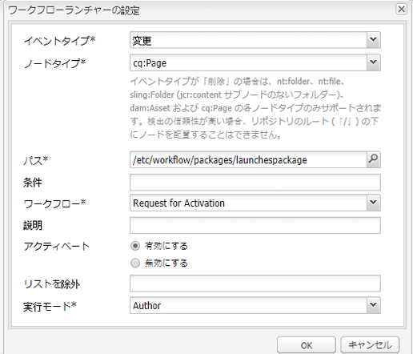

# ローンチの昇格{#promoting-launches}

コンテンツを公開する前にソース（実稼動）に戻すには、ローンチページを昇格させる必要があります。 ローンチページを昇格させると、ソースページの対応するページが、昇格したページのコンテンツに置き換わります。 ローンチページを昇格させるときには、次のオプションを使用できます。

* 現在のページのみを昇格させるか、ローンチ全体を昇格させるか。
* 現在のページの子ページを昇格させるかどうか。
* ローンチ全体を昇格させるか、変更したページのみを昇格させるか。

## ローンチページの昇格 {#promoting-launch-pages}

ページを昇格させるには、昇格させるローンチページの編集時に次の手順を実行します。

1. サイドキックの「**ページ**」タブで、「**ローンチを昇格**」をクリックします。
1. 昇格させるページを、次のように指定します。

   * （デフォルト）現在のページのみを昇格させるには、「**ページの変更を実稼動版に昇格**」を選択します。
   * 現在のページの子ページも昇格させるには、「**サブページを含める**」を選択します。
   * ローンチのすべてのページを昇格させるには、「**完全なローンチを実稼動版に昇格**」を選択します。

1. 実稼動版ページをワークフローパッケージに追加する場合は、「**ワークフローパッケージに追加**」を選択したあと、ワークフローパッケージを選択します。
1. 「**昇格**」をクリックします。

## AEM ワークフローを使用した昇格済みページの処理 {#processing-promoted-pages-using-aem-workflow}

ワークフローモデルを使用して、昇格済みのローンチページの一括処理を行います。

1. ワークフローパッケージを作成します。
1. 作成者がローンチページを昇格させるときに、ローンチページをワークフローパッケージに格納します。
1. パッケージをペイロードとして使用し、ワークフローモデルを開始します。

ページが昇格した場合に自動的にワークフローを開始するには、パッケージノードに[ワークフローランチャーを設定](/help/sites-administering/workflows-starting.md#workflows-launchers)します。

例えば、作成者がローンチページを昇格させたときに、ページのアクティベーションリクエストを自動的に生成できます。 パッケージノードの変更時に「アクティベーションをリクエスト」ワークフローを開始するように、ワークフローランチャーを設定します。

