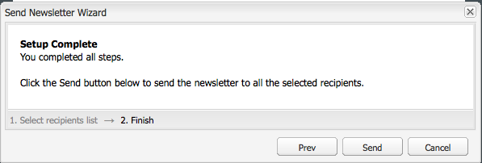

# メールマーケティング{#e-mail-marketing}

>[!NOTE]
>
>アドビでは、AEM SMTP サービスが送信したメールの開封／バウンス（配信不能）をトラッキングする機能をさらに強化する計画はありません。
>[Adobe Campaign や AEM との統合](/help/sites-administering/campaign.md)を利用することをお勧めします。

メールマーケティング（ニュースレターなど）は、どのようなマーケティングキャンペーンにおいても、コンテンツをリードにプッシュするときに重要な部分を占めます。AEM では、既存の AEM コンテンツからニュースレターを作成でき、ニュースレター特有の新しいコンテンツを追加できます。

作成した後は、即時または（ワークフローを使用して）スケジュールした時間に、特定のユーザーグループへとニュースレターを送信できます。さらに、ユーザーは自分が選択した形式でニュースレターの購読を申し込むことができます。

また、管理者は AEM を使用して、トピックの保守、ニュースレターのアーカイブ、ニュースレターの統計情報の表示などのニュースレター機能を管理できます。

>[!NOTE]
>
>Geometrixx でのニュースレターテンプレートでは、メールエディターが自動的に開きます。メール（招待など）を送信するその他のテンプレートでメールエディターを使用できます。**mcm/components/newsletter/page** からページが継承されるたびに、メールエディターが表示されます。

このドキュメントでは、AEM でのニュースレターの作成の基本について説明します。メールマーケティングの使用方法について詳しくは、以下のドキュメントを参照してください。

* [効果的なニュースレターのランディングページの作成 ](/help/sites-classic-ui-authoring/classic-personalization-campaigns-email-landingpage.md)
* [購読の管理 ](/help/sites-classic-ui-authoring/classic-personalization-campaigns-email-subscriptions.md)
* [メールサービスプロバイダーへのメールの公開](/help/sites-classic-ui-authoring/classic-personalization-campaigns-email-newsletters.md)
* [バウンスメールの追跡](/help/sites-classic-ui-authoring/classic-personalization-campaigns-email-tracking-bounces.md)

>[!NOTE]
>
>メールプロバイダーを変更した場合は、ニュースレターが先にパブリッシュインスタンスに公開されていないか、パブリッシュインスタンスが使用できない状態で、フライトテストを実行するか、ニュースレターを送信すると、これらの操作が失敗します。ニュースレターが確実に公開されていることと、パブリッシュインスタンスが稼動していることを確認してください。

## ニュースレターのエクスペリエンスの作成 {#creating-a-newsletter-experience}

>[!NOTE]
>
>メール通知は、OSGi 設定を使用して設定する必要があります。[メール通知の設定](/help/sites-administering/notification.md)を参照してください。

1. 新しいキャンペーンを左側のパネルで選択するか、右側のパネルでダブルクリックします。

1. 次のアイコンを使用して、リスト表示を選択します。

   

1. 「**新規...**」をクリックします。

   「**タイトル**」、「**名前**」および作成するエクスペリエンスのタイプ（この例では、ニュースレター）を指定できます。

   

1. 「**作成**」をクリックします。

1. すぐに新しいダイアログボックスが開きます。ここで、ニュースレターのプロパティを入力できます。

   「**デフォルトの受信者リスト**」は、ニュースレターのタッチポイントを構成するので、必須のフィールドです（リストについて詳しくは、[リストの使用](/help/sites-classic-ui-authoring/classic-personalization-campaigns.md#workingwithlists)を参照してください）。

   

   * **送信元の名前**
ニュースレターの送信者として表示させる名前です。

   * **送信元のアドレス**
ニュースレターの送信者として表示させるメールアドレスです。

   * **件名**
ニュースレターの件名です。

   * **返信先**
送信されたニュースレターへの返信先として使用されるメールアドレスです。

   * **説明**
ニュースレターの説明です。

   * **日時**
ニュースレターを送信する日時です。

   * **デフォルトの受信者リスト**
ニュースレターを受信するデフォルトのリストです。

   これらの設定は、後から&#x200B;**プロパティ...** ダイアログで更新できます。

1. 「**OK**」をクリックして保存します。

## ニュースレターへのコンテンツの追加 {#adding-content-to-newsletters}

他の AEM コンポーネントと同様に、動的なコンテンツなどのコンテンツをニュースレターに追加できます。Geometrixx でのニュースレターテンプレートには、ニュースレターでコンテンツの追加および変更に使用できるコンポーネントがあります。

1. MCM で「**キャンペーン**」タブをクリックし、コンテンツの追加または編集を行うニュースレターをダブルクリックします。ニュースレターが開きます。

1. コンポーネントが表示されていない場合、デザインビューを開き、必要なコンポーネント（ニュースレターコンポーネントなど）を有効にしてから編集を始めます。
1. 必要に応じて、新しいテキストや画像または他のコンポーネントを入力します。Geometrixx の例では、テキスト、画像、見出し、2 コラムの 4 つのコンポーネントを使用できます。ニュースレターのコンポーネント数は、設定する方法に応じて変わる可能性があります。

   >[!NOTE]
   >
   >変数を使用してニュースレターをパーソナライズします。Geometrixx のニュースレターでは、変数はテキストコンポーネントで使用できます。変数の値は、ユーザープロファイルの情報から継承されます。

   

1. 変数を挿入するには、リストの変数を選択し、「**挿入**」をクリックします。変数は「プロファイル」から設定されます。

## ニュースレターのパーソナライゼーション {#personalizing-newsletters}

ニュースレターをパーソナライズするには、Geometrixx のニュースレターのテキストコンポーネントに事前定義済みの変数を挿入します。変数の値は、ユーザープロファイルの情報から継承されます。

また、ニュースレターをパーソナライズする方法をシミュレートするには、ClientContext を使用し、プロファイルを読み込みます。

ニュースレターをパーソナライズし、外観をシミュレートするには：

1. MCM で、設定をカスタマイズするニュースレターを開きます。

1. パーソナライズするテキストコンポーネントを開きます。

1. 変数を表示する場所にカーソルを移動し、ドロップダウンリストから変数を選択して「**挿入**」をクリックします。必要な変数についてこの操作を実行し、「**OK**」をクリックします。

   

1. 送信されたときに変数がどのように表示されるかをシミュレートするには、Ctrl+Alt+c キーを押して ClientContext を開き、「**読み込み**」を選択します。リストからプロファイルを読み込むユーザーを選択し、「**OK**」をクリックします。

   読み込んだプロファイルの情報によって変数が設定されます。

   

## 様々なメールクライアントでのニュースレターのテスト {#testing-newsletters-in-different-e-mail-clients}

>[!NOTE]
>
>ニュースレターを送信する前に、`https://localhost:4502/system/console/configMgr` で Day CQ Link Externalizer の OSGi 設定を確認してください。
>
>デフォルトでは、このパラメーターの値は `localhost:4502` です。稼動しているインスタンスのポートが変更されている場合は操作を完了できません。

共通のメールクライアントを切り替えて、ニュースレターがリードにどのように表示されるかを確認します。デフォルトでは、ニュースレターはメールクライアントが選択されていない状態で開きます。

現在、次のメールクライアントでニュースレターを表示できます。

* Yahoo メール
* Gmail
* Hotmail
* サンダーバード
* Microsoft Outlook 2007
* Apple Mail

クライアントを切り替えるには、対応するアイコンをクリックして、そのメールクライアントのニュースレターを表示します。

1. MCM で、設定をカスタマイズするニュースレターを開きます。

1. 上部のバーにあるメールクライアントをクリックし、そのクライアントでニュースレターがどのように表示されるかを確認します。

   

1. 確認するその他のメールクライアントについて、この手順を繰り返します。

   

## ニュースレター設定のカスタマイズ {#customizing-newsletter-settings}

ニュースレターを送信できるのは権限のあるユーザーのみですが、次の点をカスタマイズする必要があります。

* 件名の行。ユーザーがメールを開きたくなり、ニュースレターがスパムとマークされないようにします。
* 送信者アドレス（`noreply@geometrixx.com`）。指定したアドレスからユーザーがメールを受信できるようにします。

ニュースレター設定をカスタマイズするには：

1. MCM で、設定をカスタマイズするニュースレターを開きます。

   

1. ニュースレターの上部にある「**設定**」をクリックします。

   
1. **送信元**&#x200B;のメールアドレスを入力します。

1. 必要に応じてメールの&#x200B;**件名**&#x200B;を変更します。

1. 「**デフォルトの受信者リスト**」をドロップダウンリストから選択します。

1. 「**OK**」をクリックします。

   ニュースレターをテストまたは送信すると、受信者は指定されたメールアドレスと件名を含むメールを受信します。

## ニュースレターのフライトテスト {#flight-testing-newsletters}

フライトテストは必須ではありませんが、ニュースレターを送信する前に、必要に応じて表示されるかどうかをテストする必要があります。

フライトテストでは、次の事項が実行できます。

* [対象となるすべてのクライアント](#testing-newsletters-in-different-e-mail-clients)でニュースレターを確認します。
* メールサーバーが正しく設定されていることを検証します。
* メールがスパムとしてフラグ付けされているかどうかを判断します（受信者のリストに自分を含めてください）。

>[!NOTE]
>
>メールプロバイダーを変更した場合は、ニュースレターが先にパブリッシュインスタンスに公開されていないか、パブリッシュインスタンスが使用できない状態で、フライトテストを実行するか、ニュースレターを送信すると、これらの操作が失敗します。ニュースレターが確実に公開されていることと、パブリッシュインスタンスが稼動していることを確認してください。

ニュースレターをフライトテストするには、次の手順を実行します。

1. MCM から、テストして送信するニュースレターを開きます。

1. ニュースレターの上部で、「**テスト**」をクリックして、送信前にテストを実行します。

   

1. ニュースレターを送信するテストメールアドレスを入力し、「**送信**」をクリックします。プロファイルを変更する場合は、ClientContext に別のプロファイルを読み込みます。これを行うには、Ctrl + Alt + c キーを押し、「読み込み」を選択してプロファイルを読み込みます。

## ニュースレターの送信 {#sending-newsletters}

>[!NOTE]
>
>アドビでは、AEM SMTP サービスが送信したメールの開封やバウンス（配信不能）をトラッキングする機能をさらに強化する計画はありません。
>[Adobe Campaign や AEM との統合](/help/sites-administering/campaign.md)を利用することをお勧めします。

ニュースレターまたはリストからニュースレターを送信できます。両方の手順について説明します。

>[!NOTE]
>
>ニュースレターを送信する前に、`https://localhost:4502/system/console/configMgr` で Day CQ Link Externalizer の OSGi 設定を確認してください。
>
>デフォルトでは、このパラメーターの値は `localhost:4502` です。稼動しているインスタンスのポートが変更されている場合は操作を完了できません。

>[!NOTE]
>
>メールプロバイダーを変更した場合は、ニュースレターが先にパブリッシュインスタンスに公開されていないか、パブリッシュインスタンスが使用できない状態で、フライトテストを実行するか、ニュースレターを送信すると、これらの操作が失敗します。ニュースレターが確実に公開されていることと、パブリッシュインスタンスが稼動していることを確認してください。

### キャンペーンからのニュースレターの送信 {#sending-newsletters-from-a-campaign}

キャンペーン内からニュースレターを送信するには、次の手順を実行します。

1. MCM から、送信するニュースレターを開きます。

   >[!NOTE]
   >
   >送信する前に、ニュースレターの件名と発信元のメールアドレスが、[設定のカスタマイズ](#customizing-newsletter-settings)を使用してカスタマイズされていることを確認します。
   >
   >
   >送信する前に、ニュースレターの[フライトテスト](#flight-testing-newsletters)を行うことをお勧めします。

1. ニュースレターの上部にある「**送信**」をクリックします。ニュースレターウィザードが開きます。

1. 受信者のリストで、ニュースレターを受信するリストを選択し、「**次へ**」をクリックします。

   

1. 設定が完了しました。「**送信**」をクリックして、実際にニュースレターを送信します。

   

   >[!NOTE]
   >
   >自分が受信者の 1 人であることを確認して、ニュースレターが受信されたことを確認します。

### リストからのニュースレターの送信 {#sending-newsletters-from-a-list}

リストからニュースレターを送信するには、次の手順を実行します。

1. MCM で、ウィンドウの左側にある「**リスト**」をクリックします。

   >[!NOTE]
   >
   >送信する前に、ニュースレターの件名と発信元のメールアドレスが、[設定のカスタマイズ](#customizing-newsletter-settings)を使用してカスタマイズされていることを確認します。リストから送信する場合、ニュースレターはテストできません。ニュースレターから送信する場合は、[フライトテスト](#flight-testing-newsletters)を実行できます。

1. ニュースレターの送信先であるリードリストの横にあるチェックボックスをオンにします。

1. **ツール**&#x200B;メニューの「**ニュースレターを送信**」を選択します。**ニュースレターを送信**&#x200B;ウィンドウが開きます。

   

1. 「**ニュースレター**」フィールドで、送信するニュースレターを選択し、「**次へ**」をクリックします。

   

1. 設定が完了しました。「**送信**」をクリックして、選択したニュースレターを指定したリードのリストに送信します。

   

   ニュースレターは選択した受信者に送信されます。

## ニュースレターの購読 {#subscribing-to-a-newsletter}

この節では、ニュースレターを購読する方法について説明します。

### ニュースレターの購読 {#subscribing-to-a-newsletter-1}

ニュースレターを購読するには、次の手順を実行します（例として Geometrixx web サイトを使用）。

1. 「**Web サイト**」をクリックして、Geometrixx **ツールバー**&#x200B;に移動し、ツールバーを開きます。

   

1. Geometrixx ニュースレターの&#x200B;**新規登録**&#x200B;フィールドにメールアドレスを入力し、「**新規登録**」をクリックします。これで、ニュースレターを購読できるようになります。
